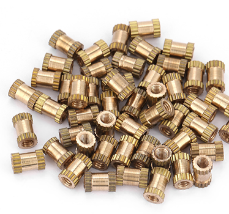

# PiFinder Case Parts Readme 

In this directory you'll find STL's for all the parts of the PiFinder.  You won't need all these pieces for any one build.  There are a few options so please read through the [build guide](../docs/build_guide_assembly.md) and the [user guide hardware section](../docs/user_guide_hw.md) before you start printing.   Reach out to [info@pifinder.io](mailto:info@pifinder.io) or join our [Discord](https://discord.gg/Nk5fHcAtWD) to ask any questions.

## Insert Size
The build uses m2.5 threaded inserts, but there are two main types of these in general availability.  To support both of these types, there are two versions of all the pieces that require inserts.  These are stored in a `small_inserts` and `large_inserts` folder and you should only need one set.

See the images below to identify the type of insert you have.  They accept the same type of screw, but the outside diameters are slightly different.

#### Small Inserts

#### Large Inserts

## PiSugar

For builds using the PiSugar battery pack and the left/right hand configuration the camera needs to mount a bit further outward.  To accomplish this, use the `back_ps` piece in the subdirectory for your inserts.  If you are using some other method to power your PiFinder, use the `back` piece to save a couple of MM of width and some printing time.

The Flat configuration uses the same pieces with and without the PiSugar

