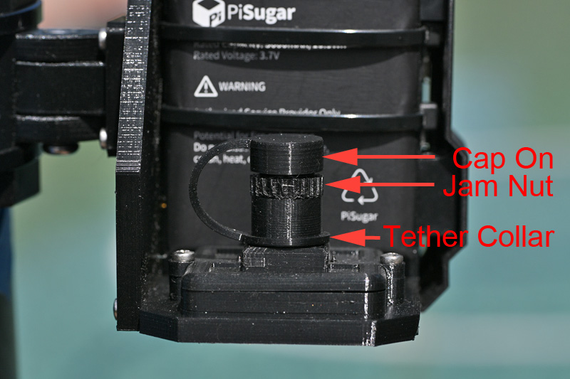
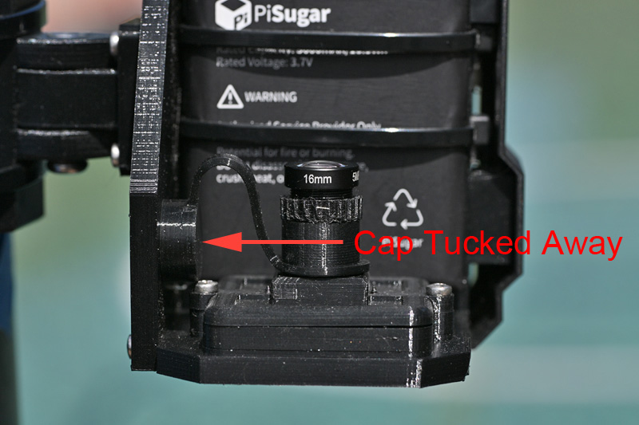

# Threaded Lens Holddown and Accessories

This is a set of STL files consisting of a threaded lens holddown for v2.5 kits, along with other lens-related accessories. The threaded holddown allows a secure way to attach the lens while providing ease in setting and keeping the proper focus. 

*Note that due to differences in 3D printer tolerances and filament characteristics, the following parts may not work for all users. For some parts, multiple versions are included with different tolerances to increase the likelihood of success.*

## Files Included
1. Threaded Lens Holddown
2. Jam Nut - Loose
3. Jam Nut - Snug
4. Lens Cap Replacement - for PETG
5. Lens Cap Replacement - for TPU
6. Tethered Lens Cap

### Detaild Descriptions of Parts, and Suggested Print Settings

* Threaded Lens Holddown.stl: This is an alternative lens holddown that is threaded (M12x0.5 threads) to accecpt the threads on the camera lens. Take care when installing the lens into the threaded holddown to prevent cross-thread damage.
 Print Suggestions: PETG filament, with layer height = 0.10 mm, supports optional.
* Jam Nut - Loose.stl: A looser-fitting jam nut that can be used with the threaded lens holddown to lock the lens at the optimal focus. Use this version if the snug jam nut below is too tight on the lens threads. To use, screw this onto the lens threads up to nearly the lens head before screwing the lens into the threaded holddown. Once the proper focus has been obtained, back out the jam nut until it is tight against the holddown to lock the lens focus. Don't overtighten the jam nut to the holddown in order to prevent stripping the nut's threads. Start easy, and tighten in small steps until the lens doesn't rotate when lightly twisted by hand. See images below.
 Print Suggestions: PETG filament, with layer height = 0.10 mm.
* Jam Nut - Snug.stl: same as Jam Nut - Loose.stl, except with a tighter fit on the lens threads. Use whichever version works better with your printer and filament choice.
 Print Suggestions: Same as for Jam Nut - Loose.stl.
* Lens Cap - PETG.stl: A direct replacement for the original lens cap provided with the camera lens, for printing with PETG. If you've lost the original, just print this one to replace it.
 Print Suggestions: PETG filament, layer height = 0.20 mm.
* Lens Cap - TPU.stl: Essentially the same as Lens Cap - PETG.stl, except with a slightly tighter fit designed to be printed with TPU. I prefer this over the PETG version, but most users probably don't have TPU and it's not worth buying any just for this.
 Print Suggestions: TPU filament (recommend 85A to 95A), layer height = 0.2 mm.
* Tethered Lens Cap.stl: A tethered version of the TPU lens cap above. This lens cap won't ever fall off and get lost. It has a collar that snugly fits over the lens holddown neck, and a bridge to the lens cap itself. When the cap is off, it can be folded back against the PiFinder case, or PiSugar if used, to keep it out of the way for plate solving. See images below. 
 Print Suggestions: TPU filament (recommend 85A to 95A), layer height = 0.2 mm. Do not print this with a rigid filament. 

## Images

