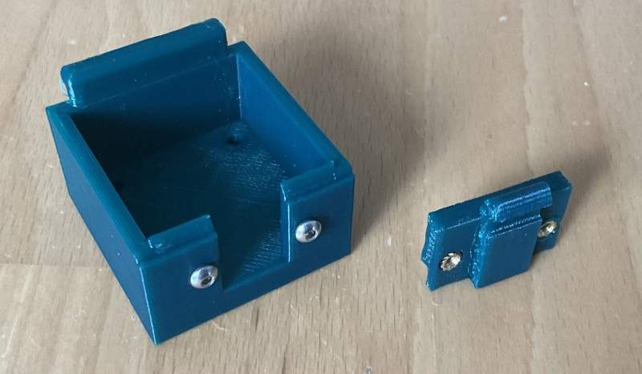
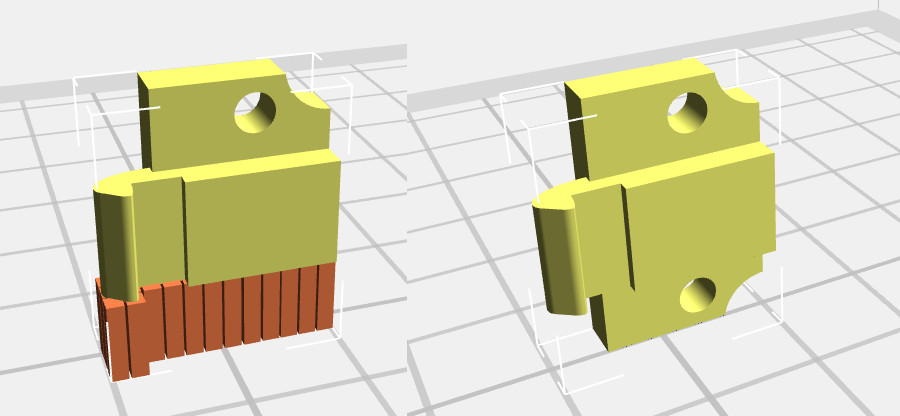

# Adapter for fitting a PiFinder onto a Rigel Quikfinder base

Here you can find an adapter for fixing the PiFinder on a Rigel Quikfinder base plate. 
We are offering two options here: 

 - The Rigel Quikfinder adapter, if the base plate is mounted "on top" of the scope and the PiFinder is reasonably perpendicular 
   to the ground (see [Mounting in the Quick Start Manual](https://pifinder.readthedocs.io/en/release/quick_start.html#mounting)). 
   This consists of two parts, see below.
 - A second (optional) adapter, that can be fixed to the first adapter, that is compatible with the "dovetail_top", so that you 
   can orient your PiFinder perpendicular to the mount, as recommended by the manual.

Option 1 looks like this: 

Option 2 looks like this: 

See the manual for build instructions, too!

## Caveat Printor! Attention Users!

Using this adaptor, your PiFinder's life will depend on the strength of the protrusions of the construction, that fix the PiFinder 
to the base plate. And keep in mind your PiFinder is roughly 6 times the weight of the Rigel Quikfinder!

So in order to make the adapter as strong as possible, we recommend to print the two parts in the following way: 

This way the filament will be perpendicular to the load and the part will be much stronger! 

## Bill of material

### Rigel Quikfinder adapter
This is what you'll need: 

| Qty | Item                            | Source               |
|-----|---------------------------------|----------------------|
| 1   | PiToQuikFinder v2 - Part 1.stl  | this directory       |
| 1   | PiToQuikFinder v2 - Part 2.stl  | this directory       |
| 2   | M2.4 x 4 mm heat set inserts    | same as for PiFinder |
| 2   | M2.5 x 12                       | same as for PiFinder |

### Optional Orientation adapter
In addition to the Rigel Quikfinder adapter above, you'll need:

| Qty | Item                            | Source               |
|-----|---------------------------------|----------------------|
| 1   | Orientation - Part 1.stl        | this directory       |
| 4   | M2.4 x 4 mm heat set inserts    | same as for PiFinder |
| 4   | M2.5 x 12                       | same as for PiFinder |

At the moment our experience with this adapter is limited, so   N O    G U A R A N T E E S   !

## Construction

### PiFinder to QuikFinder Base only
1. Print all the parts you need (Part 1 and Part 2)
2. Put heat-set inserts into "Part 2"
3. Fix "Part 1" to the PiFinder, it fits in the same position as the dovetail adapter.
4. Put 2 screws into "Part 2" to fixate it loosely.

## Fixating the PiFinder on the baseplate
## Adapting the construction

If you want to adapt the construction, [it lives in OnShape](https://cad.onshape.com/documents/9500cc0f203158187a96efcf/w/3012e46a66daad9d62f63084/e/da744dd9bb1d9cd0e2801bd8) (Free OnShape account needed).