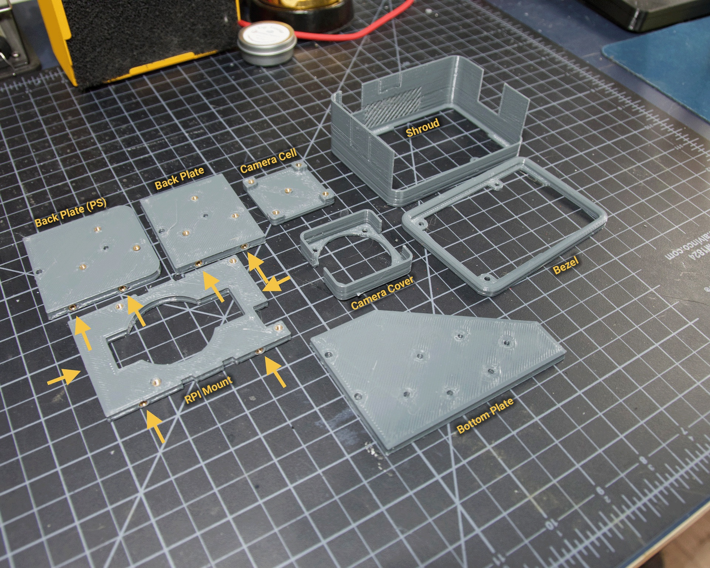
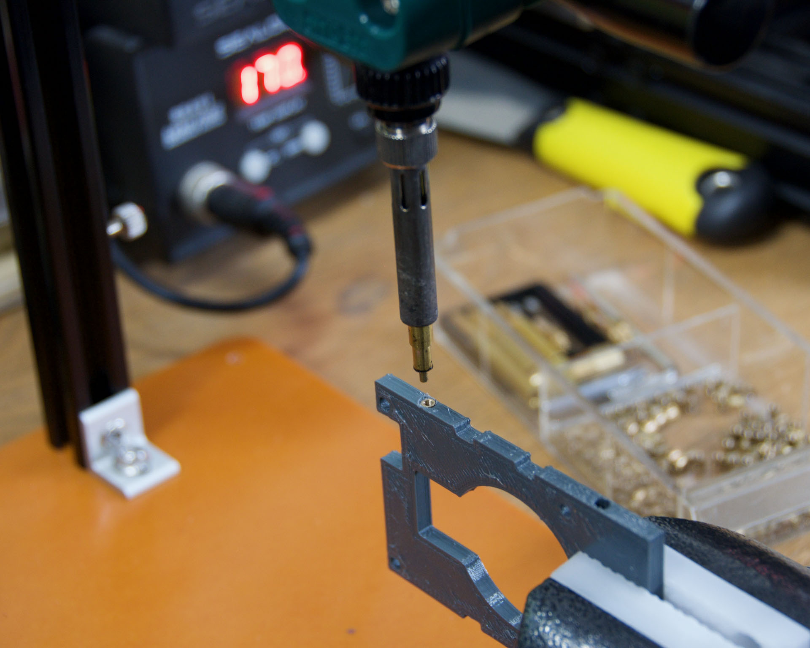
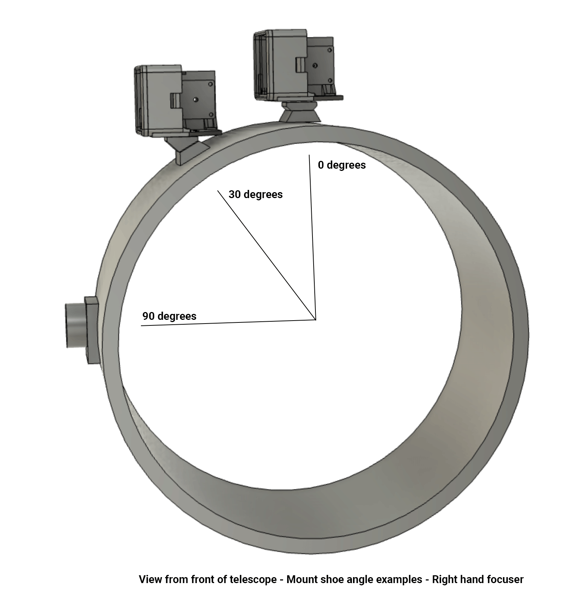

# Build Guide - Printed Parts

- [Introduction and Overview](build_guide.md)
- [UI Board](build_guide_ui.md)
- [Part Printing and Prep](build_guide_parts.md)
- [Assembly](build_guide_assembly.md)

## Parts ID

The PiFinder can be built in a left, right or flat configuration to work well on many types of telescopes.  See the [Hardware Users Guide](user_guid_hw.md) for more information including example photos.  To build each configuration, only a subset of the available parts are required.

### Common Parts
There are many parts which are common to all three configurations.  The Bezel, Camera Cell, Camera Cover and RPI Mount are used in all configurations. 

### Right and Left configurations

Below is an image showing the three specific parts required to build a left or right hand PiFinder.  Note that the Back Plate piece comes in two versions, one for use with a PiSugar (PS) and one without.  The PiSugar piece moves the camera slightly outboard to make room for the PiSugar battery pack.  You'll only need one of these or the other.

Due to the use of edge inserts, these pieces can be assembled in either left, or right, handed configurations so you just need the one set of parts regardless of which side your focuser is facing.  In the assembly guide you'll find info about how to orient the pieces as you put them together. 

### Flat Configuration
The pieces required for building the flat versions are pictured below.  The same parts are used with or without a PiSugar battery.

## Printing

These pieces will print without supports in the orientation shown on the photo.  I use 3 perimeter layers and 15% infill, but the pieces are not large and don't need to handle heavy forces so almost any print settings should work.

You will want to consider using a material other than PLA, as your PiFinder is likely to experience some sunlight in it's lifetime and PLA degrades under moderate heat and UV.  PETG or some co-polymer like NGen would be a good choice.  Prusamint Galaxy PETG is the official PiFinder filament and is pictured in most of the build guide, except where grey provided needed contrast.

## Inserts

Only some holes receive inserts, the rest have M2.5 screws inserted through them into the inserts in other pieces.  The brass inserts used in this project are M2.5 x 4mm long.  There are some inserts that go into holes through the entire piece thickness, and some that go into blind holes in the edges.  The edge inserts are indicated in the image above with arrows.

The Bottom Plate, Shroud, Bezel and Camera Cover have no inserts in them at all.

Because I use a lot of these inserts, I use a tool to help seat them plumb into the parts,  but I've done plenty freehand and it's not overly difficult.  Use a temperature a bit below your normal printing temperature (for reference, I print PETG at 230c and use 170-200c for inserts) and give the plastic time to melt around them.  

You can see a closer view of the through and blind inserts below

 

## Mounting

Most people will want to print a dovetail mount which fits into the finder shoe included on most telescopes.  The Flat configuration has it's own fixed dovetail mount, and the left/right hand version has an angle adjustable dovetail mount.  This is to allow the PiFinder to sit upright so the screen is easily visible.   See the image below for a better explanation:

If you need more flexibility, there is also a go-pro compatible plate that will bolt into the bottom plate.  You'll need to add inserts into the bottom plate mounting footprint to use this option.

Once you've got all the parts printed and inserts inserted, you're ready to [assemble](build_guide_assembly.md)!
