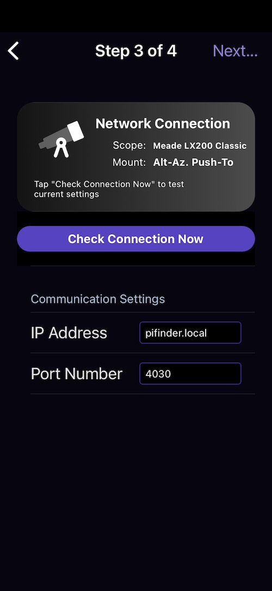
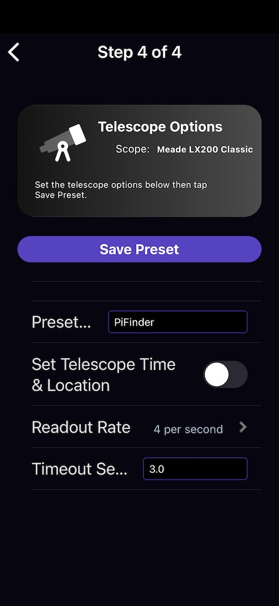

# Network Setup
Before using this guide, make sure that your device is on the same network as the PiFinder.  See the [User Guide](./user_guide.md#wifi) for details on changing WiFi modes and finding the IP address of the PiFinder

# SkySafari Setup
Connecting to a telescope requires SkySafari Plus or Pro and the first step is to setup a telescope profile.  Do this via the settings page in the Telescope section:

After clicking 'Presets', use the + button at the bottom right to add a new profile.

Select 'Other' as the telescope type

The 'Alt-Az.' GoTo as the scope type, even if you don't have a GoTo scope.  Selecting GoTo here allows you to send objects from SkySafari to the PiFinder observing list if desired.

Select 'Meade LX200 Classic' for the scope type and click 'Next'

You should be able to use `pifinder.local` for the IP address, but if this does not work, check the [Status screen](./user_guide#status) for the numeric IP address of the PiFinder.  Port 4030 seems to be the default for SkySafari, but change it to 4030 if there is another value populated.

Click 'Next' to continue

The defaults are good for the Readout rate and Timeout.  Give your profile a name and click the 'Save Preset' button.  This will save your new profile and make it the active one.

Now you should be able to select the Telescope icon on the main SkyFinder screen and click the connect button to start requesting position updates from the PiFinder.  If no solution has been obtained yet, the PiFinder will send a default location to SkySafari (0 degress RA/DEC) until it completes the first exposure/solve.