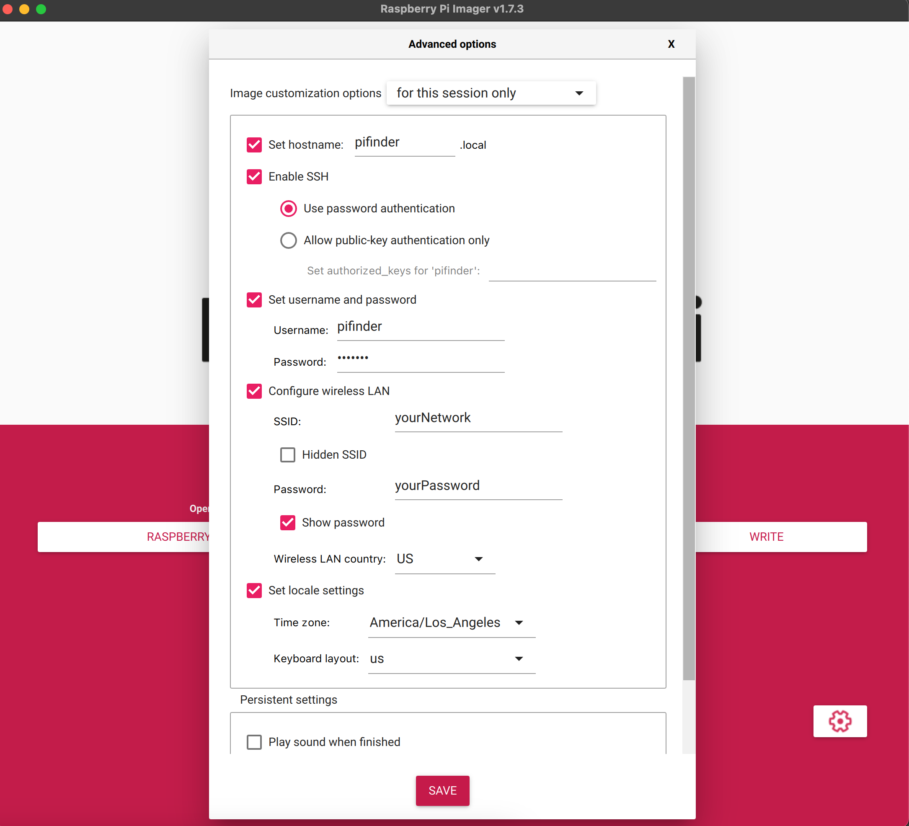

# Software Setup

Once you've built or otherwise obtained a PiFinder, here's how to setup a fresh SD card to run it.  You can do this completely headless (no monitor / keyboard) if desired.

## General Pi Setup
* Create Image:  I'd strongly recommend using the Rapsberry Pi imager.  It's available for most platforms and lets you easily setup wifi and SSH for your new image.
	* Select the 64-Bit version of Pi OS Lite (No Desktop Environment)
	* Setup SSH / Wifi / User and Host name using the gear icon.  Below is a screengrab showing the suggested settings.  The username must be `pifinder`, but the host name, password, network settings and locale should be customized for your needs.

* Once the image is burned to an SD card, insert it into the PiFinder and power it up.   It will probably take a few minutes to boot the first time.
* SSH into the Pifinder using `pifinder@pifinder.local` and the password you  setup.
* Update all packages.  This is not strictly required, but is a good practice.
	* `sudo apt update`
	* `sudo apt upgrade`
 * Enable SPI / I2C.  The screen and IMU use these to communicate.  
	 * run `sudo raspi-config`
	 * Select 3 - Interface Options
	 * Then I4 - SPI  and choose Enable
	 * Then I5 - I2C  and choose Enable

## PiFinder Software Install

Great!  You have a nice fresh install of Raspberry Pi OS ready to go.  The rest of the setup is completed by running the `pifinder_setup.sh` script in this repo.  Here's the command to download and run the script in one step:

 `wget -O - https://raw.githubusercontent.com/brickbots/PiFinder/release/pifinder_setup.sh | bash`

The script:
* Clone this repo
* Install the needed packages/dependencies
* Download some required astronomy data files
* Setup Wifi access point capabilities
* Create a samba share for pulling images, and observations logs and adding observing lists
* Finally, setup the PiFinder service to start on reboot.

Once the script is done, reboot the PiFinder:
`sudo shutdown -r now`

It will take up to two minutes to boot, but you should see the startup screen before too long:

## Catalog Images
You may now want to install all the catalog images.  These allow you to view an image of every object in the catalog system.  For more details please see the [Catalog Image Download](https://github.com/brickbots/PiFinder/blob/main/docs/user_guide_setup.md#catalog-image-download) instructions.