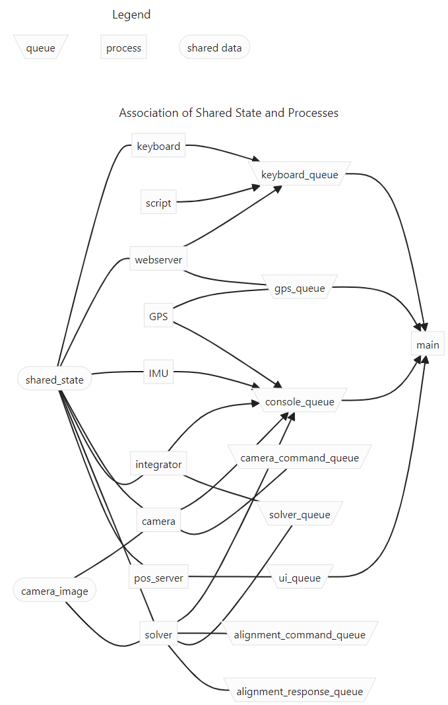

Architecture
================

The key words "MUST", "MUST NOT", "REQUIRED", "SHALL", "SHALL NOT", "SHOULD", "SHOULD NOT", "RECOMMENDED",  
"MAY", and "OPTIONAL" in this page are to be interpreted as described in `RFC 2119 <https://datatracker.ietf.org/doc/html/rfc2119>`_.

Solution Platform Constraints
--------------------------------

To facilitate do-it-yourself building, the solution platform is the **Raspberry Pi with a 
self-developed HAT**, which contains an OLED display and a custom keyboard. Integrated into
the HAT is an IMU and a GPS chip with antenna. Only components compatible with
this solution platform will be used. That means that **only cameras compatible with the 
Raspberry Pi CSI camera connector are supported**.

Choice of Language: Python
----------------------------

The **main language of the PiFinder software is Python**. Python is a well known language
with a lot of support for managing astronomical data. There's good support for 
image manipulation, statistics, APIs and implementing web servers. 

The second most used language are shell scripts managing especially the setup of the
Raspberry Pi and upgrades.

Architecture Overview
------------------------

Architecture determining Requirements
..........................................

As PiFinder is an interactive application with user input, 
there are some time-critical requirements: 

1. The camera picture SHALL be displayed as fast as possible on Raspberry Pi, 
   if it is displayed, so that movements of the telescope are reflected in the 
   display "instantanously" for the users. This implies a limit of 0.1s, see 
   [NIELSEN_LIMITS]_ [1]_.
2. The position derived on the celestial sky from the camera picture SHALL likewise 
   be displayed "instantanously". This means a very fast blind plate-solver MUST be used.
3. While the telescope is moved, the camera is not able to supply pictures that could
   be solved by the plate-solver (motion blur). In order to be able to provide 
   feedback on the movement to the users, PiFinder uses an IMU [2]_. Information derived
   from this subsystem MUST also be displayed to the user in an instantaneous fashion.
4. PiFinder offers a webserver interface, that users can connect to, 
   to remotely control PiFinder and to display and set certain configuration 
   information, that would be cumbersome to change using the keyboard. 
   This means that in parallel http requests MUST be parsed and serviced.
5. `SkySafari <https://skysafariastronomy.com/>`_ can connect to PiFinder and 
   be used as planetarium software to a) see there PiFinder is pointing and 
   b) to push targets to PiFinder. This means that PiFinder MUST support the 
   LX200 protocol as supported by SkySafari. 

.. [1] Realistically, < 0.5 - 1 s.
.. [2] inertial measurement unit, that uses accelerometers, gyroscopes and a magnetometer
       to record the movements it has undergone and estimates the position the 
       PiFinder is in.

PiFinder is a collaboration of processes
..............................................

This implies, that a lot of information needs to be collected in parallel, and MUST be 
processed and integrated to be displayed to the users. Given the choice of Python 
as the main programming language means that the choice of concurrency primitives is
important: 

As Python has a Global Interpreter Lock [GIL]_, **PiFinder uses separate processes
for the different tasks** mentioned above. This means that for communication between the 
processes either queues or shared memory are employed. Wherever possible, **we prefer to 
use queues to communicate between processes**, as it provides a decoupling 
of creation and consumption of data, so that the receiving end can process the data 
at a convenient point in time. In real life, most of the data is passed back and forth 
using shared memory. 

Processes 
....................

PiFinder consists of the following processes with their main responsibilities - 

Offloading Device interfacing to separate processes: 
 - **GPS**: Read telescope position and local time from GPS and post it to other processes. main stores this in the shared_state. ``gps_pi.py``
 - **keyboard**: Scan the keyboard, convert each button press into a keyboard event and post it. ``keyboard_pi.py``
 - **camera**: Setup the camera, read images into shared image. ``camera_pi.py``
 - **IMU**: Setup the IMU, read movements from IMU, share its orientation ``imu_pi.py``
 
Main Processing:
 - **main**: Entry point for PiFinder, this is the UI process, including Console, menu_manager and display. ``main.py``
 - **solver**: platesolve image, share position. ``solver.py``
 - **integrator**: Estimate PiFinder's current pointing by merging platesolve information and IMU data. ``integrator.py``

External Interfaces: 
 - **webserver**: Provide webpage, that shows the display and current status and allows users to control PiFinder via this website, e.g. from a mobile. ``server.py``
 - **pos_server**: Provide SkySafari the current position of PiFinder, receive new targets from SkySafari. ``pos_server.py``

In each of these code units, there's a function that will be called as the entry routine 
into that module. All of these have a signature and general structure like this:

.. code-block::

   def entry_function(shared_state, ..., <queues>, log_queue, ..., <startup parameters>)
      MultiprocLogging.configurer(log_queue) # ... Enable log forwarding, see below

      # Instantiate classes and hardware
      ...

      # Processing loop
      while true:
         ...

         # Use shared memory 
         var = shared_state.get ...
         ...
         shared_state.set ...
         ...

         # Use messages on queues
         var = queue.receive ...
         ...
         queue.send ...
         ...

Collaboration
....................

The following diagram provides an overview of the collaboration of processes: 

.. 
   mermaid
   ---
   title: Association of Shared State and Processes
   ---

   graph LR
	
	shared_state([shared_state])
	camera_image([camera_image])
    
	shared_state --- keyboard 
	keyboard_queue[\keyboard_queue/]
	keyboard --> keyboard_queue
	 
	script --> keyboard_queue
	 
	shared_state --- webserver
	webserver --> keyboard_queue
	webserver --- gps_queue
    
	gps_queue[\gps_queue/]
	GPS --- gps_queue
	console_queue[\console_queue/]
	GPS --> console_queue

	shared_state --- IMU
	IMU --> console_queue

	shared_state --- camera
	camera --> console_queue
	camera_command_queue[\camera_command_queue/]
	camera --- camera_command_queue
	camera_image --- camera 
    
	shared_state --- integrator
	integrator --> console_queue
	solver_queue[\solver_queue/]
	integrator --- solver_queue
    
	shared_state --- solver 
	camera_image --- solver
	solver --> console_queue
	alignment_command_queue[\alignment_command_queue/]
	solver --- alignment_command_queue
	solver --- solver_queue 
	alignment_response_queue[\alignment_response_queue/]
	solver --- alignment_response_queue
    
	shared_state --- pos_server
	ui_queue[\ui_queue/]
	pos_server --- ui_queue
    
	console_queue --> main
	keyboard_queue --> main
	ui_queue --> main
	gps_queue --> main

Note: **main** is associated with all queues and processes. Here we show only the queues 
that are explicitly processed and consumed in main's loop. 

Further note: The graphic was generated automatically by `mermaid <https://mermaid.js.org/>`_. 
We only show some of the flow directions, as the rendering engine gets confused and a lot 
of the clarity of the representation is lost. 

Here some details: 
 - The camera shares pictures using the Shared Memory image (see below) and receives 
   commands on exposure time through `camera_command_queue`
 - The solver processes the image and notifies the integrator of new solves 
   through the `solver_queue`
 - The `aligment_command_queue` is used to ask the solver, which pixel corresponds 
   to a given position and the result is handed back using the `aligment_response_queue`
 - Through the `ui_queue` a new target is set by the SkySafari server
 - Commands and telescope location (GPS) are injected by the `webserver` into the respective queues.

State in Shared Memory 
........................

The second option to share information between processes is using shared memory. 
This is setup using a `multiprocessing.manager` which is responsible to setup the shared memory structures
and providing objects to the processes to access the shared memory. 

There are three types of shared state in PiFinder 

- A structure **shared_state** - 
  The definition of which can be found in ``state.py``. Example:

.. code-block:: python

   SharedStateObj(
      power_state=1,
      solve_state=True,
      solution={'RA': 22.86683471463411, 'Dec': 15.347716050003328, 
                'solve_time': 1695297930.5532792, 'cam_solve_time': 1695297930.5532837, 'Roll': 306.2951794424281, 'FOV': 10.200729425086111,
                RMSE': 21.995567413046142, 'Matches': 12, 'Prob': 6.987725483613384e-13, 'T_solve': 15.00384000246413, 'RA_target': 22.86683471463411,
                'Dec_target': 15.347716050003328, 'T_extract': 75.79255499877036, 'Alt': None, 'Az': None, 'solve_source': 'CAM', 'constellation': 'Psc'},
      imu={'moving': False, 'move_start': 1695297928.69749, 'move_end': 1695297928.764207,
            'status': 3},
      location={'lat': 59.05139745, 'lon': 7.987654, 'altitude': 151.4, 'gps_lock': False, 'timezone': 'Europe/Stockholm', 'last_gps_lock': None},
      datetime=None,
      screen=<PIL.Image.Image image mode=RGB size=128x128 at 0xE693C910>,
      solve_pixel=[305.6970520019531, 351.9438781738281]
   )

- The shared image - 
  This uses a **shared memory image, that is constantly updated by the 
  image acquision thread**. Whenever working on this image, make sure that 
  you create your own local copy of it, so it does not get changed while you process it. 

- An UIState object - see ``ui/status.py`` 

Running with-out hardware
---------------------------

When PiFinder's software is not run on a Raspberry Pi equipped with the additional hardware, 
during startup instead of importing and instantiating the classes using the "real" hardware with ``<class>_pi.py``, the startup
routine imports the respective ``<class>_fake.py`` or ``<class>_none.py`` code units. 

Logging
--------- 

This choice of architecture means that logging to disk is a little bit more complex, as we
need to avoid writing to the same log file from multiple processes, to avoid overwriting
each other's logs. We have therefore implemented a **log thread and queues delivering log 
messages from other processes**. This means that in a log file, the order of log messages 
can be out of order. 

To set this up, in each process you need to invoke logging like this:

.. code-block:: python

    from PiFinder.multiproclogging import MultiprocLogging
    
    # You can create loggers with-out setting up forwarding
    logger = logging.getLogger("Solver")
    
    ...
    
    # In the main loop of the process ... 
    def process( ..., log_queue, ...)
        MultiprocLogging.configurer(log_queue) # ... Enable log forwarding
        
        # only then create log messages
        logger.debug("Starting Solver")

Note that if you use ``console.write()``, you'll in almost all cases also want to issue a ``logging.info()``: 
If the console cannot be displayed, the log file's the only way to see what's going on.

Choice of Plate-Solver
------------------------ 

PiFinder uses `cedar-detect-server (on GitHub) <https://github.com/smroid/cedar-detect>`_ 
in binary form to determine star centroids in an image. This is a fast centroider written
in the Rust programming language that is running in a separate process. A gRPC API is used
to interface with this process. See the Python documentation in the linked GitHub repository.

The detected centroids are then passed to the 
`cedar-solve (on GitHub) <https://github.com/smroid/cedar-solve>`_ for plate-solving. Note that in the code 
it is still called `tetra3`, as this was used before, and cedar-solve is a 
fork of the `tetra3-solver (on GitHub) <https://github.com/esa/tetra3>`_. It uses a database that
is stripped down to work with the approximate focal length of compatible lenses as listed 
in the `Parts List <BOM.html>`_ so that the time to get a solve is minimal.

If the platform that PiFinder is running on is not supported by cedar-detect, [3]_ PiFinder 
falls back to using the centroider of tetra3.

.. [3] This can only happen when PiFinder's software is not running on a Raspberry Pi.

Testing
----------

Unit Testing
...............

On commit or pull request to the repository the unit tests in ``python/tests`` are run using the 
configuration in ``pyproject.toml`` using nox (also see its configuration in 
``noxfile.py``). **Please provide unit tests with your pull requests.** 

Fuzz Testing
...............

A.k.a „monkey testing“.

PiFinder's software can be invoked with the ``--script <file>`` parameter, 
which plays back the key strokes listed in the specified file. 

In the ``scripts`` folder you will find two files that contain randomly created key
presses. One file contains 1k the other 10k simulated key presses. We recommend 
to run this after every change to the UI, before you create the pull request. 
This is currently not automatically done on commit to the repository.

There's also a script to create larger keystroke files. 
 
Help Needed
...............

Currently the number of tests is rather low and needs improvement. 

Please visit `Issue #232 <https://github.com/brickbots/PiFinder/issues/232>`_ 
for a discussion of tests that we would like to implement.  

References
------------

.. [NIELSEN_LIMITS] https://www.nngroup.com/articles/response-times-3-important-limits/
.. [GIL] https://realpython.com/python-gil/
