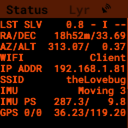
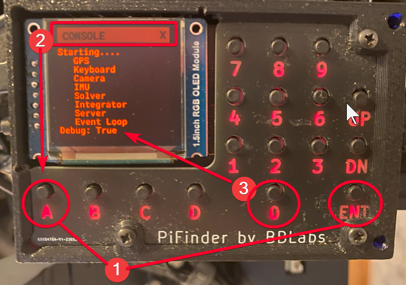
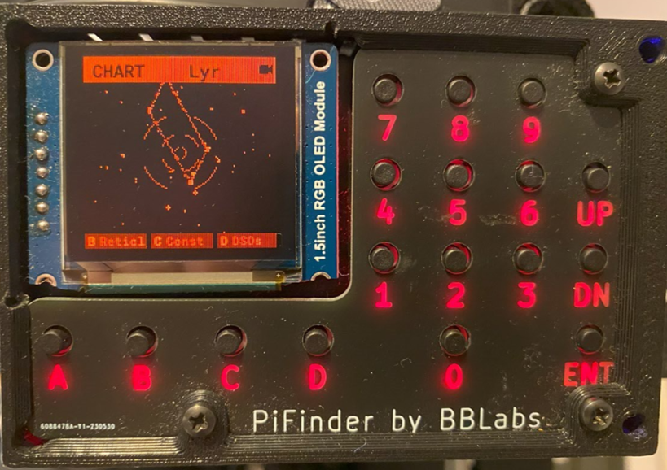

.. _dev_guide:

Contributors Guide
===================

If you'd like to help with developing PiFinder, this is the place 
to start. You don't need to be a developer to help out, as there 
are many ways to contribute to the project. Whether it's improving 
documentation, testing new features, or suggesting ideas, your 
contribution is valuable.

Here are some ways you can get involved:

- **Report Bugs**: If you encounter any issues, report them with detailed steps to reproduce the problem. This helps developers identify and fix bugs quickly.
- **Suggest Enhancements**: Share your ideas for new features or improvements. Your suggestions can help shape the future of PiFinder.
- **Improve Documentation**: Help make the documentation clearer and more comprehensive. If you find something confusing or incomplete, feel free to update it or suggest changes.
- **Translate the user interface**: Since v2.3.0 PiFinder is available in multiple languages. If you want to help with translations, please check the `internationalization`_ section below.
- **Beta Testing**: Try out new features and provide feedback. Testing helps ensure the software is stable and works as expected.
- **Contribute Code**: If you're a developer, you can contribute code by fixing bugs, adding features, or improving existing functionality.

No matter how you choose to contribute, your efforts are greatly appreciated. Join the PiFinder community and help make it even better!

The easiest way to get started is to join the `PiFinder Discord server <https://discord.gg/Nk5fHcAtWD>`_ and ask questions. The community is friendly and always willing to help newcomers. Reporting bugs and suggesting enhancements is also a great way to get involved.

If you have some experience with Unix/Linux and are willing to spend a little more time, you can improve the documentation or be a beta tester. See `beta testing`_ section below for more information.

If you are a developer, like to tinker with the code, troubleshoot you 
PiFinder in depth or contribute to the project: this guide helps you to
do all these cool things. 

Submitting issues, bugs and ideas
---------------------------------

Generally the rule applies: if you ask a question or contribute, either 
here in GitHub, via Mail or in the discord channel, the more descriptive
and precise you are, the better. Please always describe exactly what 
you **found**, what you **expected** and how the way is to **reproduce** 
the issue for others. Therefore you can additionally submit error logs, 
show us pictures of the problem or make screenshots. This helps a 
lot to speed up things.

Depending on the complexity of the problem, it is probably wise, 
to discuss the issue on the 
`PiFinder Discord server <https://discord.gg/Nk5fHcAtWD>`_ in advance.  

- If you have a **question**, that is likely to be answered in short, 
  the quickest way is to ask in the 
  `PiFinder Discord server <https://discord.gg/Nk5fHcAtWD>`_ in the 
  section "support-software". There are a lot of users and developers online 
  who can help.

- If you are serious about an **error** or you have seen a **bug**, then 
  please feel free to open a **descriptive issue** here on `GitHub <https://github.com/brickbots/PiFinder/issues/new>`_.  

- Also, if you like to **submit your ideas** or have a wish for the 
  PiFinder, you can use the **issue** page. This helps the developers 
  to sort things out and prioritize. 

Beta Testing
-------------- 

When you look at the `PiFinder GitHub repository <https://github.com/brickbots/PiFinder>`_ you will see, that there are different branches. 
That is the way, how we develop the PiFinder. The main branch is the one, on which development is happening. If you want to test the latest changes, you can
check out the main branch and run its code. For this your PiFinder needs to be connected to the internet, i.e. your WiFi. 
Once you have connected, log into your PiFinder via ssh and run the following commands in the terminal:

.. code-block:: bash

    cd ~/PiFinder
    git fetch --all
    sudo systemctl stop pifinder
    git checkout main
    git pull
    ./pifinder_post_update.sh
    sudo systemctl start pifinder

This will stop the PiFinder, update the code and dependencies to the latest development version and start it again.

If you want to return to the stable version, you can run the following command:

.. code-block:: bash

    ./pifinder_update.sh

If you really, really would like to use bleeding edge code, you can check out a different branch, or checkout one of the forks of the repository.

To list all branches, run the following command:

.. code-block:: bash

    cd ~/PiFinder
    git branch -a

To checkout one of the forks of the repository, run the following commands:

.. code-block:: bash

    cd ~/PiFinder
    git add remote <rname> <url-of-fork>
    git fetch --all
    git checkout -b <branch> <rname>/<branch>

You have to replace <rname> with the name of the remote you added, <url-of-fork> with the URL of the fork you want to check out (you can copy this from github, by pressing on the "code" button), and <branch> with the name of the branch you want to check out. This will create a new branch in your local repository, which follows the branch of the fork you checked out.

To keep up to date with the latest changes in the fork, you can run the following commands:
.. code-block:: bash

    cd ~/PiFinder
    git pull 
    cd python
    sudo pip install -r requirements.txt

 The last command will install the requirements and only needs to be run occasionally, depending on the changes in the branch. You need to restart the pifinder service to see the changes.   

Fork me - getting or contributing to the sources with pull request
------------------------------------------------------------------

If you like to alter or contribute new functionalities, fix errors in the code, 
or even just help with the documentation, best is to **fork** the code 
into your own GitHub account. Also, you can communicate your effort in the 
above mentioned `PiFinder Discord server <https://discord.gg/Nk5fHcAtWD>`_ .

Within your fork, you can do all the fancy changes, you like to see in the 
PiFinder, test them locally. Then you can do a **pull request** to the original 
code of the PiFinder project. If you are a programmer you should already know 
the procedure. If not, here is how you do this: 

* `GitHub Docs - About pull requests <https://docs.github.com/en/pull-requests/collaborating-with-pull-requests/proposing-changes-to-your-work-with-pull-requests/about-pull-requests>`_
* `GitHub Docs - Creating a pull request <https://docs.github.com/en/pull-requests/collaborating-with-pull-requests/proposing-changes-to-your-work-with-pull-requests/creating-a-pull-request>`_
* `Youtube - How To Pull Request in 3 Minutes <https://www.youtube.com/watch?v=jRLGobWwA3Y>`_

Documentation
-------------

The `PiFinder documentation <https://pifinder.readthedocs.io/en/release/index.html>`_
is written in `reStructuredText <https://www.sphinx-doc.org/en/master/usage/restructuredtext/basics.html#external-links>`_ . 
The files are located in PiFinders GitHub repository under ``docs/source`` and have 
the ending ``.rst``. The documentation is then published to `redthedocs.io <eadthedocs.io>`_, when the change is committed 
to the official GitHub repository (using readthedocs's infrastructure). 

You can link your fork also to your account on readthedocs.io, but it is easier to build the documentation locally. 
For this install sphinx using pip: 

.. code-block::

    pip install -r sphinx sphinx_rtd_theme

You can then use the supplied ``Makefile`` to build a html tree using ``make html`` and running a http server in the directory with the files: 

.. code-block::

    cd build/html; python -m http.server

Internationalization
-----------------------

PiFinder uses ``gettext`` and ``pybabel`` for internationalization.
You can find the information in folder ``python/locale`` in the repository. 
This means that strings that need translation must be 
enclosed in a call to ``_()`` such als ``_("string that needs translation")``. 

As we would like to allow users to switch the language of the user interface from the menu, and with-out restarting PiFinder,
care must be taken, that translations are performed dynamically, i.e. not at load time of python files. 
If you have a variable at package level that needs to be translated, you still need to mark the strings with ``_()``, but make sure 
it is not translated by overriding the ``_()``-function with a local one, that returns the string and then ``del`` that from the context, when you're done.
You can find an example of this in ``menu_structure.py`` at the top and bottom of the file. 

Please also check your unit tests, that these take care of installing ``_()`` into the local context, this can be achieved like this: 

.. code-block::

    import PiFinder.i18n  # noqa: F401

The ``# noqa: F401`` is needed to avoid the linter to remove the line, as the import is not used in the code.

Translating the user interface
.................................................

The translation files are located in the subdirectories in the ``python/locale`` folder. The files that need to be edited are the 
``messages.po`` files, in the respective subfolder with the language code, which is the respective ISO 639-1 code. These folders
also contain the compiled ``.mo`` files, which are binary representations of the translation and are used by the PiFinder software.

When you edit the files, check for each entry that has a ``msgstr ""`` line, which means the string is not translated yet.
You also need to check the translations of strings marked as "fuzzy". You need to remove the "fuzzy" line, once you have checked the translation.

In order to run the PiFinder software with the latest translation, you need to run the folloing commands: 

.. code-block::

    cd ~/PiFinder/python
    sudo pip install -r requirements_dev.txt
    nox -s babel 

The ``pip`` command installs the dependencies for the translation, the second command runs the babel toolchain to extract the strings 
to translate and update the .po files. This also compiles the .po files into .mo files, which are then used by the PiFinder software.

So if you want to test your translations, you need to run the ``nox`` command every time you change the .po files, then restart the PiFinder software:

.. code-block::

    nox -s babel
    sudo systemctl restart pifinder

Please post the changed po files in the Discord channel "translation" and we will include it in the next release.

Setup the development environment
---------------------------------

On the PiFinder
..................

The best development platform for the PiFinder is the PiFinder itself via SSH or with a 
monitor keyboard attached.  This will let you develop and test any part of the code. 

See the :ref:`software:build from scratch` section of the Software Setup guide for 
information on creating a base SD card and getting the base software running.

Other Options
................

Second to this is a standalone Raspberry Pi hooked up to a keyboard and monitor.  This
will make sure your code will run on the PiFinder, but you won't be able to test the 
IMU, GPS or other physical hardware features.  You can emulate these using the 
`--fakehardware` and `--display` flags.  See below for more details.

You can also develop on any Posix compatible system (Linux / MacOS) in roughly the 
same way you can on a Raspberry Pi.  The emulated hardware and networking features 
will work differently so this is mostly useful for UI/Catalog feature development.

Note that you can develop on Windows by activating Windows Subsystem for Linux (WSL2) 
and installing Ubuntu from the Microsoft Store. The window launched by PiFinder will 
be fully integrated into your windows desktop. 

To get started, fork the repo and set up your virtual environment system of choice
using Python 3.9.  Then follow some of the steps below!

Install python dependencies
...........................

For running PiFinder, you need to install some python libraries in certain
versions. These lists can be installed via 
`pip tool chain <https://pypi.org/project/pip/>`_  and are separated in two
files: one for getting PiFinder to run, one for development purposes:

.. code-block::

    pip install -r requirements.txt
    pip install -r requirements_dev.txt

Install the Hipparcos catalog
.............................

The `hipparcos catalog <https://www.cosmos.esa.int/web/hipparcos>`_ will be
downloaded to the following location: ``/home/pifinder/PiFinder/astro_data/``

.. code-block::

    wget -O /home/pifinder/PiFinder/astro_data/hip_main.dat https://cdsarc.cds.unistra.fr/ftp/cats/I/239/hip_main.dat

Install the Tetra3/Cedar solver
................................

The `Tetra3 Solver <https://github.com/esa/tetra3>`_ is a "fast lost-in-space
plate solver for star trackers written in Python". It is the next gen solver, that PiFinder uses.

This is set up as a git submodule and you will need to initialize it using the following
command from with your checked out repo

.. code-block::

    git submodule update --init --recursive

Code Quality Automation
-----------------------

The PiFinder codebase includes features for maintaining code quality,
adherance to style guide and for evaluation and testing.  These will
be installed along with the dev dependencies and should be available
to run immediately.

NOX
....

We use `Nox <https://nox.thea.codes/en/stable/>`_ as an entrypoint to all of 
the code quality tools. Simply run ``nox`` to from the ``PiFinder/python`` 
directory and it will run (almost) all of the code quality checks and tests.

The first time it runs Nox will set up suitible environments for each session
it manages and this might take a bit.  Subsequent runs will be much faster.

To see what sessions are available use ``nox -l``

To run only a specfic session use ``nox -s [session_name]``

The defined sessions are:

- lint -> Runs `RUFF <https://docs.astral.sh/ruff/>`_ using ``ruff check --fix`` to 
  check/fix common code issues.  It may produce warnings or fail completely if 
  there are issues with new code you are working on.  See the documentation for 
  details on any errors it finds.

- format -> Runs ``ruff format`` to reformat code in the Black style. 

- type_hints -> Runs `my[py] <https://mypy.readthedocs.io/en/stable/>`_ to do static
  type analysis.  The PiFinder code is not fully typed (yet!) but we are working on it
  and any new contributions will need to be fully annotated.  If you've not worked
  with type-hinted Python before, we'll help you out, so feel free to put up PR's 
  for non-type-hinted code and we can collaborate.

- smoke_tests -> Runs `PyTest <https://docs.pytest.org/en/8.2.x/>`_ and executes
  all tests marked SMOKE.  Smoke tests should be FAST and provide some basic 
  checking of sanity/syntax.

- unit_tests -> Runs PyTest and executes all tests marked as UNIT.  Unit tests 
  should exercise more functionality and make take a bit more time.  This Nox
  session is not run by default, but is executed on code check in to the PiFinder
  repository.

- babel -> Runs the complete toolchain for internationalization (based on `pybabel`).
  That means extracts strings to translate and updates the `.po`-files in `python/locale/**`
  Then these are compiled into `.mo`-files. Unfortuntely, this changes the `.mo`-files in any case,
  even if the there have been no changes to strings or their translation. As this will show up 
  as changes to checked-in, this is not run by default. 
  

CI/CD
.......

All pushes to the PiFinder repository will run all the defined Nox sessions. Automations
for PR's will need to be triggered by a maintainer, but you can (and should!) set up 
your fork to run the existing automation to validate your code as you develop.

If you need help, reach out via email or discord.  We are happy to help :-)

Running/Debugging from the command line
---------------------------------------

When you installed all the dependencies, you like to develop and test your
code. You like to see debugging information and all verbose messages. You
probably like to save these informations into a file. 

Therefore, switch to the ``~/PiFinder/python`` folder and start the PiFinder
python program with the command line parameters you need for the certain use case. 

.. code-block::

    cd /home/pifinder/PiFinder/python
    python3 -m PiFinder.main [command line parameters]

You simply stop the program with "Ctrl + C".

**Remember**: PiFinder is designed to automatically start after boot. So a
PiFinder process is likely running. Before you can start a PiFinder process for
testing purposes from the command line, you have to stop all currently running
PiFinder instances. Simply, because you can not run multiple PiFinder instances
in parallel. They would try to access the same hardware, which is not possible.
You can do this e.g. with the following code, which uses awk to kill all runnding processes of
PiFinder:

.. code-block::

    ps aux | grep PiFinder.main | awk '{system("kill -9  " $2)}'

You will need to start the ``cedar-detect`` process manually, if your development machine is not a PiFinder, 
as it is started as a separate process on the PiFinder starting with v2.4.0. 
You can do this by running the following command in another terminal window:

.. code-block::

    cd /home/pifinder/PiFinder/python/PiFinder/bin
    ./cedar-detect-server-<your arch> -p 50551

-h, --help | available command line arguments
.............................................

Get all ``PiFinder.main`` options with the "--help" flag.

.. code-block::

    pifinder@pifinder:~/PiFinder/python $ python3 -m PiFinder.main -h
    Starting PiFinder ...
    usage: main.py [-h] [-fh] [-c CAMERA] [-k KEYBOARD] [--script SCRIPT] [-f] [-n] [-x] [-l]
    
    eFinder
    
    optional arguments:
      -h, --help            show this help message and exit
      -fh, --fakehardware   Use a fake hardware for imu, gps
      -c CAMERA, --camera CAMERA
                            Specify which camera to use: pi, asi, debug or none
      -k KEYBOARD, --keyboard KEYBOARD
                            Specify which keyboard to use: pi, local or server
      --script SCRIPT       Specify a testing script to run
      -f, --fps             Display FPS in title bar
      -n, --notmp           Don't use the /dev/shm temporary directory. (useful if not on pi)
      -x, --verbose         Set logging to debug mode
      -l, --log             Log to file

.. note::

   The available command line flags may change with forthcoming releases. Always refer to the real output of the command line parameter "-h".

-x, --verbose | debug information
.................................

You enable the debug information output simply by passing the '-x' flag.

.. code-block::

    pifinder@pifinder:~/PiFinder/python $ python3 -m PiFinder.main  -x
    Starting PiFinder ...
    2024-03-17 11:31:26,285 root: DEBUG using pi camera
    2024-03-17 11:31:26,383 PiFinder.manager_patch: DEBUG Patching multiprocessing.managers.AutoProxy to add manager_owned
    2024-03-17 11:31:26,431 root: DEBUG Ui state in main is{'observing_list': [], 'history_list': [], 'active_list': [], 'target': None, 'message_timeout': 0}
    Write: Starting....
    Write:    GPS
    Write:    Keyboard
    2024-03-17 11:31:28,544 root: DEBUG GPS waking
    [...]

--display DISPLAY
..........................

Start the PiFinder software with a particular display device.  This is useful
for devloping on a different posix system like MacOS or Linux.  Available options
are:

- ssd1351 - This is the standard 1.5" OLED screen (DEFAULT)
- pg_128 - PyGame emulated 128x128 display.  Use this for developing/testing
  PiFinder code on a laptop or desktop.

-c CAMERA, --camera CAMERA
..........................

Use the "fake" camera module, so the PiFinder cam ist physically not necessary
for testing purposes. Else specify which camera to use: pi, asi, debug or none.

.. code-block::

    python3 -m PiFinder.main -k local --camera debug -x

-fh, --fakehardware | imu, gps only
...................................

This uses fake hardware for the imu and gps.

.. code-block::

    python3 -m PiFinder.main -fh -k local --camera debug -x

-k KEYBOARD, --keyboard KEYBOARD
................................

A switch between the pi keyboard (on a real device), the local keyboard
(eg Mac with emulated screen) or via a webserver. That last one will probably
be retired because the remote server is always started.

.. code-block::

    python3 -m PiFinder.main -fh -k server --camera debug -x

Troubleshooting
---------------

My app crashes
..............

When crashing, there are many unrelated stack traces running. Search for the
relevant one. The rest is not important, these are the other threads stopping.

.. ::attention

   Needs an example

Test the IMU
............

.. ATTENTION::

   Other possibilities? E.g. cover some pins?

First power up the unit and look at the Status page while moving it around. The
status screen is part of the :ref:`user_guide:tools` menu.

If the IMU section is empty ("- -") or does not move, it is likely, that either
the IMU is defect or you have a problem on your board.

1. Please check, if the board is soldered all pins correctly and did not shorten anything (spurious lead). 
2. If you sourced the parts by you own, it might be, that you bought the wrong
   IMU hardware version. You need the 4646 versio. On the non-stemma QT versions,
   the data pins are switched. 
   `See here on Discord <https://discord.com/channels/1087556380724052059/1112859631702781992/1183859911982055525>`_. 
3. The IMU is defect. 

If the IMU is defect, this only can be tested by removing the faulty hardware and replacing it with another one. 

The demo mode - it is cloudy, but I like to test my PiFinder anyways
....................................................................

Using the **demo mode** you will be able to run the PiFinder and almost all it's functionality, but not under the stars. Therefore the PiFinder get's an image of the sky from the disc instead from the camera and uses it. You can use all PiFinder commands, like searching for an object, you see the IMU run and you get a "fake" GPS signal. You also can check the PiFinder keyboard and the complete menu cycle. 

The way to get this functionality, is to enter PiFinder in the 'test' or 'debug' mode.

First method: Press (short press) **"ENT-A"** again and again to cycle through the screens until you get to the **Console screen**. There press the **"0"** key (the display shows the message "Debug: true"). This will supply a fake GPS lock, time and cause the PiFinder to just solve an image from disk.  But it will respond to IMU movement and allow use of things like Push-To and all the other functions that require a solve/lock. You can leave the "demo mode" by just again cycle to the Console screen and press "0" again (the display shows the message "Debug: false").

Second method: run PiFinder with the :ref:`dev_guide:Running/Debugging from the command line` functionality.

.. note::

  If you are using the demo-mode and move the PiFinder and scope around, you will notice, that the picture alway starts at the same "standard demo picture". And it always switch back to the same picture, once you stopped. Do not expect to move through the sky, like you normally would do and get a solve to the newly reached location. You will always be brought back to the same position in the sky.

