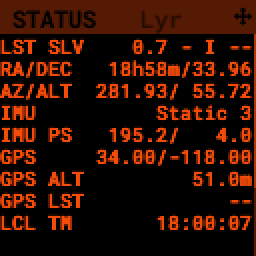

.. _dev_guide:

Developer Guide
===============

If you are a developer, like to tinke with the code, troubleshoot deeper or contribute to the project: this guide helps you to do all these cool things. 

Submitting issues, bugs and ideas
---------------------------------

Generally the rule applies: the more desciptive and precise you are, the better. T Please always describe exacactly what you found, what you expected and how you found the issue. Work with error logs or show us pictures of the problem or maker screenshots. his helps a lot to speed up things.

Depending on the complexity, it is probably wise, to discuss your issue on the discord server in advance. There are a lot of users and developers online. 

- If you have a **question**, that is likely to be answered, the quickest way is to ask in the `PiFinder Discord server <https://discord.gg/Nk5fHcAtWD>`_ in the section "support-software". 

- If you are serious about an **error** or you have seen a **bug**, then please feel free to open an issue here on GitHub.  

- Also, if you like to **submit your ideas**, you can use the issue page. 

Getting or contributing to the sources
--------------------------------------

If you like to alter or contribute new functionalities, fix errors in the code, or even just help with the documentation, best is to **fork** the code into your own GitHub account. Also, you can tell this the developers in the above mentioned `PiFinder Discord server <https://discord.gg/Nk5fHcAtWD>`_ .

From there you can do a **pull request** to the original code. If you are a programmer you should already know the procedure. If not, here is how you do this: 

* `GitHub Docs - About pull requests <https://docs.github.com/en/pull-requests/collaborating-with-pull-requests/proposing-changes-to-your-work-with-pull-requests/about-pull-requests>`_
* `GitHub Docs - Creating a pull request <https://docs.github.com/en/pull-requests/collaborating-with-pull-requests/proposing-changes-to-your-work-with-pull-requests/creating-a-pull-request>`_
* `Youtube - How To Pull Request in 3 Minutes <https://www.youtube.com/watch?v=jRLGobWwA3Y>`_

Setup a development environment
-------------------------------

Python: Version 3.9 or 3.10 python with a working `pip tool chain <https://pypi.org/project/pip/>`_
OS:     Debian Buster (Bookworm to come)

Install python dependencies
...........................

For running PiFinder, you need to install some python libraries in certain versions. These lists can be installed via `pip tool chain <https://pypi.org/project/pip/>`_  and are separeted in two files:

``
pip install -r requirements.txt
pip install -r requirements_dev.txt
``

Install Hipparcos catalog
...........................

The hipparcos catalog will be downloaded to another location: ``/home/pifinder/PiFinder/astro_data/``

``wget -O /home/pifinder/PiFinder/astro_data/hip_main.dat https://cdsarc.cds.unistra.fr/ftp/cats/I/239/hip_main.dat``

Tetra3 solver
...........................

The `Tetra3 Solver <https://github.com/esa/tetra3>` is a "fast lost-in-space plate solver for star trackers written in Python". It is the next gen solver, that PiFinder uses.

``
cd python/PiFinder
git clone https://github.com/esa/tetra3.git
``

Running in debug mode 
---------------------

If you installed everything, you like to develop and test your code. Or you like to see error messages. 

Run the following command from the ``./python`` folder to start PiFinder in the debugging mode. You can enable debug information by passing the '-x' flag:
``
cd /home/pifinder/PiFinder/python
python3 -m PiFinder.main -k local --camera debug -x
``

TBD: WHAT DOES "Server" do?
``
python3 -m PiFinder.main -fh -k server --camera debug -x
``

Troubleshooting
---------------

My app crashes
..............

When crashing, there are many unrelated stack traces running. Search for the relevant one. The rest is not important, these are the other threads stopping.

My IMU seems not to be working
..............................

First power up the unit and look at the Status page while moving it around. The status screen is part of the ´Utility Screens <https://github.com/apos/PiFinder/blob/release_doc_updates/docs/source/user_guide.rst#utility-screens>´

If the IMU section is empty ("--") or does not move, it is likely, that either the IMU is defect or you have a defect on your board.

1. Please check, if the board is soldered correctly and you have all pins fully soldered and did not shorten anything. 
2. If you sourced the parts by you own, it might be, that you bought the wrong IMU hardware version. You need the 4646 versio. On the non-stemma QT versions, the data pins are switched (`see here >https://discord.com/channels/1087556380724052059/1112859631702781992/1183859911982055525>`). 

If the IMU is defect, this only can be tested by removing it an replacing it with another

The demo mode - it is cloudy, but I like to test my PiFinder
------------------------------------------------------------

The way to enter the 'test' or 'debug' mode on the PiFinder is to use "ENT-A" to cycle through the screens to get to the Console screen and then pressing the "0" key . This will supply a fake GPS lock, time and cause the PiFinder to just solve an image from disk.  But it will respond to IMU movement and allow use of things like Push-To and all the other functions that require a solve/lock.

Pics here

