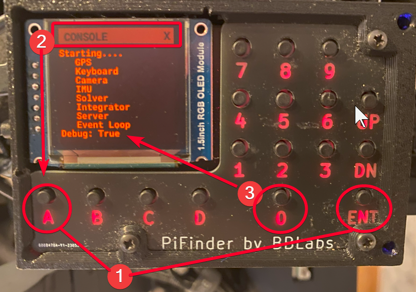
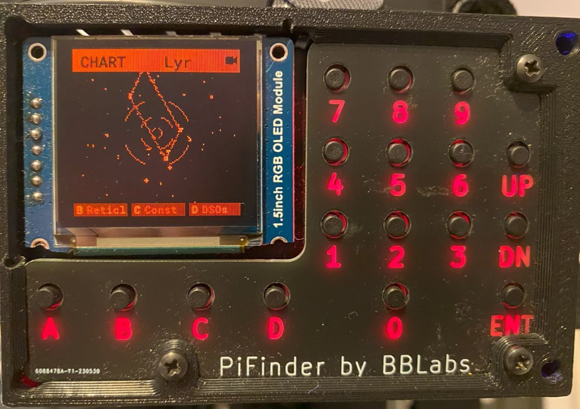

.. _dev_guide:

Contributors Guide
===================

If you'd like to help with developing PiFinder, this is the place 
to start. You don't need to be a developer to help out, as there 
are many ways to contribute to the project. Whether it's improving 
documentation, testing new features, or suggesting ideas, your 
contribution is valuable.

Here are some ways you can get involved:

- **Report Bugs**: If you encounter any issues, report them with detailed steps to reproduce the problem. This helps developers identify and fix bugs quickly.
- **Suggest Enhancements**: Share your ideas for new features or improvements. Your suggestions can help shape the future of PiFinder.
- **Improve Documentation**: Help make the documentation clearer and more comprehensive. If you find something confusing or incomplete, feel free to update it or suggest changes.
- **Translate the user interface**: Since v2.3.0 PiFinder is available in multiple languages. If you want to help with translations, please check the `internationalization`_ section below.
- **Beta Testing**: Try out new features and provide feedback. Testing helps ensure the software is stable and works as expected.
- **Contribute Code**: If you're a developer, you can contribute code by fixing bugs, adding features, or improving existing functionality.

No matter how you choose to contribute, your efforts are greatly appreciated. Join the PiFinder community and help make it even better!

The easiest way to get started is to join the `PiFinder Discord server <https://discord.gg/Nk5fHcAtWD>`_ and ask questions. The community is friendly and always willing to help newcomers. Reporting bugs and suggesting enhancements is also a great way to get involved.

If you have some experience with Unix/Linux and are willing to spend a little more time, you can improve the documentation or be a beta tester. See `beta testing`_ section below for more information.

If you are a developer, like to tinker with the code, troubleshoot your
PiFinder in depth or contribute to the project: this guide helps you to
do all these cool things. 

Submitting issues, bugs and ideas
---------------------------------

Generally the rule applies: if you ask a question or contribute, either 
here in GitHub, via Mail or in the discord channel, the more descriptive
and precise you are, the better. Please always describe exactly what 
you **found**, what you **expected** and how the way is to **reproduce** 
the issue for others. Therefore you can additionally submit error logs, 
show us pictures of the problem or make screenshots. This helps a 
lot to speed up things.

Depending on the complexity of the problem, it is probably wise, 
to discuss the issue on the 
`PiFinder Discord server <https://discord.gg/Nk5fHcAtWD>`_ in advance.  

- If you have a **question**, that is likely to be answered in short, 
  the quickest way is to ask in the 
  `PiFinder Discord server <https://discord.gg/Nk5fHcAtWD>`_ in the 
  section "support-software". There are a lot of users and developers online 
  who can help.

- If you are serious about an **error** or you have seen a **bug**, then 
  please feel free to open a **descriptive issue** here on `GitHub <https://github.com/brickbots/PiFinder/issues/new>`_.  

- Also, if you like to **submit your ideas** or have a wish for the 
  PiFinder, you can use the **issue** page. This helps the developers 
  to sort things out and prioritize. 

Beta Testing
------------

PiFinder updates over the air, right from the device. Open the
:ref:`user_guide:tools` menu and choose Software Upd; the PiFinder downloads a
prebuilt image and switches to it. The update screen is arranged as three
**channels** that you move between on the device:

- **stable** — where Software Upd opens. The production channel of official
  releases, listing the versions you can switch to. The safe choice for ordinary
  observing.
- **beta** — press **RIGHT** from the stable channel to reach it. Pre-release
  builds cut from the development branch, curated with release notes before they
  go stable. This is the channel for most beta testers.
- **unstable** — the bleeding edge: the live tip of development plus individual
  open pull requests, each installable before it's merged. It stays hidden until
  you unlock it by pressing **SQUARE** seven times on the update screen.

Each version you pick resolves to a build the project's binary cache has already
compiled, so the device only downloads and activates it — it never compiles
anything itself, and the switch takes a couple of minutes. If a build misbehaves
you can switch back to an earlier stable or beta version the same way, since
those are kept in the cache.

The PiFinder needs internet access to reach the cache, so put it in Client Mode
on a WiFi network with a connection. See :ref:`user_guide:update software` for a
full walkthrough of the update screen.

When you hit a problem on a beta or unstable build, report it as described in
`Submitting issues, bugs and ideas`_ above, and say which channel and version
you were running.

Fork me - getting or contributing to the sources with pull request
------------------------------------------------------------------

If you like to alter or contribute new functionalities, fix errors in the code, 
or even just help with the documentation, best is to **fork** the code 
into your own GitHub account. Also, you can communicate your effort in the 
above mentioned `PiFinder Discord server <https://discord.gg/Nk5fHcAtWD>`_ .

Within your fork, you can do all the fancy changes, you like to see in the 
PiFinder, test them locally. Then you can do a **pull request** to the original 
code of the PiFinder project. If you are a programmer you should already know 
the procedure. If not, here is how you do this: 

* `GitHub Docs - About pull requests <https://docs.github.com/en/pull-requests/collaborating-with-pull-requests/proposing-changes-to-your-work-with-pull-requests/about-pull-requests>`_
* `GitHub Docs - Creating a pull request <https://docs.github.com/en/pull-requests/collaborating-with-pull-requests/proposing-changes-to-your-work-with-pull-requests/creating-a-pull-request>`_
* `Youtube - How To Pull Request in 3 Minutes <https://www.youtube.com/watch?v=jRLGobWwA3Y>`_

Documentation
-------------

The `PiFinder documentation <https://pifinder.readthedocs.io/en/release/index.html>`_
is written in `reStructuredText <https://www.sphinx-doc.org/en/master/usage/restructuredtext/basics.html#external-links>`_ . 
The files are located in PiFinders GitHub repository under ``docs/source`` and have 
the ending ``.rst``. The documentation is then published to `readthedocs.io <https://readthedocs.io>`_, when the change is committed 
to the official GitHub repository (using readthedocs's infrastructure). 

Read the Docs rebuilds and publishes the site automatically whenever a change
lands on the official GitHub repository, so you don't have to do anything to
publish. To preview your changes first, build the site locally with the pinned
requirements. The dev shell provides ``uv``, which can run Sphinx in a throwaway
environment without installing anything globally — run this from the ``docs``
directory:

.. code-block::

    uv run --no-project --with-requirements source/requirements.txt --python 3.11 \
        sphinx-build -b html source build/html

Then serve the result and open it in your browser:

.. code-block::

    cd build/html; python -m http.server

Reference documentation and AI assistant skills
-----------------------------------------------

Alongside this manual, the repository carries a second layer of documentation
aimed at people working *in* the code rather than reading about the product. It
captures the project's vocabulary and the reasoning behind choices that aren't
obvious from the code alone, and it doubles as guidance for AI coding assistants
working in the repo. Reading the relevant pieces before you change an area saves
you from guessing, and from accidentally renaming a concept the rest of the
codebase depends on.

The domain model
................

PiFinder is split into a handful of *contexts* — distinct slices of the running
system, each with its own vocabulary. This documentation lives under ``docs/`` in
the repository (it is not part of this Sphinx site) and is organised like this:

- ``CONTEXT-MAP.md`` (repository root) — the index of contexts (Catalog,
  Positioning, SQM, Equipment, UI) and how they relate to one another. Start
  here for any cross-context question.
- ``docs/ax/<area>/CONTEXT.md`` — the canonical glossary for each context. These
  define what each domain term means, which words to avoid, and how related
  ideas fit together. When one of these defines a term, prefer it over synonyms
  in your code, comments, commit messages and pull requests.
- ``docs/ax/<area>.md`` — an architecture deep-dive for each context: data flow,
  lifecycle and the gotchas that catch newcomers out. These sit alongside the
  system-wide :doc:`dev_arch` page.
- ``docs/adr/NNNN-*.md`` — short Architecture Decision Records that capture the
  *why* behind a non-obvious or hard-to-reverse choice, so you can tell a
  deliberate decision from an accident.

Keeping everyone on the same words is the point: when the code, the conversation
and the commit history all use the same terms, changes are far easier to discuss
and review. If you find language in the code that conflicts with a ``CONTEXT.md``,
that's worth flagging.

AI assistant skills
...................

If you work with an AI coding assistant such as
`Claude Code <https://www.claude.com/product/claude-code>`_, the repository
bundles a set of *skills* in ``.claude/skills/``. Each one packages a common
PiFinder workflow — the right files, conventions and steps — so the assistant
follows the house way of doing things instead of guessing. They are entirely
optional; you don't need them to contribute, but they save time. Invoke one by
its name (for example ``/docs``):

- **docs** — author and edit this user-facing manual in the house style,
  including building it to check for broken cross-references. See the
  `Documentation`_ section above.
- **grill-with-docs** — stress-test a plan against the domain model described
  above, sharpen the terminology, and update the ``CONTEXT.md`` glossaries and
  ADRs as decisions settle.
- **i18n** — run the translation workflow: mark strings, run the Babel
  extract/update/compile pipeline, and fill in missing translations. See
  `Internationalization`_ below.
- **pifinder-remote** — run PiFinder headlessly and drive it like a user over
  its HTTP API: press keys to navigate the menus, capture the 128×128 screen as
  a PNG, and read live state such as the current solve, location and IMU. Handy
  for reproducing a UI bug or grabbing a screenshot without real hardware.

Internationalization
-----------------------

PiFinder uses ``gettext`` and ``pybabel`` for internationalization.
You can find the information in folder ``python/locale`` in the repository. 
This means that strings that need translation must be 
enclosed in a call to ``_()`` such as ``_("string that needs translation")``. 

As we would like to allow users to switch the language of the user interface from the menu, and with-out restarting PiFinder,
care must be taken, that translations are performed dynamically, i.e. not at load time of python files. 
If you have a variable at package level that needs to be translated, you still need to mark the strings with ``_()``, but make sure 
it is not translated by overriding the ``_()``-function with a local one, that returns the string and then ``del`` that from the context, when you're done.
You can find an example of this in ``menu_structure.py`` at the top and bottom of the file. 

Please also check your unit tests, that these take care of installing ``_()`` into the local context, this can be achieved like this: 

.. code-block::

    import PiFinder.i18n  # noqa: F401

The ``# noqa: F401`` is needed to avoid the linter to remove the line, as the import is not used in the code.

Translating the user interface
.................................................

The translation files are located in the subdirectories in the ``python/locale`` folder. The files that need to be edited are the 
``messages.po`` files, in the respective subfolder with the language code, which is the respective ISO 639-1 code. These folders
also contain the compiled ``.mo`` files, which are binary representations of the translation and are used by the PiFinder software.

When you edit the files, check for each entry that has a ``msgstr ""`` line, which means the string is not translated yet.
You also need to check the translations of strings marked as "fuzzy". You need to remove the "fuzzy" line, once you have checked the translation.

The Babel toolchain extracts the strings, updates the ``.po`` files, and compiles
them into the ``.mo`` files the PiFinder reads. Run it from ``python/`` inside the
dev shell (see `Install dependencies with Nix`_):

.. code-block::

    cd python
    pybabel extract -F babel.cfg -c TRANSLATORS -o locale/messages.pot ./PiFinder ./views
    pybabel update  -i locale/messages.pot -d locale
    pybabel compile -d locale

Run these again every time you change a ``.po`` file, then restart the PiFinder
to pick up the new ``.mo`` files. On a running device that is:

.. code-block::

    sudo systemctl restart pifinder

Please post the changed po files in the Discord channel "translation" and we will include it in the next release.

Setup the development environment
---------------------------------

PiFinder is developed on a Linux machine with the `Nix package manager
<https://nixos.org/download/>`_, which provides the exact toolchain the project
builds and tests with. An x86_64 machine running Linux — including WSL2 on
Windows — is the primary platform, and the rest of this guide assumes it.

Most UI and catalog work can be done on that machine alone: the display is
emulated and the camera, IMU and GPS are faked with the flags described under
`Running/Debugging from the command line`_. Those physical features can only be
exercised on a real PiFinder.

The device itself runs an immutable NixOS image, so its software sits read-only in
the Nix store. For a finished change you build an image and install it over the
air through the update channels (see `Beta Testing`_), or cut a release. For quick
iteration against the real camera, IMU and GPS, though, you can point the device
at an editable copy of your code and skip the image build entirely — see
`Developing on the PiFinder itself`_.

To get started, fork the repo and clone your fork, then set up the environment as
described next.

Install dependencies with Nix
.............................

PiFinder's development environment is described by the ``flake.nix`` at the
repository root, so you don't install Python or its libraries by hand. On NixOS
the Nix package manager is built in; on another Linux machine, install it and
enable flakes. If you use `direnv <https://direnv.net/>`_, let it manage the
shell automatically from the repository root:

.. code-block::

    direnv allow

The shell then loads and unloads as you enter and leave the checkout. If you do
not use direnv, enter the identical shell explicitly instead:

.. code-block::

    nix develop

Both routes give you everything PiFinder needs on your ``PATH``: a Python
interpreter with the project's dependencies, the ``ruff`` linter, the ``uv``
package manager, and the ``cedar-detect-server`` plate-solving helper. The
repo's ``.envrc`` uses the classic ``shell.nix`` entry point, which selects the
same flake dev shell but filters large runtime data out of the source copied to
the Nix store. This keeps direnv reloads quick; manual ``nix develop`` and CI
still evaluate the flake directly.

You still need to fetch the Tetra3 submodule once; see
`Install the Tetra3/Cedar solver`_ below.

Hipparcos catalog
.................

The `hipparcos catalog <https://www.cosmos.esa.int/web/hipparcos>`_
(``astro_data/hip_main.dat``) now ships in the repository, so no separate
download is required. If you ever need to refresh it, it can be re-fetched
from:

.. code-block::

    wget -O astro_data/hip_main.dat https://cdsarc.cds.unistra.fr/ftp/cats/I/239/hip_main.dat

Install the Tetra3/Cedar solver
................................

The `Tetra3 Solver <https://github.com/esa/tetra3>`_ is a "fast lost-in-space
plate solver for star trackers written in Python". It is the next gen solver, that PiFinder uses.

This is set up as a git submodule and you will need to initialize it using the following
command from with your checked out repo

.. code-block::

    git submodule update --init --recursive

Code Quality Automation
-----------------------

PiFinder uses Ruff for linting and formatting, MyPy for type checking, and
PyTest for the test suite. They all come with the dev shell, so inside
``nix develop`` you run them directly from the ``python`` directory. Every push
and pull request runs the same commands in CI, so it's worth running them
locally before you open a PR.

Linting and formatting
......................

`Ruff <https://docs.astral.sh/ruff/>`_ handles both. From ``python/``:

.. code-block::

    ruff check        # report common issues (add --fix to repair them)
    ruff format       # reformat code in the Black style

CI runs ``ruff check`` and ``ruff format --check`` and fails if either reports
anything, so run them before you push.

Type checking
.............

`MyPy <https://mypy.readthedocs.io/en/stable/>`_ does static type analysis. The
PiFinder code is not fully typed yet, but new contributions need to be
annotated. From ``python/``:

.. code-block::

    mypy .

If you've not worked with type hints before we'll help you out, so feel free to
open a PR for non-type-hinted code and we can collaborate.

Tests
.....

`PyTest <https://docs.pytest.org/>`_ runs the test suite. Tests carry markers so
you can run a slice of them. From ``python/``:

.. code-block::

    pytest -m smoke   # fast sanity/syntax checks
    pytest -m unit    # broader unit coverage
    pytest -m web     # browser tests of the web interface (see below)

There is also a UI smoke harness that builds every screen through a real
``MenuManager`` and exercises its key handlers — run it with
``pytest tests/test_ui_modules.py``. It builds the real catalogs and may
download ``hip_main.dat`` on first run, so it's heavier than the unit suite.

Smoke and unit tests run in CI on every push. The web tests need extra setup —
a Selenium Grid and a running PiFinder web server — described next.

Website Tests
.............

The PiFinder web interface can be tested using automated browser tests powered by Selenium.
These tests verify functionality across different viewports (desktop and mobile) and ensure
the web interface works correctly.

The tests exercise the remote control features of PiFinder, changing **the state of the PiFinder** and
therefore should **not be run** against a PiFinder you are actively using for observing.

.. tip::

    Note that the whole test suite runs approximately 20 min.

Running Website Tests locally
_______________________________

You can run ``pytest -m web --browser <browser> --local`` to run the website tests locally. 
This will have Selenium launch a browser on your local machine and run the tests against a locally running instance of PiFinder. 
The respective browsers need to be installed on your machine. Recognized browsers are ``chrome``, ``firefox`` and ``safari``. 

Note that when running the tests on Safari, you need to enable "Allow Remote Automation" in the Develop menu of Safari. In addition Safari
does not support the "headless" mode, so you will see the browser window when running the tests and you cannot use other windows while the tests are running.

If you want to run the tests against a real PiFinder, set the ``PIFINDER_HOMEPAGE`` environment variable to the URL of your PiFinder instance or 
pass the URL directly as a command line parameter with ``--url``. The PiFinder instance needs to be in the same WiFi as your machine, so that it is 
reachable via the network.

Running Website Tests remotely
________________________________

Using Selenium Grid you can set up servers with different operating systems and different browsers to run your tests in parallel. 
As the PiFinder is designed to have only one client accessing the web interface at a time, we recommend to run one Raspberry Pi per computer 
instance and browser in the grid. You can install the software on bare bones Raspberry Pi and fake the non-existing hardware.  
Or you can test against real PiFinders. 

In the following we describe a simple setup with Selenium Grid running locally and running tests againt a locally running instance of PiFinder. 
You can easily adapt this to more complex setups, e.g. by running the Selenium Grid server on a different machine or testing against a real PiFinder. 

Running against a locally running instance at localhost:8080:

.. code-block:: bash

    cd python
    export SELENIUM_GRID_URL=<your selenium grid url which ends in /wd/hub> # Optional, default is http://localhost:4444/wd/hub
    pytest -m web --local

If you want to test against a real PiFinder, set the ``PIFINDER_HOMEPAGE`` environment variable to the URL of your PiFinder instance:

.. code-block:: bash

    cd python
    export SELENIUM_GRID_URL=<your selenium grid url which ends in /wd/hub> # Optional, default is http://localhost:4444/wd/hub
    export PIFINDER_HOMEPAGE=http://pifinder.local # Change to the URL of your PiFinder, which needs to be in the same WiFi
    pytest -m web

If you run the tests with-out a working Selenium Grid instance, the tests will all be skipped. 
You can also run individual tests with PyTest directly, use ``SELENIUM_GRID_URL=... PIFINDER_HOMEPAGE=... pytest tests/website/test_file.py``.

Note that due to the tests depending on the response times of the PiFinder web server and the Selenium Grid server, there may be occasional timeouts or failures.
If you encounter such issues, simply re-run the tests. We need to strike a balance between test speed and reliability, and this may require some tuning in the future.

Setting up Selenium Grid
___________________________

If you choose to run the website tests using a Selenium Grid server, the easiest way is to download the Selenum Grid server jar 
from the selenium website, see https://www.selenium.dev/downloads/ and run it with Java:

.. code-block:: bash
  
    java -jar selenium-server-<version>.jar standalone

If you run the Selenium Grid server this way, the browsers need to be installed on the same machine. 
You'll have to consult the Selenium documentation for setting up a more complex grid with different machines and browsers.

Running/Debugging from the command line
---------------------------------------

When you installed all the dependencies, you like to develop and test your
code. You like to see debugging information and all verbose messages. You
probably like to save this information into a file. 

Therefore, switch to the ``~/PiFinder/python`` folder and start the PiFinder
python program with the command line parameters you need for the certain use case. 

.. code-block::

    cd /home/pifinder/PiFinder/python
    python3 -m PiFinder.main [command line parameters]

You simply stop the program with "Ctrl + C".

.. note::

   On a Nix development machine, enter the dev shell first (``nix develop``, or
   let direnv load it) and run these commands from the ``python`` folder of your
   own checkout rather than ``/home/pifinder/PiFinder``. Everything you need,
   including ``cedar-detect-server``, is already on your ``PATH``.

**Remember**: PiFinder is designed to automatically start after boot. So a
PiFinder process is likely running. Before you can start a PiFinder process for
testing purposes from the command line, you have to stop all currently running
PiFinder instances. Simply, because you can not run multiple PiFinder instances
in parallel. They would try to access the same hardware, which is not possible.
You can do this e.g. with the following code, which uses awk to kill all running processes of
PiFinder:

.. code-block::

    ps aux | grep PiFinder.main | awk '{system("kill -9  " $2)}'

Running cedar-detect-server
.............................

If your development machine isn't a PiFinder, you need to start the
``cedar-detect`` star-detection process yourself — since v2.4.0 it runs as a
separate process. The Nix dev shell puts ``cedar-detect-server`` on your
``PATH``, so in another terminal window run:

.. code-block::

    cedar-detect-server -p 50551

The ``-p 50551`` port is required — PiFinder looks for the server there.

-h, --help | available command line arguments
.............................................

Run ``PiFinder.main`` with the ``-h`` flag to print every available option:

.. code-block::

    python3 -m PiFinder.main -h

.. note::

   The set of command line flags changes between releases, so rather than
   reproduce the full list here it is best to consult the real output of
   ``-h``.  The flags you'll reach for most often are described in their own
   sections below.

-x, --verbose | debug information
.................................

You enable the debug information output simply by passing the '-x' flag.

.. code-block::

    pifinder@pifinder:~/PiFinder/python $ python3 -m PiFinder.main  -x
    Starting PiFinder ...
    2024-03-17 11:31:26,285 root: DEBUG using pi camera
    2024-03-17 11:31:26,383 PiFinder.manager_patch: DEBUG Patching multiprocessing.managers.AutoProxy to add manager_owned
    2024-03-17 11:31:26,431 root: DEBUG Ui state in main is{'observing_list': [], 'history_list': [], 'active_list': [], 'target': None, 'message_timeout': 0}
    Write: Starting....
    Write:    GPS
    Write:    Keyboard
    2024-03-17 11:31:28,544 root: DEBUG GPS waking
    [...]

--display DISPLAY
..........................

Start the PiFinder software with a particular display device.  This is useful
for developing on a different posix system like MacOS or Linux.  Available options
are:

- ssd1351 - This is the standard 1.5" OLED screen (DEFAULT)
- pg_128 - PyGame emulated 128x128 display.  Use this for developing/testing
  PiFinder code on a laptop or desktop.

-c CAMERA, --camera CAMERA
..........................

Use the "fake" camera module, so the PiFinder camera is not physically necessary
for testing purposes. Else specify which camera to use: pi, asi, debug or none.

.. code-block::

    python3 -m PiFinder.main -k local --camera debug -x

-fh, --fakehardware | imu, gps only
...................................

This uses fake hardware for the imu and gps. On its own this emulates
rev-3 hardware, with no battery indicator; add ``--fakebattery`` to
emulate rev-4.

.. code-block::

    python3 -m PiFinder.main -fh -k local --camera debug -x

-fb, --fakebattery
..................

With ``--fakehardware``, runs the fake battery monitor and enables the
rev-4 battery indicator.

.. code-block::

    python3 -m PiFinder.main -fh -fb -k local --camera debug -x

-k KEYBOARD, --keyboard KEYBOARD
................................

A switch between the pi keyboard (on a real device), the local keyboard
(eg Mac with emulated screen) or via a webserver. That last one will probably
be retired because the remote server is always started.

.. code-block::

    python3 -m PiFinder.main -fh -k server --camera debug -x

Developing on the PiFinder itself
---------------------------------

Most development happens on your desktop, but the camera, IMU, GPS and the
physical keypad and screen only exist on the device. When a change needs testing
against that real hardware, you can run your own code on the PiFinder directly,
without building and flashing an image for every edit.

The shipped software sits read-only in the Nix store, and
``/home/pifinder/PiFinder`` is a symlink pointing at it. Repoint that symlink at a
writable copy of your code and the app runs your files instead, using the Python
interpreter and libraries already installed on the device. The service follows
the symlink into your checkout, so the loop is just edit, restart, look — no
rebuild.

Connect to the PiFinder over SSH, then:

1. Stop the running app. It starts automatically at boot, and only one instance
   can use the hardware at a time:

   .. code-block:: bash

       sudo systemctl stop pifinder

2. Get a copy of your fork into the ``pifinder`` home directory, under any name
   except ``PiFinder`` itself — that's the symlink you're about to move. The
   device carries ``git`` and ``rsync``, so clone your fork directly:

   .. code-block:: bash

       git clone --depth 1 https://github.com/<your-fork>/PiFinder.git PiFinder-dev

   The checkout includes the bundled catalog data, so it's a few hundred
   megabytes; ``--depth 1`` keeps the Git history lean. If you'd rather edit on
   your desktop, ``rsync`` the changed files over between runs:

   .. code-block:: bash

       rsync -a --exclude .git ./ pifinder@pifinder.local:PiFinder-dev/

3. Note where the symlink currently points, so you can get back to the shipped
   code later, then aim it at your copy:

   .. code-block:: bash

       readlink /home/pifinder/PiFinder                       # save this store path
       ln -sfT /home/pifinder/PiFinder-dev /home/pifinder/PiFinder

4. Start the app again. It now runs your code:

   .. code-block:: bash

       sudo systemctl start pifinder

From here the cycle is quick. Edit a file — ``vim`` is on the device, or re-copy
it from your desktop — then restart the app and follow its log:

.. code-block:: bash

    sudo systemctl restart pifinder
    journalctl -u pifinder -f

For verbose, interactive output (the ``-x`` flag and the other switches above),
stop the service instead and run the app in the foreground from your copy's
``python`` folder, exactly as in `Running/Debugging from the command line`_.

For work that changes Python dependencies or needs development tools, enter the
repository's complete Nix development environment first:

.. code-block:: bash

    cd /home/pifinder/PiFinder-dev
    nix develop

The flake provides this shell for both desktop Linux and the PiFinder's
``aarch64-linux`` system. It uses the checked-in ``flake.lock``,
``python/pyproject.toml`` and ``python/uv.lock`` and supplies the same native
``libcamera`` and GObject bindings as the service. CI publishes the aarch64
shell dependency closure for testable PRs and releases to the PiFinder binary
caches.

Why ``nix develop`` here instead of the desktop's preferred ``direnv allow``?
The released device does not currently ship direnv. More importantly, the
current dev-shell output still includes the PiFinder project source: editing a
file changes that output's store hash even when none of its dependencies
changed. ``--option max-jobs 0`` would therefore reject an ordinary edited
checkout whose exact source-dependent output cannot already exist in a cache.
The intended end state is to make the shell dependency-only and ship direnv on
the device; at that point ``direnv allow`` can be the identical entry point on
desktop and PiFinder while the editable source remains outside the cached
environment.

.. note::

   This override is deliberately temporary. A reboot or an over-the-air software
   update re-runs the device's activation step, which restores
   ``/home/pifinder/PiFinder`` to the shipped store path. To return to the
   released software at any time, reboot — or repoint the symlink at the path you
   saved with ``readlink``.

.. note::

   Repointing the symlink runs your code against the image's existing Python
   environment, which is the fastest path for pure-Python edits. Use ``nix
   develop`` when changing the environment itself; do not create a separate
   ``uv venv`` on the device, because that omits native bindings supplied by
   Nix. A dependency you intend to keep belongs in ``python/pyproject.toml``
   with an updated ``uv.lock`` and ultimately in a new image (see `Beta
   Testing`_) so every device runs the same tested environment.

Troubleshooting
---------------

Shared Memory location already exists
.......................................

It can happen that during development the shared memory location 
``//cedar_detect_image`` is not cleaned up properly, e.g. because of a crash. 
In this case, you can simply remove the shared memory location with the following command: 

.. code-block:: bash

    sudo rm /dev/shm/cedar_detect_image

on Linux or with the following command on MacOS:

.. code-block:: bash

    python -c "import _posixshmem; _posixshmem.shm_unlink('//cedar_detect_image')"

My app crashes
..............

When crashing, there are many unrelated stack traces running. Search for the
relevant one. The rest is not important, these are the other threads stopping.

Test the IMU
............

First power up the unit and look at the Status page while moving it around. The
status screen is part of the :ref:`user_guide:tools` menu.

.. image:: images/user_guide/status_screen_docs.png

If the IMU section is empty ("- -") or does not move, it is likely, that either
the IMU is defect or you have a problem on your board.

1. Please check, if the board is soldered all pins correctly and did not shorten anything (spurious lead). 
2. If you sourced the parts by you own, it might be, that you bought the wrong
   IMU hardware version. You need the 4646 version. On the non-stemma QT versions,
   the data pins are switched. 
   `See here on Discord <https://discord.com/channels/1087556380724052059/1112859631702781992/1183859911982055525>`_. 
3. The IMU is defect. 

If the IMU is defect, this only can be tested by removing the faulty hardware and replacing it with another one. 

The demo mode - it is cloudy, but I like to test my PiFinder anyways
....................................................................

Using the **demo mode** you will be able to run the PiFinder and almost all it's functionality, but not under the stars. Therefore the PiFinder get's an image of the sky from the disc instead from the camera and uses it. You can use all PiFinder commands, like searching for an object, you see the IMU run and you get a "fake" GPS signal. You also can check the PiFinder keyboard and the complete menu cycle. 

There are a few ways to enter this 'test' (or 'debug') mode.

The easiest is from the menu: open **Tools › Test Mode**. This supplies a fake
GPS lock and time and has the PiFinder solve a stored image from disk instead of
the camera, while still responding to IMU movement, so Push-To and everything
else that needs a solve/lock keeps working.

You can also toggle it from the **Console screen**: open **Tools › Console**,
then press **0** (the display shows "Debug: true"). Press **0** on the Console
screen again to leave it (the display shows "Debug: false").

Finally, you can start straight into this mode from the command line — see the
:ref:`dev_guide:Running/Debugging from the command line` section above.

.. note::

  If you are using the demo-mode and move the PiFinder and scope around, you will notice, that the picture alway starts at the same "standard demo picture". And it always switch back to the same picture, once you stopped. Do not expect to move through the sky, like you normally would do and get a solve to the newly reached location. You will always be brought back to the same position in the sky.

