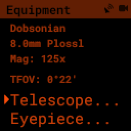
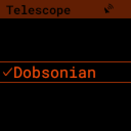
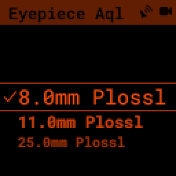
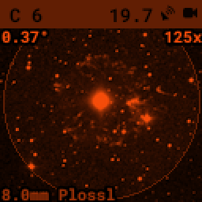

Equipment
=========

The PiFinder can track the telescopes and eyepieces you observe with. Telling
it about your gear is optional, but it unlocks several conveniences: it works
out the magnification and true field of view for any telescope-and-eyepiece
pairing, sizes and orients the survey images on the
:ref:`user_guide:object details` screen to match the eyepiece view, and lets
the push-to arrows follow the way your setup moves.

You manage equipment from two places: the :ref:`connectivity:web interface` is
where you add and edit telescopes and eyepieces, and the Equipment screen on the
PiFinder is where you pick which ones are active for tonight's session.

Telescopes and eyepieces
------------------------

A **telescope** records the optical details of one instrument: make and name,
aperture, focal length, central obstruction, and mount type, plus a few display
options covered below. Aperture and focal length drive the magnification and
field-of-view calculations.

An **eyepiece** records its focal length and apparent field of view, plus the
field stop if you know it, which gives a more precise field-of-view figure.
Store as many of each as you like and switch between them as the night goes on.

Adding and editing your gear
----------------------------

Add telescopes and eyepieces through the :ref:`connectivity:web interface`.
Connect to the PiFinder as described there, then open the Equipment page from
the navigation menu. You'll find a list of telescopes and a list of eyepieces,
each with buttons to add, edit, or remove an item.

A new PiFinder starts with a generic 200mm Dobsonian and a small set of Plössl
eyepieces so the calculations work out of the box. Edit or replace these with
your own gear whenever you're ready.

.. note::
   The on-device Equipment menu builds its list of telescopes and eyepieces
   when the PiFinder starts up. If you add new gear in the web interface while
   the PiFinder is running, restart the PiFinder so the new items appear in the
   on-device selection lists.

Choosing your active telescope and eyepiece
-------------------------------------------

The PiFinder uses one **active** telescope and one **active** eyepiece at a time
for its calculations and displays. Set these from either place:

* **On the PiFinder**, open the :ref:`user_guide:tools` menu and select
  Equipment. The Equipment screen shows the active telescope and eyepiece and,
  when both are set, the resulting magnification and true field of view. Choose
  "Telescope..." or "Eyepiece..." to pick from your stored gear.
* **In the web interface**, use the Equipment page to mark a telescope or
  eyepiece active.

Choosing "Telescope..." or "Eyepiece..." opens a list of your stored gear, a
check mark beside the active one. Use the **UP/DOWN** arrows to highlight an
item and **RIGHT** to make it active.

If nothing is selected, the PiFinder skips the magnification and field-of-view
figures and shows the object image in its default orientation.

Magnification and true field of view
-------------------------------------

With an active telescope and eyepiece set, the PiFinder shows two numbers on the
Equipment screen:

* **Magnification** is the telescope's focal length divided by the eyepiece's.
  A 1000mm telescope with a 25mm eyepiece gives 40×.
* **True field of view** (TFOV) is how much sky you see through that
  combination, in degrees. Compare it against the push-to distance: when the
  object is within half your true field of view of the centre, it's in the
  eyepiece.

The true field of view also sets the starting zoom of the survey image on the
:ref:`user_guide:object details` screen, so the image frames roughly the same
patch of sky your eyepiece shows. Zoom in and out from there with the **+** and
**-** keys.

Both figures appear on the object image too — field of view in the top-left
corner, magnification in the top-right — so you always know the scale of what
you're looking at.

Matching the object image to your eyepiece: flip and flop
---------------------------------------------------------

The survey images on the object details screen are oriented to match your
eyepiece view, so you can compare them directly. Different telescopes flip the
view in different ways, so two per-telescope options let you correct the
orientation:

* **Flip image (upside down)** mirrors the image top to bottom.
* **Flop image (left right)** mirrors the image left to right.

You don't need to reason about your optics. Point at a bright, recognisable
object, compare the object image to your eyepiece view, and toggle the two
options until they match:

* If the image is **upside down** compared to the eyepiece, turn on **Flip**.
* If the image is **mirrored** left-to-right, turn on **Flop**.
* If it's both, turn on both.

As a starting point for common setups:

.. list-table::
   :header-rows: 1
   :width: 100%

   * - Your telescope
     - Flip
     - Flop
   * - Newtonian / Dobsonian
     - off
     - off
   * - Refractor or SCT, straight through (no diagonal)
     - off
     - off
   * - Refractor or SCT with a star diagonal
     - one of the two — try Flop first
     -
   * - Refractor with a correct-image (erecting) diagonal
     - on
     - on

A plain Newtonian or Dobsonian needs neither option, which is why both are off
by default. A star diagonal produces a mirror image, so you'll need exactly one
of Flip or Flop; which one depends on how the diagonal sits in the focuser, so
pick whichever makes the image match.

.. note::
   Early PiFinder software shipped the default Dobsonian with Flop turned on by
   mistake. If a Newtonian or Dobsonian image looks mirrored, open the telescope
   in the Equipment page and turn Flop off.

Reversing the push-to arrows
----------------------------

The same telescope settings include **Reverse Arrow A** and **Reverse Arrow B**,
which flip the push-to arrows so they point the way your telescope actually
moves. If nudging the scope in the direction an arrow points sends the target
further away instead of closer, turn on the matching reverse option. The two
arrows cover the two directions of movement, so enable A, B, or both until the
arrows guide you the right way.
