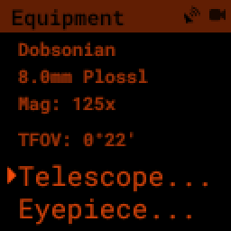
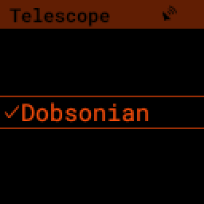
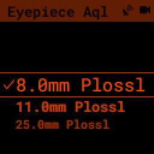
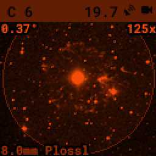

Equipment
=========

The PiFinder can track the telescopes and eyepieces you observe with. Telling
it about your gear is optional, but it adds several conveniences. The PiFinder
works out the magnification and true field of view for any
telescope-and-eyepiece pairing. It sizes and orients the survey images on the
:ref:`user_guide:object details` screen to match the eyepiece view. It also
lets the push-to arrows follow the way your setup moves.

You manage equipment from two places. Use the :ref:`connectivity:web interface`
to add and edit telescopes and eyepieces. Use the Equipment screen on the
PiFinder to select which ones are active for tonight's session.

Telescopes and eyepieces
------------------------

A **telescope** records the optical details of one instrument. It stores the
make and name, aperture, focal length, central obstruction, and mount type,
plus a few display options covered below. The PiFinder uses the focal length for
the magnification and field-of-view calculations, and the aperture for the
:ref:`contrast reserve <user_guide:contrast reserve>`.

An **eyepiece** records its focal length and apparent field of view. Add the
field stop as well if you know it, because it gives a more precise
field-of-view figure. Store as many of each as you like and switch between them
as the night goes on.

Adding and editing your gear
----------------------------

Add telescopes and eyepieces through the :ref:`connectivity:web interface`.
Connect to the PiFinder as described there, then open the Equipment page from
the navigation menu. The page shows a list of telescopes and a list of
eyepieces. Each list has buttons to add, edit, or remove an item.

A new PiFinder starts with a generic 200mm Dobsonian and a small set of Plössl
eyepieces, so the calculations work from the start. Edit or replace these with
your own gear when you are ready.

.. note::
   The Equipment menu on the PiFinder builds its list of telescopes and
   eyepieces when you turn the PiFinder on. If you add new gear in the web
   interface while the PiFinder is running, restart the PiFinder so the new
   items appear in its selection lists.

Choosing your active telescope and eyepiece
-------------------------------------------

The PiFinder uses one **active** telescope and one **active** eyepiece at a time
for its calculations and for what it shows on the screen. Set them from either
place:

* **On the PiFinder**, open the :ref:`user_guide:tools` menu and select
  Equipment. The Equipment screen shows the active telescope and eyepiece. When
  both are set, it also shows the resulting magnification and true field of
  view. Select "Telescope..." or "Eyepiece..." to change either one.
* **In the web interface**, open the Equipment page and mark a telescope or
  eyepiece active.

Select "Telescope..." or "Eyepiece..." to open a list of your stored gear. A
check mark sits beside the active item. Press the **UP** and **DOWN** arrows to
highlight an item, then press **RIGHT** to make it active.

With no active telescope or eyepiece, the PiFinder skips the magnification and
field-of-view figures. It shows the object image in its default orientation.

Magnification and true field of view
-------------------------------------

With an active telescope and eyepiece set, the PiFinder shows two numbers on the
Equipment screen:

* **Magnification** is the telescope's focal length divided by the eyepiece's.
  A 1000mm telescope with a 25mm eyepiece gives 40×.
* **True field of view** (TFOV) is how much sky you see through that
  combination, in degrees. Compare it against the push-to distance. When the
  object is within half your true field of view of the centre, it is in the
  eyepiece.

The true field of view also sets the starting zoom of the survey image on the
:ref:`user_guide:object details` screen, so the image frames roughly the same
patch of sky your eyepiece shows. Press **+** and **-** to zoom in and out from
there.

Both figures also appear on the object image. The field of view sits in the
top-left corner and the magnification in the top-right, so you always know the
scale of what you are looking at.

Matching the object image to your eyepiece: flip and flop
---------------------------------------------------------

The PiFinder orients the survey images on the object details screen to match
your eyepiece view, so you can compare them directly. Different telescopes flip
the view in different ways. Two per-telescope options let you correct the
orientation:

* **Flip image (upside down)** mirrors the image top to bottom.
* **Flop image (left right)** mirrors the image left to right.

You do not need to reason about your optics. Point the telescope at a bright,
recognisable object. Compare the object image to your eyepiece view, then set
the two options until they match:

* If the image is **upside down** compared to the eyepiece, turn on **Flip**.
* If the image is **mirrored** left-to-right, turn on **Flop**.
* If it is both, turn on both.

As a starting point for common setups:

.. list-table::
   :header-rows: 1
   :width: 100%

   * - Your telescope
     - Flip
     - Flop
   * - Newtonian / Dobsonian
     - off
     - off
   * - Refractor or SCT, straight through (no diagonal)
     - off
     - off
   * - Refractor or SCT with a star diagonal
     - Turn on one of the two. Try Flop first
     -
   * - Refractor with a correct-image (erecting) diagonal
     - on
     - on

A plain Newtonian or Dobsonian needs neither option, which is why both are off
by default. A star diagonal produces a mirror image, so you need exactly one of
Flip or Flop. Which one depends on how the diagonal sits in the focuser, so
turn on whichever makes the image match.

.. note::
   Early PiFinder software shipped the default Dobsonian with Flop turned on by
   mistake. If a Newtonian or Dobsonian image looks mirrored, open the telescope
   in the Equipment page and turn Flop off.

Reversing the push-to arrows
----------------------------

The same telescope settings include **Reverse Arrow A** and **Reverse Arrow B**.
These flip the push-to arrows so they point the way your telescope actually
moves. If you nudge the telescope in the direction an arrow points and the
object moves further away instead of closer, turn on the matching reverse
option. The two arrows cover the two directions of movement, so turn on A, B,
or both until the arrows guide you the right way.
