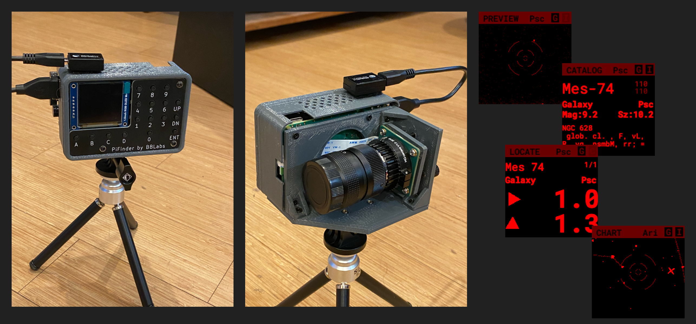

PiFinder Welcome
================
PiFinder is a telescope finder that uses plate-solving technology to allow anyone to simply and accurately find objects in the night sky

For an overview of what the PiFinder is and how it came to be visit the official project website at `PiFinder.io <https://www.pifinder.io>`_

Features
--------

* Zero setup: Just turn it on and point it at the sky!  
* Accurate pointing: Onboard GPS determines location and time while the camera determines where the scope is pointing.  Inertial Measurement Unit tracks scope motion and updates sky position between camera solves
* Self-contained:  Includes catalog search/filtering, sky/object charting, push-to guidance and logging all via the screen and keypad on the unit.
* Dark site friendly:  Red OLED screen and soft backlit keys have wide brightness adjustment, right down to 'off'. No need for bright cell phones or tablets
* Easy access: Can be mounted by the eyepiece just like a finder.
* Wifi Access Point / SkySafari Integration:  The PiFinder can act as a WIFI access point to connect your tablet or phone to sync SkySafari or other planetarium software with your scope.

Build Your Own
--------------
The PiFinder is fully open-source hardware and software.  You can order PCB's and 3d print the case with the files in this repo and order all the parts from the :doc:`Parts List <BOM>`

If you would like pre-assembled units, kits or other items to jump start your PiFinder journey, visit `PiFinder.io <https://www.pifinder.io>`_ to see what's available and place an order.

.. image:: ../../images/PiFinder_on_scope.jpg

If you'd like to learn more about how it works, and potentially build your own, everything you need should be here.  I recommend starting with the :doc:`User Manual <user_guide>` and then checking out the build process using the links below.

Discord
-------
Join the `PiFinder Discord server <https://discord.gg/Nk5fHcAtWD>`_ for support with your build, usage questions, and suggestions for improvement.

.. toctree::
   :hidden:
   :maxdepth: 2
   :caption: Contents:
   :glob:

   self
   quick_start
   user_guide
   build_guide
   dev_guide
   BOM
