Quick Start
================

.. note::
   This documentation is for v3 and v2.5 PiFinders running software |min_software| or above.
   You can see what version of software is running by looking in the upper right of
   the welcome screen.

   If you need docs for a previous version please choose `1.x.x <https://pifinder.readthedocs.io/en/v1.11.2/index.html>`_
   , `2.0.x <https://pifinder.readthedocs.io/en/v2.0.4/index.html>`_
   or `2.1.x <https://pifinder.readthedocs.io/en/v2.1.1/index.html>`_

Congratulations on getting your hands on a PiFinder™! Whether you built it yourself or
ordered a finished unit from BBLabs, you're on your way to a new level of accuracy and
ease at the eyepiece.

This Quick Start gets you out and observing with most of what you need. For the rest —
settings and non-observing functions — see the full :doc:`User Guide <user_guide>`.

We'll get your PiFinder running for the first time, walk you through your first night out,
show you how to change your settings, and leave you confident in how it works.

PiFinder takes continuous pictures of the stars, compares them to its database, and tells
you exactly where your scope is pointed. This process — called *plate solving* — runs
constantly, so the PiFinder always knows your aim. An accelerometer (like the one in a
mobile phone) senses when you move the scope, so between solves the PiFinder can still
tell you where to go.

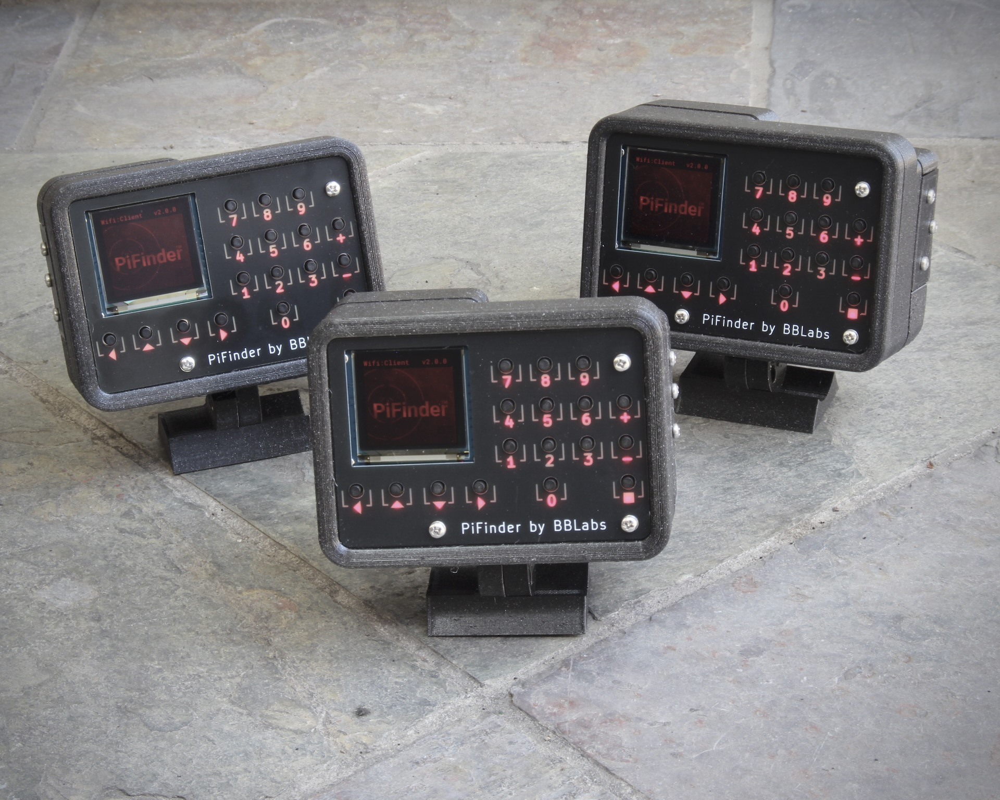

Unboxing
--------

The PiFinder arrives fully assembled and ready to use. The keypad and screen are how
you'll interact with it — choosing what to look for, getting Push-To guidance, and logging
objects.

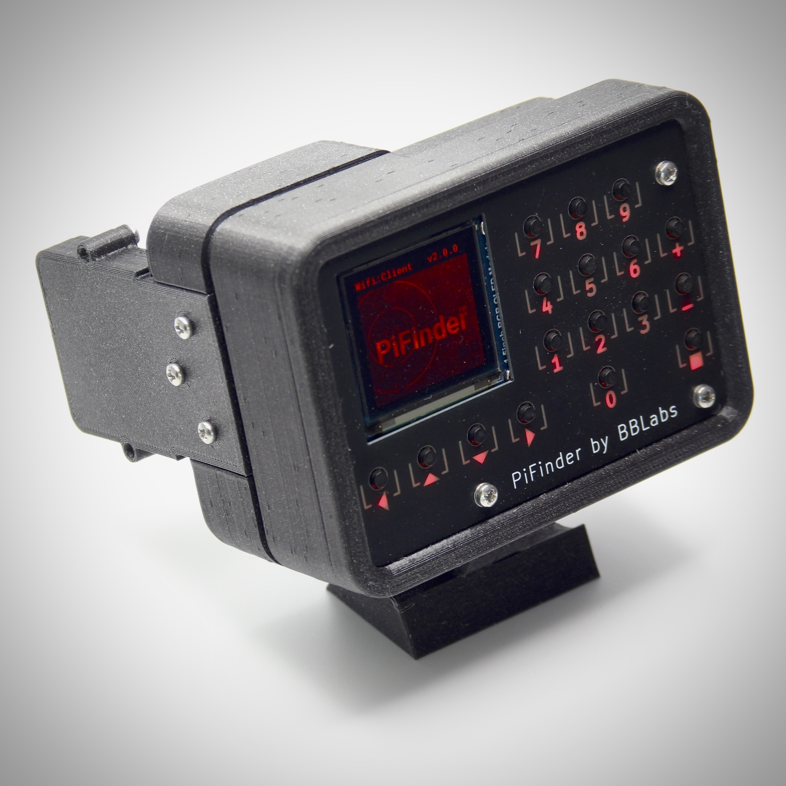
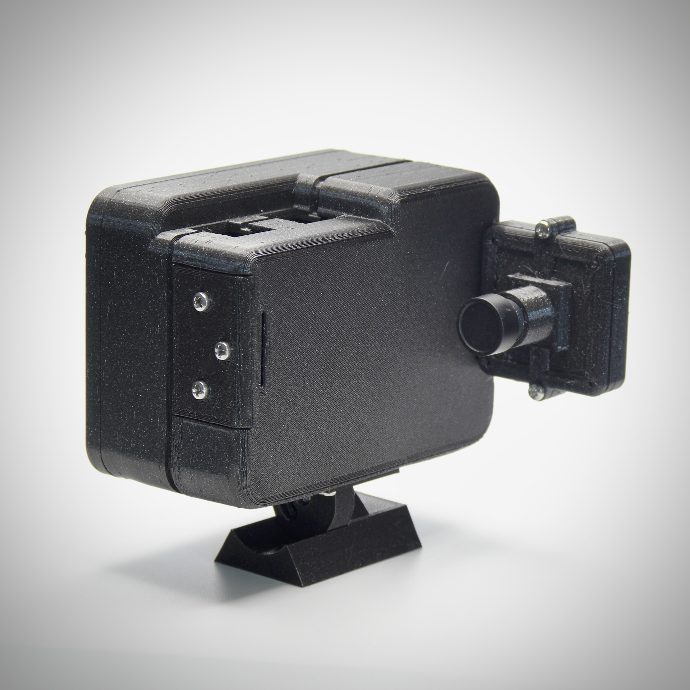

Depending on your configuration, the camera may face a different direction or sit in a
different spot, so it can see the sky while the keypad and screen stay within easy reach
on any type of scope.

Powering the PiFinder
----------------------

If your PiFinder has the optional internal battery, charge it before first use. Plug a
USB-C cable into the port on top, closest to the back of the case, arrowed below. The
charging indicator glows blue while charging and turns green when complete.

The power switch is the small white switch on top, above the screen, boxed below. Facing
the screen, slide it right for on, left for off.

.. image:: images/quick_start/power.jpeg

For external power, either USB-C port will run the unit. The port on the Raspberry Pi
nearest the keypad (the only one if you don't have the internal battery) powers the
PiFinder but won't charge the battery. To both power the unit and charge the battery from
external power, use the charging connector with the white switch set to On.

The first power-on takes a minute, and the welcome screen may come and go as the PiFinder
restarts; later start-ups are much quicker. Once it's powered on, you'll see a welcome
image, then some loading information, and finally the Main Menu.

Using the PiFinder
-------------------

The PiFinder uses a scrolling menu with the active option highlighted in the middle of
the screen.

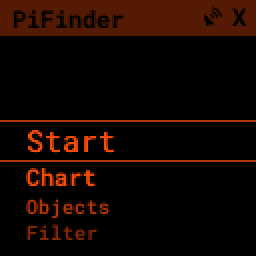

Every feature is reached through this menu — by scrolling, selecting options, or moving
between screens:

.. This key list is duplicated in user_guide.rst (The Menu System) — keep the two in sync.

- The **UP** and **DOWN** arrows scroll the current menu
- The **RIGHT** arrow activates the current option, selecting it or moving to another menu
- The **LEFT** arrow takes you back to the previous menu or screen
- Holding **LEFT** for more than a second always jumps back to the TOP of the menus

Some menus, like the catalog selection, let you check multiple options on and off with the
**RIGHT** arrow.

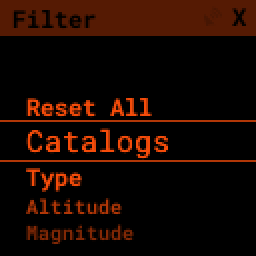
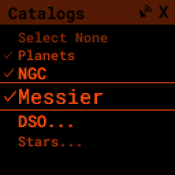

Other menu items take you to specific functions, like a star chart showing where your
telescope is currently pointing.

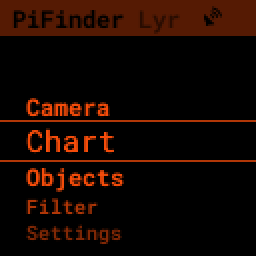
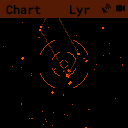

The **LEFT** arrow always takes you back to the previous menu or screen.

Many screens use the number keys along with **+**, **-**, and **SQUARE** for extra
functions, listed in that screen's help pages.

To open a screen's help (and other screen-specific options), hold **SQUARE** for more than
a second to bring up the handy Quick Menu (the radial menu).

.. image:: images/quick_start/main_menu_marking.png

The Quick Menu offers four options you can reach quickly with the arrow keys; **UP**
normally selects HELP.

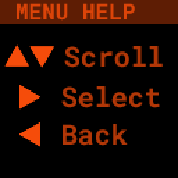

Use the **UP** and **DOWN** arrows to read through all of a screen's help.

The PiFinder has a lot of powerful features, but they all live in this menu system and use
the same basic set of buttons to get around.

Configuration Setup
--------------------

The PiFinder comes in several configurations (Right/Left/Straight/Flat). Set yours in the
software so the PiFinder can give pointing directions that match your setup.

From the main menu, select Settings, scroll down to Advanced, then select PiFinder Type.

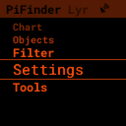
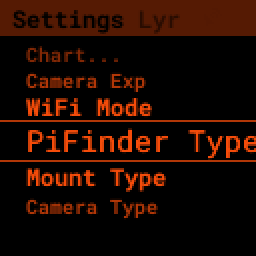

Highlight the type of PiFinder you're using and press **RIGHT** to select it. This restarts
the PiFinder software.

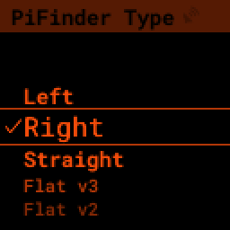

Mounting
---------

The PiFinder comes set up with a 32 mm dovetail that fits the standard finder shoe found on
most scopes. Below is the finder shoe with a version 1 PiFinder mounted in it; current
PiFinders attach the same way.

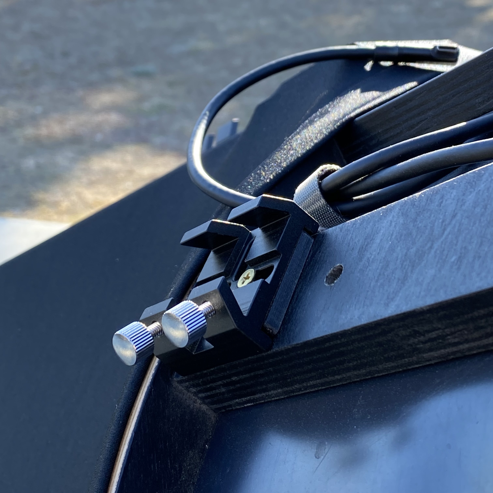

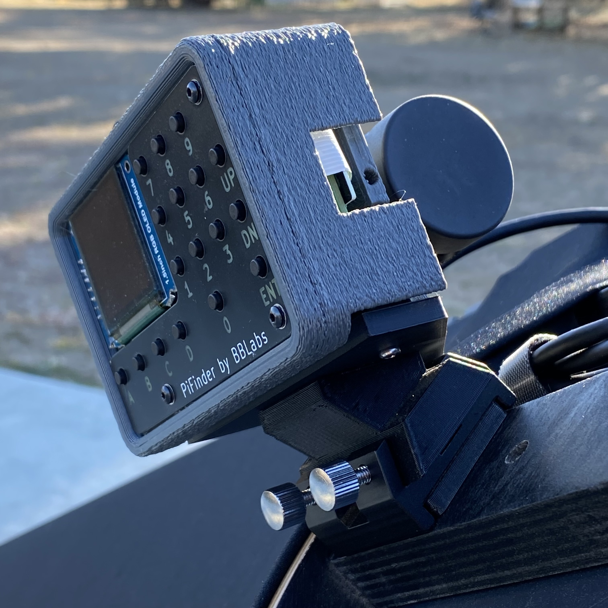

The PiFinder works out its own orientation, so it no longer needs to sit perfectly upright
— any mounting angle is fine, as long as the camera points where the scope points. You may
still prefer it roughly level so the screen is easy to read.

The dovetail is adjustable, so you can set a comfortable angle even if your finder shoe
isn't right at the top of the optical tube. Loosen the two dovetail screws, set the PiFinder
on your scope, adjust the angle to suit, then remove it and tighten the two screws. You're
all set for a night of observing.

.. note::
   * Mount the PiFinder so the camera has an unimpeded view of the sky.
   * Left, right, straight and flat versions each need the software configured to match —
     see the 'Configuration Setup' section above.

First Time Out
--------------

Once your PiFinder is charged and your mount is set on your scope, you're ready to head out
to your observing site. Set up your scope, mount your PiFinder, and read on.

You can start using the PiFinder as soon as several stars are visible in the part of the
sky it faces — it uses those stars (and its internal GPS sensor) to learn where it is and
what it's looking at, so it needs a few stars to get going. That might be soon after
sunset, or, under light pollution, not until full darkness.

Two icons in the upper right tell you whether the PiFinder knows where it is. The satellite
dish is solid once a GPS signal is received and a location acquired, and flashes while
searching for location and time.

The other icon shows how the PiFinder determined your telescope's position. A camera means
it has plate-solved its current view; the camera fades when the scope is moving and it's
relying on the accelerometer. An 'X' means it hasn't worked out where it's pointing yet
(see :ref:`quick_start:setting focus & first solve`).

.. list-table::

   * - .. figure:: images/quick_start/status_both.png

          GPS Location + Camera Solve

          Ready to go!

     - .. figure:: images/quick_start/status_no_gps.png

          No GPS - Will be flashing

          Wait a bit....

     - .. figure:: images/quick_start/status_no_solve.png

          No plate solve yet

          Check focus if it's dark

.. note::
   The GPS receiver must be outside to get a lock, and it can take several minutes to
   gather everything it needs to calculate its location and date/time. Expect a longer wait
   after the PiFinder has been off for a long period, or moved a distance while off; later
   start-ups at the same location are quicker.

   Leaving the PiFinder on the GPS Status screen speeds up the lock: this screen disables
   the camera, which reduces EM noise and helps the receiver see more satellites.

.. note::
   No GPS, or don't want to wait for a lock?  You can enter your location and time by hand
   and start using the PiFinder right away — see :ref:`Place & Time <user_guide:place & time>`
   in the User Guide.

Adjusting Brightness
^^^^^^^^^^^^^^^^^^^^^

You can adjust the brightness of the screen and keypad at any time: hold **SQUARE** and
press **+** for brighter, or **-** for dimmer. At a dark sky site, turn it right down to
preserve your dark-adapted vision.

.. note::
   After it's been idle for a while, the PiFinder dims the screen and slows its exposures,
   solving, and other processes to save battery and prevent glare at the eyepiece. The
   default is 30 seconds; you can change it, or turn it off, in the
   :ref:`user_guide:settings menu`. Any button press, or moving the PiFinder, wakes it.

Start with the Start menu
^^^^^^^^^^^^^^^^^^^^^^^^^^^^^^^^^

At the start of each session, you may need to do a few things:

- Check and adjust camera focus
- Align the PiFinder by telling it where your scope is pointing
- Check the status of the GPS lock

These items live in the 'Start' menu at the top of the PiFinder main menu.

You won't always need all three. Focus generally holds from night to night, and if you
leave your PiFinder on your scope you may not need to re-align. Most functions need a GPS
signal, which happens automatically — but the GPS Status screen lets you monitor progress
toward a lock and boost the signal, which helps in marginal conditions or to speed things
along.

Setting Focus & First Solve
^^^^^^^^^^^^^^^^^^^^^^^^^^^^^^^^^

Once stars are populating the sky, turn on your PiFinder, take off the lens cap, and aim at
one of the brightest stars you can see; it gets to work solving straight away. The lens
focus is set when your PiFinder is assembled, but may need a little adjustment to catch the
dimmest stars.

.. note::
   **Focus is the single most common reason a PiFinder won't solve.**  Stars that look
   sharp by eye are often still too soft to solve, so rather than judging focus by sight,
   use the **HFD** readout on the Focus screen (described below) to find the
   sharpest point precisely.

Screw the lens in and out in the holder to adjust focus. Starting from scratch — a new
build, or a lens that's been moved — set the lens so about 6 mm of thread is showing
(roughly the width of a pencil). That's close to in focus and a good place to begin.

Select the 'Focus' option under the 'Start' menu.

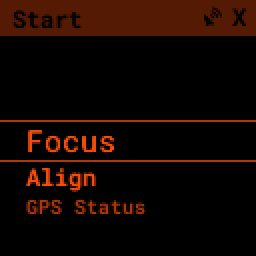

The Focus screen finds the four brightest stars anywhere in the camera frame and arranges
their magnified, centered views into four equal screen quadrants in the visible area below
the title bar.  Once selected, the same stars stay in the same quadrants while they remain
detectable; tracking their relative pattern keeps them stable even if the whole camera image
shifts while you adjust the lens.  A star that disappears is replaced by another bright star.
This does not depend on a plate solve or catalog identity, so it also works while badly out of
focus.  These are raw camera pixels: the display does
not stretch the contrast, remove skyglow, sharpen, blur, or smooth the stars.  It only crops and
enlarges them with nearest-neighbour sampling, then applies the panel's red night-vision colour.

The default magnification is about 10× compared with a full-frame view.  When a star is
well out of focus, its tile automatically shows a wider crop so the broad disc or donut is not
clipped.  As focus improves the view tightens toward 10×.  Use **+/-** to change the nominal
magnification between 4× and 16×.

At the intersection of the four quadrants is the **HFD** readout — the Half-Flux Diameter of
the measurable stars, in camera pixels.  This is how spread-out the stars are, so lower is
sharper.  Slowly screw the lens in or out and chase the smallest stable number.  ``?.?`` means
there is no usable focus measurement for the current frame; broad stars may still remain visible
in their enlarged tiles while you adjust toward focus.

A rolling 10-second HFD trace runs along the middle divider on either side of the number.  It
centres its recent value range on the divider, with lower HFD values below the line.  This makes
it easier to see when you have passed through the focus minimum and should turn back, without
pretending that one absolute HFD value is equally good on every PiFinder.
When no star can be measured no new point is added, so the existing trace visibly recedes as it
becomes stale.  A fresh signal starts on the first numeric measurement that follows.

Good focus means the quickest solves.  Close will work, but it is worth adjusting through the
minimum and then returning to the lowest HFD you saw.  Judge the number and all four stars
together rather than relying on a single unusually bright or saturated star.

Press **SQUARE** to cycle through four Focus views:

* **Stars** — the four magnified raw star tiles described above.
* **Single** — the brightest detected star at twice the apparent magnification of Stars,
  with the HFD number and rolling trace on a translucent overlay in the lower third.
* **Image** — the complete camera frame using the original display-only autocontrast.
  Focus measurements still use raw pixels.
* **Stats** — HFD, an additional FWHM estimate, total detected stars, exposure mode and
  actual exposure, gain, and a histogram of the raw pixel values.  HFD is still the number
  to minimize; FWHM is supplementary because it is less reliable on saturated or heavily
  defocused stars.

The **+/-** magnification keys apply in the Stars and Single views.  Hold **SQUARE** from any view to
open the normal Quick Menu.

.. note::
   **Can’t get a plate solve?** The usual culprits are simple: make sure the lens cap is off
   and the PiFinder isn't moving, then check focus — soft stars stop solves, so watch the HFD
   on the Focus screen and adjust the lens until it reaches its lowest value.  For anything
   beyond that — obstructions, dew, thin cloud, exposure settings — see the
   :doc:`troubleshooting` page.

Alignment
^^^^^^^^^^^
To get the most out of PiFinder, you need to align it with your telescope. PiFinder uses
*digital* alignment: instead of physically nudging the PiFinder so its field of view matches
your scope, you simply tell it where your scope is pointing within its wide field.

The camera sees a 10° patch of sky — about 20 full moons across — and your eyepiece's much
smaller field sits somewhere inside it. By pointing your telescope at a star and then
selecting that same star on PiFinder's chart, you tell PiFinder exactly where to place
objects so they land in the center of your eyepiece.

.. note::
   These instructions cover the alignment system in software version 2.1.0 and above. For
   the previous instructions, `click here <https://pifinder.readthedocs.io/en/v2.0.4/quick_start.html#alignment>`_.

To begin, select 'Align' from the 'Start' menu.

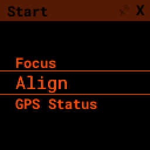

You'll see a rendered star chart with constellation lines showing the sky PiFinder is
currently seeing. If you instead see a message about not having a solve, return to the focus
section above.

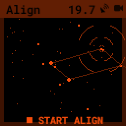

The current alignment point is marked with a Telrad-style reticle. As you move your
telescope the chart updates, and you can zoom in and out with the **+/-** keys.

.. note::
   The reticle marks where your telescope is pointing *within* the camera's wide 10° field,
   so it normally sits off to one side rather than in the center. That's expected and does
   not mean your PiFinder is misaligned.

Now align in a few steps:

1. Pick a star you can easily recognize — a bright star, or one in a distinctive
   constellation or asterism. Any naked-eye star works, but you can't align on a planet.
   Point your telescope at it and roughly center it in your eyepiece.
2. Look at the PiFinder screen and find that star plotted there. Use the **+/-** keys to
   zoom out if it helps you identify it.
3. Press **SQUARE** to switch to star-selection mode.

   .. image:: images/quick_start/align_start.png

   The large reticle is replaced by a small selection marker. The arrow keys jump it to the
   next closest star in that direction.

   .. image:: images/quick_start/align_select.png

4. Use the arrow keys to highlight the star your telescope is pointing at, then return to
   the eyepiece and center it as well as you can.
5. Press **SQUARE** to complete the alignment — PiFinder will now place objects wherever in
   your eyepiece that star sits. Or press **0** to exit without changing the alignment point.

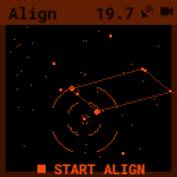

The marker returns to the normal Telrad-style reticle, showing your newly adjusted alignment
point. PiFinder saves it, so you won't need to repeat this unless you remove and re-attach
the PiFinder to your telescope.

.. note::
   You can also align on any catalog object. If you've found an object and it's not centered,
   center it up, hold **SQUARE** for one second, and choose align. This isn't like adding
   alignment points to a standard DSC for accuracy — it simply tells PiFinder where in your
   eyepiece you'd like objects placed if your initial alignment wasn't quite right.

Daytime alignment
^^^^^^^^^^^^^^^^^^^
The alignment above relies on a plate solve, so it only works once there are stars to see. To
set things up during the day, choose 'Align (Day)' from the 'Start' menu. It reaches the same
result by hand: you point your telescope at a distant object, find where the camera sees it,
and mark that spot directly — no solve required.

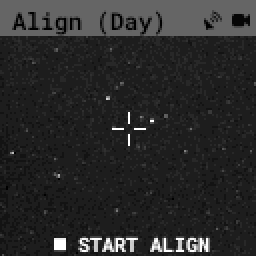

Opening the screen switches the camera to a short daytime exposure so you can see what it's
pointing at. Press **SQUARE** to begin.

The view splits into four quadrants labelled to match the keypad corners — **7** top-left,
**9** top-right, **1** bottom-left, **3** bottom-right. Press the key for the quadrant your
object sits in.

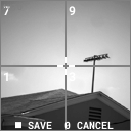

That quarter fills the screen and divides into quadrants again, so each press narrows the
marker into a smaller area. Repeat for up to three rounds:

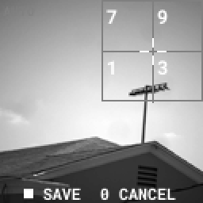
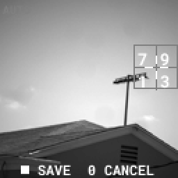

From there the arrow keys nudge the marker a pixel at a time for fine placement. The first
arrow press also leaves quadrant mode, so you can switch to fine adjustment at any point.

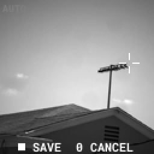

Center your distant object in the eyepiece, move the marker onto it on screen, then press
**SQUARE** to save. Press **0** to exit without changing the alignment. Pick something far
enough away that the focus matches the night sky — a distant treetop, chimney, or hilltop,
not something across the room.

.. note::
   In daylight the image is shown in plain white rather than the usual red, since night vision
   isn't a concern. If the view is washed out or too dark, **+** and **-** adjust the exposure
   by hand. Hold **SQUARE** for the Quick Menu, where 'Exp Auto' hands exposure back to the
   camera and 'Center' returns the marker to the middle.

GPS Status
^^^^^^^^^^^

A GPS status indicator in the PiFinder title bar flashes while the PiFinder searches for its
position and time, and turns solid once it knows where and when it is. You can monitor this
process and turn on a signal-boost mode from the 'GPS Status' item in the 'Start' menu.

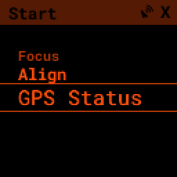

The screen has two modes — a large-text summary and a full-details view — and you switch
between them with the **SQUARE** button.

.. list-table::

   * - .. figure:: images/quick_start/GPS_Status.png

          Easy to read summary

     - .. figure:: images/quick_start/GPS_Status_details.png

          Full details view

Under partially obstructed skies, or when a lock is just taking longer than you'd like,
leave this screen active to boost the GPS signal by temporarily stopping the camera. Like
most electronics, the camera generates electromagnetic noise that can drown out the faint
GPS satellite signals.

Once a lock shows, press the **LEFT** arrow to return to the menu, re-activate the camera,
and go find your first object.

Find Your First Object
^^^^^^^^^^^^^^^^^^^^^^^^
Now that you're aligned, it's time to explore. We'll select an object, get some information
about it, and push your scope until it's in the eyepiece.

- Hold the **LEFT** arrow for more than a second to jump to the main menu if you're not
  already there
- Select Objects from the menu

.. image:: images/quick_start/main_menu_01_docs.png
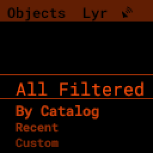

- Scroll down to By Catalog to browse objects by catalog
- Select the Messier catalog from the menu

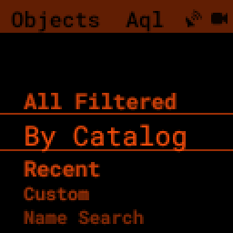
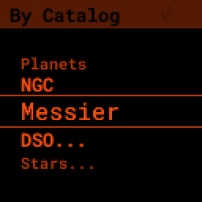

Selecting the Messier catalog brings up the heart of the PiFinder observing system, the
Objects List. Here it shows every Messier object that matches your
:ref:`filters<user_guide:filters>`.

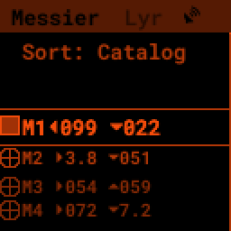
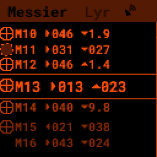

- Press the **SQUARE** key to cycle the information shown for each object: Locate, Names, or
  Magnitude/Size

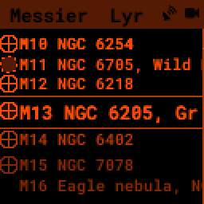
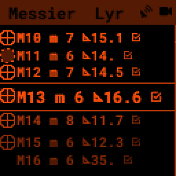

- Use the **UP** and **DOWN** keys to browse objects and pick one you want to view
- Press the **RIGHT** arrow to open Object Details, including Push-To guidance

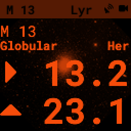

Object Details shows Push-To instructions by default; press the **SQUARE** key to see an
image of the object or its catalog details instead.

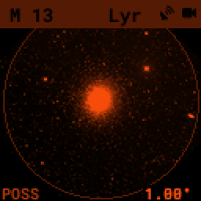
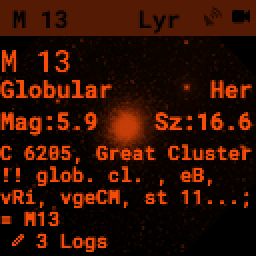

Now point your scope at the object.

- Press **SQUARE** to cycle the object information until you see the Push-To instructions

The Push-To instructions show how far to move your scope on each axis. The top arrow and
number tell you which way to spin the scope — clockwise or counterclockwise — and how far in
degrees. The lower arrow tells you whether to move toward the zenith or the horizon, and how
far in degrees.

Watch the numbers as you move the scope; they change to show how much closer or further you
are from the object. When both are near zero, the object should be in your eyepiece.

.. note::
   - How close to 0.00/0.00 you need to get depends on your eyepiece. With a true field of
     view of 1/2 degree, a readout below 0.25/0.25 puts the object somewhere in your eyepiece.
   - While you're moving, the PiFinder estimates position from its accelerometer — less
     accurate than a plate solve, so the numbers dim slightly. Stop moving and it takes a fresh
     image, fixes your exact position, and the numbers shift a little and brighten to show a
     reliable solve.

Shutting down the PiFinder
---------------------------

Shutting down isn't strictly required before power-off, but the PiFinder is a computer and
skipping it risks file corruption.  Hold **LEFT** for more than a second to jump to the
main menu, hold **SQUARE** to open the Quick Menu, then press **DOWN** for SHUTDOWN and
confirm with **RIGHT**.  Once the screen and keypad turn off, it's safe to cut power.
The :ref:`user_guide:shutdown` section walks through it with pictures.

That's the basics of using your PiFinder sorted. To learn more, continue to the full
:doc:`user_guide`.
