Quick Start
================

.. note::
   This documentation covers rev4, v3 and v2.5 PiFinders running software |min_software| or
   above. You can see what version of software is running by looking in the upper right of
   the welcome screen.

   Not sure which you have? See
   :ref:`Which PiFinder do I have? <quick_start:which pifinder do i have?>` below.

   If you need docs for a previous version please see `1.x.x <https://pifinder.readthedocs.io/en/v1.11.2/index.html>`_
   , `2.0.x <https://pifinder.readthedocs.io/en/v2.0.4/index.html>`_
   or `2.1.x <https://pifinder.readthedocs.io/en/v2.1.1/index.html>`_

Congratulations on getting your hands on a PiFinder™! Whether you built it yourself or
ordered a ready-built one from BBLabs, you're on your way to a new level of accuracy and
ease at the eyepiece.

This Quick Start gets you out and observing with most of what you need. For the rest, such
as settings and non-observing functions, see the full :doc:`User Guide <user_guide>`.

We'll get your PiFinder running for the first time, walk you through your first
night out, shows you how to change your settings, and leaves you confident in how it works.

The PiFinder takes continuous pictures of the stars, compares them to its database, and
tells you exactly where your telescope is pointed. This process is called *plate solving*,
and it runs constantly, so the PiFinder always knows your aim. An accelerometer, like the
one in a mobile phone, senses when you move the telescope. Between solves, the PiFinder
uses the accelerometer to keep telling you where to go.

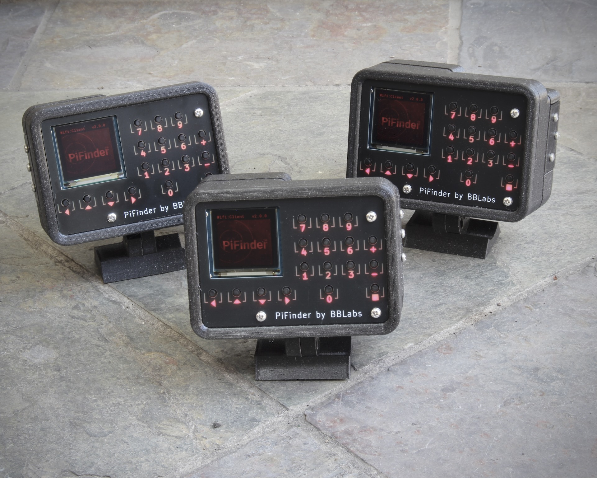

Unboxing
--------

The PiFinder arrives fully assembled and ready to use. You work with it through the keypad
and screen: select what to look for, follow Push-To guidance, and log the objects you see.

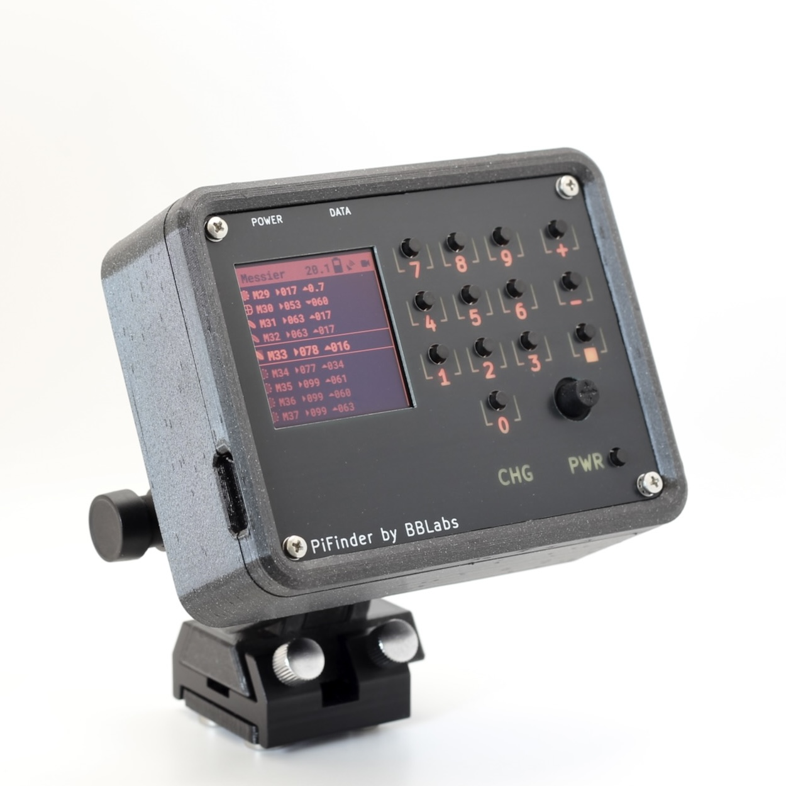
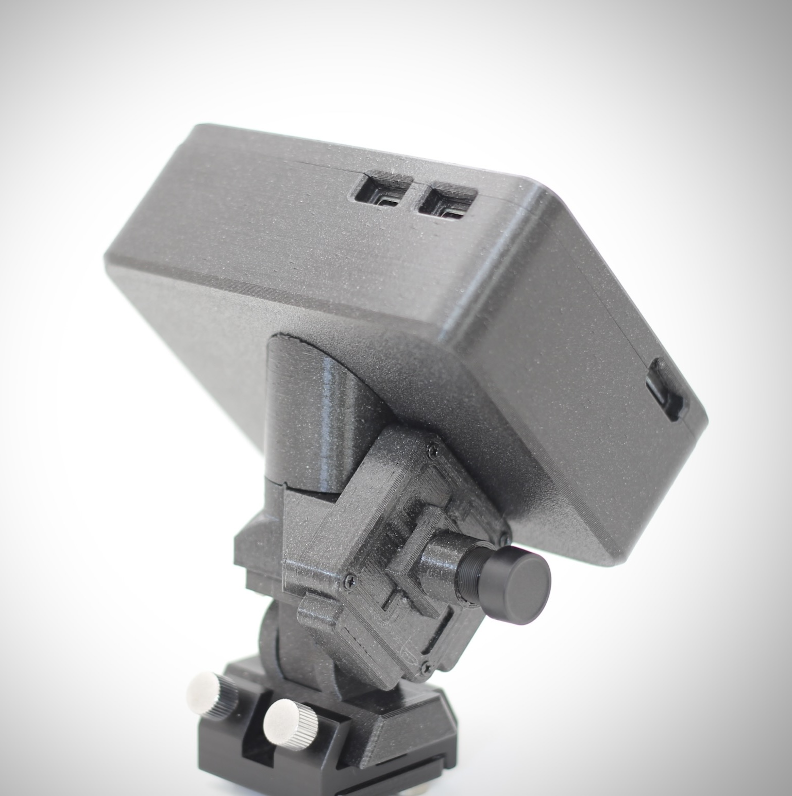

You get around with the joystick. Move it up, down, left or right for the four arrow keys,
and press it straight in for **SQUARE**. That does the same as the **SQUARE** key on the
pad, so use whichever falls under your thumb. From here on, this guide names only the keys,
such as **UP**, **RIGHT** and **SQUARE**, without repeating how you reach each one.

.. note::
   On v3 and v2.5 PiFinders the four arrows are separate buttons in a row along the bottom
   of the keypad rather than a joystick. Every key name in this guide means the same thing
   on both.
   |v3_docs|

Depending on your configuration, the camera can face a different direction or sit in a
different spot. The camera then sees the sky while the keypad and screen stay within easy
reach on any type of telescope.

Which PiFinder do I have?
--------------------------

This guide covers three generations of hardware: rev4, v3 and v2.5. You can tell them apart
without opening anything. Here's a v3 on the left beside a rev4 on the right:

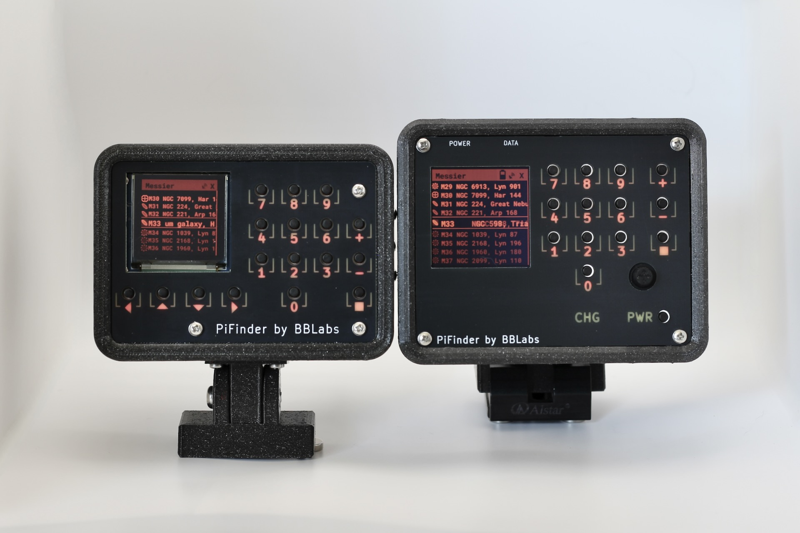

**The directional control.** rev4 has a single joystick that you move up, down, left and
right. v3 and v2.5 have four separate arrow buttons in a row along the bottom of the
keypad. This is the quickest way to tell them apart, and you can't miss it.

**The screen.** The rev4 screen is 1.91" across and 176 pixels square. The v3 and v2.5
screen is 1.5" and 128 pixels square. The extra room shows. Below is the same main menu on
each, in the same order as the photo above.

.. list-table::

   * - .. figure:: images/quick_start/main_menu_v3_docs.png

          v3 / v2.5: 1.5", 128 px

     - .. figure:: images/quick_start/main_menu_rev4_docs.png

          rev4: 1.91", 176 px

**The SD card slot.** rev4 has a spring-loaded card slot in the left side of the case as you
face the screen, and you reach it from the outside. On v3 and v2.5 the card sits inside,
behind three screws.

Everything else follows from those. rev4 turns on and off with a power button rather than a
slide switch. It charges from an on-board charger and shows a battery indicator in the
title bar, and it has a small buzzer with its own Volume setting. Where the revisions
differ, this guide describes rev4 and notes the v3 and v2.5 behaviour underneath.

Powering the PiFinder
----------------------

Plug in and charge your PiFinder before first use. Two USB-C ports sit on top of the case,
each named on the faceplate just below it. Plug the cable into **POWER**. The **CHG** light
on the faceplate stays on while the battery charges and goes out when it's full. From empty
that takes about six hours. The other port, **DATA**, connects accessories such as the
PiFinder remote.

Press and hold the button marked **PWR**, on the front below the keypad, for about two
seconds to turn the PiFinder on.

.. image:: images/quick_start/rev4_power.jpeg

A full charge runs the PiFinder for about ten hours, enough for all but the longest
observing sessions. You can also use the PiFinder while it charges, so a USB power bank on
the **POWER** port keeps you going all night. Any 5V USB-C supply rated for at least 2A
works.

The first time you turn the PiFinder on it takes a minute, and the welcome screen can come
and go as the PiFinder restarts. Later it is much quicker. You see a welcome image, then
some loading information, and finally the Main Menu.

The **PWR** label lights as soon as you press the button, so you know the PiFinder is on
before there's any other sign of life. It goes out once the screen and keypad light up. It
isn't dimmable like the rest of the interface, and going dark is normal.

.. note::
   On v3 and v2.5 PiFinders, power is a small white slide switch above the screen. Facing
   the screen, slide it right for on and left for off. Charge through the port nearest the
   back of the case. Its indicator glows blue while charging and green when full. The port
   nearest the keypad runs the PiFinder without charging the battery.
   |v3_docs|

Using the PiFinder
-------------------

The PiFinder uses a scrolling menu with the active menu item highlighted in the middle of
the screen.

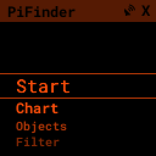

You reach every feature through this menu, by scrolling, selecting menu items and moving
between screens:

.. This key list is duplicated in user_guide.rst (The Menu System).  Keep the two in sync.

- The **UP** and **DOWN** arrows scroll the current menu
- The **RIGHT** arrow selects the current menu item, which either sets an option or opens another menu
- The **LEFT** arrow takes you back to the previous menu or screen
- Press and hold **LEFT** for more than a second to jump back to the TOP of the menus

Some menus, like the catalog selection, let you check several menu items on and off with
the **RIGHT** arrow.

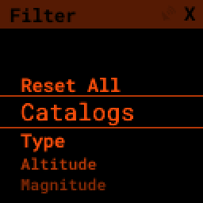
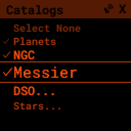

Other menu items take you to specific functions, like a star chart showing where your
telescope is currently pointing.

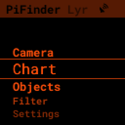
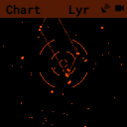

The **LEFT** arrow always takes you back to the previous menu or screen.

Many screens use the number keys along with **+**, **-**, and **SQUARE** for extra
functions. That screen's help pages list them.

To open a screen's help and its other options, press and hold **SQUARE** for more than a
second. This brings up the handy Quick Menu, also called the radial menu.

.. image:: images/quick_start/main_menu_marking.png

The Quick Menu offers four options that you reach quickly with the arrow keys. **UP**
normally selects HELP.

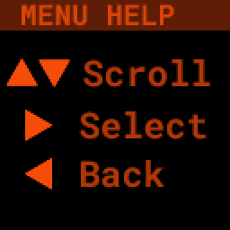

Use the **UP** and **DOWN** arrows to read through all of a screen's help.

The PiFinder has a lot of powerful features. They all live in this menu system and use the
same basic set of keys to get around.

Configuration Setup
--------------------

There is only one physical rev4 PiFinder. The body rotates on its mount, so the same
PiFinder sits with the screen facing left, right or straight back, whichever suits your
telescope. What changes between configurations is the position you rotate it into, not the
hardware.

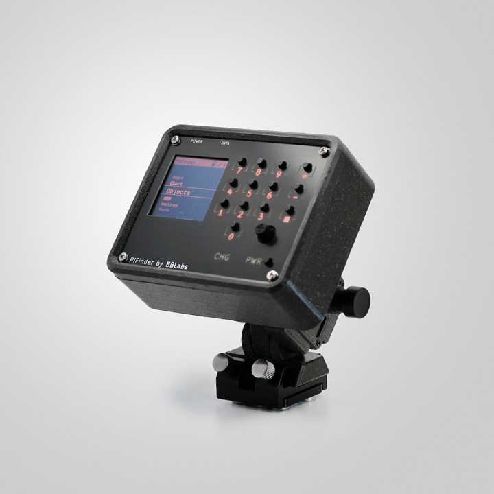

The mount is spring-loaded, with detents marking the three positions, so you don't need to
loosen anything first. Take hold of the body and turn it firmly. It drops into the next
position and stays there.

The software needs to know which position the body is in, so its star charts and pointing
directions come out the right way round. Your PiFinder arrives set to match the position it
shipped in. Check the setting if you rotate the body, or if the Push-To directions send you
the wrong way. Reversed Push-To is the usual sign that the setting and the hardware
disagree.

From the main menu, select Settings, scroll down to Advanced, then select PiFinder Type.

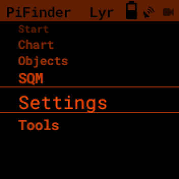
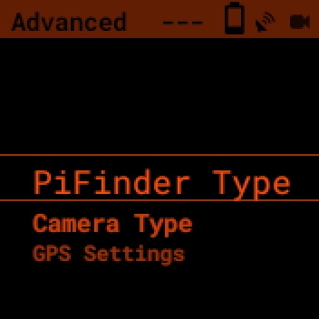

Highlight the type of PiFinder you're using and press **RIGHT** to select it. This restarts
the PiFinder software.

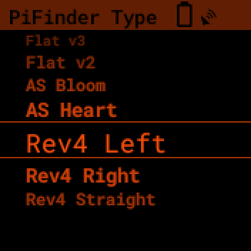

The rev4 entries sit at the bottom of the list. Three of them name the position you've
rotated the body into:

- **Rev4 Left**: the screen faces left, for a Dobsonian or Newtonian with the focuser on
  the left of the tube.
- **Rev4 Right**: the screen faces right, for a focuser on the right.
- **Rev4 Straight**: the screen faces back, set at 45°.

Straight suits a telescope you focus from the rear, such as a refractor or a
Schmidt-Cassegrain. The screen is angled rather than flat, so you read it from behind the
telescope, where you already stand to observe. This is why rev4 has no separate Flat
configuration. If the telescope sits above head height, or you point it very high, rotate
the body left or right instead. The screen is easier to read from the side.

**AS Bloom** and **AS Heart** are the exceptions: they name a telescope rather than an
orientation. You can order Analog Sky's Bloom and Heart with a PiFinder fully integrated
into the telescope. If you observe with one of those, select the entry that matches it.

.. note::
   The entries above these are the v3 and v2.5 configurations. Left, Right and Straight
   mean the same as they do on rev4, but on those PiFinders the build sets the
   configuration rather than a rotation. Flat v3 and Flat v2 sit with the lens on top and
   the screen angled back toward you.
   |v3_docs|

Mounting
---------

The PiFinder comes set up with a 32 mm dovetail that fits the standard finder shoe found on
most telescopes. It slides into the shoe the same way a finder does.

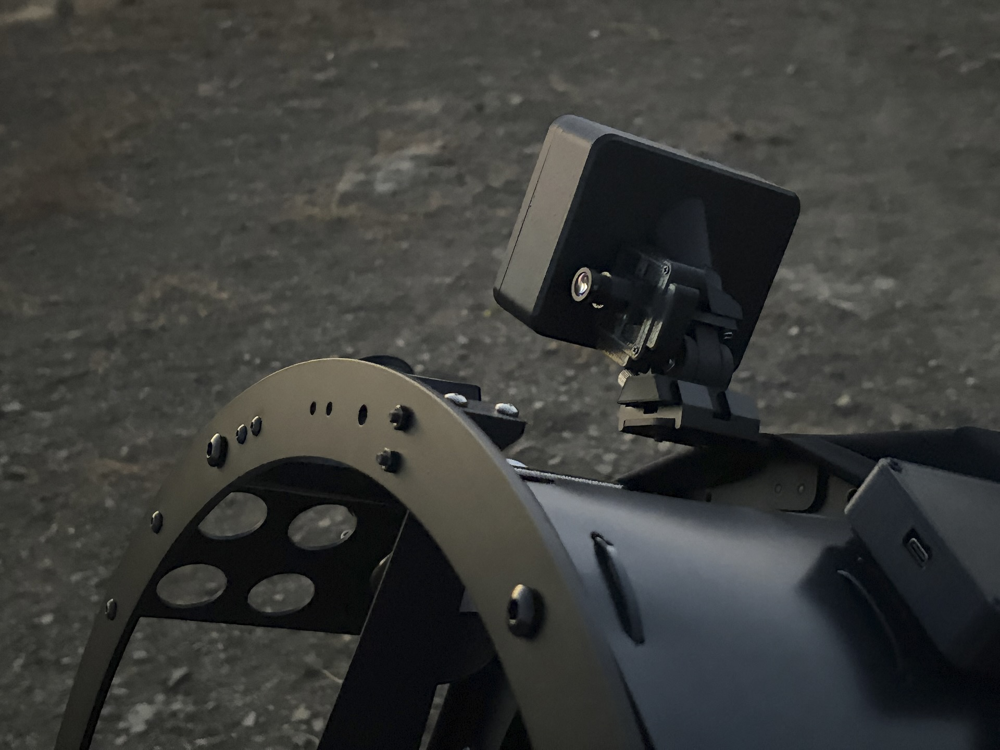
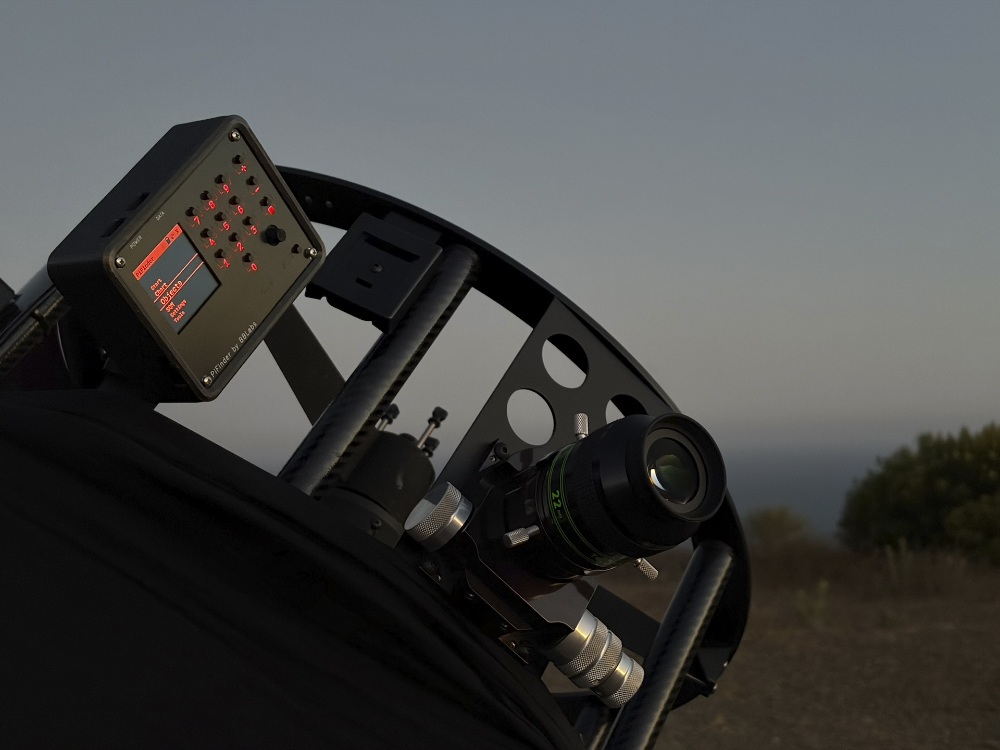

The PiFinder works out its own orientation, so it no longer needs to sit perfectly upright.
Any mounting angle works, as long as the camera points where the telescope points. You may
still prefer it roughly level so the screen is easy to read.

The dovetail is adjustable, so you can set a comfortable angle even if your finder shoe
isn't right at the top of the optical tube. Loosen the single M5 bolt that holds the foot,
tilt the PiFinder to the angle that suits you, then tighten the bolt again. You're all set
for a night of observing.

.. note::
   * Mount the PiFinder so the camera has an unimpeded view of the sky.
   * Whichever position or configuration you use, set the software to match. See
     :ref:`quick_start:configuration setup`.

First Time Out
--------------

Once your PiFinder is charged and your mount is set on your telescope, you're ready to head
out to your observing site. Set up your telescope, mount your PiFinder, and read on.

You can start using the PiFinder as soon as several stars are visible in the part of the
sky it faces. It uses those stars, along with its internal GPS receiver, to learn where it
is and what it's looking at. It needs a few stars to get going. That might be soon after
sunset, or, under light pollution, not until full darkness.

Two icons in the upper right tell you whether the PiFinder knows where it is. The satellite
dish flashes while the PiFinder searches for its location and time, and turns solid once it
has a GPS signal and a location.

The other icon shows how the PiFinder worked out your telescope's position. A camera means
it has solved its current view. The camera fades while the telescope moves and the PiFinder
relies on the accelerometer. An 'X' means it hasn't worked out where it's pointing yet. See
:ref:`quick_start:setting focus & first solve`.

.. list-table::

   * - .. figure:: images/quick_start/status_both.png

          GPS Location + Camera Solve

          Ready to go!

     - .. figure:: images/quick_start/status_no_gps.png

          No GPS - Will be flashing

          Wait a bit....

     - .. figure:: images/quick_start/status_no_solve.png

          No plate solve yet

          Check focus if it's dark

.. note::
   The GPS receiver must be outside to get a lock, and it can take several minutes to
   gather everything it needs to calculate its location and date/time. Expect a longer wait
   after the PiFinder has been off for a long period, or moved a distance while off. Once
   it has a lock at a location, later sessions there are quicker.

   Leave the PiFinder on the GPS Status screen to speed up the lock. That screen turns the
   camera off, which reduces electromagnetic noise and helps the receiver see more
   satellites. "Sats seen/used" reads 0/0 for most of the wait, so don't read it as a
   progress bar, and don't turn the PiFinder off and on again while you wait. That restarts
   the process from the beginning. See :ref:`user_guide:getting a gps lock` for the full
   picture.

.. note::
   No GPS, or don't want to wait for a lock?  Enter your location and time by hand and
   start using the PiFinder right away. See :ref:`Place & Time <user_guide:place & time>`
   in the User Guide.

Adjusting Brightness
^^^^^^^^^^^^^^^^^^^^^

You can adjust the brightness of the screen and keypad at any time. Hold **SQUARE** and
press **+** for brighter, or **-** for dimmer. At a dark sky site, turn it right down to
preserve your dark-adapted vision. The keypad backlight tracks the screen. To set the keys
brighter or dimmer than the screen, use **Key Bright** in the
:ref:`user_guide:settings menu`.

.. note::
   After a while with no activity, the PiFinder dims the screen and slows its exposures,
   solving, and other processes to save battery and prevent glare at the eyepiece. The
   default is 30 seconds. You can change it, or turn it off, with Sleep Time in the
   :ref:`user_guide:settings menu`. Any key press, or moving the PiFinder, wakes it.

   Only key presses keep it awake. Motion wakes the PiFinder, but it does not reset the
   timer, so slow work at the telescope can dim the screen while you watch it. Set Sleep
   Time to Off when that gets in the way.

Start with the Start menu
^^^^^^^^^^^^^^^^^^^^^^^^^^^^^^^^^

At the start of each session, you may need to do a few things:

- Check and adjust the camera focus
- Align the PiFinder by telling it where your telescope is pointing
- Check the status of the GPS lock

These items live in the Start menu at the top of the PiFinder main menu.

You won't always need all three. Focus generally holds from night to night, and if you
leave your PiFinder on your telescope you may not need to align it again. Most functions
need a GPS signal, and the PiFinder gets one automatically. The GPS Status screen lets you
monitor progress toward a lock and boost the signal, which helps in marginal conditions or
when you want to speed things along.

Setting Focus & First Solve
^^^^^^^^^^^^^^^^^^^^^^^^^^^^^^^^^

Once stars are out, turn on your PiFinder, take off the lens cap, and aim at one of the
brightest stars you can see. The PiFinder gets to work solving straight away. The lens
focus is set when your PiFinder is assembled, but it may need a little adjustment to catch
the dimmest stars.

.. note::
   **Focus is the single most common reason a PiFinder won't solve.**  Stars that look
   sharp by eye are often still too soft to solve. Don't judge focus by sight. Use the
   **HFD** readout on the Focus screen, described below, to find the sharpest point
   precisely.

Screw the lens in and out in the holder to adjust focus. If you start from scratch, with a
new build or a lens that has been moved, set the lens so about 6 mm of thread is showing,
roughly the width of a pencil. That's close to in focus and a good place to begin.

Select Focus in the Start menu.

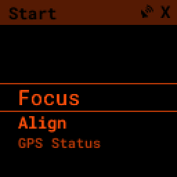

The Focus screen finds the four brightest stars in the camera's view and shows each one
magnified in its own quadrant of the screen.  The same stars keep their quadrants while you
work, even if the image shifts as you handle the lens.  When a star drops out, the next
brightest takes its place.  None of this needs a plate solve, so the screen keeps working
however far out of focus you start.

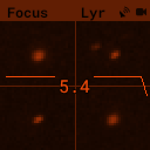

The tiles show raw camera pixels, simply cropped and enlarged, with no sharpening,
smoothing, or contrast tricks.  What you see is honestly how tight your stars are.  Each
star is magnified about 10x.  A badly defocused star automatically gets a wider view so its
broad disc or donut isn't clipped, and it tightens back up as focus improves.  The **+**
and **-** keys adjust the magnification between 4x and 16x.

The Focus screen holds the camera exposure steady while you work.  Everywhere else the
PiFinder sets the exposure itself from the results of each plate solve, but soft stars are
exactly what stops it solving.  The exposure would drift while you turn the lens, moving the
HFD readout and changing which stars you see.  Holding it steady means every change on screen
comes from the lens.

Press **UP** for a longer exposure and **DOWN** for a shorter one.  These step through the
same values as the Camera Exp setting, from 0.025s to 1s.  A bar along the bottom of the
screen shows the held exposure on the left and the keys that change it on the right.  The bar
stays on screen while you work.  Nothing you set here is saved.  The PiFinder restores your
previous exposure setting when you leave.  To set an exposure the PiFinder keeps, select
Settings from the main menu, then select Camera Exp.

At the center of the screen is the **HFD** readout.  This is the Half-Flux Diameter of the
detected stars, in camera pixels, and it measures how spread out the starlight is.  A
smaller number means tighter, sharper stars, so screw the lens slowly in or out and chase
the lowest stable number.  A readout of ``?.?`` means the PiFinder could not measure a star
on the current frame.  Keep adjusting, and the number returns as the stars tighten.

Work in small steps.  The whole journey from stars too soft to see on screen to good focus
is only a few turns of the lens, and the difference between fair and good focus is less
than half a turn.  Turn the lens an eighth to a quarter of a turn at a time, then take your
hand away for a moment so any vibration settles and the readout catches up.  Bigger or
continuous turns make it easy to sweep straight through best focus without ever seeing it.

A trace of the last 10 seconds of HFD runs along the divider on either side of the number,
with lower (sharper) values below the line.  As you turn the lens slowly through best focus, the
trace falls and rises again.  Go back to the low point.  Good focus means the quickest
solves, so it's worth taking the time to find the true minimum.  Judge it by the number and
all four stars together rather than by a single unusually bright star.

Press **SQUARE** to cycle through four views:

* **Stars**: the four magnified star tiles described above.
* **Single**: the brightest star alone at twice the magnification, with the HFD readout
  and trace along the bottom.
* **Image**: the full camera frame, brightened for the screen.
* **Stats**: the HFD alongside an FWHM estimate, the detected-star count, the held exposure
  marked ``HOLD``, gain, and a histogram of the raw image.  This view reports the exposure
  itself, so it has no bar along the bottom.

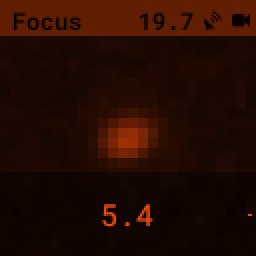
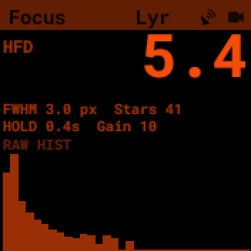

Press and hold **SQUARE** in any view to open the :ref:`user_guide:quick menu`.  It offers
HELP for this screen.  With dark enough skies and good focus, the camera icon appears
in the top right and the current constellation shows in the title bar.  Congratulations, the
PiFinder knows where it's pointing!

If you touch up focus on a later night, judge it here on the Focus screen rather than by
the camera icon.  A solve takes a second or so to catch up with each change of the lens, so
the icon always lags a little behind.  The HFD readout responds much faster, and the
technique is the same: a small turn, then a pause to let things settle.

A rev4 PiFinder has a lock ring on the lens.  Once you are happy with focus, tighten the
ring against the lens holder by hand.  The focus then holds through transport, so you do
not set it again every time you move the telescope.  To change focus later, loosen the
ring, adjust, then tighten it again.

Focus first, lock second.  Your PiFinder is focused on the bench before it ships, which is
close but not the best it can do.  Refine it here under real stars, chasing the lowest HFD,
and only then tighten the ring.  Lock it straight out of the box and you lock in "pretty
good" rather than sharp.

.. note::
   **Can’t get a plate solve?** The usual causes are simple.  Make sure the lens cap is off
   and the PiFinder isn't moving, then check focus.  Soft stars stop solves, so watch the HFD
   on the Focus screen and adjust the lens until it reaches its lowest value.  For anything
   beyond that, such as obstructions, dew, thin cloud or exposure settings, see the
   :doc:`troubleshooting` page.

Alignment
^^^^^^^^^^^
To get the most out of the PiFinder, align it with your telescope. The PiFinder uses
*digital* alignment. Instead of physically nudging the PiFinder so its field of view matches
your telescope, you tell it where your telescope points within its wide field.

The camera sees a 10° patch of sky, about 20 full moons across, and your eyepiece's much
smaller field sits somewhere inside it. Point your telescope at a star, then select that
same star on the PiFinder's chart. This tells the PiFinder exactly where to place objects so
they land in the center of your eyepiece.

.. note::
   These instructions cover the alignment system in software version 2.1.0 and above. For
   the previous instructions, `click here <https://pifinder.readthedocs.io/en/v2.0.4/quick_start.html#alignment>`_.

Select Align in the Start menu.

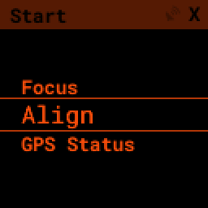

A rendered star chart appears, with constellation lines showing the sky the PiFinder
currently sees. If you instead see a message about not having a solve, return to the focus
section above.

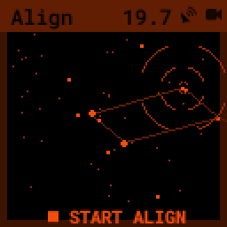

A Telrad-style reticle marks the current alignment point. The chart updates as you move
your telescope, and the **+/-** keys zoom in and out.

.. note::
   The reticle marks where your telescope is pointing *within* the camera's wide 10° field,
   so it normally sits off to one side rather than in the center. That's expected and does
   not mean your PiFinder is misaligned.

Now align in a few steps:

1. Start with a star you can easily recognize, such as a bright star or one in a
   distinctive constellation or asterism. Any naked-eye star works, but you can't align on
   a planet. Point your telescope at it and roughly center it in your eyepiece.
2. Look at the PiFinder screen and find that star plotted there. Press the **+/-** keys to
   zoom out if it helps you identify it.
3. Press **SQUARE** to switch to star-selection mode.

   .. image:: images/quick_start/align_start.png

   A small selection marker replaces the large reticle. The arrow keys jump it to the next
   closest star in that direction.

   .. image:: images/quick_start/align_select.png

4. Use the arrow keys to highlight the star your telescope is pointing at, then return to
   the eyepiece and center it as well as you can.
5. Press **SQUARE** to complete the alignment. The PiFinder now places objects wherever in
   your eyepiece that star sits. To exit without changing the alignment point, press **0**.

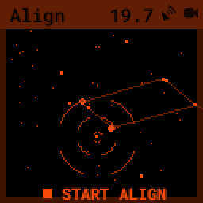

The marker returns to the normal Telrad-style reticle, showing your newly adjusted alignment
point. The PiFinder saves it, so you don't need to repeat this unless you remove the
PiFinder from your telescope and attach it again.

.. note::
   You can also align on any catalog object. If you've found an object and it's not centered,
   center it up, press and hold **SQUARE** for one second, and select Align. This isn't like
   adding alignment points to a standard DSC for accuracy. It simply tells the PiFinder where
   in your eyepiece you want objects placed if your initial alignment wasn't quite right.

Daytime alignment
^^^^^^^^^^^^^^^^^^^
The alignment above relies on a plate solve, so it only works once there are stars to see.
To set things up during the day, select Align (Day) in the Start menu. It reaches the same
result by hand, with no solve required: point your telescope at a distant object, find
where the camera sees it, and mark that spot directly.

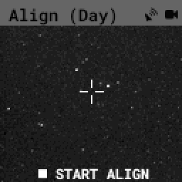

Opening the screen switches the camera to a short daytime exposure so you can see what it's
pointing at. Press **SQUARE** to begin.

The view splits into four quadrants, labelled to match the keypad corners: **7** top-left,
**9** top-right, **1** bottom-left, **3** bottom-right. Press the key for the quadrant your
object sits in.

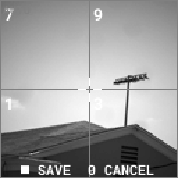

That quarter fills the screen and divides into quadrants again, so each press narrows the
marker into a smaller area. Repeat for up to three rounds:

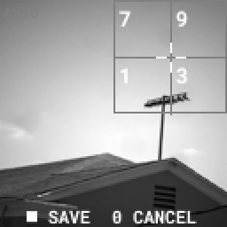
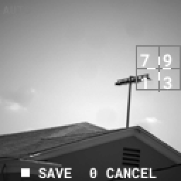

From there the arrow keys nudge the marker a pixel at a time for fine placement. The first
arrow press also leaves quadrant mode, so you can switch to fine adjustment at any point.

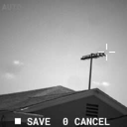

Center your distant object in the eyepiece, move the marker onto it on screen, then press
**SQUARE** to save. Press **0** to exit without changing the alignment. Use something far
enough away that the focus matches the night sky, such as a distant treetop, chimney or
hilltop, rather than something across the room.

.. note::
   In daylight the PiFinder shows the image in plain white rather than the usual red, since
   night vision isn't a concern. If the view is washed out or too dark, **+** and **-** adjust
   the exposure by hand. Press and hold **SQUARE** for the Quick Menu, where Exp Auto hands
   exposure back to the camera and Center returns the marker to the middle.

GPS Status
^^^^^^^^^^^

A GPS status indicator in the PiFinder title bar flashes while the PiFinder searches for its
position and time, and turns solid once it knows where and when it is. To monitor this
process and turn on a signal-boost mode, select GPS Status in the Start menu.

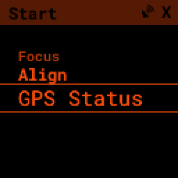

The screen has two modes: a large-text summary and a full-details view. Press **SQUARE** to
switch between them.

.. list-table::

   * - .. figure:: images/quick_start/GPS_Status.png

          Easy to read summary

     - .. figure:: images/quick_start/GPS_Status_details.png

          Full details view

Under partially obstructed skies, or when a lock is just taking longer than you'd like,
leave this screen active to boost the GPS signal by temporarily stopping the camera. Like
most electronics, the camera generates electromagnetic noise that can drown out the faint
GPS satellite signals. The screen shows "Lock boost on" while it does this.

A first lock takes several minutes, and the satellite counts stay at 0/0 for most of that
time. For what the counts and the lock types mean, and why a restart sets the wait back to
the start, see :ref:`user_guide:getting a gps lock`.

Once a lock shows, press the **LEFT** arrow to go back to the menu. This turns the camera on
again, and you're ready to find your first object.

Find Your First Object
^^^^^^^^^^^^^^^^^^^^^^^^
Now that you're aligned, it's time to explore. Select an object, read about it, then move
your telescope until the object is in the eyepiece.

- Press and hold the **LEFT** arrow for more than a second to jump to the main menu, if
  you're not already there
- Select Objects in the menu

.. image:: images/quick_start/main_menu_01_docs.png
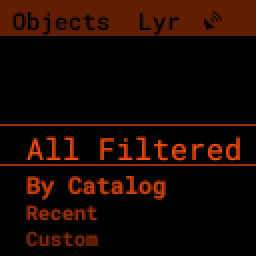

- Scroll down to By Catalog to see the objects in each catalog
- Select the Messier catalog

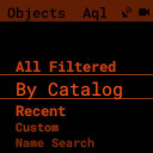
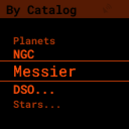

Selecting the Messier catalog brings up the heart of the PiFinder observing system, the
Objects List. It shows every Messier object that matches your
:ref:`filters<user_guide:filters>`.

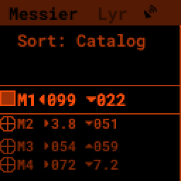
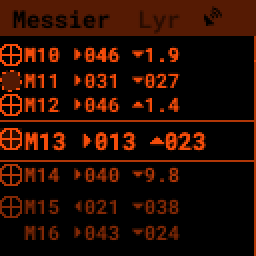

- Press the **SQUARE** key to cycle the information shown for each object: Locate, Names, or
  Magnitude/Size

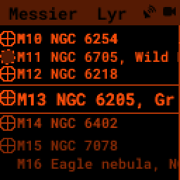
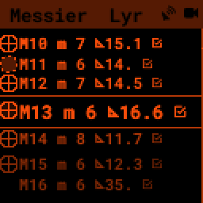

- Press the **UP** and **DOWN** keys to scroll through the objects and stop on one you want
  to view
- Press the **RIGHT** arrow to open Object Details, including Push-To guidance

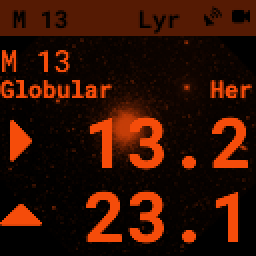

Object Details shows Push-To instructions by default. Press the **SQUARE** key to see an
image of the object or its catalog details instead.

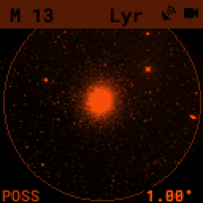
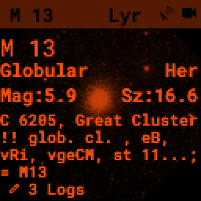

Now point your telescope at the object.

- Press **SQUARE** to cycle the object information until you see the Push-To instructions

The Push-To instructions show how far to move your telescope on each axis. The top arrow
and number tell you which way to turn the telescope, clockwise or counterclockwise, and how
far in degrees. The lower arrow tells you whether to move toward the zenith or the horizon,
and how far in degrees.

Watch the numbers as you move the telescope. They change to show how much closer or further
you are from the object. When both are near zero, the object should be in your eyepiece.

.. note::
   - How close to 0.00/0.00 you need to get depends on your eyepiece. With a true field of
     view of 1/2 degree, a readout below 0.25/0.25 puts the object somewhere in your eyepiece.
   - While you're moving, the PiFinder estimates position from its accelerometer. That is
     less accurate than a plate solve, so the numbers dim slightly. Stop moving and the
     PiFinder takes a fresh image and fixes your exact position. The numbers shift a little
     and brighten to show a reliable solve.

Shutting down the PiFinder
---------------------------

A shutdown isn't strictly required before you turn the power off, but the PiFinder is a
computer and skipping it risks file corruption.  Press and hold the power button for about a
second.  The screen asks you to confirm, and a second press shuts the PiFinder down and
turns it off.  The :ref:`user_guide:shutdown` section walks through it with pictures,
including the keypad route.

.. note::
   On v3 and v2.5 PiFinders, shut down from the keypad. Press and hold **LEFT** for more than
   a second to jump to the main menu, press and hold **SQUARE** to open the Quick Menu, then
   press **DOWN** for SHUTDOWN and confirm with **RIGHT**.  Once the screen and keypad turn
   off, it's safe to slide the power switch off.
   |v3_docs|

That's the basics of using your PiFinder sorted. To learn more, continue to the full
:doc:`user_guide`.
