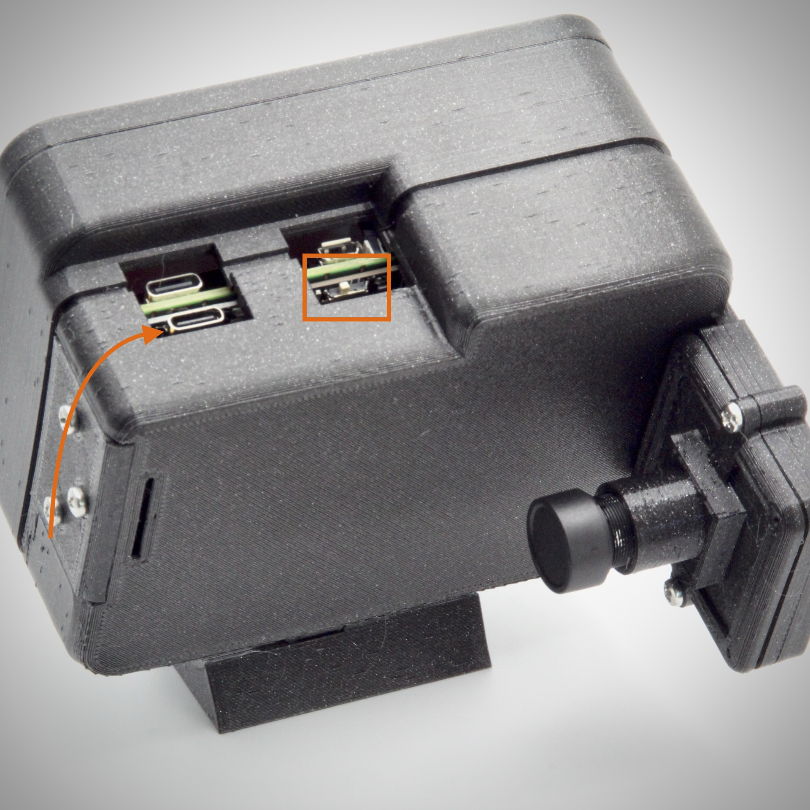

Quick Start
================

Congratulations on getting your hands on a PiFinder! Whether you’ve built it from scratch, or ordered a completed model from BBLabs, you’re on your way to a whole new level of accuracy and ease while observing the night sky.

This manual will help get you set up, and teach you how to use the PiFinder so you never have to read this again!

We’ll walk you through getting your PiFinder up and running for the first time, give you step-by-step instructions for your first night out, show you how to change your settings, and get you confident in understanding how PiFinder works. 

PiFinder uses its camera to take continuous pictures of the stars it sees, compares those stars to its database, and then tells you exactly where you’re pointed. It does that process, called “plate solving”, constantly, so it always knows where you’re aimed. It also uses an accelerometer (much like most modern mobile phones) to feel when you move the scope, and these two processes help tell it where you are, and the PiFinder in turn can tell you where you need to go.

PiFinder was created by software engineer and amateur astronomer Richard Wolff-Jacobson, who realized he could use his engineering and coding experience to create a brand new way to get more out of his time at the telescope. He saw that plate solving technology could be handled by the famous Raspberry Pi single-board computer and a simple camera. The software and rig he developed will turn your telescope into an accurate guide through the night sky.

Unboxing
--------

First, let’s get to know your PiFinder.

There are two parts of your PiFinder that you’ll interact with: the keypad/screen and the camera.

.. image:: images/quick_start/pf_front.jpeg
   :width: 45%

Powering the PiFinder
----------------------
If you purchased or built your PiFinder with the optional internal battery, you’ll need to charge the battery before first use. Plug a USB-C charging cable into the port on the top of the PiFinder, closest to the camera, as indicated below. For battery powered units, the power switch is the small white switch located on top of the PiFinder above the screen as shown below with the right hand arrow. While facing the screen slide it right to turn it on, left to turn it off. 

If you use an external power source, hook up your battery pack (5v/2A) to the USB-C port on the Raspberry Pi which is closest to the keypad, there may be only one if you don't have the internal battery. If you have a dobsonian telescope, we recommend mounting your power source on your primary mirror box, as this can also serve as a counterweight for the PiFinder.

Note that when you turn on your PiFinder for the first time, it will take a minute to start up. During startup, no image will appear on screen. This is normal and start up will be faster on subsequent power-ons.

Once the PiFinder is powered on, an welcome image will appear on the screen.  You’ll then see some information about the loading process and finally the CAMERA screen!

Camera Setup
------------

In this step we’ll get the camera ready for use. Once you’ve set it, you likely won’t need to adjust it very often. The camera has an aperture and focus ring indicated in orange and green below. 

.. image:: images/quick_start/cam_adjustments.jpeg

First, remove the lens cap.
Next, use your fingers to gently turn the aperture ring until it is fully open (you can even see it open through the front lens). This allows in the most light from the stars.

.. list-table::

   * - .. figure:: images/quick_start/aperture_closed.jpeg

          Camera Aperture Closed

     - .. figure:: images/quick_start/aperture_open.jpeg

          Camera Aperture Open

Lastly, turn the focuser all the way in the Far direction indicated on the lens and back it off about ¼ turn.  This should get you close to focus, and you can refine focus using the CAMERA screen explained later in this manual, when you are using the PiFinder for the first time under the stars.

Your camera is now all set for use! If you ever have troubles with alignment or plate solving, you can troubleshoot these steps to make sure your camera is set up correctly.

Mounting
---------

The PiFinder comes set up for a dovetail for mounting, which is 32mm wide and fits the standard finder shoe found on most scopes.

.. image:: images/quick_start/mount_shoe.jpeg
   :width: 47%

.. image:: images/quick_start/pifinder_mounted.jpeg
   :width: 47%

The PiFinder must be mounted in a way that is close to perpendicular to the ground, otherwise it will give you bad directions during object location. The beauty of the PiFinder is that it always knows where it’s looking in the sky and it is programmed to assume it is perpendicular to the earth, so it will give you instructions based on that assumption.

The dovetail that comes with the PiFinder is adjustable to allow the PiFinder to sit upright, even if your finder shoe is not right at the top of your optical tube.  Loosen the two screws in the dovetail, put the PiFinder on your scope and adjust the angle until it’s roughly perpendicular to the ground.  Once you’re happy, remove the PiFinder and tighten the two adjustment screws.  You should be all set for a night of observing!

.. note::
   * Make sure to mount the PiFinder in such a way that the camera has an unimpeded view of the sky. 
   * There are different versions of the PiFinder for left, right and flat mounting and the software needs to be configured properly for each.  See the ‘Global Config Options’ section to see how to adjust this.

First Time Out
--------------

Once your PiFinder is charged and your mount is set on your scope, you’re ready to  head out to your observing site! Set up your scope, mount your PiFinder, and read on…

You’ll be able to turn on your PiFinder and start using it as soon as you see multiple stars in the part of the sky where the PiFinder is pointed. PiFinder uses the stars (and its internal GPS sensor) to learn where it is and what it’s looking at, so it needs a few stars in order to get started. This may happen a little after sunset, or, if you’re in an area with light pollution, you may have to wait until full darkness. 

There are two icons in the upper right of the screen that will tell you if the PiFinder knows where it is: one shows a sattelite dish when GPS signal and location has been acquired, and the other shows how the PiFinder has determined your current telescope poition.  I will display a camera if it has plate-solved its current view, and a cross of arrows if the scope is moving and it's using the acceleromiter.  If you see an 'X', the PiFinder has yet to determine where it's pointing (see :ref:`quick_start:setting focus & first solve`)

.. list-table::

   * - .. figure:: images/quick_start/status_CAMERA_001_docs.png

          No GPS, No Solve

     - .. figure:: images/quick_start/status_CAMERA_002_docs.png

          GPS + Camera Solve

     - .. figure:: images/quick_start/status_CAMERA_003_docs.png

          GPS + IMU Estimate

Adjusting Brightness
^^^^^^^^^^^^^^^^^^^^^

The PiFinder is designed to allow you to adjust the brightness of the screen and keypad at any time: simply hold down the ENT button and push UP for brighter, or DN for dimmer. In a dark sky site, you can turn the brightness down to preserve your dark-adapted vision.

.. note::
   The PiFinder will dim the screen and reduce the frequency of exposures, solving, and other processes when it’s been idle for a period of time. This helps save battery power and can also prevent glare at the eyepiece in especially dark environments. The default is 30 seconds and this can be configured, or turned off completely, in the :ref:`user_guide:global options`

   Pressing any button, or moving the PFinder will wake it from power save mode.

Setting Focus & First Solve
^^^^^^^^^^^^^^^^^^^^^^^^^^^^^^^^^

Once you see stars populating the sky, turn on your PiFinder and aim your scope at one of the brightest best stars you can see. Make sure your lens cap is off, and immediately PiFinder will get to work solving what it sees.... but what it sees might be fuzzy so you'll need to adjust the focus on the lense.  Start by turning it all the way in the 'Far' direction and turning it 1/4 turn back.  You should see one or more bloated, unfocused stars as seen below.  Turn the focus ring until the star tightens up and looks like the image to the right.  Focus is not critical, it just needs to be close.  If the sky is dark enough and you've got focus correct, you should see the camera icon appear in the top right and the current constellation will be shown in the title bar.  Congratulations Plate Solving is complete, and the PiFinder knows where it is pointin! 

.. list-table::

   * - .. figure:: images/quick_start/CAMERA_unfocused.png

          Unfocused star with bright background

     - .. figure:: images/quick_start/CAMERA_focused.png

          Tightly focused star with darkened background

.. note::
   **Can’t get a plate solve?** Check to make sure your lens cap is off, your aperture is all the way open, and your focus is at infinity. **Still not working?** Make sure nothing is impeding PiFinder’s view of the sky, and its screen has not dewed or fogged over.

Alignment
^^^^^^^^^^^
In order to get the most out of PiFinder, you must align it with your telescope. Even the smallest change in how your PiFinder sits in its mount as you setup your scope from night to night can change where it aims, so our first step will be to get a bright star in the center of your eyepiece.  This will be used to tell the PiFinder what part of the sky your telescope is seeing. Any star you can identify with the naked eye will work.

When you first start up PiFinder, it will load in the “CAMERA” screen, which shows the live image from the camera.  You should be able to see your chosen star in the PiFinder’s screen.  

.. image:: images/quick_start/align_CAMERA_001_docs.png

Next, press B to enter ALIGN mode. (If you’ve moved away from CAMERA Mode, push the A button three times to cycle through PiFinder’s other modes until you return to the CAMERA screen). PiFinder will identify up to three bright stars in the field of view, and give each a number from 1-3. 

.. image:: images/quick_start/align_CAMERA_006_docs.png

Choose the number that represents the star currently in your telescope’s eyepiece, and press that number on PiFinder’s number pad. You will be taken back to the CAMERA screen, and now the reticle will be centered on your chosen star. You are now aligned, and ready to explore the universe!

.. image:: images/quick_start/align_CAMERA_004_docs.png

.. note::
   **Can’t find your star on the ALIGN screen?** You can use the hardware thumbscrews on the back of the PiFinder to adjust where the camera is pointing relative to your telescope.  Loosen some screws as you tighten others and wait between each adjusment for a new image to be taken.

Find Your First Object
^^^^^^^^^^^^^^^^^^^^^^^^
Now that you’re aligned, it’s time to explore!  We'll walk you through the steps to look up an object in the catalog, get some informaiton about it, select it to find and push your scope so it's in the eyepiece.

The 'A' function key will move you through the main observing screens and if you press it twice from the CAMERA screen, you'll end up on the CATALOG screen.

.. image:: images/quick_start/firstobj_CATALOG_001_docs.png

The CATALOG screen let's you browse and search through all 16,000+ objects the PiFinder can guide you to.  These objects are grouped into several popular catalogs and the 'C' function key (for Catalog) will switch between the various active catalogs.  Press 'C' until you find a catalog containing an object you'd like to look at.  In this case, we've selected Messier 13, but you'll have to adjust for your location and time of year.

.. note::
   To figure out what great objects are in the sky tonight, use an astronomy app like SkySafari or SkyGuide, or consult a pocket sky atlas.

.. image:: images/quick_start/firstobj_CATALOG_002_docs.png

Once you have selected the catalog your object is in, use the number keys to type in the object ID number.  As you type, the PiFinder will present matching objects.

.. image:: images/quick_start/firstobj_CATALOG_003_docs.png

.. note::
   If you don't find the particular object you are looking for, it may be filtered!  By default, the PiFinder will only show objects in it's catalog that are currently visible from your location at your time.  To adjust filter settings check out :ref:`user_guide:Catalog`

Once you've typed in the object ID number, you can press the ENT key to select it, and the PiFinder will switch to the LOCATE screen to help guide you to it!

.. image:: images/quick_start/firstobj_LOCATE_001_docs.png

Now that you’re on the LOCATE screen, you’ll see two arrows and two large numbers. The top arrow and number tell you which direction to spin your scope clockwise vs. counterclockwise, and how far in degrees. The lower arrow tells you whether to move your scope up towards zenith, or down towards the horizon, and how far in degrees.

Once you’re at 0.0 in both numbers, look through your eyepiece–if you’ve selected the right magnification eyepiece for the object you’re observing, the object will appear in the field of view! If not, verify your :ref:`quick_start:alignment` and try again.

Shutting down the PiFinder
---------------------------

Although shutting down is not strictly needed before power-off, the PiFinder is a computer and there is a chance of file corruption if you do not.  Some MicroSD cards are more sensitive to this than others.

An option to shutdown is available in the :ref:`user_guide:global options` screen. Hold down *Ent* and press *A* to cycle through the system screens until you see the status screen, the press and hold *A* to access the Global Options

You've now got the basics of using the PiFinder sorted, to learn more you can continue on to the full :ref:`user_guide:pifinder user manual`
