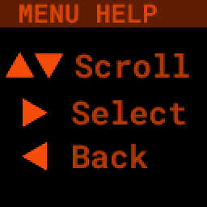
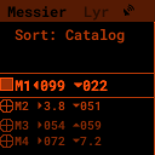

Quick Start
================

.. note::
   This documentation is for v3 and v2.5 PiFinders running software 2.2.0 or above.
   You can see what version of software is running by lookin in the upper right of
   the welcome screen. 

   If you need docs for a previous version please choose `1.x.x <https://pifinder.readthedocs.io/en/v1.11.2/index.html>`_
   , `2.0.x <https://pifinder.readthedocs.io/en/v2.0.4/index.html>`_
   or `2.1.x <https://pifinder.readthedocs.io/en/v2.1.1/index.html>`_

Congratulations on getting your hands on a PiFinder™! Whether you’ve built it from scratch, or ordered a completed model 
from BBLabs, you’re on your way to a whole new level of accuracy and ease while observing the night sky.

This Quick Start guide aims to get you out and observing with most everything you need.  For more depth and information
about non observing functions, checkout the full :doc:`User Guide<user_guide>` 

We’ll walk you through getting your PiFinder up and running for the first time, give you step-by-step instructions for 
your first night out, show you how to change your settings, and get you confident in understanding how PiFinder works. 

PiFinder uses its camera to take continuous pictures of the stars it sees, compares those stars to its database, and 
then tells you exactly where you’re pointed. It does that process, called “plate solving”, constantly, so it always 
knows where you’re aimed. It also uses an accelerometer (much like most modern mobile phones) to feel when you move 
the scope, and these two processes help tell it where you are, and the PiFinder in turn can tell you where you need 
to go.

PiFinder was created by software engineer and amateur astronomer Richard Wolff-Jacobson, who realized he could use 
his engineering and coding experience to create a brand new way to get more out of his time at the telescope. He saw 
that plate solving technology could be handled by the famous Raspberry Pi single-board computer and a simple camera. 
The software and rig he developed will turn your telescope into an accurate guide through the night sky.

Unboxing
--------

The PiFinder comes fully assembled and ready to use.  The keypad and screen are the primary way you'll interact
with the PiFinder, choosing what to look for, getting Push-To guidance and logging objects.

.. image:: images/quick_start/pf_front.jpeg
   :width: 45%
.. image:: images/quick_start/pf_rear.jpeg
   :width: 45%

Depending on the configuration of your PiFinder the camera may be facing a different direction or be located
in a different spot.  This is to make sure the camera sees the sky while the keypad and screen are comfortable
for an observer to reach on any type of scope.

Powering the PiFinder
----------------------

If you purchased or built your PiFinder with the optional internal battery, you’ll need to charge the 
battery before first use. Plug a USB-C charging cable into the port on the top of the PiFinder, 
closest to the back of the case, as indicated below with an arrow.  The charging indicator will glow 
blue when charging and switch to green when complete.

For battery powered units, the power switch is the small white switch located on top of the PiFinder 
above the screen highlighted with a box below. While facing the screen slide it right to turn it on, left to turn it off. 

.. image:: images/quick_start/power.jpeg

If you use an external power source, you can use either USB-C port to power the unit.  The USB-C port on the Raspberry Pi which 
is closest to the keypad (there will be only one if you don't have the internal battery) will power the unit, but not 
charge the internal battery. You can use the regular charging connector to both power the unit and charge the battery 
from external power if you turn the white power switch to the 'On' position.

Note that when you turn on your PiFinder for the first time, it will take a minute to start up. During intial 
startup, the welcome screen will come and go as the PiFinder restarts but subsequent power-on's will be much quicker.

Once the PiFinder is powered on, an welcome image will appear on the screen.  You’ll then see some information about 
the loading process and finally the Main Menu will appear.

Using the PiFinder
-------------------

The PiFinder features a scolling menu with the active option highlighted in the middle of the screen.  

All the features of the PiFinder are available through this menu by scrolling, selecting options
or moving to new menu screens.

- The **UP** and **DOWN** arrows will scroll the current menu
- The **RIGHT** arrow will activate the current option; selecting it or moving to another menu
- The **LEFT** arrow will take you back to the previous menu or screen
- Holding **LEFT** for more than one second will always take you back to the TOP of the menus

Some menus, like the catalog selection, allow you to check on an off multiple options using
the RIGHT arrow

There are menu items which take you to specific functions, like a star chart showing where
your telescope is currently pointing.

The **LEFT** arrow will always take you back to the previous menu or screen. 

Many screens will use the number keys along with **+**,**-**, and **SQUARE** to perform other functions.  
These are listed in the help pages for that screen.

To access the help page for a screen (along with other useful screen specific items) hold down 
the **SQUARE** button for more than 1 second to bring up the handy Radial Menu

The Radial menu presents four options you can access quickly using the arrow keys.  The **UP** 
arrow will normally select HELP.  

You can read through all the help for a particular screen by using the **UP** and **DOWN** arrows.

The PiFinder has a lot of powerful features, but they are all available from this menu system 
and are designed to use this same basic set of buttons to move around.

Configuration Setup
--------------------

The PiFinder is available in multiple configurations (Right/Left/Straight/Flat).  You'll need to set the correct 
configuration in the software so the PiFinder can provide appropriate pointing directions for your specific set up.

Use the menu to select Settings from the main menu and then scroll down and select PiFinder Type

Scroll to highlight the type of PiFinder you are using and press RIGHT to make your selection.  This will restart
the PiFinder software.

Mounting
---------

The PiFinder comes set up for a dovetail for mounting, which is 32mm wide and fits the standard 
finder shoe found on most scopes. Here's an image of the finder shoe and a version 1 PiFinder 
mounted in it.  Current PiFinders attach to your scope in just the same way.

.. image:: images/quick_start/mount_shoe.jpeg
   :width: 47%

.. image:: images/quick_start/pifinder_mounted.jpeg
   :width: 47%

The PiFinder must be mounted in a way that is close to perpendicular to the ground, otherwise it will
not be as accurate when estimating position while moving. The beauty of the PiFinder is that it always 
knows where it’s looking in the sky and it is programmed to assume it is perpendicular to the earth, so 
it will give you instructions based on that assumption.

The dovetail that comes with the PiFinder is adjustable to allow the PiFinder to sit upright, even if 
your finder shoe is not right at the top of your optical tube.  Loosen the two screws in the dovetail, 
put the PiFinder on your scope and adjust the angle until it’s roughly perpendicular to the ground.  
Once you’re happy, remove the PiFinder and tighten the two adjustment screws.  You should be all set for a night of observing!

.. note::
   * Make sure to mount the PiFinder in such a way that the camera has an unimpeded view of the sky. 
   * There are different versions of the PiFinder for left, right, straight and flat mounting and the software 
     needs to be configured properly for each.  Check the 'Configuration Setup' section above to see how to adjust this.

First Time Out
--------------

Once your PiFinder is charged and your mount is set on your scope, you’re ready to  head out 
to your observing site! Set up your scope, mount your PiFinder, and read on…

You’ll be able to turn on your PiFinder and start using it as soon as you see multiple stars in 
the part of the sky where the PiFinder is pointed. PiFinder uses the stars (and its internal GPS 
sensor) to learn where it is and what it’s looking at, so it needs a few stars in order to get 
started. This may happen a little after sunset, or, if you’re in an area with light pollution, 
you may have to wait until full darkness. 

There are two icons in the upper right of the screen that will tell you if the PiFinder knows 
where it is: one shows a sattelite dish which will be solid when there is a GPS signal and 
a location has been acquired, and will flash when searching for a location and time.

The other indicator shows how the PiFinder has determined your current telescope poition.  It will 
display a camera if it has plate-solved its current view and this camera icon will fade if the scope 
is moving and it's using the acceleromiter.  If you see an 'X', the PiFinder has yet to determine 
where it's pointing (see :ref:`quick_start:setting focus & first solve`)

.. list-table::

   * - .. figure:: images/quick_start/status_both.png

          GPS Location + Camera Solve

          Ready to go!

     - .. figure:: images/quick_start/status_no_gps.png

          No GPS - Will be flashing

          Wait a bit....

     - .. figure:: images/quick_start/status_no_solve.png

          No plate solve yet

          Check focus if it's dark

.. note::
   The GPS reciever in the PiFinder must be outside to get a GPS lock and may take several
   minutes to recieve all the data required to calculate it's location and date/time.

   This delay is longer after the PiFinder has been off for a long period or moved a distance
   while it's turned off.  Subsequent start ups at the same location should be quicker.

   Leaving the PiFinder on the GPS Status screen will result in a faster lock time as 
   this screen disables the camera, reducing the overall EM noise and helping the GPS
   reciever see more satellites.

Adjusting Brightness
^^^^^^^^^^^^^^^^^^^^^

The PiFinder is designed to allow you to adjust the brightness of the screen and keypad at any 
time: simply hold down the **SQUARE** button and push **+** for brighter, or **-** for dimmer. In a dark sky 
site, you can turn the brightness down to preserve your dark-adapted vision.

.. note::
   The PiFinder will dim the screen and reduce the frequency of exposures, solving, and other processes 
   when it’s been idle for a period of time. This helps save battery power and can also prevent glare 
   at the eyepiece in especially dark environments. The default is 30 seconds and this can be configured, 
   or turned off completely, in the :ref:`user_guide:settings menu`

   Pressing any button, or moving the PFinder will wake it from power save mode.

Start with the Start menu
^^^^^^^^^^^^^^^^^^^^^^^^^^^^^^^^^

At the start of each session, you may need to do three things:

- Check and adjust camera focus
- Align the PiFinder by telling it where your scope is pointing
- Check the status of the GPS lock

We've organized these three items into the 'Start' menu listed at the top of the PiFinder main menu.

You may not need to do all of these things at the start of every session.  The focus should generally remain 
the same from night to night and if you leave your PiFinder on your scope you may not need to adjust the 
alignment each time.  To perform most functions the PiFinder will require a GPS signal, and this should
happen automatically, but the GPS Status screen can be used to monitor progress towards a lock and also 
boosts the GPS signal.  This can help in marginal situations or to speed things along.

Setting Focus & First Solve
^^^^^^^^^^^^^^^^^^^^^^^^^^^^^^^^^

Once you see stars populating the sky, turn on your PiFinder and aim your scope at one of the brightest 
best stars you can see. Make sure your lens cap is off, and immediately PiFinder will get to work solving 
what it sees.... the focus point of the lens is set when your PiFinder is assembled, but it may need
some adjustment to see the dimmest stars.

Screw the lens in and out in the holder to adjust focus if needed.

Use the menu system to select the 'Focus' option under the 'Start' menu

The Focus screen shows a live preview of what the camera is seeing.  It uses special image processing to 
highlight stars and remove background skyglow so that you can easily focus your PiFinder camera.

If there are no stars visible or the image is too defocused he screen may seem too bright or dark or 
have a noisy appearance, this is normal until the camera is near focus.  See below for some examples

.. list-table::

   * - .. figure:: images/quick_start/CAMERA_unfocused.png

          Unfocused star with bright background

     - .. figure:: images/quick_start/CAMERA_focused.png

          Tightly focused star with darkened background

Try to pan your scope until you see some bright object in the camera view.  You can screw the lens in and out 
to adjust focus.  Once something star-like is in the FOV and near focus, the image processing in the preview screen 
will work properly and start dimming the background and highlighting the stars.

Good focus is important for the quickest solves.  Close will work, but you should use the **+/-** keys to zoom in the view
to get the stars as tight as you reasonably can.  If the sky is dark enough and you've got focus 
correct, you should see the camera icon appear in the top right and the current constellation will be shown in 
the title bar.  Congratulations, the PiFinder knows where it is pointing!

.. note::
   **Can’t get a plate solve?** Check to make sure your lens cap is off, the PiFinder is not moving and
   the lens is properly focused.
   **Still not working?** Make sure nothing is impeding PiFinder’s view of the sky, and its 
   lens has not dewed or fogged over.

Alignment
^^^^^^^^^^^
In order to get the most out of PiFinder, you must align it with your telescope. The PiFinder
uses a digital alignment system. Rather than physically adjust the PiFinder so the center
of it's FOV lines up with your telescope, you tell the PiFinder where within it's wide FOV 
your telescope is pointing.

The PiFinder camera sees a patch of sky that is 10 degrees wide.  That's about 20 full moons
across and the much smaller field of view (FOV) of your telescope is somehwere in 
that patch of sky.  By pointing your telescope at a star, and then selecting that same star 
on the PiFinder's alignment chart, you are telling the PiFinder where to put DSO's so they
are in the middle of your eyepiece each time.

.. note::
   The instructions below are for the new alignment system in PiFinders running software
   version 2.1.0 and above.  For the previous alignment instructions, please 
   `click here <https://pifinder.readthedocs.io/en/v2.0.4/quick_start.html#alignment>`_

To being, select the 'Align' option from the 'Start' menu 

You'll see a rendered star chart with constellation lines showing the area of the sky the
PiFinder is seeing.  If you instead see a message about not having a solve, return to the 
focus section above.

.. image:: images/quick_start/align_intro.png

In this chart view the current alignment point is shown with a Telrad style reticle. As 
you move your telescope, this chart will update and you can zoom in and out using the **+/-**
keys.

Next, pick a star you can easily recognize in the sky.  This can be a bright star, or 
a star which is part of a distinctive constellation or asterism.  You can choose any star
you can see with your naked eye, but you can't align using a planet.  Point your telescope
at this star and roughly center it in your eyepiece.

Look at the screen of the PiFinder and you should see the star plotted there.  You can use
the **+/-** key to zoom out and make it easier to identify the star if needed.

Press the **SQUARE** button to switch to star-selection mode

The large reticle will be replaced with a smaller selection marker that you can move from star
to star using the arrow keys.  Pressing one of the arrows will move the selection to the next 
closest star in that direction.

Once you have used the arrow keys to highlight the star your telescope is pointing at 
go back to the eyepiece and center it up as well you can.  When you press the 
**SQUARE** button to select the star, the PiFinder will put objects you want to see
wherever in your telescope eyepiece the star is at that moment

Press the **SQUARE** button to complete the alignment, or you can press the **0** key
to exit alignment mode without changing the alignmnet point.

The indicator will return to the normal Telrad style reticle to indicate the newly adjusted
alignment point.  

The PiFinder will save this alignment point so you won't need to complete this process again
unless you remove and re-attach your PiFinder to your telescope.

.. note::
   You can also align using any catalog object!  If you have used the PiFinder to find an object
   and it's not centered in your eyepiece, center it up, hold down the **SQUARE** key for one 
   second and choose align.  

   This is not the same as adding alignment points to a standard DSC to improve accuracy, this is 
   simply telling the PiFinder where in your eyepiece you'd like objects to be put if your initial
   alignment was not quite to your liking.

GPS Status
^^^^^^^^^^^

There is a GPS status indicator in the PiFinder title bar which will flash while the PiFinder is 
searching for it's position and time.  This indicator will turn solid once the PiFinder knows where
it's at and what time it is.  You can monitor this process and activate a special signal boost mode
via the 'GPS Status' menu item in the 'Start' menu.

This screen has two modes, one with basic details in larger text and a full details mode.  You can 
switch between them using the SQUARE button.

.. list-table::

   * - .. figure:: images/quick_start/GPS_Status.png

          Easy to read summary 

     - .. figure:: images/quick_start/GPS_Status_details.png

          Full details view

If you are using the PiFinder under partially obstructed skies, or locking is just taking longer than
you like, you can leave this screen active to enhance the GPS signal by temporarily stopping the camera.
Like most electronics, the camera system generates electromagnetic noise that can make it more difficult
for the subtle GPS satellite signals.

Once a lock is indicated, you can press the LEFT arrow to return to the menu, re-activate the camera, 
and continue on to find your first object!

Find Your First Object
^^^^^^^^^^^^^^^^^^^^^^^^
Now that you’re aligned, it’s time to explore!  We'll walk you through the steps to select an object to find,
get some information about it, and push your scope so it's in the eyepiece.

- Hold the **LEFT** arrow button for more than a second to jump to the main menu if you are not already there
- Select Objects from the menu

.. image:: images/quick_start/main_menu_01_docs.png

- Scroll down to find the By Catalog option to browse objects by catalog
- Select the Messier catalog from the menu

After selecting the Messier catalog you'll see the heart of the PiFinder observing system, the Objects List!
In this case the Objects List is showing all the objects that match your :ref:`filters<user_guide:filters>`
from the Messier catalog.  

- Press the **SQUARE** key to cycle through the different information to display about each object: Locate,
  Names, or Magnitude/Size

- Use the **UP** and **DN** keys to browse objects and select one you want to view
- Press the **RIGHT** arrow key to access Object Details, including Push-To guidance

.. image:: images/quick_start/M13_locate.png

Object Details will show Push-To instructions by default, but you can use the **SQUARE** key to see
an image of any object or catalog details.

Now it's time to point your scope at the selected object!

- Press the **SQUARE** to cycle through the object information until you see the Push-To instructions

.. image:: images/quick_start/M13_locate.png

The Push-To instructions show how many degress to move your scope on each axis in order to find the
current object.  The top arrow and number tell you which direction to spin your scope clockwise vs. 
counterclockwise, and how far in degrees. The lower arrow tells you whether to move your scope up towards 
zenith, or down towards the horizon, and how far in degrees.

While watching the numbers, move your scope and the numbers should change to indicate
how much closer or further you are from the object.  When you get the numbers near zero, the object should
be in your eyepiece!

.. note::
   - How close you need to get to 0.00/0.00 depends on your eyepiece.  If you have an eyepiece with a true
     field of view of 1/2 degree, then a readout below 0.25/0.25 will assure the object is somewhere in your eyepiece FOV
   - When moving your scope the PiFinder uses it's accelerometer to estimate where your telescope is pointing.  This is 
     less accurate than a plate solve, so the numbers displayed dim slightly to signal this.  As soon as your stop
     moving the telescope, the PiFinder will take a new image of the sky and determine exactly where your scope is pointing.
     The numbers displayed will shift a bit and become brighter indicating a 100% reliable position.

Shutting down the PiFinder
---------------------------

Although shutting down is not strictly needed before power-off, the PiFinder is a computer and there is a chance of
file corruption if you do not.  Some MicroSD cards are more sensitive to this than others.

To easily shut down the PiFinder:

- Hold the **LEFT** arrow button for more than a second to jump to the main menu
- Hold the **SQUARE** button to access the Radial menu

.. image:: images/quick_start/main_menu_01_docs.png

- Press **DOWN** to select the SHUTDOWN option
- Use the **RIGHT** arrow to confirm, or the **LEFT** arrow to go back

When you confrim the screen and keypad will turn off after a few seconds and it's then safe to
turn off the unit using the power switch or unplugging the battery.

You've now got the basics of using the PiFinder sorted, to learn more you can continue on to the full :doc:`user_guide`
