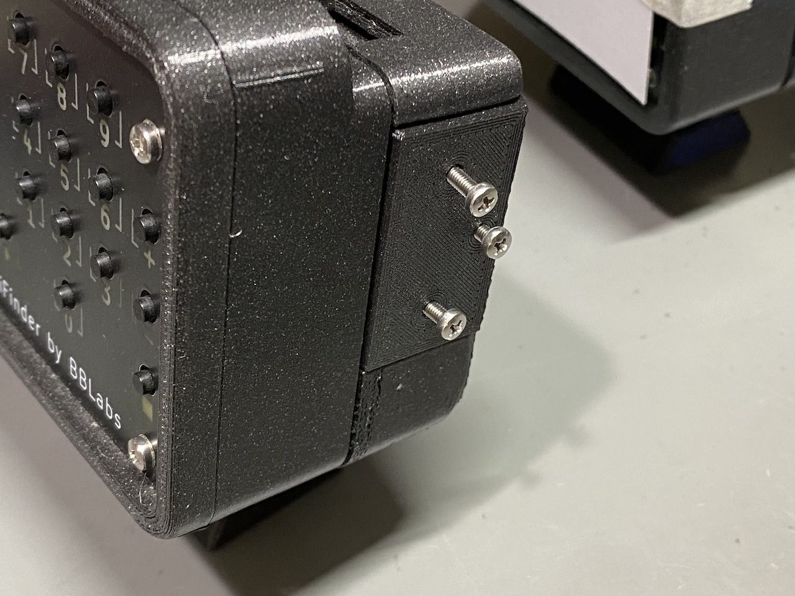
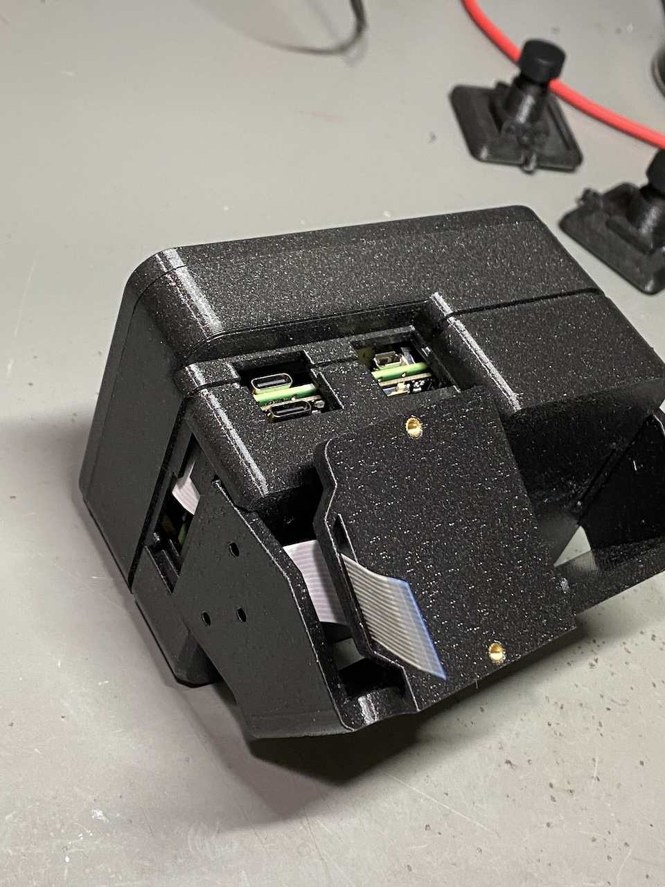
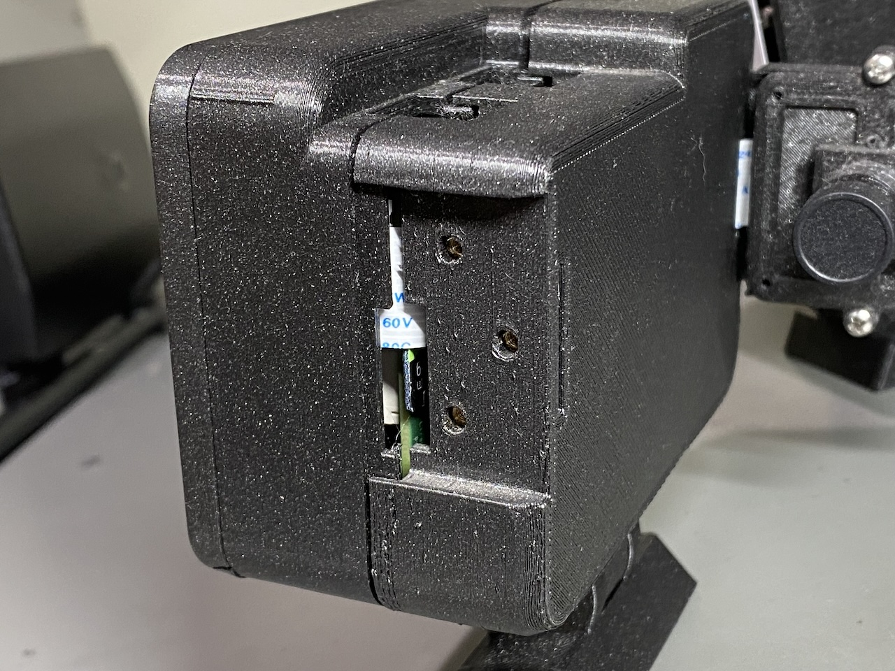
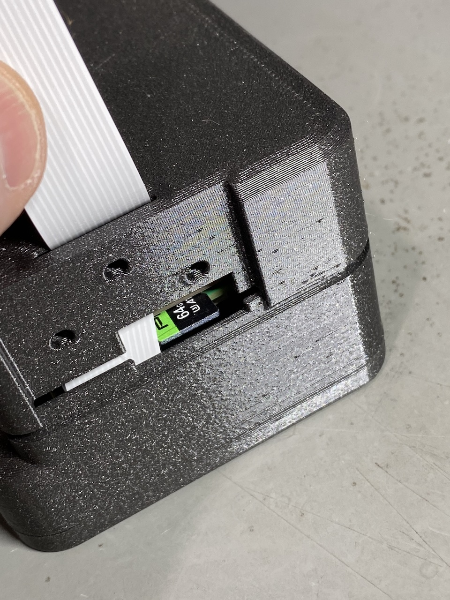

Swapping the SD Card
====================

.. note::
   This procedure is for v3 PiFinders.  The microSD card holds everything the
   PiFinder runs — the operating system, the PiFinder software, your settings,
   and the deep sky catalog images — so swapping it is how you recover from a
   corrupt card or move to a fresh or larger one.

The PiFinder boots from a microSD card tucked inside the case, in the slot
between the Raspberry Pi and the power board.  This page covers getting at that
card and swapping it.  To put software on the new card first, see
:doc:`Software Setup <software>`.

When you'd swap the card
------------------------

* The card has become corrupt and the PiFinder won't boot reliably (see
  :doc:`troubleshooting`).
* You'd rather re-image onto a spare card and keep your original as a backup.

Image the new card before you open the case — the
:ref:`software:prebuilt release image` is the quickest way, and it already
includes the catalog images.

Before you start
----------------

If the PiFinder is on, shut the PiFinder down cleanly first (Tools → Shutdown), wait for the screen and
keypad to go dark, then switch off the power.  Pulling a card from a running unit
can corrupt it.

You'll need a small Phillips screwdriver.  The card sits in a friction slot —
there's no spring to push it in or out, so you pull it straight out and push the
new one straight in.

Opening the case
----------------

On every v3 unit, start by removing the three screws on the right-hand side as
you face the screen.

How you reach the card from there depends on your configuration.  If you're not
sure which one you have, the :ref:`build_guide:configurations overview` has
photos of each.

Right configuration
~~~~~~~~~~~~~~~~~~~~~

Simply lift off the separate cover held on by the three screws to expose the card.

Left configuration
~~~~~~~~~~~~~~~~~~~~

For the left configuration, the three screws hold the camera assembly in place.  
Gently tilt the camera assembly out of the way to reach the card. Be mindful of 
the cable, but there should be plenty of slack.

Flat configuration
~~~~~~~~~~~~~~~~~~~

The three screws hold one side of the flat cradle. Removing them allows enough flex to 
gently pull the flat holder down to expose the card.  The image below shows this, but 
was taken during assembly before the camera is installed.  There is no need to remove
the camera to access the sd card.

Swapping the card
-----------------

The card sits in the slot between the green Raspberry Pi board and the black
power board.  The white camera ribbon cable runs nearby — move it gently aside
if it's in the way, taking care not to crease or unseat it.

Grip the card and pull it straight out, then push the replacement straight in
until it's fully seated.  The card is easy to crack once it's part-way out, so
support it as you work and don't flex it against the case.

Reassemble and boot
-------------------

Reverse the steps: refit the cover or holder for your configuration, check that
the camera ribbon is sitting flat and isn't pinched, and replace the three side
screws — snug, not forced.

Power the PiFinder on.  The first boot from a freshly imaged card takes longer
than usual while it expands the filesystem to fill the card, so give it a couple
of minutes.

.. important::
   After swapping the card you'll most likely need to set the **Camera Type**
   again.  A freshly imaged card defaults to one sensor, and if it doesn't match
   your unit the camera view will be blank.  Set it under Settings → Advanced → Camera Type
   — the v3 sensors are ``imx462`` and ``imx296`` — then **fully power the
   PiFinder off and on**, as a software restart alone won't apply the change.
   See :ref:`troubleshooting:the camera view is blank or black` for more.  It's
   also worth re-checking your WiFi settings, since they won't carry over to a
   freshly imaged card.
