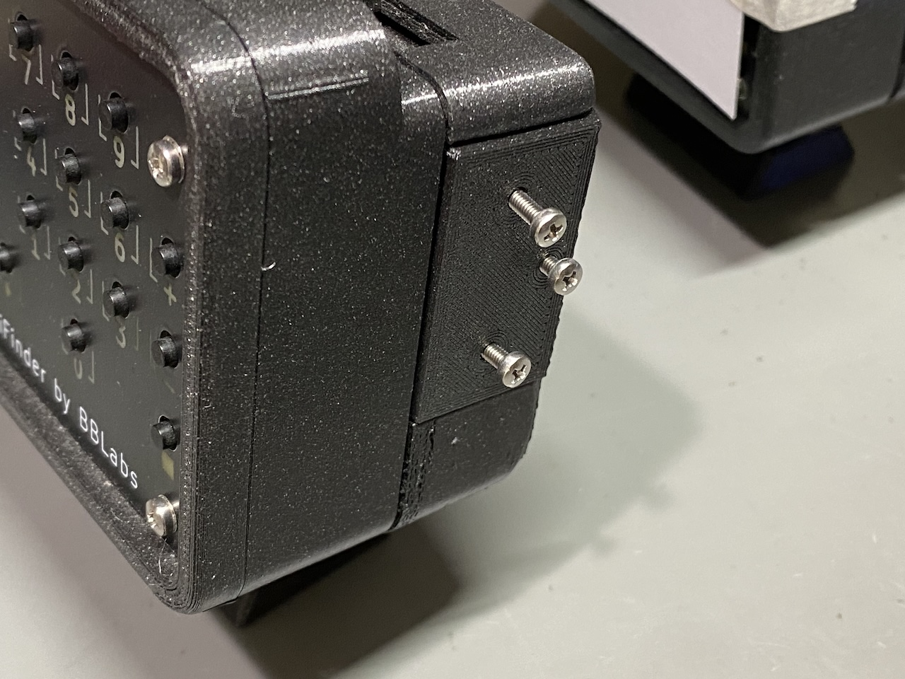
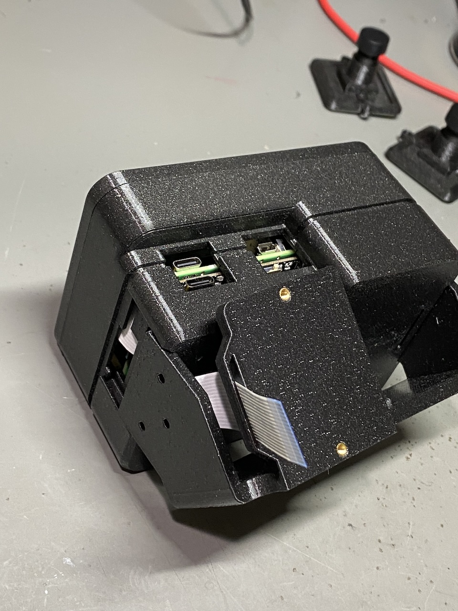
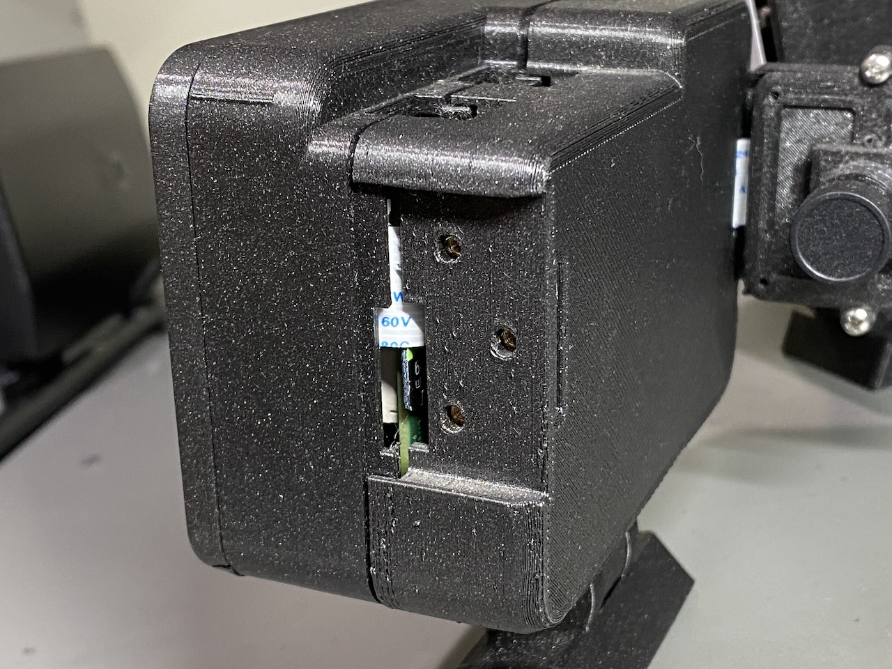
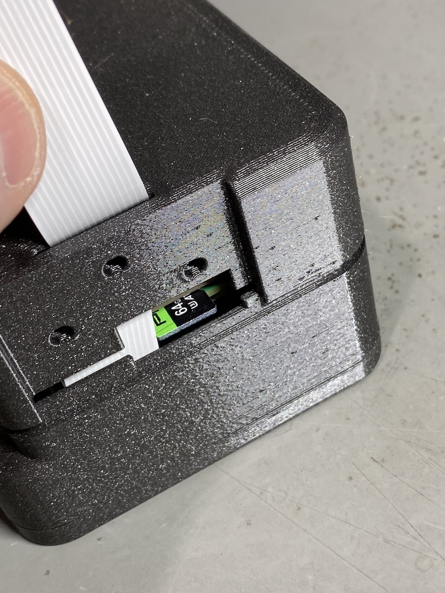

Swapping the SD Card
====================

.. note::
   This page covers rev4, v3 and v2.5 PiFinders, and the procedure differs on each.  If
   you're not sure which one you have, the :ref:`quick_start:which pifinder do i have?`
   section of the Quick Start tells them apart.  The microSD card holds everything the
   PiFinder runs: the operating system, the PiFinder software, your settings, and the
   deep-sky catalog images.  Swapping it is how you recover from a corrupt card or move
   to a fresh or larger one.

The PiFinder boots from a microSD card.  On rev4 that card sits in a slot on the
side of the case, reachable from outside.  Swapping it takes no tools, and
nothing has to come apart.  This page covers how to reach the card and swap it.
To put software on the new card first, see :doc:`Software Setup <software>`.

.. note::
   On v3 and v2.5 PiFinders the card is inside the case, in the slot between the
   Raspberry Pi and the power board.  You have to open the case to reach it.
   See :ref:`sd_card:reaching the card on v3 and v2.5 units` below.
   |v3_docs|

When you'd swap the card
------------------------

* The card is corrupt and the PiFinder won't boot reliably (see
  :doc:`troubleshooting`).
* You'd rather re-image onto a spare card and keep your original as a backup.

Image the new card before you start.  The :ref:`software:prebuilt release image`
is the quickest way, and it already includes the catalog images.

Before you start
----------------

If the PiFinder is on, shut it down cleanly.  Wait for the screen and keypad to
go dark before you touch the card.  See :ref:`user_guide:shutdown`.  Pulling a
card from a running PiFinder can corrupt it.

.. note::
   On v3 and v2.5 PiFinders, turn the power off at the slide switch once the
   screen and keypad have gone dark, before you open the case.
   |v3_docs|

Swapping the card
-----------------

Face the screen and look at the left-hand side of the case.  The card slot is a thin
opening in that side panel with the edge of the microSD card sitting in it.  You need
no tools, and nothing has to come apart.

The slot is spring-loaded, so the card comes out with a push rather than a pull:

1. Push the card in until it clicks, then let go.  The spring pushes it part-way out.
2. Slide the card clear of the slot.
3. Push the replacement in until it clicks and stays put.

The card is easy to crack once it's part-way out, so support it as you work and
don't flex it against the case.

Reaching the card on v3 and v2.5 units
--------------------------------------

On these PiFinders the card is inside the case, so you must open the case first.
It sits in a friction slot.  There is no spring, so you pull the card straight
out and push the new one straight in.

Opening a v3 case
~~~~~~~~~~~~~~~~~

You need a small Phillips screwdriver.  On every v3 PiFinder, start by removing
the three screws on the right-hand side as you face the screen.

How you reach the card from there depends on your configuration.  If you're not
sure which one you have, the :ref:`build_guide:configurations overview` has
photos of each.

Right configuration
^^^^^^^^^^^^^^^^^^^

Lift off the separate cover held on by the three screws to expose the card.

Left configuration
^^^^^^^^^^^^^^^^^^

The three screws hold the camera assembly in place.  Tilt it gently out of the
way to reach the card.  Be careful with the cable, but there should be plenty of
slack.

Flat configuration
^^^^^^^^^^^^^^^^^^

Remove the three screws that hold one side of the flat cradle.  The cradle then
flexes enough to pull the flat holder gently down and expose the card.  The image
below shows this, taken during assembly before the camera was installed.  You don't need to remove the camera to reach the card.

Opening a v2.5 case
~~~~~~~~~~~~~~~~~~~

A v2.5 PiFinder has an access door that snaps out to expose the card.  You need
no tools.  The alternative is to undo the three faceplate screws with a small
Phillips screwdriver and slide the whole shroud off.  Those are the faceplate
screws, not the side screws a v3 uses.

Removing and replacing the card
~~~~~~~~~~~~~~~~~~~~~~~~~~~~~~~

The card sits in the slot between the Raspberry Pi board and the power board.
The white camera ribbon cable runs nearby.  Move it gently aside if it's in the
way, and take care not to crease or unseat it.

Grip the card and pull it straight out, then push the replacement straight in
until it's fully seated.  The card is easy to crack once it's part-way out, so
support it as you work and don't flex it against the case.

Reassembling
~~~~~~~~~~~~

Reverse the steps you took to get in: refit the cover, holder or shroud, check
that the camera ribbon is sitting flat and isn't pinched, and replace the three
screws.  Tighten them snug, but don't force them.  An access door presses back
into place on its own.

First boot
----------

Turn the PiFinder on.  The first boot from a freshly imaged card takes longer
than usual, because it expands the filesystem to fill the card.  Give it a couple
of minutes.

.. important::
   A freshly imaged card comes set up for a rev4 PiFinder in the right-hand
   position: **Camera Type** ``v3 - imx462``, **GPS Baud Rate**
   ``115200 (UBlox-10)``, and **PiFinder Type** ``Rev4 Right``.  If that
   doesn't describe your PiFinder, correct these settings after the first
   boot.  :ref:`software:match the settings to your pifinder` covers what to
   change on each PiFinder.  Re-check your WiFi settings too.  They don't
   carry over to a freshly imaged card.
