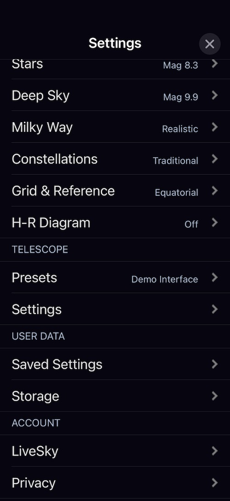
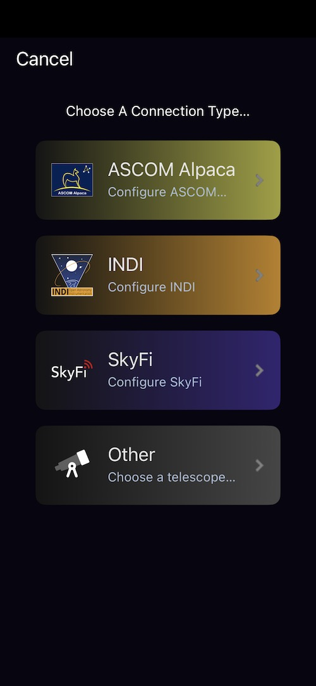
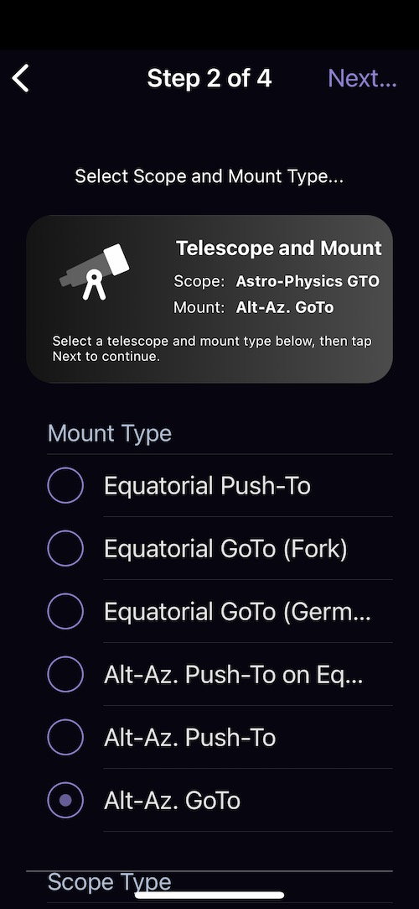
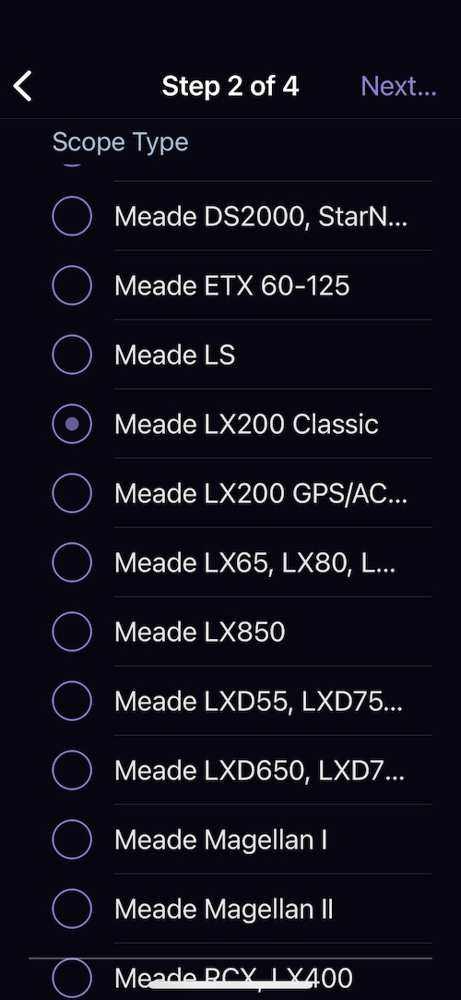
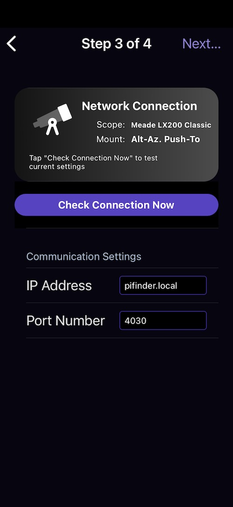
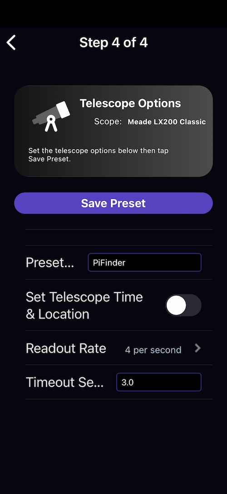

===============
SkySafari
===============

Network Setup
-------------

First, make sure your device is on the same network as the PiFinder.  See :doc:`connectivity` for changing WiFi modes and finding the PiFinder's IP address.

App Setup
---------

Connecting requires SkySafari Plus or Pro.  Start by setting up a telescope profile from the Telescope section of the settings page:

Click 'Presets', then use the + button at the bottom right to add a new profile.

Select 'Other' as the telescope type.

Choose 'Alt-Az. GoTo' as the mount type, even without a GoTo scope — GoTo lets you send objects from SkySafari to the PiFinder observing list.

Select 'Meade LX200 Classic' for the scope type and click 'Next'.

Use ``pifinder.local`` for the IP address; if that doesn't work, check the Status screen for the numeric IP.  Set the port to 4030, the SkySafari default.

Click 'Next' to continue.

The default Readout rate and Timeout are fine.  Name your profile and click 'Save Preset' to save it and make it active.

Now select the Telescope icon on the main SkySafari screen and click connect to start receiving position updates.  Until the first solve completes, the PiFinder sends a default location (0 degrees RA/DEC).

Using SkySafari
---------------

Once connected, SkySafari and the PiFinder work together in two main ways:

* **Follow your scope on the star chart.**  As you move the telescope, the PiFinder reports
  its solved position and SkySafari marks it on its chart — a large, zoomable view of where
  you are pointed.  This is especially handy near the zenith, where the PiFinder's own
  Push-To numbers become twitchy.
* **Send targets to the PiFinder.**  Pick an object in SkySafari and send it to the
  PiFinder's observing list, then use Push-To guidance to find it — a comfortable
  alternative to entering objects with the keypad.

A few things are worth knowing about the connection today:

* SkySafari does **not** command the PiFinder to slew or auto-center a GoTo mount.  The
  connection reads out position and sends targets; GoTo control is in development.
* Only **one** device can connect to the PiFinder at a time.  To connect a different phone
  or tablet, disconnect the first one.
* The PiFinder cannot talk to SkySafari and a GoTo mount at the same time — choose one.
* SkySafari 5 Plus, 6, and 7 all work; version 7 is the most reliable.

.. note::
   If the PiFinder drops into power-save mode it stops sending position updates, so
   SkySafari appears to freeze.  When you are relying on SkySafari, lengthen or turn off
   the sleep timer (see :ref:`quick_start:adjusting brightness`).

Troubleshooting
---------------

**SkySafari won't connect, or the connection keeps dropping.**
The usual cause is your phone or tablet quietly leaving the ``PiFinderAP`` network.  Because
it has no internet access, many devices switch back to cellular or a home network in the
background, breaking the link.  Re-select ``PiFinderAP`` in your WiFi settings, and turn off
any "smart network switching" or "auto-switch to mobile data" option.

**``pifinder.local`` doesn't resolve.**
Some phones and networks can't reliably look up the ``.local`` name.  Use the PiFinder's
numeric IP instead — you'll find it on the Status screen.  In Access Point mode that address
is ``10.10.10.1``.

**It connects, but the position never updates.**
Until the first plate solve completes, the PiFinder reports 0°/0°, so give it a moment with
the camera focused on the sky.  If the position was updating and then froze, the PiFinder has
most likely entered power-save mode — see the note above.

**The connection is intermittent at a star party.**
Two nearby PiFinders using the same network name (SSID) can interfere with each other.  Give
each one a distinct network name to avoid this.
