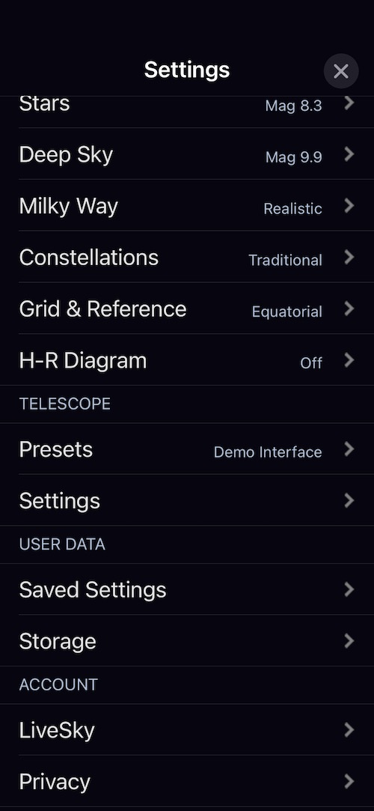
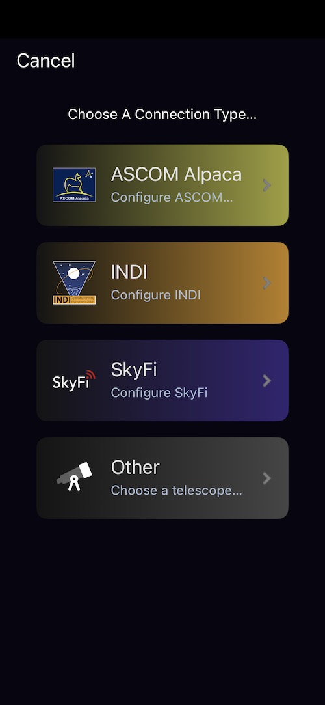
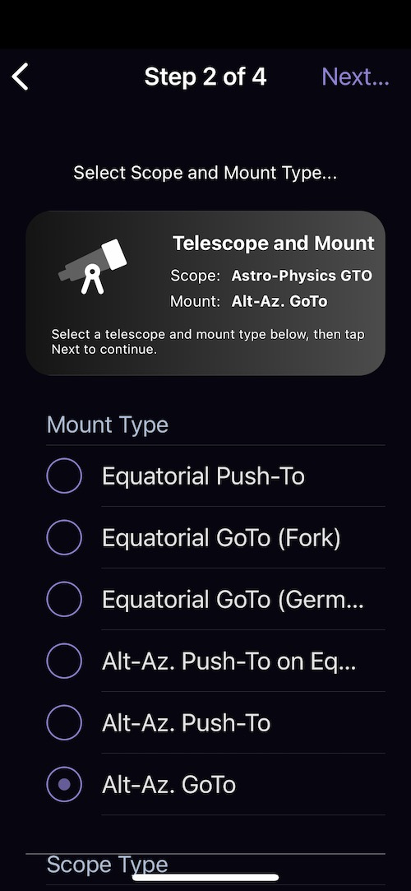
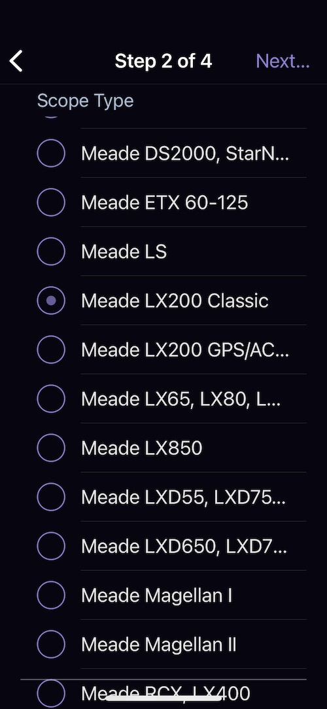
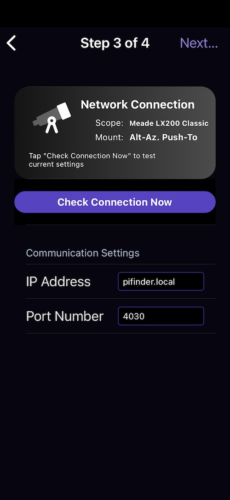
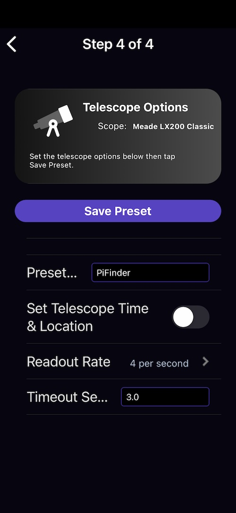

===============
SkySafari
===============

Network Setup
-------------

First, check that your phone or tablet is on the same network as the PiFinder.  See :doc:`connectivity` for changing WiFi modes and finding the PiFinder's IP address.

App Setup
---------

You need a paid version of SkySafari to connect: Plus or Pro, version 6 or later.  The free version has no telescope control.  Set up a telescope profile in the Telescope section of the settings page:

Select 'Presets', then use the + button at the bottom right to add a new profile.

Select 'Other' as the telescope type.

Select 'Alt-Az. GoTo' as the mount type, even if your telescope has no GoTo.  The GoTo setting is what lets you send objects from SkySafari to the PiFinder's observing list.

Select 'Meade LX200 Classic' for the scope type, then select 'Next'.

Use ``pifinder.local`` for the IP address.  If that does not work, check the Status screen for the numeric IP address.  Set the port to 4030, the SkySafari default.

Select 'Next' to continue.

The default Readout rate and Timeout are fine.  Name your profile, then select 'Save Preset' to save it and make it active.

Now select the Telescope icon on the main SkySafari screen and connect.  SkySafari then receives position updates from the PiFinder.  Until the first plate solve completes, the PiFinder sends a default location (0 degrees RA/DEC).

Using SkySafari
---------------

After you connect, SkySafari and the PiFinder work together in two main ways:

* **Follow your telescope on the star chart.**  As you move the telescope, the PiFinder
  reports its solved position and SkySafari marks that position on its chart.  The chart gives
  you a large, zoomable view of where the telescope points.  This is most useful near the
  zenith, where the PiFinder's own Push-To numbers become unstable.
* **Send objects to the PiFinder.**  Select an object in SkySafari and send it to the
  PiFinder's observing list, then use Push-To guidance to find it.  This is more comfortable
  than entering objects with the keypad.

A few things are worth knowing about the connection:

* SkySafari does **not** command the PiFinder to slew or auto-center a GoTo mount.  The
  connection reads out position and sends objects.  GoTo control is in development.
* Only **one** app can connect to the PiFinder at a time.  To connect from a different
  phone, tablet or computer, disconnect the first.
* The PiFinder cannot connect to SkySafari and a GoTo mount at the same time.  Use one or the
  other.

.. note::
   If the PiFinder enters power-save mode, it stops sending position updates.  SkySafari then
   appears to freeze.  When you rely on SkySafari, lengthen the sleep timer or turn it off.
   See :ref:`quick_start:adjusting brightness`.

Troubleshooting
---------------

**SkySafari won't connect, or the connection keeps dropping.**
The usual cause is your phone or tablet leaving the ``PiFinderAP`` network.  That network has
no internet access, so many phones and tablets switch back to cellular or a home network in
the background.  This breaks the link.  Select ``PiFinderAP`` again in your WiFi settings, and
turn off any "smart network switching" or "auto-switch to mobile data" option.

**``pifinder.local`` doesn't resolve.**
Some phones and networks cannot reliably look up the ``.local`` name.  Use the PiFinder's
numeric IP address instead.  The Status screen shows it.  In Access Point mode that address
is ``10.10.10.1``.

**It connects, but the position never updates.**
Until the first plate solve completes, the PiFinder reports 0°/0°, so give it a moment with
the camera focused on the sky.  If the position updated and then froze, the PiFinder is most
likely in power-save mode.  See the note above.

**The connection is intermittent at a star party.**
Two nearby PiFinders using the same network name (SSID) can interfere with each other.  Give
each one a distinct network name to avoid this.
