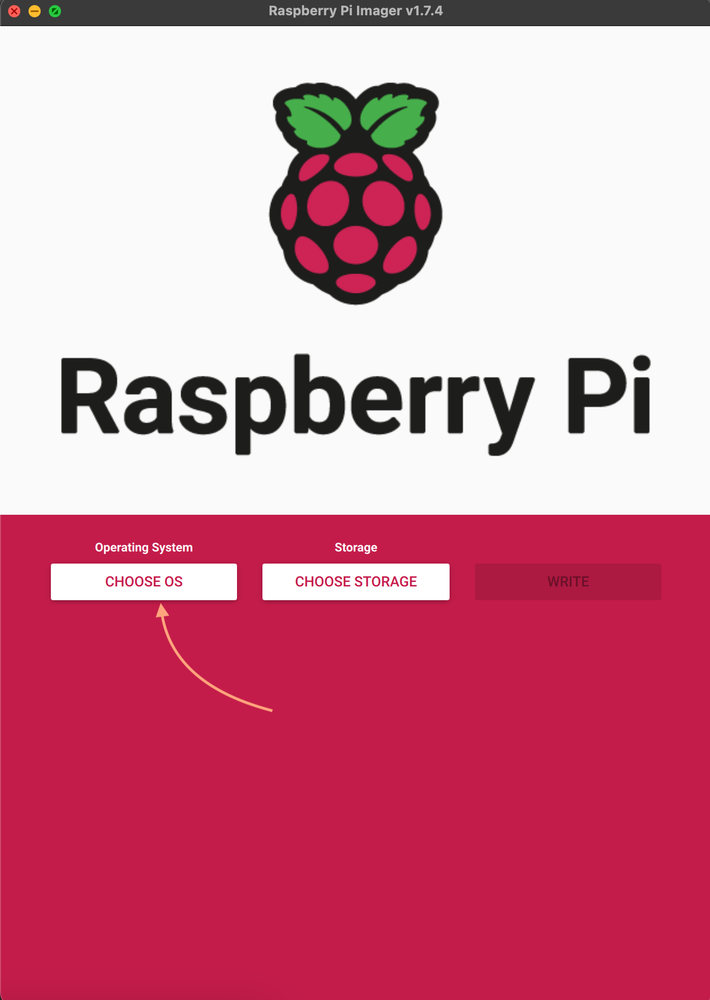
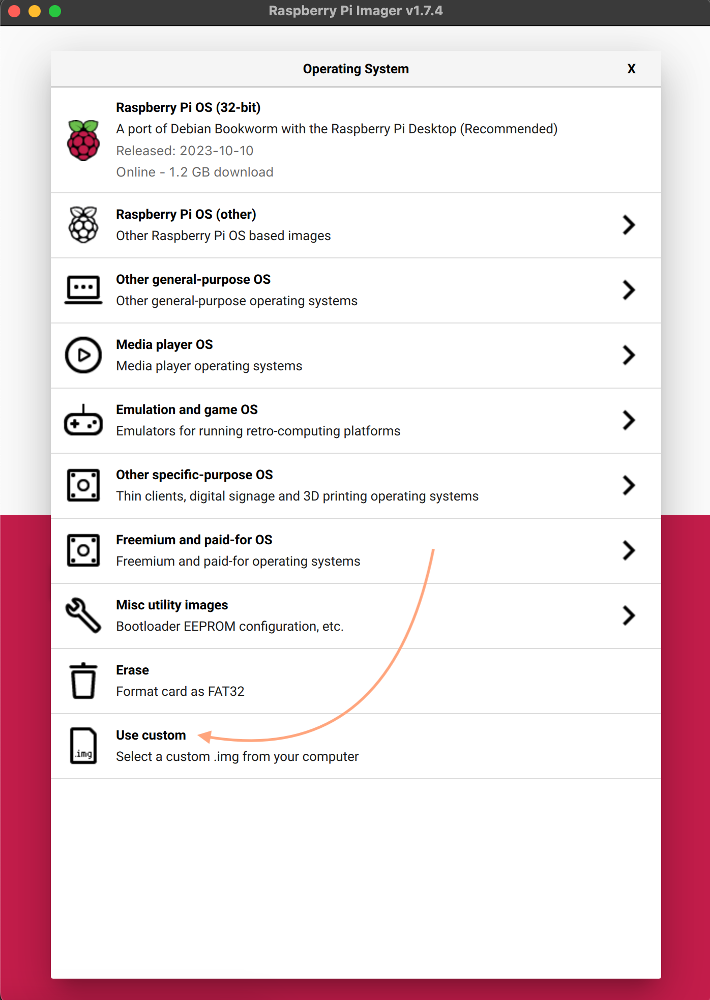
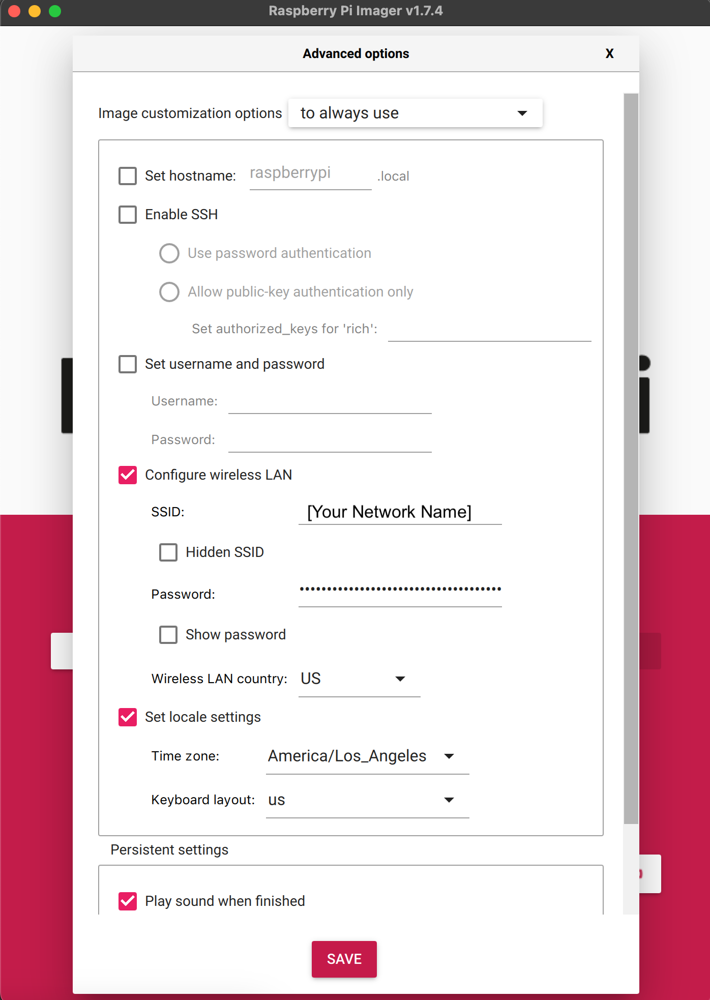

Software Setup
==============

Once you've built or otherwise obtained a PiFinder, here's how to setup a fresh SD card to run it.  The easy and recommended way is to download the current prebuilt release image file and use the Raspberry Pi imager to burn it and configure your wifi settings.  If you prefer, you can build an image from scratch following the instructions below.

Prebuilt Release Image
----------------------

The image files on our release pages contain the proper version of the Raspberry Pi OS, the installed and configured PiFinder software, and all the catalog images for deep sky objects.

* Download the latest release image from our `releases page <https://github.com/brickbots/PiFinder/releases>`_

* Install the Raspberry Pi imager: https://www.raspberrypi.com/software/

* Run the imager and click 'Choose OS' and select 'Use Custom' then select the image you downloaded

* **Do not set the hostname or username/password**  SSH is enabled on this image by default.

* If you'd like to set up your network so the PiFinder can connect to it, click the gear icon at the lower left and fill in:

  * SSID: The name of your wifi network
  * Password: The password for your wifi network
  * Wireless LAN Country: Where you live to configure wifi in accordance with local laws

* You can also setup your locale and keyboard settings if you like, but these are not used by the PiFinder software and only affect the language of the underlying operating system.

.. image:: images/software/rpi_imager_003.png
   :target: images/software/rpi_imager_003.png
   :width: 47%

* Click the 'Select Storage' button and choose the SD card on your computer
* Then click the 'Write' button to start.

Once the image writing is complete, you can insert the SD card into your PiFinder and power it up.  The first boot will take a bit longer as it will expand the filesystem to fill the entire SD card, so be patient.

Build From Scratch
------------------

You can do this completely headless (no monitor / keyboard) if desired.

General Pi Setup
^^^^^^^^^^^^^^^^^^^^^^^^

* Create Image:  I'd strongly recommend using the Rapsberry Pi imager.  It's available for most platforms and lets you easily setup wifi and SSH for your new image.

  * Select the 64-Bit version of Pi OS (**Legacy**) Lite (No Desktop Environment)

    * **Make sure you select the Legacy Bullseye option here**

  * Setup SSH / Wifi / User and Host name using the gear icon.  Below is a screengrab showing the suggested settings.

    * **The username must be** ``pifinder``
    * The host name, password, network settings and locale should be customized for your needs.

.. image:: ../../images/raspi_imager_settings.png
   :target: ../images/raspi_imager_settings.png
   :alt: Raspberry Pi Imager settings

* Once the image is burned to an SD card, insert it into the PiFinder and power it up.   It will probably take a few minutes to boot the first time.
* SSH into the Pifinder using ``pifinder@pifinder.local`` and the password you  setup.
* Update all packages.  This is not strictly required, but is a good practice.

  * ``sudo apt update``
  * ``sudo apt upgrade``

    * Enable SPI / I2C.  The screen and IMU use these to communicate.  
    * run ``sudo raspi-config``
    * Select 3 - Interface Options
    * Then I4 - SPI  and choose Enable
    * Then I5 - I2C  and choose Enable

PiFinder Software Install
^^^^^^^^^^^^^^^^^^^^^^^^^^

Great!  You have a nice fresh install of Raspberry Pi OS ready to go.  The rest of the setup is completed by running the ``pifinder_setup.sh`` script in this repo.  Here's the command to download and run the script in one step:

 ``wget -O - https://raw.githubusercontent.com/brickbots/PiFinder/release/pifinder_setup.sh | bash``

The script will do the following:

* Clone this repo
* Install the needed packages/dependencies
* Download some required astronomy data files
* Setup Wifi access point capabilities
* Create a samba share for pulling images, and observations logs and adding observing lists
* Finally, setup the PiFinder service to start on reboot.

Once the script is done, reboot the PiFinder:
``sudo shutdown -r now``

It will take up to two minutes to boot, but you should see the startup screen before too long:

.. image:: ../../images/screenshots/WELCOME_001_docs.png
   :target: ../images/screenshots/WELCOME_001_docs.png
   :alt: Startup log

Catalog Images
^^^^^^^^^^^^^^^^^^^^^^^^

You may now want to install all the catalog images.  These allow you to view an image of every object in the catalog system.  For more details please see the :ref:
`Catalog Image Download <user_guide:catalog-image-download>`_ instructions.
