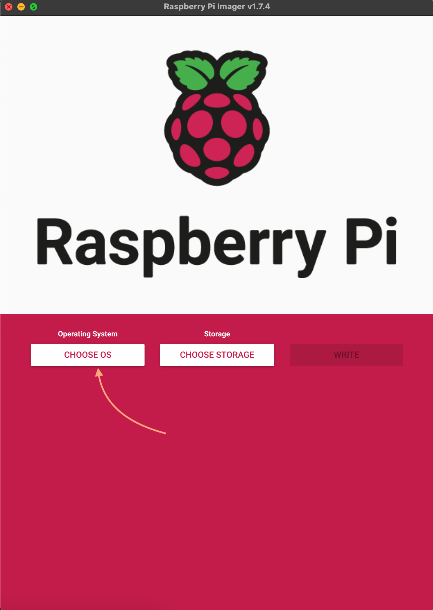
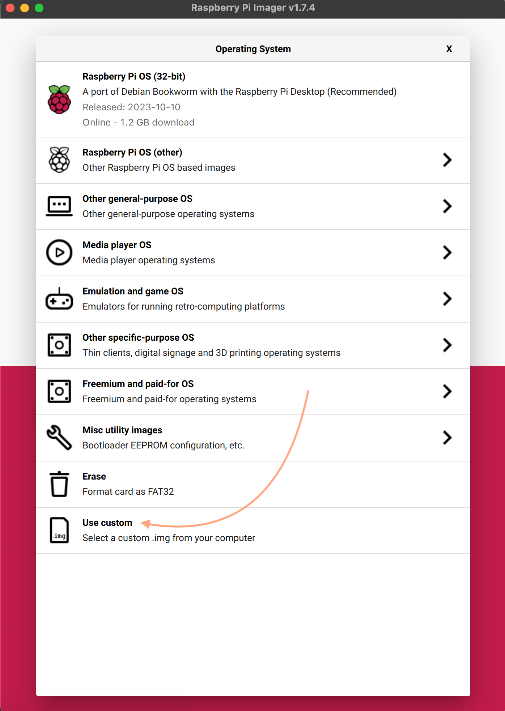
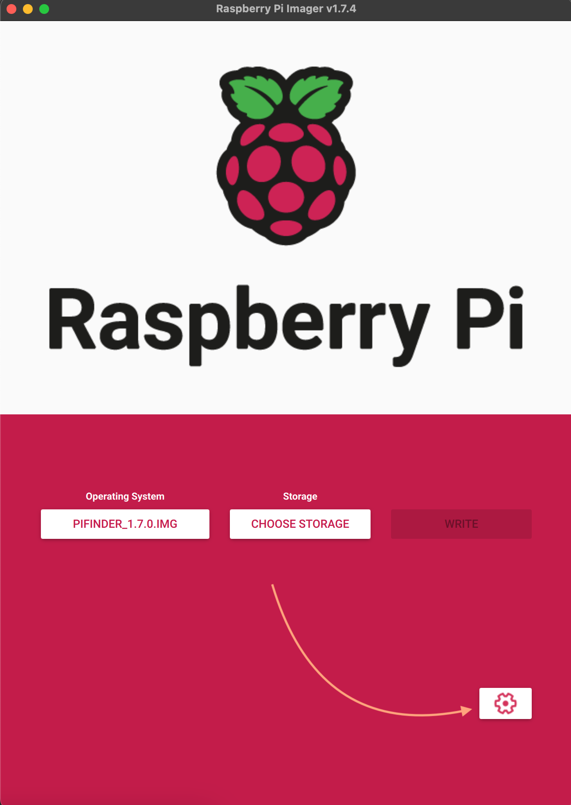
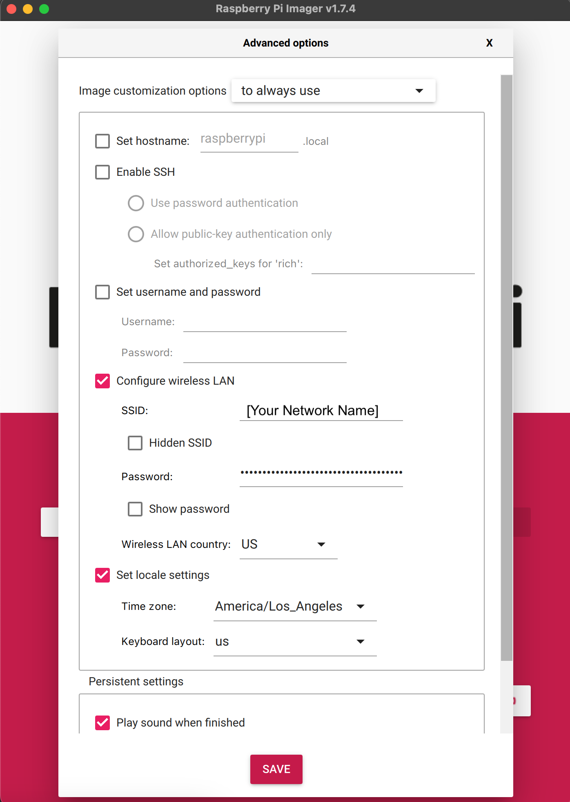
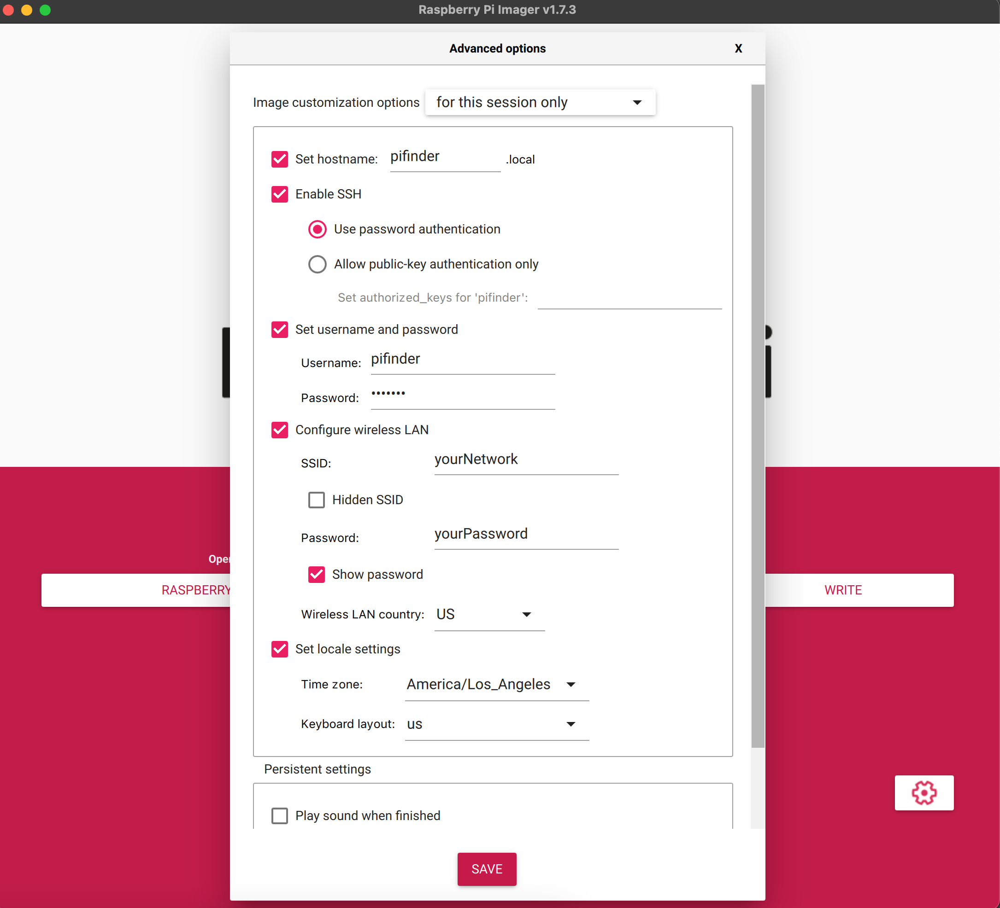
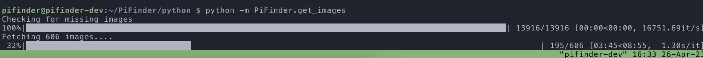

Software Setup
==============

Once you've built or otherwise obtained a PiFinder, here's how to set up a fresh SD card to run it.  The recommended way is to download the current prebuilt release image and use the Raspberry Pi imager to burn it and configure your wifi.  If you prefer, you can build an image from scratch following the instructions below.

Prebuilt Release Image
----------------------

The image files on our release pages bundle the correct Raspberry Pi OS version, the installed and configured PiFinder software, and all the deep sky catalog images.  This is the recommended way to get PiFinder onto an SD card, however you built or purchased the unit.

* Download the latest release image from our `releases page <https://github.com/brickbots/PiFinder/releases>`_

* Install the Raspberry Pi imager: https://www.raspberrypi.com/software/

* Run the imager, click 'Choose OS', select 'Use Custom', then choose the image you downloaded

* To let the PiFinder connect to your network, click the gear icon at the lower left and fill in:

  * SSID: The name of your wifi network
  * Password: The password for your wifi network
  * Wireless LAN Country: Where you live, so wifi follows local regulations

* You can also set your locale and keyboard, but the PiFinder software ignores these; they only affect the underlying operating system.

.. important::
   Do not set the hostname or username/password.  SSH is enabled on this image by default.

* Click 'Select Storage' and choose the SD card on your computer
* Click 'Write' to start

.. note::
   If the imager reports that the image is **"not a multiple of 512 bytes"** (or otherwise
   refuses to write it), the download was incomplete or corrupted.  Download the release
   image again and retry.

Once writing is complete, insert the SD card into your PiFinder and power it up.  The first boot takes a bit longer as it expands the filesystem to fill the card, so be patient.

With the software installed, you're ready for the :doc:`Quick Start Guide<quick_start>` and a night of observing.

Build From Scratch
------------------

.. warning::

   You probably do not want to do this.  These instructions are primarily for developers
   who are making a new image file from scratch.  To just use your PiFinder you will
   want to use the instructions above to download and use a pre-built image for your
   sd card.

You can do this completely headless (no monitor or keyboard) if you like.

General Pi Setup
^^^^^^^^^^^^^^^^^^^^^^^^

.. important::

   You must use the specific Raspberry Pi OS version listed here or the PiFinder software will not work.  The software is designed and tested for a specific version with each release.

* Create the image using the Raspberry Pi imager.  It's available for most platforms and makes it easy to set up wifi and SSH.

  * Select the 64-Bit version of Pi OS (**Legacy**) Lite (No Desktop Environment)

    * **Make sure you select the Legacy Bullseye option here**

  * Set up SSH / Wifi / User and Host name using the gear icon.  Below is a screengrab showing the suggested settings.

    * **The username must be** ``pifinder``
    * Customize the host name, password, network settings, and locale for your needs.

* Once the image is burned to an SD card, insert it into the PiFinder and power it up.  The first boot will probably take a few minutes.
* SSH into the PiFinder using ``pifinder@pifinder.local`` and the password you set up.
* Update all packages.  This isn't strictly required, but it's good practice.

  * ``sudo apt update``
  * ``sudo apt upgrade``

    * Enable SPI / I2C, which the screen and IMU use to communicate.
    * run ``sudo raspi-config``
    * Select 3 - Interface Options
    * Then I4 - SPI  and choose Enable
    * Then I5 - I2C  and choose Enable

PiFinder Software Install
^^^^^^^^^^^^^^^^^^^^^^^^^^

You now have a fresh install of Raspberry Pi OS.  The rest of the setup is handled by the ``pifinder_setup.sh`` script in this repo.  Download and run it in one step:

 ``wget -O - https://raw.githubusercontent.com/brickbots/PiFinder/release/pifinder_setup.sh | bash``

The script will:

* Clone this repo
* Install the needed packages/dependencies
* Download some required astronomy data files
* Set up Wifi access point capabilities
* Create a samba share for pulling images and observation logs and adding observing lists
* Set up the PiFinder service to start on reboot

Once the script finishes, reboot the PiFinder:
``sudo shutdown -r now``

Booting takes up to two minutes, but you should see the startup screen before long:

Catalog Image Download
^^^^^^^^^^^^^^^^^^^^^^

The PiFinder can show a survey image behind each object in Object Details when the images are present on your SD card.  They take a few GB of space and the full set can take a while to fetch, but you can cancel and pick up where you left off at any time.

The :ref:`software:prebuilt release image` already bundles every image, so flashing it is by far the fastest way to get them — one download on your main computer instead of thousands of small ones on the device.

To fetch them on the device, first put the PiFinder in WiFi Client mode so it can reach the internet (see :doc:`connectivity`).  Then open Tools, select Download Images, and choose what to fetch:

* **All Objects** — every catalog image.
* **Current Filter** — only the objects your active filter currently shows.
* **Observing List** — the objects on your loaded observing list.

The PiFinder counts how many images are missing, estimates the download size, and checks that it can reach the image server, then offers Download or Cancel.  (If WiFi isn't in Client mode the screen reads "WiFi must be client mode" — switch modes and come back.)

While a download runs, a status line just under the title bar shows its progress on every screen, so you can keep observing while it works.  Pressing **LEFT** to go back leaves the download running in the background; the Cancel action on the Download Images screen stops it.  Either way, images already downloaded are kept.

Downloading is idempotent: re-running a scope skips images you already have, so there's nothing special to resume — just trigger the same scope again.

.. note::
   There's also a headless fallback for advanced users.  With the PiFinder in
   Client mode, SSH in and run ``python -m PiFinder.get_images`` from
   ``PiFinder/python`` to fetch every image, or add ``--catalog NGC`` to fetch a
   single catalog.
