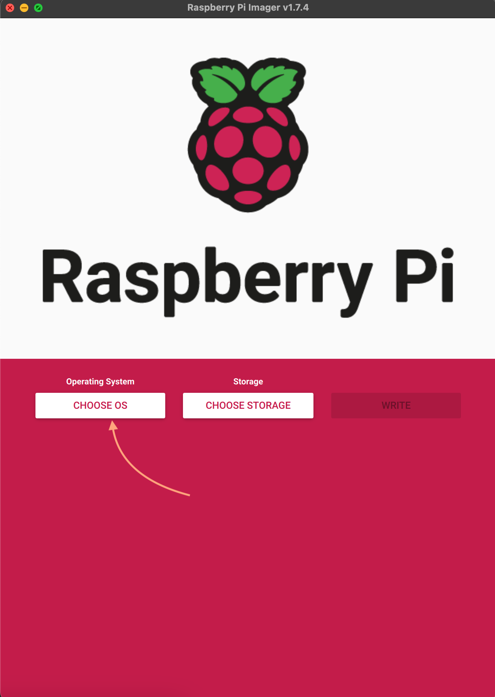
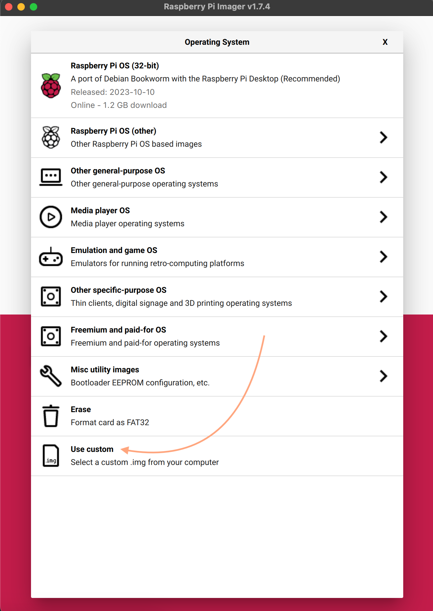
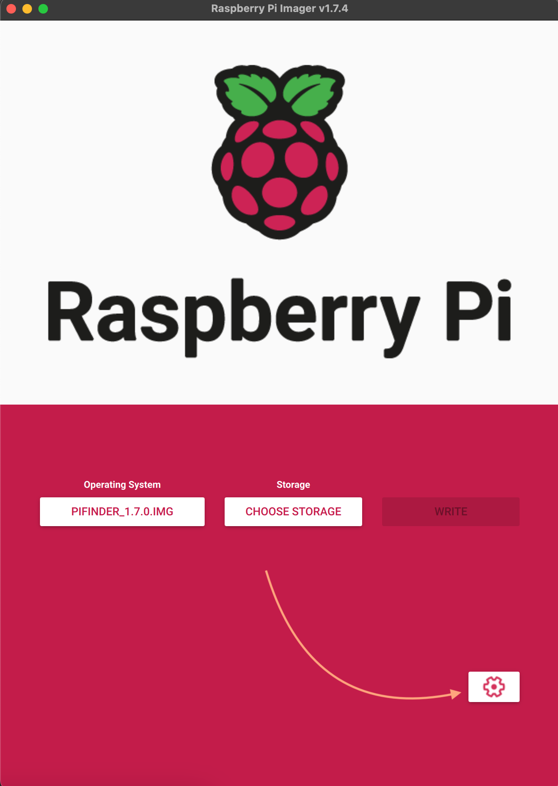
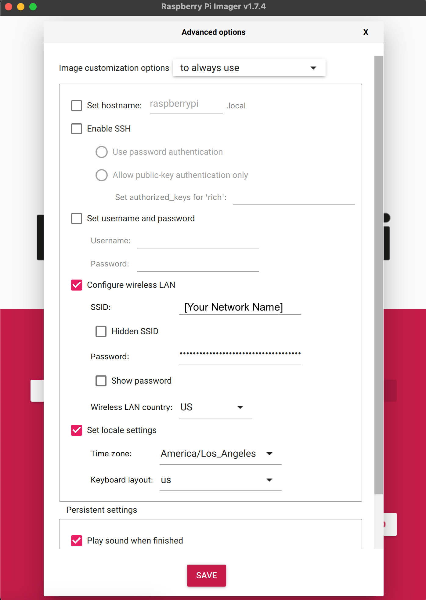
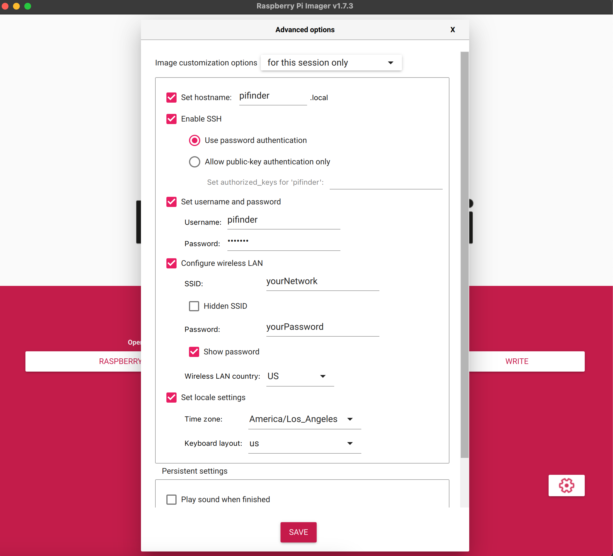
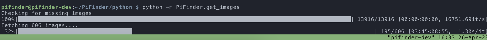

Software Setup
==============

Once you've built or otherwise obtained a PiFinder, set up a fresh SD card to run it.  The recommended way is to download the current prebuilt release image, then use the Raspberry Pi imager to write it to the card and set up your WiFi.  If you prefer, build an image from scratch by following the instructions below.

Prebuilt Release Image
----------------------

The image files on our release pages bundle the correct Raspberry Pi OS version, the installed and configured PiFinder software, and all the deep-sky catalog images.  This is the recommended way to put the PiFinder software on an SD card, whether you built or bought your PiFinder.

* Download the latest release image from our `releases page <https://github.com/brickbots/PiFinder/releases>`_

* Install the Raspberry Pi imager: https://www.raspberrypi.com/software/

* Run the imager, click 'Choose OS', select 'Use Custom', then select the image you downloaded

* To let the PiFinder connect to your network, click the gear icon at the lower left and fill in:

  * SSID: The name of your WiFi network
  * Password: The password for your WiFi network
  * Wireless LAN Country: Where you live, so WiFi follows local regulations

* You can also set your locale and keyboard.  These affect only the underlying operating system, and the PiFinder software ignores them.

.. important::
   Do not set the hostname or username/password.  This image enables SSH by default.

* Click 'Select Storage' and select the SD card on your computer
* Click 'Write' to start

.. note::
   If the imager reports that the image is **"not a multiple of 512 bytes"** (or otherwise
   refuses to write it), the download was incomplete or corrupted.  Download the release
   image again and retry.

Once the imager finishes writing, insert the SD card into your PiFinder and turn it on.  The first boot takes longer than usual, because the PiFinder expands the filesystem to fill the card.  Be patient.

The software is now installed.  Continue to the :doc:`Quick Start Guide<quick_start>` for a night of observing.

Build From Scratch
------------------

.. warning::

   You probably do not want to do this.  These instructions are for developers who build
   a new image file from scratch.  To just use your PiFinder, follow the instructions
   above to download a prebuilt image and write it to your SD card.

You can do all of this headless (no monitor or keyboard).

General Pi Setup
^^^^^^^^^^^^^^^^^^^^^^^^

.. important::

   You must use the specific Raspberry Pi OS version listed here, or the PiFinder software will not work.  We design and test the software for one specific version with each release.

* Create the image with the Raspberry Pi imager.  It's available for most platforms and makes it easy to set up WiFi and SSH.

  * Select the 64-Bit version of Pi OS (**Legacy**) Lite (No Desktop Environment)

    * **Select the Legacy Bullseye option here**

  * Set up SSH, WiFi, and the user and host name with the gear icon.  The screenshot below shows the suggested settings.

    * **The username must be** ``pifinder``
    * Customize the host name, password, network settings, and locale for your needs.

* Once you've written the image to an SD card, insert it into the PiFinder and turn it on.  The first boot takes a few minutes.
* SSH into the PiFinder using ``pifinder@pifinder.local`` and the password you set up.
* Update all packages.  This isn't strictly required, but it's good practice.

  * ``sudo apt update``
  * ``sudo apt upgrade``

* Enable SPI / I2C, which the screen and IMU use to communicate.

  * Run ``sudo raspi-config``
  * Select 3 - Interface Options
  * Select I4 - SPI, then select Enable
  * Select I5 - I2C, then select Enable

PiFinder Software Install
^^^^^^^^^^^^^^^^^^^^^^^^^^

You now have a fresh install of Raspberry Pi OS.  The ``pifinder_setup.sh`` script in this repo handles the rest of the setup.  Download and run it in one step:

 ``wget -O - https://raw.githubusercontent.com/brickbots/PiFinder/release/pifinder_setup.sh | bash``

The script will:

* Clone this repo
* Install the needed packages/dependencies
* Download some required astronomy data files
* Set up WiFi access point capabilities
* Create a samba share for pulling images and observation logs and adding observing lists
* Set up the PiFinder service to start on boot

Once the script finishes, restart the PiFinder:
``sudo shutdown -r now``

Booting takes up to two minutes, but the startup screen appears before long:

Catalog Image Download
^^^^^^^^^^^^^^^^^^^^^^

The PiFinder can display catalog object images when they're on your SD card.  These images use about 5gb of space and can take several hours or more to download.  You can cancel and resume at any time.

The :ref:`software:prebuilt release image` already includes these images.  It's much quicker to download as a single file from your main computer.

To download the catalog images, put your PiFinder in WiFi client mode so it can reach the internet, then SSH into it using the password you set up initially.

Once connected, type:

.. code-block::

   cd PiFinder/python
   python -m PiFinder.get_images

The PiFinder checks which images are missing and starts downloading.  You can monitor progress on the status bar.

There are 13,000+ images, so the download takes a while.  You can do it across multiple sessions.  The PiFinder uses whichever images you have each time you observe.
