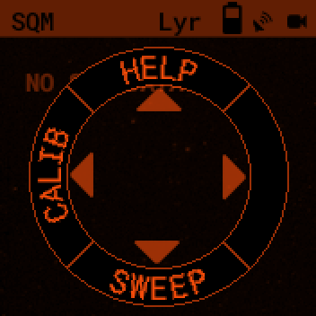
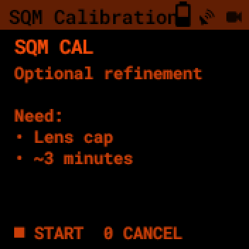
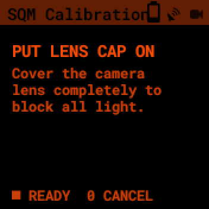

Sky Quality Meter
=================

The PiFinder measures how dark your sky is.  It reports the result as a **Sky
Quality Meter (SQM)** reading in magnitudes per square arcsecond.  Higher
numbers mean darker skies.  A reading around 21.5 is a rural sky.  A reading
around 18 is the edge of a city.

The measurement comes from the PiFinder's own camera.  There is no separate
meter to buy and nothing to plug in.  Turn the PiFinder on, point it at the
sky, and the reading appears.

The PiFinder also uses the reading itself.  It feeds the
:ref:`contrast reserve <user_guide:contrast reserve>` on the Object Details
screen.  That is why the same object reads as easier to see from a dark site
than from town.

.. note::
   This page describes the Sky Quality Meter in software 2.6.1 and above.
   Earlier versions worked out the sky brightness from the stars in a
   plate-solved frame, so the reading depended on a recent solve.  From 2.6.1
   the PiFinder measures the sky background directly.

Reading the SQM screen
----------------------

From the main menu, select SQM.  The screen shows the current reading in large
digits over a dimmed view of what the camera sees.

The large number is the sky brightness in magnitudes per square arcsecond.
Under it the PiFinder shows the **Bortle class**, a nine-point scale that
describes the same sky in words.  The top row carries the supporting detail:

Age
   How long ago the PiFinder took the reading, such as ``12s ago``.  A fresh
   reading updates about once a second.

Stars
   The number of catalog stars matched in the last solve, marked with a star
   symbol.  This tells you how the solve is doing.  The sky reading itself does
   not depend on it.

Exposure
   The camera exposure time for the current frame.

Below the units line you may also see a value marked ``alt:``.  This is the
reading adjusted to what the sky would read straight overhead.  Use it to
compare readings taken at different parts of the sky.  The PiFinder shows it
only when it knows where the telescope points.

Press **SQUARE** to open the Bortle description.  It explains in plain language
what you can expect to see under a sky of that class, such as whether the Milky
Way shows structure or the zodiacal light is visible.  Scroll through it with
the **+** and **-** keys.  Press **SQUARE** again to go back.

.. note::
   The PiFinder switches the camera to longer, steadier exposures while the SQM
   screen is open, and switches back when you leave.  Expect the exposure figure
   to change as you arrive.

The reading does not need a plate solve
---------------------------------------

The PiFinder measures the brightness of the empty sky between the stars.  It
does not need to identify any stars to do this, so it does not need a plate
solve.

This matters on a difficult night.  The reading keeps updating through thin
cloud, through frames with too few stars to solve, and while the telescope
moves.  A failed solve does not stop the sky reading.

.. note::
   The reading describes the sky where the camera actually points, not the sky
   overhead.  Pointing low puts more atmosphere and usually more light pollution
   in the field, so the reading drops.  This is honest rather than a fault.  Use
   the ``alt:`` value when you want a figure you can compare across the sky.

What the number means
---------------------

These are the bands the PiFinder uses to select the Bortle class it shows:

.. list-table::
   :header-rows: 1

   * - Reading
     - Bortle
     - Sky
   * - 21.76 and above
     - 1
     - Excellent Dark-Sky Site
   * - 21.60 to 21.76
     - 2
     - Typical Truly Dark Site
   * - 21.30 to 21.60
     - 3
     - Rural Sky
   * - 20.80 to 21.30
     - 4
     - Brighter Rural
   * - 20.30 to 20.80
     - 4.5
     - Semi-Suburban/Transition Sky
   * - 19.25 to 20.30
     - 5
     - Suburban Sky
   * - 18.50 to 19.25
     - 6
     - Bright Suburban Sky
   * - 18.00 to 18.50
     - 7
     - Suburban/Urban Transition
   * - 17.00 to 18.00
     - 8
     - City Sky
   * - Below 17.00
     - 9
     - Inner-City Sky

Treat the figure as a good guide rather than a laboratory measurement.  The
PiFinder is calibrated against a hand-held SQM-L meter, but it does not see the
sky in exactly the same colours or over exactly the same patch of sky.  Expect
close agreement, not an identical number.

Moonlight, twilight, and cloud all change the sky brightness.  They change what
the PiFinder reports because they change the sky itself.

Calibration
-----------

When you need it
~~~~~~~~~~~~~~~~

Normally, never.

The PiFinder recognises its own camera and loads calibration settings for that
sensor when it starts.  Those settings are measured at the factory against a
reference meter.  The accuracy quoted for the PiFinder is measured this way,
with no calibration of your own.

The SQM screen shows a small ``!CAL`` marker when you have not run the
calibration wizard on your PiFinder.  This is the normal state and it does not mean
anything is wrong.  Once you run the wizard the marker changes to ``CAL``.

Run the wizard only if you have a reason:

* You compare the PiFinder against a hand-held meter and see a consistent
  offset that does not go away.
* You observe at a genuinely dark site and take long exposures, where the
  camera's own dark current becomes a measurable part of what it reads.
* You are helping to diagnose a problem with a reading.

How to run it
~~~~~~~~~~~~~

You need a lens cap for the PiFinder's camera and about three minutes.  Run it
in the dark, at the temperature you observe at, because the camera behaves
differently when warm.

1. From the main menu, select SQM.
2. Press and hold **SQUARE** to open the Quick Menu.
3. Press **LEFT** to select CALIB.

The wizard opens on a summary of what it needs.  Press **SQUARE** to start, or
press **0** to cancel.

The wizard then walks you through the steps.  Follow the screen:

1. Put the lens cap on when asked.  Cover the camera completely so no light
   reaches it.
2. Wait while the PiFinder captures its dark frames.  It measures the camera's
   own electrical signal with no light falling on it.
3. Take the lens cap off when asked.
4. Let the PiFinder capture a few frames of real sky.  It compares its own
   measurement against those frames.
5. Read the results, then save them.

The PiFinder saves the result to its data folder and starts using it right
away.  You do not need to restart.

The wizard produces no flat frames and no master darks.  Nothing you capture
during it is stored as an image.

What it changes
~~~~~~~~~~~~~~~

The wizard measures three things about your camera, and they carry different
weight:

Dark current
   The signal the camera builds up over an exposure with no light on it.  This
   is the measurement worth having.  The PiFinder ships with estimates for each
   sensor that it does not apply, because an estimate that is wrong is worse
   than none.  Once the wizard measures your camera, the PiFinder subtracts the
   real figure.

Black level
   The camera's baseline signal.  The PiFinder already tracks this while you
   observe, by watching how the background changes with exposure time.  That
   live measurement is more accurate than a stored one, because the real black
   level drifts as the sensor warms and cools.  The live figure takes over as
   soon as it settles, so the wizard's version mainly covers the first few
   minutes of a session.

Read noise
   Recorded for diagnosis only.  It never changes your reading.

Expect a modest improvement, not a transformation.  Calibration matters most at
a dark site with long exposures, where the camera's own dark current is a real
part of the small signal it measures.  Under a bright suburban sky the sky
itself dominates, and calibration makes little visible difference.

.. note::
   Calibration corrects your camera, not your sky.  It does not remove the
   effect of moonlight, cloud, or light pollution.  Those are real properties of
   the sky and the PiFinder reports them on purpose.

Exposure sweep
--------------

The Quick Menu also offers SWEEP.  This is a data-collection tool rather than
an everyday feature.  It captures a series of frames across a range of exposure
times and records them with full metadata.

If you own a hand-held meter, the sweep asks for its reading first and stores
that alongside the captured frames.  The result is the raw material the project
uses to check and improve the factory calibration for each camera.

Run a sweep when you report a problem with a reading, or when you want to
contribute calibration data.  You do not need it for ordinary observing.
