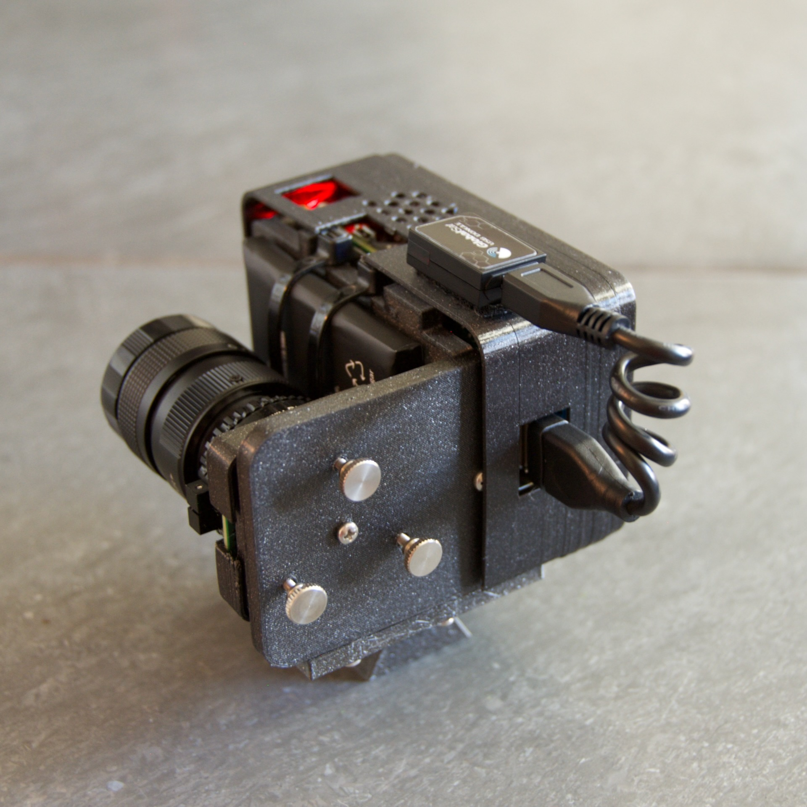

====================
PiFinder User Manual
====================

Introduction and Overview
=========================

Thanks for your interest in the PiFinder!  This guide describes how to use a PiFinder but if you want information on building one, please see the `Build Guide <./build_guide.md>`_ and the `Bill of Materials <BOM.md>`_.

The PiFinder is a self-contained telescope positioning device.  It will let you know where your telescope is pointed, provide the ability to choose a particular target (like a Galaxy or other DSO) and direct you on how to move your telescope to find that object.  There are some other nice features along with these core functions, but the PiFinder is designed primarily as a way to get interesting objects into your eyepiece so you can take a look at them.

The primary way PiFinder determines where your telescope is pointing is by taking photos of the sky and using stars contained therein to determine where it's pointing.  Having the camera of the PiFinder 

This user manual is divided into several sections which you can access using the links at the top of any section.  

Keypad and Screen
-----------------

The main way you'll interact with the PiFinder is through the Keypad and Screen located on the front.  Ideally this will be mounted near your eyepiece for easy access. 

.. image:: ../../images/ui_reference.png
   :target: ../../images/ui_reference.png
   :alt: Hardware UI Overview

Along with the 1.5" oled screen, the keypad has three primary parts, a numeric keypad (\ *0-9*\ ), four functions keys (\ *A, B, C, D*\ ), and three control keys (\ *UP, DN, ENT*\ ).  The screen will display different content depending on the mode you are in, but there will always be a Status Bar along the top which displays which mode the UI is in, the current constellation being pointed at (if a solve has been completed), GPS and Solver Status.

* If the GPS has locked and provided a location, the GPS square in the status bar will be filled in and the G will be in black.  
* The solver status will show either C (Camera) or I (IMU) depending on the source of the last position fix.  The background of this square fades from red to black, over six seconds, indicating the time since last solve.  

Brightness Adjustment
-------------------------

At any time you can hold down the *ENT* key and press the *UP*\ /\ *DN* keys to adjust the screen and backlight brightness together.  If you want to change the keypad brightness relative to the screen, you can set this in the Options page of the Status screen with the rest of the global options.  The setting there allows you to make the keypad brighter or dimmer relative to the screen or turn it off all together.  Once you have the two balanced to your liking, the *ENT + UP/DN* should be all you need during and observing session to fine-tune the overall PiFinder brightness.

Power Save Mode
-------------------------

The PiFinder will dim the screen and reduce the frequency of exposures, solving, and other processes when it's been idle for a period of time.  This helps save battery power and can also prevent glare at the eyepiece in especially dark environments.  The default is 30 seconds and this can be configured, or turned off completely, in the `Options <user_guide_ui.md#options>`_ page of the `Status <user_guide_ui.md#status>`_ screen.

Pressing any button, or moving the PFinder will wake it from power save mode.

User Interface
=====================================

UI Screens
----------

The user interface for the PiFinder is split into various screens that you can switch between to perform different tasks.  The A key is used to cycle between the three main screens:

* Camera
* Chart
* Catalog
* Locate

By holding down the Enter key and pressing the A function key you can get to the less commonly used screens:

* Console
* Status

Some actions in one screen will move you to another, for instance selecting an object from the Catalog will switch automatically to the Locate screen.  

The remaining function keys serve different purposes depending on which screen you are on at the time you press them, but there are some key-combinations that act across any of the individual screens:

* Long press *A*\ :  For screens with options, such a the Catalog screeen, holding down the *A* function key will bring up the options for that screen.  See `Options <#options>`_ below.
* *ENT + UP/DN*\ : This combination will adjust the screen brightness up and down at any time.

Options
^^^^^^^

Many screens have options which change the way they behave or perform other less commonly used actions.  Pressing and holding the *A* button will bring up the options for whichever screen you are currently using.  To exit the option screen press *A* to return to the previous screen.

.. image:: ../../images/screenshots/CATALOG_OPTIONS_001_docs.png
   :target: ../../images/screenshots/CATALOG_OPTIONS_001_docs.png
   :alt: Options screen for Catalog

The options screen will show one option or action item per line with the name or description of the item to the left and the current value to the right.  The bright numbers along the left edge indicate the key on the keypad to press to access that item.

.. image:: ../../images/screenshots/CATALOG_OPTIONS_002_docs.png
   :target: ../../images/screenshots/CATALOG_OPTIONS_002_docs.png
   :alt: Options screen for Catalog, magnitude exposed

Once an item is selected the item will be highlighted and the available values or types of actions will be listed along the right hand side.   The bright numbers along the right hand side will let you select the value(s) for this item.

Some types of options can only have a single value, like Magnitude above.  Others, such as Obj Types will allow you to select multiple values.  If an option only has a single value, selecting it will return you to the main options page.  For options that can have multiple values, you'll need to use the *ENT* key to confirm your selections and return to the main option page.

The Options screen can also contain less commonly used actions which will take place when a value is selected.  

.. image:: ../../images/screenshots/STATUS_OPTIONS_001_docs.png
   :target: ../../images/screenshots/STATUS_OPTIONS_001_docs.png
   :alt: Options screen for Status

The Options screen shown above (for the Status screen) has general PiFinder options along with a couple actions.  Selecting an action item, such as *1*\ , will always have one additional step to confirm the action, or allow you exit.

.. image:: ../../images/screenshots/STATUS_OPTIONS_002_docs.png
   :target: ../../images/screenshots/STATUS_OPTIONS_002_docs.png
   :alt: Options screen for Status

To exit the option screen press *A* to return to the previous screen.

Camera
^^^^^^^

.. image:: ../../images/screenshots/PREVIEW_001_docs.png
   :target: ../../images/screenshots/PREVIEW_001_docs.png
   :alt: Camera screen

The Camera screen displays most recently taken exposure from the camera.  You can adjust the processing of this image (just for display purposes), adjust exposure and zoom in to focus.

* *B* key - Adjust reticle brightness or turn it off completely
* *C* key - Turn background subtraction on/off
* *D* key - Adjust gamma correction intensity

In the options menu (long-press *A*\ ) you can adjust these same display parameters and also enter Focus Help mode.  In this mode the camera image is enlarged to help achieve good focus on a star.  Since this only shows the center of frame, get a star lined up in the reticle before activating Focus Help.

You can adjust overall exposure using the *UP/DN* keys (check the `Console <#console>`_ for specific setting).  If you'd like to save this exposure as the default for future sessions, use the *ENT* key.

Chart
^^^^^

.. image:: ../../images/screenshots/CHART_001_docs.png
   :target: ../../images/screenshots/CHART_001_docs.png
   :alt: Chart interface

The chart screen will display a star chart centered around the current RA / Dec coordinates the PiFinder has determined.  By default it shows stars down to magnitude 7 and has a 10 degree field of view.  As you move your telescope the chart will be updated several times a second using either a plate solve for a captured image or an approximation based on the last plate solve and the Inertial Measurement Unit (IMU).

There is a Telrad style reticle that can be used to help orient the chart.  The outer ring is four degrees in diameter, the inner two degrees and the middle 1/2 degree.

If you have a target selected, an arrow around the outer rim of the reticle will point in the direction that target is located. 

.. image:: ../../images/screenshots/CHART_009_docs.png
   :target: ../../images/screenshots/CHART_009_docs.png
   :alt: Chart interface
 

If the target is within the current chart, the arrow will disappear and a small X will mark the spot of the target.  

.. image:: ../../images/screenshots/CHART_010_docs.png
   :target: ../../images/screenshots/CHART_010_docs.png
   :alt: Chart interface

While viewing the chart you can adjust it's appearance and FOV in several ways:

* *B* Function key: Toggle reticle state.  There are several brightness levels including off.
* *C* Function key: Toggle constellation line brightness.
* *D* Function key: Toggle observing list marker brightness.  This will show markers for DSO objects in your observing list.
* *UP/DN* :  Increase or decrees the field of view (zoom).  This ranges from 5 degrees to 60 degrees.
* Holding the *A* function key will bring up settings for the chart including the above reticle/constellation brightness

Catalog
^^^^^^^

.. image:: ../../images/screenshots/CATALOG_001_docs.png
   :target: ../../images/screenshots/CATALOG_001_docs.png
   :alt: Catalog screenshot

The catalog screen allows the searching and selection of astronomical objects to locate.  It has multiple catalogs available (Messier, NGC, IC) and displays some basic information about each object.  You can set filter criteria (Altitude, Magnitude, Object Type) to limit the objects surfaced via the search.

The *B* function keys toggles between a description of the object, if available, and information about how often you've observed that object.

The *C* function keys will cycle through the various catalogs available.  The upper-left will show the count of filtered objects over the total number of objects in each catalog.

.. image:: ../../images/screenshots/CATALOG_002_docs.png
   :target: ../../images/screenshots/CATALOG_002_docs.png
   :alt: Catalog screenshot

Use the number keys to enter the id of the object you are looking for.  As you type, any matching object will be displayed.  Typing in *74* to look for Messier 74 will bring up Messier 7 and 74 in turn as you enter numbers.

.. image:: ../../images/screenshots/CATALOG_003_docs.png
   :target: ../../images/screenshots/CATALOG_003_docs.png
   :alt: Catalog screenshot
 
.. image:: ../../images/screenshots/CATALOG_004_docs.png
   :target: ../../images/screenshots/CATALOG_004_docs.png
   :alt: Catalog screenshot

If the number you have entered matches an object in the catalog, information about the object will be displayed below including:

* Object Type
* Constellation
* Magnitude
* Size
* Other names
* IC/NGC coded observing notes

Pressing the *B* key will cycle through various pages of information about the selected object.  This includes object descriptions in NGC shorthand, information about when you have observed this object, and potentially images of the object.

Use the *D* key to clear the number field out and start fresh.  If you find an object you are interested in, pressing the *ENT* key will add it to your target list and switch to the `Locate <#Locate>`_ screen.

Holding the *A* key for two seconds will bring up the settings for the catalog.  You can filter by apparent altitude, magnitude and object type.  The Options page also has an action to push the currently filtered catalog to the `Observing <user_guide_howto.md#observing-lists>`_ list. Pressing *A* will bring you back to the catalog and update the count of objects that match your filter.

* The *UP/DN* keys will scroll through the currently filtered objects.

Object Images
~~~~~~~~~~~~~

If you have `downloaded <./user_guide_setup.md#catalog-image-download>`_ the set of catalog images you can view what the selected object looks like via images from sky surveys.  Pressing the *B* key will cycle through various pages of information about each object including images from the Palomar Observatory Sky Survey and potentially updated images from the Sloan Digital Sky Survey.   

As an example, here are the images available for M57

.. image:: ../../images/screenshots/CATALOG_images_001_docs.png
   :target: ../../images/screenshots/CATALOG_images_001_docs.png
   :alt: Catalog Image

.. image:: ../../images/screenshots/CATALOG_images_002_docs.png
   :target: ../../images/screenshots/CATALOG_images_002_docs.png
   :alt: Catalog Image

.. image:: ../../images/screenshots/CATALOG_images_003_docs.png
   :target: ../../images/screenshots/CATALOG_images_003_docs.png
   :alt: Catalog Image

These images are oriented as they would be through the eyepiece in a newtonian reflector pointing at a specific area of the sky from your current location.   You can use the *UP* and *DN* keys to switch between various eyepiece field of views.   If you have your telescope and eyepiece collection information entered into the PiFinder these will be used to determine the FOV's to cycle through.  The defaults are 1, 0.5, 0.25, 0.12 degrees.

The bottom left of the screen shows the source of the current image and the left side shows the current FOV / Eyepiece information.

Locate
^^^^^^

.. image:: ../../images/screenshots/LOCATE_001_docs.png
   :target: ../../images/screenshots/LOCATE_001_docs.png
   :alt: Locate Screenshot

The Locate screen uses the last solve and currently selected target to provide a visual indication of which direction to move your telescope in order to center the target.  It also provides a summary of the current target and information about the overall target list.  

Values are expressed in degrees with the top line being rotation in Azimuth and the bottom line in Altitude.  

* *UP/DN* will cycle through the active list.  The numbers in the upper-right corner of the screen represent the index of the current object / total number of objects in the list and the list name is displayed directly below.
* *ENT* will switch back to the catalog screen to access full information about the current target
* *B* will toggle between the `History and Observing lists <user_guide_howto.md#observing-lists>`_
* Holding the *A* key will open the `Options <#options>`_ page where you can load and save observing lists to disk

The currently target is also displayed on the `Chart <#Chart>`_ screen as a small tick mark.

System Screens
--------------

The screens listed below are more rarely used and do not show up when rotating through the regular UI screens using the *A* key.  To access these screens, rotate through them using the *ENT-A* combination.  

Log
^^^

.. image:: ../../images/screenshots/LOG_001_docs.png
   :target: ../../images/screenshots/LOG_001_docs.png
   :alt: Logging Interface

The Log screen can be accessed at any time by long holding the ENT key.  It allows you to record your observation of the currently selected target in a database as part of a session.  Each session starts when you power-up, or reset, the PiFinder and every observation logged during the session will be grouped together for later review.

Summary information about the current target is displayed along with the distance from the current telescope position.  This distance allows you to make sure you are observing/logging the correct object in a crowded field, like Virgo.  

You can add some details about your observation by holding down the A key to add notes.

.. image:: ../../images/screenshots/LOG_002_docs.png
   :target: ../../images/screenshots/LOG_002_docs.png
   :alt: Observation logging notes interface

* Transp. :  The transparency of the sky.  This is often noted along with Seeing below
* Seeing:  The stillness of the atmosphere. 
* Eyepiece:  You can note which of your eyepieces you are using.
* Obsabillit:  Observability - How easy is it to spot and recognize this object
* Appeal: Overall rating of this object.. would you refer a friend?

Pressing the A key from the Observing Notes options will bring you back to the Log screen.

* B key - Logs the current target to the database and saves a 512x512 snapshot image with current exposure settings.
* C key - Logs the current target to the database and takes a high-resolution photo.  Takes longer, but you get a nice image of a 10 degree patch of sky that should have contained your target.
* D key - Abort and return to the previous screen

Status
^^^^^^

.. image:: ../../images/screenshots/STATUS_001_docs.png
   :target: ../../images/screenshots/STATUS_001_docs.png
   :alt: Status Screen

The status screen displays:

* LST SLV: Seconds since last position solution, plus last position solution source (CAM or IMU)
* RA/DEC: Last solved Right Ascension and Declination
* AZ/ALT: Last solved position in Azimuth / Altitude.  This can only be displayed if a GPS lock is achieved to provide location and time information.
* GPS: GPS Status (Locked/--)
* IMU: Inertial Measurement Unit status.  Moving/Static + Confidence level (0-3)
* IMU PS:  Current IMU position (Azimuth / Altitude) before conversion to astronomical AZ/ALT position.
* LCL TM: Local time (requires GPS fix)
* UTC TM: UTC Time (requires GPS fix)
* CPU TMP: Temperature of the Raspberry PI CPU
* WiFi: Current WiFi mode, either AP for access point, or Cli for client
* IP: Current IP address for connecting to via software such as SSH or SkySafari

System Options
~~~~~~~~~~~~~~

The `Options <#options>`_ page for the status screen gives access to general PiFinder options and actions.  Press and hold the *A* key to access the option page.

* Set the `Power Save <user_guide.md#power-save>`_ timeout
* Change `WiFi <user_guide_howto.md#wifi>`_ Mode between client and access point
* Switch between left/right `side <build_guide.md#focuser-side>`_ orientation
* `Restart <user_guide_howto.md#shutdown-and-restart>`_ the PiFinder software
* `Shutdown <user_guide_howto.md#shutdown-and-restart>`_ the PiFinder
* `Update <user_guide_howto.md#update-software>`_ the PiFinder software

Console
^^^^^^^

.. image:: ../../images/screenshots/CONSOLE_001_docs.png
   :target: ../../images/screenshots/CONSOLE_001_docs.png
   :alt: Console screen

Logged information from the various parts of the PiFinder system is displayed here.

* *UP/DN* key - Scroll the log display

Hardware
===============================

You may have build the PiFinder you are going to use, but if not, here's a quick overview of the unit. 

Overview
------------------

One side has the keypad and screen, while the other has the camera, lens and camera mounting cell.  There is likely also a GPS transciever plugged into one of the USB ports with an antenna mounted on top.  

.. image:: ../../images/hardware_overview.png
   :target: ../../images/hardware_overview.png
   :alt: Hardware overview

Depending on how your unit was built it may have internal batteries or it may be powered from your telescope through the available USB-C port.

In the photo on the left above, you can see two of the three thumbscrews used to tilt the camera mounting cell.  These thumbscrews allow alignment of the camera with your telescope optical axis after it's mounted.

Mounting
------------------

There are currently 3 different mounting configurations supported. Right, Left, and Flat. Right and Left mounts are commonly used with reflector style telescopes where it is required for the screen to face the side due to the focuser position.  In these 2 mounting styles, the PiFinder is upright and the screen faces either left, or right, depending the focuser position. Flat mount is more commonly used for refractors or catadioptrics where the user sits behind the telescope. In this mounting orientation, the PiFinder lays flat with the screen pointing up. See photo below for an example of the right-hand and flat configurations.

.. image:: ../../images/PiFinder_on_scope.jpg
   :target: ../../images/PiFinder_on_scope.jpg
   :alt: Right hand mount

.. image:: ../../images/flat_mount.png
   :target: ../../images/flat_mount.png
   :alt: Flat mount

For information about which parts to print for which configuration, please see the `Parts <build_guide_parts.md>`_ section of the build guide.  The dovetail mounting system included with the PiFinder will fit into the most common finder brackets found on telescopes.  For the left and right hand configurations the dovetail bracket is adjustable so that the PiFinder can site upright and the screen is easily viewable no matter where around the circumference of your telescope the finder bracket is mounted.

There are currently 3 different mounting configurations supported. Right, Left, and Flat. Right and Left mounts are commonly used with reflector style telescopes where it is required for the screen to face the side due to the focuser position. In these 2 mounting styles, the PiFinder is upright. Flat mount is more commonly used for refrectors or catadioptrics where the user sits behind the telescope. In this mounting orientaiton, the PiFinder lays flat with the screen pointing up. See photo below for an example of the flat mount.

.. image:: ../../images/flat_mount.png
   :target: ../../images/flat_mount.png
   :alt: Flat mount

Camera Setup
------------------

After you mount your PiFinder the first time, you'll need to setup the camera aperture and focus.
If you are using the recommended lens, it will have two adjustment rings on it; One to adjust the aperture (f-stop) and one for focus.

.. image:: ../../images/user_guide/camera_controls.png
   :target: ../../images/user_guide/camera_controls.png
   :alt: Camera controls

F-Stop
^^^^^^^^^^^^^^

Make sure the aperture of your lens is all the way open.  For the recommend lens, turn the f-stop ring towards you all the way if you are looking at the unit like like the image above.

Focus
^^^^^^^^^^^^^^

Focus for plate solving is actually not all the critical, and defocusing a bit can even improve the solve as it spreads star light across multiple pixels.  You can either use a very distant object during the day, or a bright star at night.  Start with the focus ring all the way to the 'Far' end and you'll probably be close enough to solve most areas of the sky.  Better focus may help pick out a few dimmer stars and allow you to potentially reduce exposure time.

As you adjust the focus ring, you'll have to wait a second or two make after each adjustment to see the results in the exposure.

Camera Alignment
^^^^^^^^^^^^^^^^^^^

Once your PiFinder is mounted to your telescope, you'll need to align it with the optical axis of your telescope just like a RACI or red-dot finder.   To do this, you can use the three thumbscrews at the back of the unit to adjust where the camera is pointing:

* To start, point your telescope at a distant object or bright star and center it in your telescope eyepiece.  
* Turn on the PiFinder if it's not on already
* Make sure your PiFinder is in :ref:`Camera <user_guide:camera>` mode so you can see what the camera sees.

  * If you are doing this during the day, you'll need to use the *DN* key to reduce the exposure

* Use the three thumbscrews to adjust the tilt of the camera.  Between each adjustment, make sure you wait for a new exposure to be taken to see the results.  This normally takes about 1.5 seconds (at night), depending on your exposure settings.

.. note::
   If the PiFinder is not holding alignment between observing sessions, try tightening the middle screw to help hold the cell more tightly against the thumbscrews.

How To
=============================

Adjust Screen Brightness
----------------------------------

At any time you can hold down the *ENT* key and use the  *UP* and *DN* keys to adjust screen brightness.  The brightness level will be adjusted immediately and saved automatically.

See all the Messier (or Caldwell, or NGC....) objects
------------------------------------------------------

This how to covers a lot of the basic catalog/locating/observing features of the PiFinder.   

Combining the ability to filter a catalog by observation status and pushing the nearest 'X' objects to the observing list allows you to work your way through a collection of objects easily.

Use the *A* key to cycle through the main screens until you get to the `Catalog <user_guide_ui.md#catalog>`_

.. image:: ../../images/screenshots/how_to_see_CATALOG_001_docs.png
   :target: ../../images/screenshots/how_to_see_CATALOG_001_docs.png
   :alt: Catalog

Then use the *C* key to cycle through the available catalogs to find the Messier objects

.. image:: ../../images/screenshots/how_to_see_CATALOG_002_docs.png
   :target: ../../images/screenshots/how_to_see_CATALOG_002_docs.png
   :alt: Catalog

Holding the *A* button for about a second will bring up the `Options <user_guide_ui.md#options>`_ page of the `Catalog <user_guide_ui.md#catalog>`_ screen

.. image:: ../../images/screenshots/how_to_see_OPTIONS_003_docs.png
   :target: ../../images/screenshots/how_to_see_OPTIONS_003_docs.png
   :alt: Catalog

On this screen you can filter the catalog in various ways.  By default, it will only show items that are higher than 10degrees above the horizon right now and will include objects of any magnitude, type and regardless of whether you have observed them or not.  You can switch the observation filter to 'No' to focus on the Messier objects you've not yet observed.

Press the *3* key to bring up the Observed options

.. image:: ../../images/screenshots/how_to_see_OPTIONS_004_docs.png
   :target: ../../images/screenshots/how_to_see_OPTIONS_004_docs.png
   :alt: Catalog

Then press the *2* key to select the 'No' option.  Pressing the *A* key will return you to the Catalog page with your filters activated.  You can see in the upper-right of the screen that the number of objects matching the filter is 47 of 110

.. image:: ../../images/screenshots/how_to_see_CATALOG_004_docs.png
   :target: ../../images/screenshots/how_to_see_CATALOG_004_docs.png
   :alt: Catalog

We're going to create an observing list from this filtered catalog.  Hold down the *A* key to return to the Options page.  

.. image:: ../../images/screenshots/how_to_see_OPTIONS_003_docs.png
   :target: ../../images/screenshots/how_to_see_OPTIONS_003_docs.png
   :alt: Catalog

We can either push all the items that match our current filter using the *4* Push List action, 
or we can choose to create a list of objects near the current place the telescope is pointing.   This is a great way to easily and quickly work through objects when they might be most visible based on your particular location.

Press the *5* key to select Push Near

.. image:: ../../images/screenshots/how_to_see_OPTIONS_006_docs.png
   :target: ../../images/screenshots/how_to_see_OPTIONS_006_docs.png
   :alt: Catalog

You can select the number of nearby objects you want to push to the observing list.  Let's get 20 nearby Messier objects we've never logged observations for!  Press the *4* key and you'll end up at the `Locate <user_guide_ui.md#locate>`_ screen with a list of these 20 objects sorted by distance from the current pointing position.

.. image:: ../../images/screenshots/how_to_see_LOCATE_001_docs.png
   :target: ../../images/screenshots/how_to_see_LOCATE_001_docs.png
   :alt: Locate

The locate screen serves double duty by showing you where to move the telescope to center this object, and also letting you scroll through the observing or history lists.  In the screenshot above were looking at item 1/20 in the Obsv (Observing) list.  You can use *UP* and *DN* to scroll through the list.  Or just push the scope in the indicated direction to observe M33.

When you have observed M33, hold down the *ENT* button to log this object using the `LOG <user_guide_ui.md#log>`_ screen.

.. image:: ../../images/screenshots/how_to_see_LOG_001_docs.png
   :target: ../../images/screenshots/how_to_see_LOG_001_docs.png
   :alt: LOG

The Logging screen shows you the current target, how far you are from it and allows you to press *B* to log the item, *C* to log with a photo and *D* to abort the logging.  If you press and hold the *A* key you can provide more information about your observation.

.. image:: ../../images/screenshots/how_to_see_LOG_OPTIONS_001_docs.png
   :target: ../../images/screenshots/how_to_see_LOG_OPTIONS_001_docs.png
   :alt: LOG

This page works just like others.  You can use the numbers on the right to select what you want to adjust and then choose an option on the right.  Once you've set your observation notes, press *A* to return to the log screen and either *B* or *C* to log your observation.

Now that M33 is logged, it won't show up any longer when you filter the Messier objects by 'No' observation.

Another way to use the observing list is to switch to the Chart screen.  The currently selected target will be pointed to with the arrow around the reticle if it's offscreen and an X if it's on screen.  

.. image:: ../../images/screenshots/how_to_see_CHART_001_docs.png
   :target: ../../images/screenshots/how_to_see_CHART_001_docs.png
   :alt: Chart

Use can use the *UP* and *DN* keys to zoom the chart in an out.  Here is the chart zoomed out showing the location of M33 along with some of the other nearby objects on the observing list.

.. image:: ../../images/screenshots/how_to_see_CHART_002_docs.png
   :target: ../../images/screenshots/how_to_see_CHART_002_docs.png
   :alt: Chart

Switch Sides
------------------------------------------------------

By default, the PiFinder software is set for right-side focuser operation.   To switch to left-side orientation, use the `Options <user_guide_ui.md#options>`_ page of the `Status <user_guide_ui.md#status>`_ screen.  This will make sure the preview is displayed correct side up and the IMU up/down direction is correct.

WiFi
------

Access Point and Client Mode
^^^^^^^^^^^^^^^^^^^^^^^^^^^^^^^

The PiFinder can either connect to an existing network, or serve as an wireless access point for other devices to connect to.  Use the `Options <user_guide_ui.md#system-options>`_ page of the Status screen to switch between these two modes and see which mode is currently active.

Using the PiFinder in Access Point mode creates a network called AP_PiFinder with no password to allow easy connection of phones, tablets and other devices in the field.

Changing Wifi networks
^^^^^^^^^^^^^^^^^^^^^^^^^^^^^^^

When in client mode, the PiFinder will attempt to connect to one or more networks which have been previously configured.  If you set up your PiFinder via the instructions `here <software.md>`_ you likely already have one network configured.

If you purchased a kit that came with an SD card, or you want to change network configuration, please see the instructions below to change your network settings:

* Shutdown and power off the PiFinder
* Remove the SD card from your PiFinder and insert it into another computer.  

  * Windows may prompt you to format the card, don't do so! There is a partition on there (/boot) that windows should be able to read/write to.

* Create a file called wpa_supplicant.conf in the root of the SD card with these contents:

.. code-block::

   ctrl_interface=DIR=/var/run/wpa_supplicant GROUP=netdev
   country=<Insert 2 letter ISO 3166-1 country code here>
   update_config=1

   network={
    ssid="<Name of your wireless LAN>"
    psk="<Password for your wireless LAN>"
   }

* Set ``country`` to your two letter country code.
* Set SSID to your WiFi network name, preserving the surrounding quotes.
* Set PSK to the password for your WiFi network, again preserving the surrounding quotes.
* Save this file (make sure it ends up with the .conf extension)
* Insert it back into the PiFinder and power back on.

That file will be moved from the ``/boot`` partition and the PiFinder should connect to your network. 

Alternatively, you can switch the PiFinder to AP mode, SSH into it and edit ``/etc/wpa_supplicant.conf`` in place to change or add networks.

PiFinder address
-----------------

In most cases, you can use the name ``pifinder.local`` to connect to the PiFinder.  On older computer or those that don't support zeroconf networking, you can use the IP address provides on the `Status <user_guide_ui.md#status>`_ screen to connect.  You can connect to the PiFinder via:

* SSH to get shell access for software updates and other admin tasks
* SMB (Samba) to access saved images, logs an observing lists
* LX200 protocol to allow updating of a planetarium app, such as `SkySafari <#skysafari>`_\ , with the position of the telescope

SkySafari
-----------------

The PiFinder can provide real-time pointing information to a device running SkySafari via the LX200 protocol.  See this `guide <./skysafari.md>`_ for complete details, but here is the connection info:

* Use 'Other' telescope type
* Mount Type: Alt-Az, GoTo.. even if your scope is Push-To.  This allows sending of targets from SkySafari to the PiFinder
* Scope Type: Meade LX200 classic
* IP Address: ``pifinder.local`` or IP address provides on the `Status <user_guide_ui.md#status>`_ screen.
* Port: 4030

Data Access
-----------------

In the course of using the PiFinder several data files are created that may be of interest.  These are available via a SMB (samba) network share called ``//pifinder.local/shared``.  Accessing this will depend on your OS, but the PiFinder should be visible in a network browser provided.  There is no password requirement, just connect as ``guest`` with no password provided.

Once connected, you'll see:

* ``captures/``\ : These are images saved when logging objects.  They are named with the observation ID from the database.
* ``obslists/``\ : This folder holds observing saved during a PiFinder session or to load for future sessions.
* ``screenshots/``\ :  It's possible to take screenshots while using the PiFinder (hold down *ENT* and press *0*\ ).  They are stored here.
* ``solver_debug_dumps/``\ : If enabled, information about solver performance is stored here as a collection of images and json files.
* ``observations.db``\ : This is the SQLite database which holds all the logged observations.

Shutdown and Restart
---------------------

Although shutting down is not strictly needed before power-off, the PiFinder is a computer and there is a chance of file corruption.  Some MicroSD cards are more sensitive to this than others.

Shutdown and Restart actions are available from the `Options <user_guide_ui.md#options>`_ for the `Status <user_guide_ui.md#status>`_ screen.  Hold down *Ent* and press *A* to cycle through the system screens until you see the status screen, the press and hold *A* to access the options.

Restarting the PiFinder software should not normally be needed, but can be useful for generating a new session id which is included for a photos and logging during a particular execution of the PiFinder software.

Observing lists
-----------------

PiFinder maintains two lists of objects for each observing session; The History list and the Observing list.  The `Locate <user_guide_ui.md#locate>`_ screen lets you scroll through these lists and push the telescope to any object on them.

The History list will record any object that you set as a target to push-to.  It's added to as soon as you press the *ENT* key on the catalog screen to select an object.  The main purpose of the History list is to let you scroll back through objects you have observed that session.

The Observing list is a list of objects that is populated from either a filtered catalog or a file on disk.  It's a list of objects you'd like to observe during a session.  

Both these lists start empty at the beginning of each session.  To populate an observing list you can push a filtered list of objects from the `Catalog <user_guide_ui.md#catalog>`_ screen or use the `Options <user_guide_ui.md#options>`_ page of the `Locate <user_guide_ui.md#locate>`_ screen to load an observing list from disk.  The PiFinder supports .skylist file format used in SkySafari and adopted in many other applications as well.

Update Software
-----------------

A Software action is available from the :ref:`user_guide:options` for the :ref:`user_guide:status` screen.  This will both show which version the PiFinder currently has installed and allow you to Upd the software if the PiFinder is connected to the internet.  You man need to switch :ref:`user_guide:WiFi` modes to Client if the device is in AP mode.

Select the option for 'Software' and then 'Upd'.  You should see a message that says 'Updating...' followed by 'Ok! Restarting'.  The PiFinder should restart and the new software version should be displayed when checking the :ref:`user_guide:Options` for the :ref:`user_guide:Status` screen

FAQ
====

Have any questions?  Please send them through to me at `rich@brickbots.com <mailto:rich@brickbots.com>`_ and I'll do my best to help and potentially add your question here.  Better yet, feel free to fork this repo and contribute via a pull request!
