====================
PiFinder User Manual
====================

Thanks for your interest in the PiFinder!  This guide describes how to use a PiFinder but if you want information on building one, please see the :doc:`Build Guide <build_guide>` and the :doc:`Bill of Materials <BOM>`.

This user manual is divided into several sections which you can access using the links to the left.  Now, let's dig deeper into the various functions of the PiFinder!

How It Works
===============

The PiFinder is a self-contained telescope positioning device.  It will let you know where your telescope is pointed, provide the ability to choose a particular target (like a Galaxy or other DSO) and direct you on how to move your telescope to find that object.  There are some other nice features along with these core functions, but the PiFinder is designed primarily as a way to get interesting objects into your eyepiece so you can take a look at them.

In order to direct you to wonders of the night sky, the PiFinder needs to know where your telescope is currently pointed.  The primary way it does this is directly, but taking photos of the night sky and examining the star patterns to determine what section of the sky it's seeing.  It can do this incredibly fast (up to two times per second!) and very accurately.  This only works well if your telescope is not moving, so it couples this very accurate system with an accelerometer to provide an estimate of how far your telescope has moved from the last known position.  This estimate will contain some error, but as soon as you stop moving the scope a new photo will be taken and any inaccuracty will be corrected.

Along with knowing where your telescope is pointing, the PiFidner knows where thousands of interesting objects are located. It can use these two pieces of information to indicate how you should move your telescope to bring any of those thousands of objects into your eyepiece.  Since it's directly observing where your telescope is pointing, you can be assured you are on target!

Observing Screens
=====================================

The observing functions of the PiFinder are split into various screens that you can switch between. Each screen makes use of the B, C, D, UP, DN, and ENT keys in their own way... but the A key always switches between them.  When switching between screens a hint is displayed at the bottom to remind you what the B/C/D keys do for that particular screen.

The **A** key on it's own cycles between the four main screens:

.. list-table::
   :width: 100%

   * - .. image:: images/user_guide/CAMERA_001_docs.png

     - **Camera**

       The Camera screen shows a live preview of what the

       camera is currently seeing.  This screen is used 

       for setting focus and aligning the view of the PiFinder 

       with your telescope
    
       | 

       *Function Keys*

       * **B** - :ref:`Bright star alignment<quick_start:alignment>`
       * **C** - Background subtraction toggle
       * **D** - Adjust reticle brightness
       

   * - .. image:: images/user_guide/CHART_001_docs.png

     - **Chart**

       This screen shows a star chart centered on your 

       telescopes position.  As you move your scope it

       will be updated in real time and can show contellation

       lines as well as DSO's from your observing list!

       | 
       | The reticle circles are 0.5, 2, 4 degrees.

       
       *Function Keys*

       * **B** - Adjust reticle brightness
       * **C** - Adjust constellation line brightness
       * **D** - Adjust DSO Brightness
       * **UP/DN** - Zoom in and out
       * **ENT** - Reset FOV to 10 degrees
         
   * - .. image:: images/user_guide/CATALOG_001_docs.png

     - **Catalog**

       From the catalog screen you can search for

       and select deep-sky objects to locate.  There

       is a variety of information about each object

       and you can filter by various criteria.

       | 
       
       *Function Keys*

       * **B** - Switch Between Info and Images
       * **C** - Cycle through catalogs
       * **D** - Scroll information display
       * **UP/DN** - Previous/Next object
       * **ENT** - Select object to find

       Click for more info about the :ref:`user_guide:catalog` system.

   * - .. image:: images/user_guide/LOCATE_001_docs.png

     - **Locate**

       Once an object is selected from the catalog 

       the Locate screen will show you how to move

       your telescope to find that object.  

       | 
       
       *Function Keys*

       * **B** - Switch to history list
       * **C** - Switch to observing list
       * **D** - Hold down to remove object
       * **UP/DN** - Previous/Next object
       * **ENT** - View catalog info for object

       Click for more info about the :ref:`user_guide:observing lists` screen and observing lists

Utility Screens
================

There are two screens that are not often needed and provide deeper information about the PiFinder.  Most nights observing you'll never need to access these.

By holding down the Enter key and pressing the A (**ENT-A**) function key you can get to the less commonly used screens:

.. list-table::
   :width: 100%

   * - .. image:: images/user_guide/STATUS_001_docs.png

     - **Status**
       
       The Status screen provides information about the 

       PiFinder and it's various bits of hardware like 

       the accleromiter and GPS.  There is also information 

       about the solving state and other functions.  

       |
       | This is also the screen which allows you to set :ref:`user_guide:global options`

       *Function Keys*

       * **UP/DN** - Scroll status items
       

   * - .. image:: images/user_guide/CONSOLE_001_docs.png

     - **Console**

       In normal operation the PiFinder will sometimes 

       note information here about things that have 

       happened.  You can scroll through these

       on this screen.

       | 

       
       *Function Keys*

       * **UP/DN** - Scroll the console messages up and down
         

Option Pages
===============

Many screens have options which change the way they behave or perform other less commonly used actions.  Pressing and holding the **A** button will bring up the options for whichever screen you are currently using.  To exit the option screen press **A** to return to the previous screen.

The options screen will show one option or action item per line with the name or description of the item to the left and the current value to the right.  The bright numbers along the left edge indicate the key on the keypad to press to access that item.

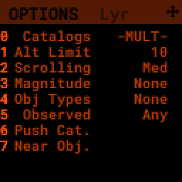

Once an item is selected the item will be highlighted and the available values or types of actions will be listed along the right hand side.   The bright numbers along the right hand side will let you select the value(s) for this item.

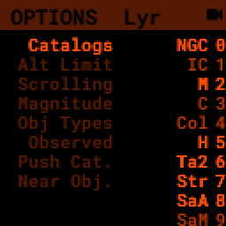

Some types of options can only have a single value, like Magnitude above.  Others, such as Obj Types will allow you to select multiple values.  If an option only has a single value, selecting it will return you to the main options page.  For options that can have multiple values, you'll need to use the **ENT** key to confirm your selections and return to the main option page.

The Options screen can also contain less commonly used actions which will take place when a value is selected.  

Global Options
----------------

.. image:: images/user_guide/STATUS_OPTIONS_001_docs.png
   :alt: Options screen for Status

The Options page for the Status screen is special and gives access to general PiFinder options and actions.  Used the **ENT-A** combo to cycle through the utility screens until you get to the Status screen.  Then press and hold the **A** key to access the option page.

* Adjust the key backlight brightness relative to the screen
* Set the power saving sleep time
* Set the screen saver time
* Choose how long hints are visible when switching screens
* Change :ref:`user_guide:wifi` Mode between client and access point
* Switch between left/right/flat orientation
* Restart the PiFinder software
* Shutdown the PiFinder before powering it off
* :ref:`Update <user_guide:update software>` the PiFinder software

Catalog
======================

.. image:: images/user_guide/CATALOG_001_docs.png

The catalog screen allows the searching and selection of astronomical objects to locate.  It has multiple catalogs available and displays some basic information about each object.  You can set filter criteria to limit the objects listed for each catalog.

The **B** function keys toggles between a description of the object, if available, and information about how often you've observed that object.

The **C** function keys will cycle through the various catalogs available.  The upper-left will show the count of filtered objects over the total number of objects in each catalog.

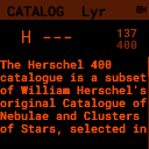

Use the number keys to enter the id of the object you are looking for.  As you type, any matching object will be displayed.  Typing in *74* to look for Messier 74 will bring up Messier 7 and 74 in turn as you enter numbers.

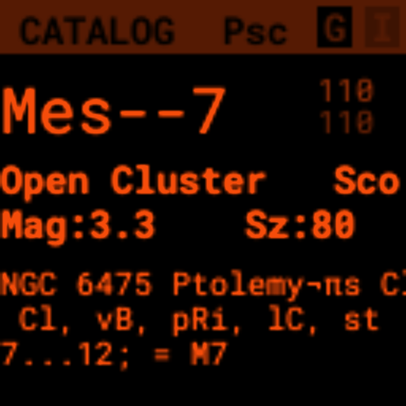
 
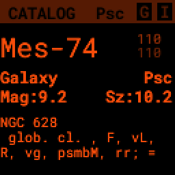

If the number you have entered matches an object in the catalog, information about the object will be displayed below including:

* Object Type
* Constellation
* Magnitude
* Size
* Other names
* IC/NGC coded observing notes
* Number of times you have :ref:`logged<user_guide:logging observations>` that object

Pressing the **B** key will switch between the text description and :ref:`user_guide:object images`

Use the **D** key to clear the number field out and start fresh.  If you find an object you are interested in, pressing the **ENT** key will add it to your target list and switch to the Locate screen

Holding the **A** key for two seconds will bring up the settings for the catalog.  You can filter by apparent altitude, magnitude and object type.  The Options page also has an action to push the currently filtered catalog to the :ref:`observing list<user_guide:observing lists>`. Pressing **A** will bring you back to the catalog and update the count of objects that match your filter.

* The *UP/DN* keys will scroll through the currently filtered objects.

Object Images
---------------

If you have used the prebuilt PiFinder image or have :ref:`downloaded<software:catalog image download>` the set of catalog images you can view what the selected object looks like via images from sky surveys.  Pressing the **B** key will cycle through various pages of information about each object including images from the Palomar Observatory Sky Survey and potentially updated images from the Sloan Digital Sky Survey.   

As an example, here are the images available for M57

.. image:: ../../images/screenshots/CATALOG_images_001_docs.png
   :target: ../../images/screenshots/CATALOG_images_001_docs.png
   :alt: Catalog Image

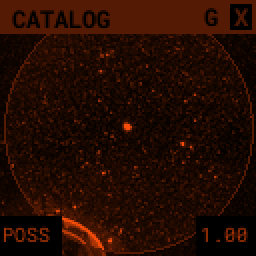

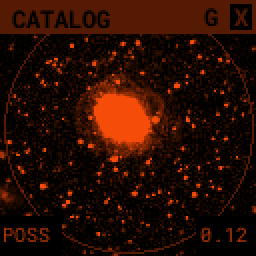

These images are oriented as they would be through the eyepiece in a newtonian reflector pointing at a specific area of the sky from your current location.   You can use the **UP** and **DN** keys to switch between various eyepiece field of views.   If you have your telescope and eyepiece collection information entered into the PiFinder these will be used to determine the FOV's to cycle through.  The defaults are 1, 0.5, 0.25, 0.12 degrees.

The bottom left of the screen shows the source of the current image and the left side shows the current FOV / Eyepiece information.

Observing Lists
======================

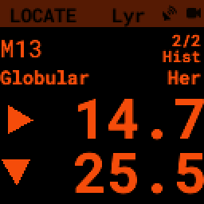

The Locate screen uses the last solve and currently selected target to provide a visual indication of which direction to move your telescope in order to center the target.  It also provides a summary of the current target and information about the overall target list.  

Values are expressed in degrees with the top line being rotation in Azimuth and the bottom line in Altitude.  

* **UP/DN** will cycle through the active list.  The numbers in the upper-right corner of the screen represent the index of the current object / total number of objects in the list and the list name is displayed directly below.
* **ENT** will switch back to the catalog screen to access full information about the current target
* **B** will 
* Holding the **A** key will open the :ref:`Options<user_guide:Option Pages>` page where you can load and save observing lists to disk

The currently target is also displayed on the screen as a small tick mark.

PiFinder maintains two lists of objects for each observing session; The History list and the Observing list.  The Locate screen lets you scroll through these lists and push the telescope to any object on them.

The History list will record any object that you set as a target to push-to.  It's added to as soon as you press the **ENT** key on the catalog screen to select an object.  The main purpose of the History list is to let you scroll back through objects you have observed that session.

The Observing list is a list of objects that is populated from either a filtered catalog or a file on disk.  It's a list of objects you'd like to observe during a session.  

Both these lists start empty at the beginning of each session.  To populate an observing list you can push a filtered list of objects from the :ref:`user_guide:catalog` screen or use the Options page to load an observing list from disk.  The PiFinder supports .skylist file format used in SkySafari and adopted in many other applications as well.

Logging Observations
======================

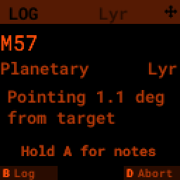

The Log screen can be accessed at any time by long holding the **ENT** key.  It allows you to record your observation of the currently selected target in a database as part of a session.  Each session starts when you power-up, or reset, the PiFinder and every observation logged during the session will be grouped together for later review.

Summary information about the current target is displayed along with the distance from the current telescope position.  This distance allows you to make sure you are observing/logging the correct object in a crowded field, like Virgo.  

You can add some details about your observation by holding down the A key to add notes.

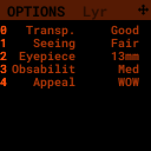

* Transp. :  The transparency of the sky.  This is often noted along with Seeing below
* Seeing:  The stillness of the atmosphere. 
* Eyepiece:  You can note which of your eyepieces you are using.
* Obsabillit:  Observability - How easy is it to spot and recognize this object
* Appeal: Overall rating of this object.. would you refer a friend?

Pressing the **A** key from the Observing Notes options will bring you back to the Log screen.

* **B** key - Logs the current target to the database
* **D** key - Abort and return to the previous screen

Observing Projects
===================

If you are like me, you may enjoy various observing projects, such as observing all the Messier or Herschel objects.  The PiFinder makes these longer term efforts easy by allowing you to log each object and then only showing you objects you have left that are visible during any observing session!

This section covers a lot of the basic catalog/locating/observing features of the PiFinder and how it can be used to pursue such a project.

Combining the ability to filter a catalog by observation status and pushing the nearest 'X' objects to the observing list allows you to work your way through a collection of objects easily.

Use the **A** key to cycle through the main screens until you get to the `Catalog <user_guide_ui.md#catalog>`_

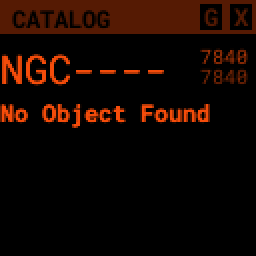

Then use the **C** key to cycle through the available catalogs to find the Messier objects

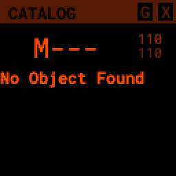

Holding the **A** button for about a second will bring up the `Options <user_guide_ui.md#options>`_ page of the `Catalog <user_guide_ui.md#catalog>`_ screen

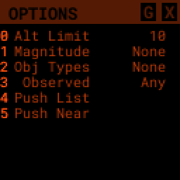

On this screen you can filter the catalog in various ways.  By default, it will only show items that are higher than 10degrees above the horizon right now and will include objects of any magnitude, type and regardless of whether you have observed them or not.  You can switch the observation filter to 'No' to focus on the Messier objects you've not yet observed.

Press the **3** key to bring up the Observed options

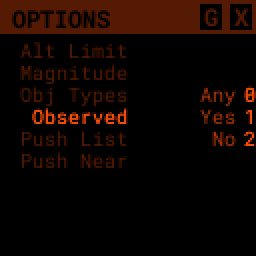

Then press the **2** key to select the 'No' option.  Pressing the **A** key will return you to the Catalog page with your filters activated.  You can see in the upper-right of the screen that the number of objects matching the filter is 47 of 110

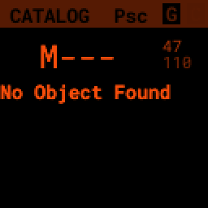

We're going to create an observing list from this filtered catalog.  Hold down the **A** key to return to the Options page.  

We can either push all the items that match our current filter using the **4** Push List action, 
or we can choose to create a list of objects near the current place the telescope is pointing.   This is a great way to easily and quickly work through objects when they might be most visible based on your particular location.

Press the **5** key to select Push Near

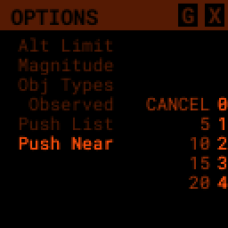

You can select the number of nearby objects you want to push to the observing list.  Let's get 20 nearby Messier objects we've never logged observations for!  Press the **4** key and you'll end up at the Locate screen with a list of these 20 objects sorted by distance from the current pointing position.

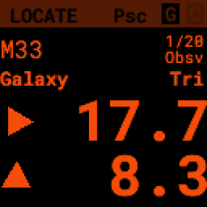

The locate screen serves double duty by showing you where to move the telescope to center this object, and also letting you scroll through the observing or history lists.  In the screenshot above were looking at item 1/20 in the Obsv (Observing) list.  You can use **UP** and **DN** to scroll through the list.  Or just push the scope in the indicated direction to observe M33.

When you have observed M33, hold down the **ENT** button to :ref:`log<user_guide:logging observations>` this object.

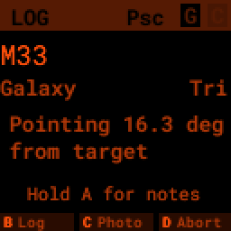

Now that M33 is logged, it won't show up any longer when you filter the Messier objects by 'No' observation.

Another way to use the observing list is to switch to the Chart screen.  The currently selected target will be pointed to with the arrow around the reticle if it's offscreen and an X if it's on screen.  

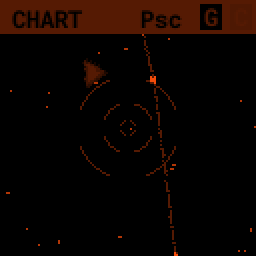

Use can use the **UP** and **DN** keys to zoom the chart in an out.  Here is the chart zoomed out showing the location of M33 along with some of the other nearby objects on the observing list.

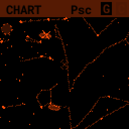

WiFi
==========================

Access Point and Client Mode
----------------------------------

The PiFinder can either connect to an existing network, or serve as an wireless access point for other devices to connect to.  Use the :ref:`user_guide:Global Options` page of the Status screen to switch between these two modes and see which mode is currently active.

Using the PiFinder in Access Point mode creates a network called APPiFinder with no password to allow easy connection of phones, tablets and other devices in the field.

Changing Wifi networks
----------------------------------

When in client mode, the PiFinder will attempt to connect to one or more networks which have been previously configured.  If you set up your PiFinder via the instructions `here <software.md>`_ you likely already have one network configured.

If you purchased a kit that came with an SD card, or you want to change network configuration, please see the instructions below to change your network settings:

* Shutdown and power off the PiFinder
* Remove the SD card from your PiFinder and insert it into another computer.  

  * Windows may prompt you to format the card, don't do so! There is a partition on there (/boot) that windows should be able to read/write to.

* Create a file called wpa_supplicant.conf in the root of the SD card with these contents:

.. code-block::

   ctrl_interface=DIR=/var/run/wpa_supplicant GROUP=netdev
   country=<Insert 2 letter ISO 3166-1 country code here>
   update_config=1

   network={
    ssid="<Name of your wireless LAN>"
    psk="<Password for your wireless LAN>"
   }

* Set ``country`` to your two letter country code.
* Set SSID to your WiFi network name, preserving the surrounding quotes.
* Set PSK to the password for your WiFi network, again preserving the surrounding quotes.
* Save this file (make sure it ends up with the .conf extension)
* Insert it back into the PiFinder and power back on.

That file will be moved from the ``/boot`` partition and the PiFinder should connect to your network. 

Alternatively, you can switch the PiFinder to AP mode, SSH into it and edit ``/etc/wpa_supplicant.conf`` in place to change or add networks.

PiFinder address
-----------------

In most cases, you can use the name ``pifinder.local`` to connect to the PiFinder.  On older computer or those that don't support zeroconf networking, you can use the IP address provides on the `Status <user_guide_ui.md#status>`_ screen to connect.  You can connect to the PiFinder via:

* SSH to get shell access for software updates and other admin tasks
* SMB (Samba) to access saved images, logs an observing lists
* LX200 protocol to allow updating of a planetarium app, such as :doc:`skysafari` , with the position of the telescope

SkySafari
===================

The PiFinder can provide real-time pointing information to a device running SkySafari via the LX200 protocol.  See this :doc:`skysafari` document for complete details, but here is the connection info:

* Use 'Other' telescope type
* Mount Type: Alt-Az, GoTo.. even if your scope is Push-To.  This allows sending of targets from SkySafari to the PiFinder
* Scope Type: Meade LX200 classic
* IP Address: ``pifinder.local`` or IP address provides on the Status screen
* Port: 4030

Shared Data Access
===================

In the course of using the PiFinder several data files are created that may be of interest.  These are available via a SMB (samba) network share called ``//pifinder.local/shared``.  Accessing this will depend on your OS, but the PiFinder should be visible in a network browser provided.  There is no password requirement, just connect as ``guest`` with no password provided.

Once connected, you'll see:

* ``captures/``\ : These are images saved when logging objects.  They are named with the observation ID from the database.
* ``obslists/``\ : This folder holds observing saved during a PiFinder session or to load for future sessions.
* ``screenshots/``\ :  It's possible to take screenshots while using the PiFinder (hold down **ENT** and press *0*\ ).  They are stored here.
* ``solver_debug_dumps/``\ : If enabled, information about solver performance is stored here as a collection of images and json files.
* ``observations.db``\ : This is the SQLite database which holds all the logged observations.

Update Software
==================

A Software action is available from the :ref:`user_guide:global options` screen.  This will both show which version the PiFinder currently has installed and allow you to Upd the software if the PiFinder is connected to the internet.  You man need to switch :ref:`user_guide:WiFi` modes to Client if the device is in AP mode.

Select the option for 'Software' and then 'Upd'.  You should see a message that says 'Updating...' followed by 'Ok! Restarting'.  The PiFinder should restart and the new software version should be displayed when checking the :ref:`user_guide:option pages` for the Status screen

FAQ
====

Have any questions?  Please send them through to me at `rich@brickbots.com <mailto:rich@brickbots.com>`_ and I'll do my best to help and potentially add your question here.  Better yet, feel free to fork this repo and contribute via a pull request!
