======================
PiFinder™ User Manual
======================

.. note::
   This documentation is for v3 and v2.5 PiFinders running software |min_software| or above.
   You can see which version you're running in the upper right of the welcome screen.

   If you need docs for a previous version please choose `1.x.x <https://pifinder.readthedocs.io/en/v1.11.2/index.html>`_
   , `2.0.x <https://pifinder.readthedocs.io/en/v2.0.4/index.html>`_
   or `2.1.x <https://pifinder.readthedocs.io/en/v2.1.1/index.html>`_

Thanks for your interest in the PiFinder!  This guide describes how to use one; if you
want to build one, see the :doc:`Build Guide <build_guide>` and the
:doc:`Bill of Materials <BOM>`.

The manual is divided into sections you can reach from the links to the left.  Let's dig
into what the PiFinder can do.

How It Works
===============

The PiFinder is a self-contained telescope positioning device.  It tells you where your
telescope is pointed, lets you pick a target such as a galaxy or other DSO, and directs
you on how to move the scope to find it.  There are other nice features alongside these
core functions, but the PiFinder is designed primarily to get interesting objects into
your eyepiece for a look.

To direct you, the PiFinder needs to know where your telescope is pointed.  It works this
out directly, by photographing the night sky and examining the star patterns to determine
which section of sky it's seeing — incredibly fast (up to 20 times per second!) and very
accurately.  This only works while the scope is still, so it pairs that camera with an
accelerometer (the IMU, as the Status screen and Settings menu call it) that estimates
how far the scope has moved since the last solve.  The
estimate carries some error, but the moment you stop, a fresh photo corrects it.  The
PiFinder works out its own orientation as it solves, so it can be mounted at any angle —
it doesn't need to sit upright — as long as the camera points the same way as your scope.

Knowing where your scope points and where thousands of interesting objects sit, the
PiFinder combines the two to show you how to move the scope to bring any of those objects
into your eyepiece.  Because it observes your actual pointing direction, you can trust
you're on target.

.. note::
   For a general overview of using the PiFinder, read the :doc:`quick_start`.  This manual
   goes deeper but doesn't cover the first-time set-up steps in the Quick Start.

The Menu System
=====================================

All of the PiFinder's functions are reached through its menu system:

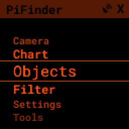

Each menu is a list of items representing a submenu, a screen, or a set of options.  Scroll
through a menu and make selections with these keys:

.. This key list is duplicated in quick_start.rst (Using the PiFinder) — keep the two in sync.

- The **UP** and **DOWN** arrows scroll the current menu
- The **RIGHT** arrow activates the current option, selecting it or moving to another menu
- The **LEFT** arrow takes you back to the previous menu or screen
- Holding **LEFT** for more than a second always returns to the TOP of the menus

The status bar at the top of the screen shows the name of the menu you're viewing.

For a bird's-eye view of every menu and what each option does, see the
:doc:`menu_map`.

Screens
--------

Some menu items, like Camera, lead to a specific screen — a camera preview, a star chart,
or details about a catalog object.  Each screen is covered in more detail below.

Options
--------

Some menus present a list of options where you choose one or more items to control how the
PiFinder operates.  For instance, the Set Filters menu items take you to a sub-menu of ways
to filter your object lists:

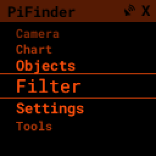
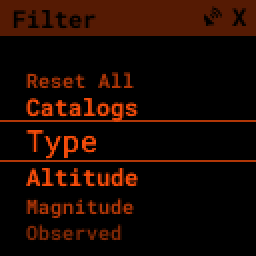

Selecting Type presents the DSO types you can choose to control which objects appear in
your object lists.

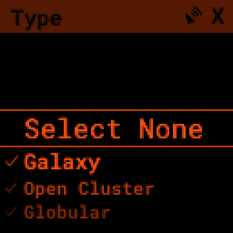
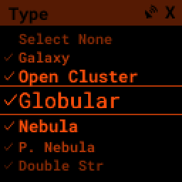

Lists that offer selections show a check-mark next to the one or many options selected.
Pressing the **RIGHT** arrow with an option highlighted selects or de-selects it.

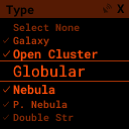

For menus that allow only a single selection, such as Altitude, choosing one item
de-selects any others.  Multi-Select menus offer options to select or de-select all items
at once.

When you're done, press the **LEFT** arrow to return to your last menu or screen.

With this simple set of scroll-and-select tools you can reach all the PiFinder's powerful
features.

Quick Menu
-------------------------------------

You can reach everything through the menu system, but a secondary quick-menu brings some
functions into easier reach.

Hold the **SQUARE** key to open the Quick Menu

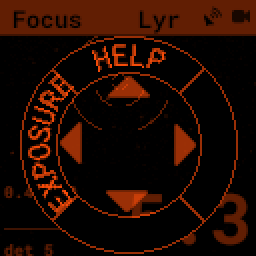

This menu presents up to four options, one per arrow button; press the arrow to select its
item.  The menu changes with the screen you're on, but often has
:ref:`HELP<user_guide:help system>` at the UP option.  The Focus screen above offers HELP
and Exposure.

Some Quick Menus have a second layer.  The Object List's Quick Menu, for example, offers
Sort and Filter; pressing LEFT for Sort opens a ring of sort orders, with subtle shading
marking the current one.

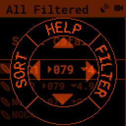
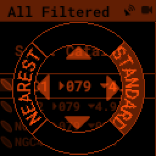

Pick a sort order to apply it.  Exit the Quick Menu at any time by pressing SQUARE again.

Help System
--------------

Many screens offer help with specific button functions and other details about how things
work or what a page is for.

When available, HELP is the UP option in the Quick Menu

Pressing the UP arrow selects help and displays one or more pages.  A prompt at the top or
bottom of the screen shows when more pages are available; press UP or DOWN to scroll
through them.

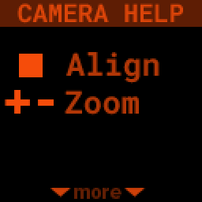
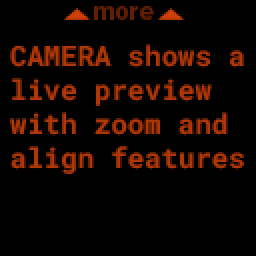

Observing with PiFinder
========================

Out under the stars, you'll be doing four basic things in various combinations:

* Curating a list of objects you're interested in
* Viewing details about those objects
* Pushing the scope to bring them into your eyepiece
* Logging your observations

Everyone observes their own way, so the PiFinder offers different ways to use (or skip!)
these features for a great night out.

Object List
--------------------

The Object List is one of the PiFinder's main features.  It presents a collection of
objects you've selected using catalogs, filters, observing lists, and text search.

To pick a starting point, choose Objects from the main PiFinder menu, then choose one of
five options:

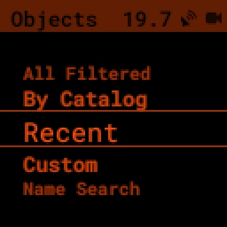

- **All Filtered**: All objects across all catalogs that meet your
  :ref:`filter criteria<user_guide:filters>`.  This could be thousands of objects and is
  most useful with strict filters, such as globulars above 30 degrees altitude and brighter
  than magnitude 10.
- **By Catalog**: All objects from a specific catalog that meet your filter criteria.  Great
  for observing projects and finding the nearest objects in a particular catalog.
- **Recent**: Starts empty and builds a history of the objects you've checked out during
  the current session.
- **Custom**: Enter a right ascension and declination by hand to make a one-off target.
  See :ref:`user_guide:custom targets`.
- **Name Search**: Using the number keypad, search for objects by name.  The Snowball
  planetary?  Cat's Eye?  This is the way to find them.

However you build the list, it always displays the same information and offers the same
sorting and selection.

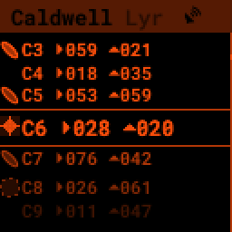

A symbol along the left shows each object's type.  Next to it is the designation — usually
the catalog abbreviation and index number — then the distance from your current telescope
position.  Each entry's brightness hints at its magnitude.

Pressing the **SQUARE** key cycles through additional information for the objects on the
list.

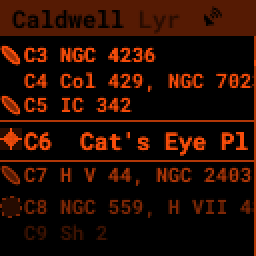

You can see a scrolling list of common names for each object.

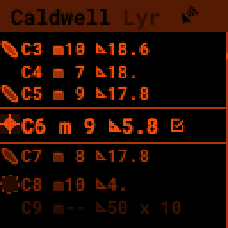

And the magnitude and size of each object, with a check mark to indicate whether you've
observed and logged it before.

Holding the **SQUARE** key brings up the Quick Menu to sort and filter this list.

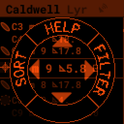

Pressing **LEFT** selects SORT

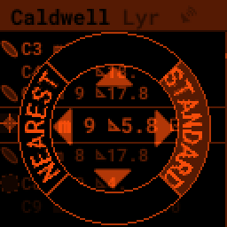

By default, lists use STANDARD order — usually the order they appear in catalogs.  Press
the indicated arrow to choose another order such as NEAREST, which puts the object closest
to your current telescope position at the top.

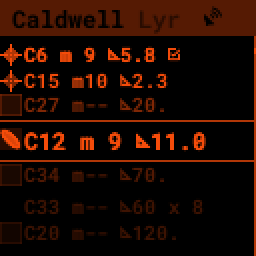

If you start typing a number, the Object List jumps to the next object with that index
number.  Use the **UP/DOWN** arrows to step to the next or previous match, and the
**SQUARE** key to exit jump mode and select an object.

Pressing the **RIGHT** key brings you to details for the selected object.

Object Details
--------------------

Pressing the **RIGHT** key from the Object List brings up the Object Details screen for the
highlighted object.  This screen shows large Push-To instructions,
:ref:`object images<user_guide:object images>`, and catalog details.

Pressing **SQUARE** cycles through the object's information and **UP/DOWN** moves to the
next or previous object in the list.  **LEFT** returns to the full list, and **RIGHT**
brings up the :ref:`Logging<user_guide:logging observations>` interface for the current
object.

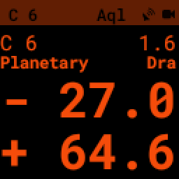

The Push-To info shows which way, and how far, to move your telescope to put the object in
your eyepiece.  As you move the scope the numbers dim, indicating the PiFinder is using the
accelerometer to estimate where the telescope is pointing.  When you stop, or move slowly
enough, the camera plate solves to provide an absolute position and the numbers brighten
again.

When the numbers are near 0.00 the object should be in your eyepiece.  The numbers are the
distance to the object in degrees, so with an eyepiece offering a 0.5 degree true field of
view, getting them below 0.25 (half the true field) should put the object in view.

Closer to zero means more centered.  For a very dim object, knowing it's dead center and
consulting the object image can make all the difference.

.. note::
   By default the Push-To arrows guide you in altitude and azimuth — the way an Alt/Az or
   Dobsonian mount moves.  On an equatorial mount or platform, set Mount Type to Equatorial
   in the :ref:`user_guide:settings menu` and the guidance switches to right ascension and
   declination to match your mount's axes.

The number in the upper right is the object's
:ref:`contrast reserve <user_guide:contrast reserve>` — an estimate of how easily it
should show in your eyepiece tonight.

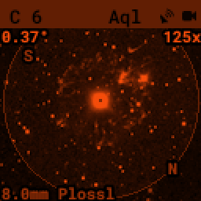

The PiFinder can display images of every object in its catalog.  See the section on
:ref:`object images<user_guide:object images>` below for more.

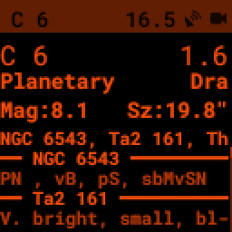

Depending on the catalog, the PiFinder may have detailed notes alongside the object's type,
constellation, magnitude, and size — the size is shown in degrees, arcminutes, or arcseconds,
whichever best suits the object.  Use the **+/-** keys to scroll the notes.

Many objects carry more than one catalog designation, and the notes can gather a description
from each.  A bright horizontal rule labelled with the catalog and number — for example
*NGC 6543* — sets one catalog's notes off from the next, so you can see at a glance where
each note comes from.  The notes finish with a count of how many times you've logged the
object, marked by its own rule (it reads *Not Logged* until your first sighting).

What each part of the screen shows
^^^^^^^^^^^^^^^^^^^^^^^^^^^^^^^^^^^

The Object Details screen packs a lot in.  These two views label every part — the Push-To
screen, and the catalog details you reach by pressing **SQUARE**:

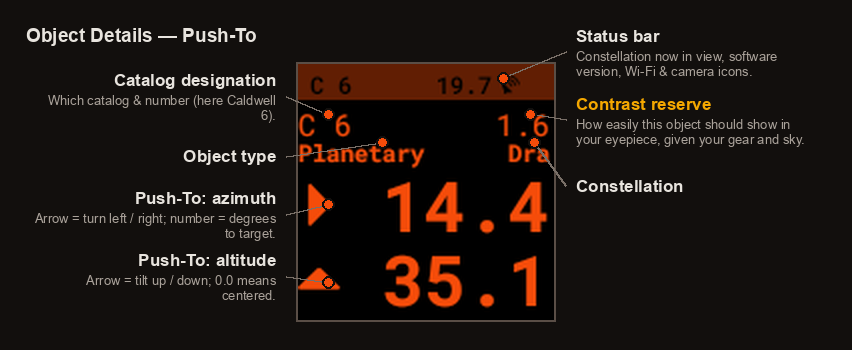

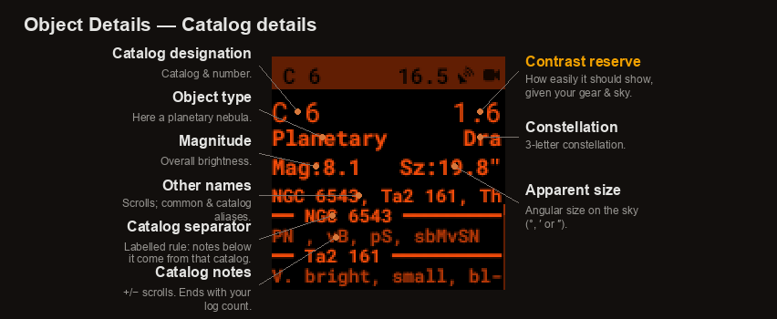

Contrast Reserve
^^^^^^^^^^^^^^^^^

The number in the upper right of the Object Details screen is the **contrast reserve** — an
estimate of how easily an object should stand out in your eyepiece.  It weighs the object's
brightness and size against your sky brightness, your telescope's aperture, and the
magnification of your active eyepiece, then compares the result to what the eye can detect.
A higher number means the object should be easier to see.

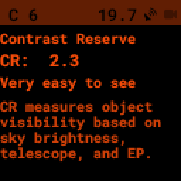

Keep pressing **SQUARE** to reach the Contrast Reserve page, which shows the value on its
own with a plain-language reading of what to expect:

.. list-table::
   :header-rows: 1

   * - Contrast reserve
     - What to expect
   * - Below −0.2
     - Object is not visible
   * - −0.2 to 0.1
     - Questionable detection
   * - 0.1 to 0.35
     - Difficult to see
   * - 0.35 to 0.5
     - Quite difficult to see
   * - 0.5 to 1.0
     - Easy to see
   * - 1.0 and above
     - Very easy to see

The contrast reserve appears only when the PiFinder has everything it needs to work it out:
an active :ref:`telescope and eyepiece <equipment:choosing your active telescope and eyepiece>`,
a sky-brightness reading, and an object with a known magnitude and size.  If any of these is
missing — a double star with no single magnitude, or before the camera has estimated the sky
brightness — the number is simply left off.

.. note::
   The sky-brightness figure comes from the PiFinder's Sky Quality Meter (SQM), its
   camera-based estimate of how dark your sky is, so the contrast reserve tracks your real
   conditions: the same object reads higher under a dark sky than from town.  Treat it as a
   guide rather than a guarantee — averted vision, transparency, and how dark-adapted you
   are all still play their part at the eyepiece.

Star Chart
-------------

The Star Chart, reached from the main PiFinder menu, draws a live map of the sky around
where your telescope is pointing, with constellation lines and markers for nearby objects.
It redraws as you move the scope, so it's a quick way to see what's around you and confirm
your aim.  Zoom in and out with the **+/-** keys.

How the chart is turned is up to you.  Choose Coordinate Sys. under Chart... in the
:ref:`user_guide:settings menu`:

- **Horizontal** (the default) keeps the horizon level and the zenith up, matching what you
  see with the naked eye.
- **EQ (Auto)** lines the chart up with the celestial pole — north-up in the northern
  hemisphere, south-up in the southern.
- **EQ (North-up)** and **EQ (South-up)** force north-up or south-up wherever you are.

The chart labels what's currently at the top — "Zenith up", "NCP up" (north celestial
pole), or "SCP up" (south celestial pole) — so you always know how it's oriented.  The same
orientation applies to the Align screen.

.. note::
   The chart works before the PiFinder has a GPS fix.  The Horizontal and EQ (Auto) modes
   need to know where you are to orient themselves, so until GPS locks — or you
   :ref:`enter your location by hand <user_guide:place & time>` — the chart falls back to
   north-celestial-pole-up and marks the label with a leading "!" (for example "!NCP up")
   to show it's a temporary orientation that settles once your location is known.

Filters
----------

Every object list aside from :ref:`user_guide:name search` and Recent shows only objects
that meet the filter criteria you've set.  View and adjust your filters from the Set
Filters menu, the last item in the Objects menu.

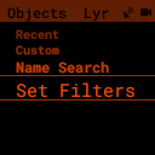

You can also jump to the filter options from the :ref:`user_guide:quick menu` on the Object
List screen.

The Set Filters menu offers several ways to limit which objects appear, plus a Reset All
option to clear every filter.

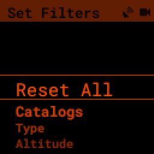

With no filters set, every available object appears — the All Filtered list will show over
18,000 objects!

Some filter types take a single value, like Altitude, and some allow multiple selections,
like Object type.  Here's a brief explanation of each:

- **Catalogs**: Limit which catalogs are included in the All Filtered list.  This is
  distinct from the catalog-specific object lists, which are a shortcut to one catalog.
  Using the Catalogs filter, the All Filtered list can show globular clusters across
  multiple catalogs at once.
- **Type**: Limit by object type.  You can select multiple types to include.
- **Altitude**: The current apparent altitude of an object from your observing location.
- **Magnitude**: Limit to objects at least as bright as the selected magnitude.
- **Observed**: Include only objects you've logged, never logged, or any logged state.

Catalogs Filter
^^^^^^^^^^^^^^^^^

The PiFinder has many catalogs, so this menu groups them by category.

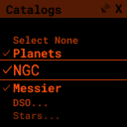

Common catalogs appear at the top level for quick reference; less common ones sit in
sub-categories marked with an ellipsis (...).

Here's the DSO... category as an example:

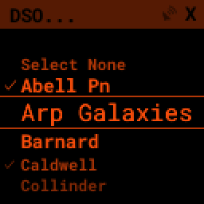

Selected catalogs show a check box, and you may see the same catalog, like Messier, in
multiple spots.  Selecting or de-selecting anywhere changes its state everywhere.

Name Search
------------

A powerful way to search the PiFinder's large object database is by name, letting you find
objects by their common description, like the Cat's Eye nebula.  To reach the Name Search
screen, select it from the Objects menu:

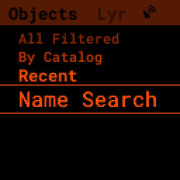

It uses multi-tap text input, like the cellphones from the dawn of text messaging.  The
on-screen keypad shows the letters available by pressing each number key several times in a
row.

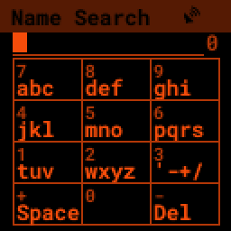

Each number key generates its number, then the three or four letters shown, in turn.  Pause
long enough between presses, or press a different key, and the cursor moves to the next
position.

If you'd rather press each key just once, switch the search input to T9: every press enters
its digit, and the PiFinder matches the digit sequence against the letters of each object
name — ``1897`` finds Vega.  Choose between Multi-Tap and T9 under Search Input in the
:ref:`user_guide:settings menu`, or hold **SQUARE** here and pick Input from the
:ref:`user_guide:quick menu` to jump straight to the setting.

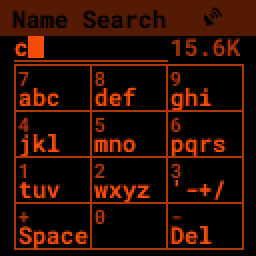

As you type, the PiFinder shows how many objects match your search term, to the far right
of your text.

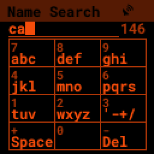

The count drops as you add more text.

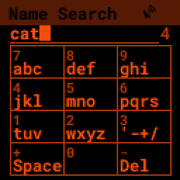

Once you've narrowed the list enough, press the **RIGHT** key to see the full list of
matches.

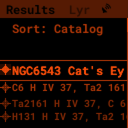

Custom Targets
---------------

Sometimes the object you're after isn't in any catalog — a newly discovered comet, or a
position from a chart or article.  Choose Custom from the Objects menu to enter a right
ascension and declination by hand, then push to it like any other object.

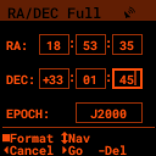

Type the coordinates with the number keys; the **UP/DOWN** arrows move between fields and
**-** deletes the last digit.  The **SQUARE** key cycles the entry format — full
hours/minutes/seconds (shown above), decimal hours and degrees, or decimal degrees for
both — with the active format named in the title bar.  With the declination degrees
selected, **+** flips its sign; on the EPOCH field, **+** cycles between J2000, JNOW, and
B1950.

When the numbers look right, press **RIGHT** to create the target.  The PiFinder makes a
one-off object, opens its :ref:`Object Details<user_guide:object details>` screen with
Push-To guidance, and adds it to the Recent list so you can return to it during the
session.  Press **LEFT** to back out without creating anything.

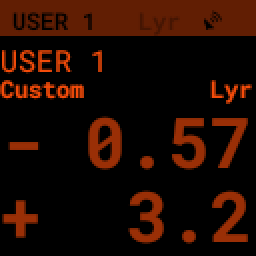

Observing Lists
---------------

If you like to plan a session ahead of time — in SkySafari, a spreadsheet, or a list a
fellow observer shared — you can bring that plan to the eyepiece.  Copy the list file into
the ``obslists/`` folder of the PiFinder's :ref:`shared data
folder <connectivity:shared data access>`, then load it from Obs Lists in the Objects
menu.

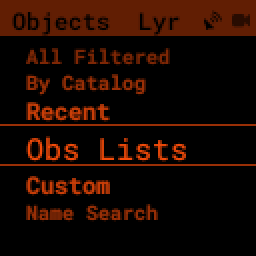

The PiFinder reads observing lists in all of these formats, recognizing each by its file
extension and, for ``.txt`` files, by the content itself:

.. list-table::
   :header-rows: 1

   * - Format
     - Extension
   * - `SkySafari observing list <https://support.simulationcurriculum.com/hc/en-us/articles/236161107-SkySafari-5-Observing-Lists>`_
     - ``.skylist``
   * - PiFinder native
     - ``.pifinder``
   * - CSV
     - ``.csv``
   * - `Stellarium observing list <https://stellarium.org/guide/>`_
     - ``.sol``
   * - `Autostar / Meade tour <http://www.weasner.com/etx/autostar/as_tours.html>`_
     - ``.txt``, ``.mtf``
   * - `Argo Navis catalog <http://www.wildcard-innovations.com.au/downloads/documentation/argoman10.pdf>`_
     - ``.txt``
   * - `NexTour / Celestron tour <https://www.nexstarsite.com/PCControl/NexRemote.htm>`_
     - ``.hct``
   * - `EQMOD tour <https://eq-mod.sourceforge.net/tour/>`_
     - ``.lst``
   * - Plain text, one object name per line
     - ``.txt``

The Obs Lists screen shows every list it finds, along with any folders — shown in
``[brackets]`` — so you can organize lists into subfolders by trip, season, or source.
Scroll with the **UP/DOWN** arrows and press **RIGHT** to open a folder or load a list.

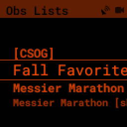

When two lists share a name — say you have both ``Messier Marathon.skylist`` and
``Messier Marathon.csv`` — the format is appended to tell them apart, as in the image
above.

Loading a list matches each entry against the PiFinder's catalogs, briefly reports how
many objects matched, and opens the result as a regular
:ref:`Object List <user_guide:object list>` you can sort, browse, and push to.

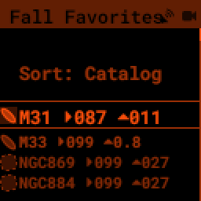

Entries that match a catalog behave exactly like objects you'd find by browsing — images,
descriptions, and your observation logs all come along.  An entry the PiFinder can't match
but that includes coordinates becomes a one-off target under the code OBS, so nothing on
your list is left behind.

.. note::
   The ``.pifinder`` format is the PiFinder's own JSON list format, and the one to choose
   when a planning tool offers it: it carries catalog references, magnitudes, object sizes,
   and coordinate epochs that the other formats drop.  Its fields, JSON schema, and a worked
   example are documented in the `observing-list formats reference
   <https://github.com/brickbots/PiFinder/blob/main/docs/ax/catalog/obslist-formats/README.md#the-pifinder-format>`__.

Importing a CSV list
^^^^^^^^^^^^^^^^^^^^^

CSV is the format to reach for when another tool — a spreadsheet, an observing planner, or
a sky atlas — gives you a list as plain columns.  The first line is a header naming the
columns; the PiFinder reads them by name, so their order does not matter and the case is
ignored.  Only ``Name`` is required, plus coordinates so the PiFinder knows where to point:

.. list-table::
   :header-rows: 1

   * - Column
     - Holds
   * - ``Name``
     - A label for the row, e.g. ``M 3`` or ``My comet``.
   * - ``RA`` / ``Dec``
     - Right ascension and declination (see the coordinate forms below).
   * - ``Magnitude``
     - Brightness, optional.
   * - ``Type``
     - Object type such as ``Gx`` or ``PN``, optional.

Common spellings of those headers are accepted too — ``ra`` / ``dec`` / ``mag`` and
``RA_deg`` / ``Dec_deg`` all work.  The RA header can also carry the unit: a decimal under
``RA_h`` or ``RA_hours`` is read as hours, while ``RA`` or ``RA_deg`` is read as degrees.
Coordinates may be written in any of three forms:

.. list-table::
   :header-rows: 1

   * - Form
     - RA example
     - Dec example
   * - Decimal degrees
     - ``205.8583``
     - ``+28.244``
   * - Colon-separated
     - ``13:43:26``
     - ``+28:14:39``
   * - Sexagesimal
     - ``13h 43m 26s``
     - ``+28° 14' 39"``

A decimal right ascension is read as **degrees** (0–360) unless its header names hours.  A
small list might look like this::

   Name,RA,Dec,Magnitude
   My target,205.8583,28.2442,6.3
   Comet 2024X,250.667,36.411,11.0

Each row resolves the same way as any other observing list: if its name matches a catalog
object — spacing and capitalisation are ignored, so ``M 13``, ``M13`` and ``NGC 224`` all
work — you get that object with its images, descriptions, and your logs; otherwise the
PiFinder uses the row's own coordinates as an OBS target.  To keep your exact coordinates
for an object the catalog would otherwise recognize, give the row a name the catalog will
not match; prefixing it, as in ``_M 3``, is enough.

For the complete column reference — every accepted header spelling, the coordinate forms,
and import notes — see the `observing-list formats reference
<https://github.com/brickbots/PiFinder/blob/main/docs/ax/catalog/obslist-formats/README.md#csv-import>`__.

Object Images
---------------

If you used the prebuilt PiFinder image or have :ref:`downloaded<software:catalog image download>`
the set of catalog images, you can see what the selected object looks like via sky-survey
images.  These display in the background of the :ref:`user_guide:object details` screen,
and you can view them in full detail by pressing the **SQUARE** key to cycle through the
pages of information about each object.

The images are rotated and oriented as they appear through the eyepiece at your position
and time, to help you identify the faintest targets.

Zoom in and out with the **+/-** keys; the FOV is displayed at the bottom of the image so
you can match it to your eyepiece.

As an example, here are the images available for M57

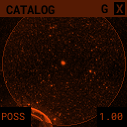

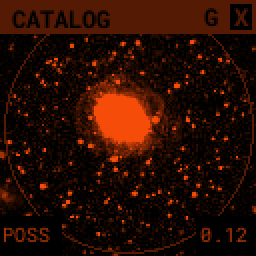

These images are oriented to match the view through your eyepiece for the telescope you're
using, pointing at a specific area of sky from your current location.  By default they're
oriented for a Newtonian reflector; if you use a refractor or an SCT with a star diagonal,
set the orientation options for your telescope as described in :doc:`equipment`.  Use the
**+** and **-** keys to switch between the fields of view of the eyepieces you configured
via the :ref:`Web Interface <connectivity:web interface>`

Two overlays help you read the image.  Letters near the edge of the field mark the
cardinal directions — two of N, S, E, and W, depending on how the image is rotated — so
you can relate the view to a chart.  A thin outline traces the object's cataloged size
and orientation; when only the bright core shows in the eyepiece, it gives you a feel
for the object's full extent.  Both overlays can be switched off under Image... in the
:ref:`user_guide:settings menu`.

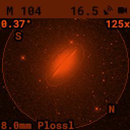

The bottom left of the screen shows the source of the current image, and the left side
shows the current FOV information.

Logging Observations
-----------------------

Pressing the **RIGHT** arrow while viewing any object's details brings up the logging
interface, where you can add context about your observation and save it to your log.

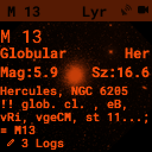
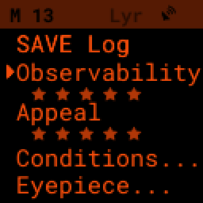

Use the **UP/DOWN** arrows to select one of the four context items to change:

- **Observability**: How easy is it to spot and recognize this object
- **Appeal**: Overall rating — would you refer a friend?

Set these first two by choosing a number from 1 to 5, or pressing the **RIGHT** arrow to
cycle through the stars.

- **Conditions**...

  - **Transparency**: A relative measure of contrast.

  - **Seeing**: The stillness of the atmosphere.

- **Eyepiece**: Note which of your eyepieces you're using.

When you're done — or if you just want to note that you observed an object without context
— use the **UP/DOWN** arrows to select **SAVE LOG** and record your observation.

Observing Projects
--------------------

If you're like me, you may enjoy observing projects, such as working through all the
Messier or Herschel objects.  The PiFinder makes these long-term efforts easy: log each
object, and it will then show you only the objects you have left that are visible during
any session.

Combining a :ref:`filter<user_guide:filters>` on observation status with an object list
sorted by NEAREST lets you work through a collection easily.

Power & Charging
=====================================

PiFinders ordered with the optional internal battery run for an evening on a single
charge, and you can keep one going indefinitely from any USB-C power source.  This section
covers how the two USB-C ports differ, how charging behaves, how long a charge lasts, and
how to look after the battery.  For the very first power-on, the
:ref:`quick_start:powering the pifinder` section of the Quick Start walks through it step
by step.

The two USB-C ports
-------------------

A battery-equipped PiFinder has two USB-C ports on top, and they do different things:

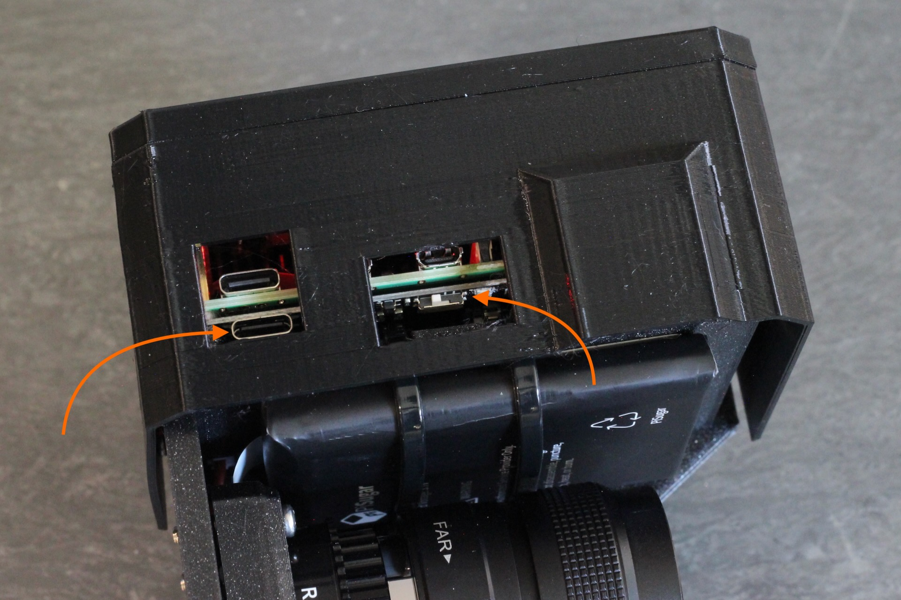

- The port nearest the **back** of the case (marked with the arrow above) both powers the
  PiFinder **and** charges the battery.  Use this one for charging.
- The port nearest the **keypad** powers the unit only — it does not charge the battery.
  It is also wired ahead of the power switch, so plugging into it turns the PiFinder on
  immediately *regardless of the switch position*.

During a session the keypad-side (power-only) port is the nicer one to run from, because
the charging port's indicator LED is quite bright in the dark.  A unit without the battery
has only the single power-only port.

The power switch is the small white **slide** switch on top, above the screen (boxed in
the image above).  Facing the screen, slide it right for on and left for off.  It is a
switch, not a button.

Charging
--------

Plug a USB-C cable into the charging port (nearest the back).  The indicator LED glows
**blue** while charging and turns **green** when full.  From empty, a full charge takes
roughly three hours, though this varies with the power source — a Power Delivery (PD)
charger negotiates more power and fills faster, while a basic 5V supply charges more
slowly but works fine.

Charge with the power switch **off**.  If the PiFinder runs while plugged in, it can draw
about as much current as the charger supplies, so the battery may barely fill.  A long
charge that leaves the battery still flat almost always means the unit was switched on the
whole time.

.. note::
   The last stretch of charging is slow.  As the battery approaches full the charging
   current tapers off, so the change from blue to green can take a while even though the
   battery is nearly there.  This is normal and not a fault.

Battery life
------------

The battery runs the PiFinder for about **four to five hours**, but real runtime depends
heavily on how hard you work it.  Sitting at the eyepiece on one object, or stepping away
from the scope, lets the PiFinder drop into power-save mode and stretches the time
considerably.  A fast tour through many objects — camera, motion sensor, and screen all
busy — draws more power and shortens it.  Turning the brightness down helps too: hold
**SQUARE** and press **+** or **-** to adjust the screen and keypad at any time.

There is **no battery-level indicator** on the screen and no low-battery warning: when the
charge is depleted the PiFinder simply shuts off.  For a long night, top up beforehand and
keep a USB-C power bank handy.  You can add external power at any time without restarting
(see below).

.. note::
   The PiFinder drops into power-save mode after it has been idle for a while, dimming the
   screen and slowing the camera to save power.  Any button press or movement of the scope
   wakes it.  The idle time can be changed, or turned off entirely, in the
   :ref:`user_guide:settings menu`.

Running on external power
-------------------------

Any USB-C source rated for at least **2A** will run the PiFinder — a wall charger, a USB
power bank, or a portable power station's USB output.  As a rough guide, about 1,000mAh of
power-bank capacity runs the PiFinder for an hour, so a 10,000mAh bank is good for the
better part of a night.

External power can be added mid-session without a restart.  A useful trick for stretching
a long night: plug a power bank into the power-only port, then switch the battery **off**.
The PiFinder keeps running on the external power while the battery is held in reserve for
after the bank is unplugged.

If you hit power dropouts, suspect the cable first — some USB-C cables are unreliable at
the ~2A the PiFinder draws, especially on long runs.

.. warning::
   Feed the PiFinder **5V USB-C power only**.  To run it from a telescope's 12V supply, you
   must use a 12V-to-5V step-down (DC-DC) converter with a USB-C output.  Never connect 12V
   directly to the PiFinder — doing so will damage it.

Battery safety & care
---------------------

The internal battery is a lithium-polymer (LiPo) cell.  Treated sensibly it will last for
years, but like any lithium battery it deserves a little respect.

.. warning::
   Stop using the battery and disconnect power if it ever becomes **swollen, damaged,
   unusually hot, or develops an odour**.  A puffed-up or punctured LiPo cell can vent or
   catch fire.  Do not continue to charge or use a cell in this condition — contact us about
   a replacement.

.. warning::
   Do not **puncture, crush, drop, or open** the battery, and do not attempt to disassemble
   the PiSugar power board it sits on.  Keep the unit dry; the battery and electronics are
   not waterproof.

A few habits keep the cell healthy:

- **Charge from the built-in port only.**  The PiSugar power board manages charging for you;
  just supply 5V USB-C as described above.  There is no need for an external LiPo charger,
  and you should not connect one.
- **Charge where you can keep an eye on it,** and not on or near anything flammable.  Avoid
  charging or leaving the unit in extreme heat — a closed car on a sunny day is the classic
  way to cook a battery.
- **Mind the temperature.**  The PiFinder has been used from about -15°C (5°F) to 40°C
  (100°F).  Capacity drops in the cold, though the computer's own heat keeps the cell warm
  enough to work in most conditions.  Avoid charging a battery that is below freezing.
- **For long-term storage,** leave the cell partly charged rather than full or empty and keep
  it somewhere cool and dry.  Top it up every few months so it does not discharge completely.
- **Dispose of it responsibly.**  A worn-out lithium battery should go to a battery-recycling
  drop-off, not the household rubbish.

.. note::
   If you ever need to replace the battery, the only compatible part is the **PiSugar S Plus
   5000mAh**.  Other PiSugar models share the I2C bus with the PiFinder's motion sensor and
   will cause problems, so make sure you fit the S Plus.

Settings Menu
==============

All user-configurable items live in the Settings Menu, near the bottom of the main
PiFinder menu.

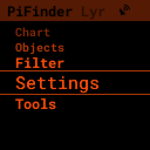

The top items collect several options under User Preferences, the Chart Screen, and the
:ref:`object image <user_guide:object images>` overlays.  An ellipsis (...) indicates
more options below.

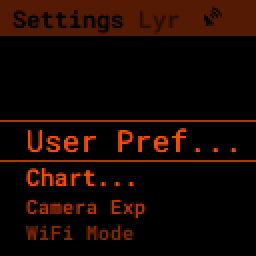

Below the general UI options are settings to change which :ref:`connectivity:wifi` mode your
PiFinder is in and its physical configuration.

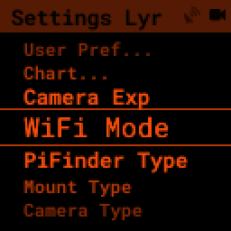

Hardware setup that's normally configured once — PiFinder Type, Camera Type, and GPS
Settings (type and baud rate) — lives under the Advanced submenu near the bottom of the
Settings Menu.  Opening it shows a brief "Options for DIY PiFinders" reminder, since on a
fully built unit these are already set to match your hardware.

Connectivity
==============

The PiFinder hosts its own WiFi network, ``PiFinderAP`` (no password), so your phone or
tablet can join it anywhere; it can also join your home network instead.  Switch between
the two modes from the :ref:`user_guide:settings menu`, and check the current mode and
address on the :ref:`user_guide:status screen` — from a connected device the PiFinder
answers at ``http://pifinder.local``.  The web interface, SkySafari and other planetarium
apps, and the shared data folder are all covered in :doc:`connectivity`.

Tools
==========================

Near the bottom of the main PiFinder menu, the Tools option leads to a set of screens that
aren't observing-related but provide useful information or let you perform actions —
checking the PiFinder's :ref:`status<user_guide:status screen>`, choosing your active
:doc:`telescope and eyepiece <equipment>`, setting your place and time by hand,
:ref:`updating the software<user_guide:update software>`, and
:ref:`shutting down<user_guide:shutdown>` or restarting.

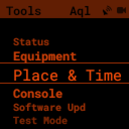

For the full tree and a note on what every item does, see the
:ref:`Tools section of the Menu Map<menu_map:tools>`.  The screens you'll reach for
most often are covered below.

Status Screen
----------------------------------

The Status Screen is the central place to check the PiFinder's current state and operation.

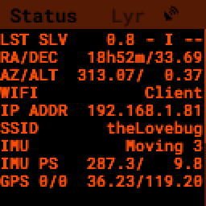

Some of the key information shown:

- The current solver state, as LAST SLV on the top line.  It shows the seconds since the
  last plate solve, the solve type (i for IMU or C for camera), and, for a camera solve,
  the number of stars matched.
- WiFi information a bit further down, including the current WiFi mode, network name, and
  IP address.

Place & Time
----------------------------------

The PiFinder needs to know where and when it is to turn the sky's coordinates into the
directions it gives you.  Its built-in GPS handles this automatically, but you don't have
to wait for a fix — or have GPS at all — to get going.  Open Tools, then Place & Time, to
set everything by hand.

Set Location gathers the ways to manage your observing site:

- **Enter Coords** lets you type your latitude, then longitude, then altitude with the
  number keys.  The **+** key flips the sign for southern latitudes and western longitudes.
- **Load Location** recalls one of your saved sites, and **Save Location** stores the
  current one so you can pick it again next time.

Set Time/Date sets the clock when there's no GPS: enter the time and the PiFinder moves on
to a date-entry screen.  A time you set by hand is protected — a later GPS fix won't
overwrite it — so your manual clock stays put.  Reset Location and Reset Time/Date discard
what's set if you'd rather start fresh or hand control back to GPS.

.. note::
   With your location and time set by hand, the PiFinder is fully usable without a GPS
   signal — you can focus, align, browse objects, and push to them.  The
   :ref:`user_guide:star chart` and Align screens also work before a GPS lock.

Update Software
------------------

The PiFinder can download and install software updates directly from its screen and keypad.
To start, choose Software Upd from the :ref:`user_guide:tools`

Updates happen right on the device — there is no need to send your PiFinder anywhere.  New
units often ship a version or two behind the latest release, so running an update is a
normal part of your first night out.

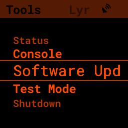

The PiFinder needs internet access, so put it in Client Mode connected to a WiFi network.
See :ref:`connectivity:connecting to a new wifi network` for details.

The PiFinder confirms it can reach the internet, then compares the current release version
to the one installed.

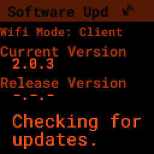

.. note::
   If the release version shows as **unknown**, the PiFinder cannot reach the internet to
   check — it is either in Access Point mode or its WiFi is not configured.  Put it in
   Client mode on a network with internet access (see
   :ref:`connectivity:connecting to a new wifi network`); re-imaging the SD card is not the
   fix for this.  If WiFi is configured but the check still fails, move closer to the
   router or re-enter the network details.

If a new version is available, use the presented option to start the update.  This may take
several minutes, and the PiFinder restarts when it's done.

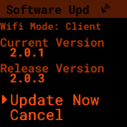

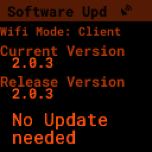

You can also download a pre-built image of any software release and write it to the
PiFinder's SD card.  See our `release page <https://github.com/brickbots/PiFinder/releases>`_
for information about each release and a download link.

Instructions for writing release images to an SD card are on the :doc:`software setup<software>`
page.

Polar Alignment
---------------------------

An equatorial platform or equatorial mount tracks the sky by turning your telescope around a
single axis that's meant to point at the celestial pole — the platform's pivot, or the
mount's right ascension axis.  The closer that axis is to the true pole, the longer objects
stay put in the eyepiece.  The Polar Alignment tool measures how far your axis sits from the
pole and walks you through correcting it — using ordinary plate solves, with no polar scope
or sight of Polaris needed.

It lives near the bottom of the main menu: open Tools, scroll down to Experimental, and
choose Polar Align.

It works by solving the sky at two or three points while you rotate around that axis between
them — turning the platform, or slewing the mount in right ascension only — then working out
where the axis points from how the view shifts.  The measurement is only as good as the
solves behind it, so before you start make sure the PiFinder has a GPS lock, is focused, and
is solving reliably.

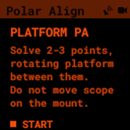

.. note::
   This aligns the rotation *axis*, not the PiFinder to your eyepiece.  The one rule that
   matters: between captures, move only *around* that axis.  On a platform, keep the scope
   clamped to the platform and rotate the platform; on an equatorial mount, lock the
   declination axis and slew only in right ascension.  During adjustment, move the axis
   itself with your altitude and azimuth adjusters — not by slewing the scope.

To take a measurement, open Polar Align and press **SQUARE** to begin, then:

1. Aim the telescope well away from the pole, where the camera gets reliable solves, and
   wait for the screen to report a recent solve.  Press **SQUARE** to capture the first
   point.
2. Rotate around the axis by at least about 10° — turn the platform, or slew in right
   ascension only — wait for a fresh solve, and press **SQUARE** for the second point.
3. For a stronger result, rotate farther and capture a third point — three points let the
   PiFinder check how well the captures agree.  To stop at two points instead, press **0**
   to solve now.

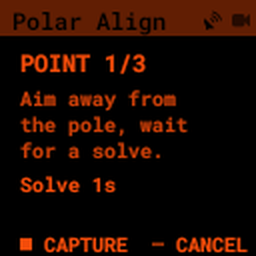

If the screen says 'Rotate more', the captures were too close together to pin down the axis;
rotate farther and capture again.

Once it has enough rotation, the PiFinder switches to a live target showing how far the axis
is from the pole, as push-to offsets in altitude and azimuth.  Turn your altitude and azimuth
adjusters — the platform's, or the mount's polar-alignment bolts — to follow the arrows until
both readings fall to zero.  The display refreshes with each new solve; if it shows 'No
solve', hold everything still until the PiFinder solves again.

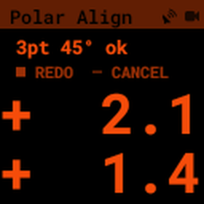

The top line summarises the measurement: the number of points used, the total sweep, and —
for a three-point solve — a fit rating of ``ok``, ``mid``, or ``bad``.  A poor fit usually
means something moved between captures that shouldn't have, so it's worth redoing.

Hold **SQUARE** for the marking menu, which gathers the advanced actions.  **STATS** opens a
read-only detail view, **REDO PT** drops just the last point so you can recapture it, and
**Roll On/Off** switches between a full three-axis fit and an RA/Dec-only fit that ignores
camera roll — useful after a camera flop.

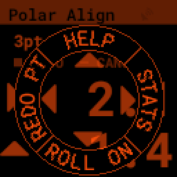

The STATS view spells out the correction in both degrees and arcminutes for each axis, the
fitted axis position, the fit quality, and how the captures were spaced in time — handy for
judging whether a measurement is trustworthy.

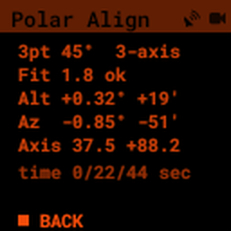

To start a fresh measurement at any time, press **SQUARE**; to leave the tool, press
**MINUS**.

Shutdown
---------------------------

Shutting down isn't strictly required before power-off, but the PiFinder is a computer and
there's a chance of file corruption if you skip it.  Some MicroSD cards are more sensitive
than others.

The Tools menu offers a Shutdown option under Power, and there's a quick way to reach it
too.

To shut down the PiFinder quickly:

- Hold the **LEFT** arrow button for more than a second to jump to the main menu
- Hold the **SQUARE** button to access the Quick Menu

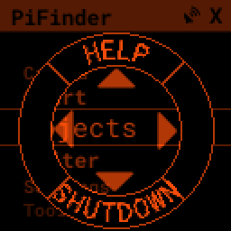

- Press **DOWN** to select the SHUTDOWN option
- Use the **RIGHT** arrow to confirm, or the **LEFT** arrow to go back

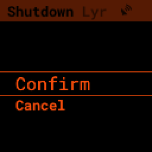

After you confirm, the screen and keypad turn off within a few seconds; it's then safe to
turn off the unit with the power switch or by unplugging the battery.
