======================
PiFinder™ User Manual
======================

.. note::
   This documentation covers rev4, v3 and v2.5 PiFinders running software |min_software| or
   above.  You can see which version you're running in the upper right of the welcome screen.

   Not sure which you have?  See
   :ref:`Which PiFinder do I have? <quick_start:which pifinder do i have?>` in the Quick
   Start.

   For docs covering a previous version, see
   `1.x.x <https://pifinder.readthedocs.io/en/v1.11.2/index.html>`_,
   `2.0.x <https://pifinder.readthedocs.io/en/v2.0.4/index.html>`_ or
   `2.1.x <https://pifinder.readthedocs.io/en/v2.1.1/index.html>`_.

Thanks for your interest in the PiFinder!  This guide describes how to use one.  To build
one, see the :doc:`Build Guide <build_guide>` and the :doc:`Bill of Materials <BOM>`.

The manual has sections you can reach from the links to the left.  Let's dig into what the
PiFinder can do.

How It Works
===============

The PiFinder is a self-contained telescope positioning device.  It tells you where your
telescope is pointed, lets you select an object such as a galaxy or another deep-sky
object, and directs you on how to move the telescope to find it.  It has other useful
features alongside these core functions, but its main purpose is to get interesting objects
into your eyepiece for a look.

To direct you, the PiFinder needs to know where your telescope is pointed.  It works this
out directly.  It photographs the night sky and examines the star patterns to determine
which section of sky it sees.  It does this quickly, up to 20 times per second, and very
accurately.  This only works while the telescope is still, so the PiFinder pairs the camera
with an accelerometer that estimates how far the telescope has moved since the last solve.
The Status screen and the Settings menu call this sensor the IMU.  The estimate carries
some error, but the moment you stop, a fresh photo corrects it.  The PiFinder works out its
own orientation as it solves, so you can mount it at any angle.  It does not need to sit
upright, as long as the camera points the same way as your telescope.

The PiFinder knows where your telescope points and where thousands of interesting objects
sit, so it can show you how to move the telescope to bring any of those objects into your
eyepiece.  Because it measures where the telescope actually points, you can trust its
guidance.

.. note::
   For a general overview of using the PiFinder, read the :doc:`quick_start`.  This manual
   goes deeper but doesn't cover the first-time set-up steps in the Quick Start.

The Menu System
=====================================

You reach all of the PiFinder's functions through its menu system:

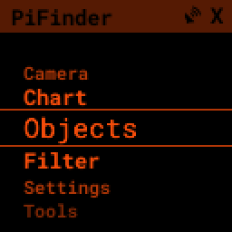

Each menu is a list of items.  A menu item leads to a submenu, a screen, or a set of
options.  Scroll through a menu and select items with these keys:

.. This key list is duplicated in quick_start.rst (Using the PiFinder).  Keep the two in sync.

- The **UP** and **DOWN** arrows scroll the current menu
- The **RIGHT** arrow selects the current menu item, which either sets an option or opens another menu
- The **LEFT** arrow takes you back to the previous menu or screen
- Press and hold **LEFT** for more than a second to jump back to the TOP of the menus

The arrows are the four directions of the joystick.  Pressing the joystick straight in does
the same as the **SQUARE** key.

.. note::
   On v3 and v2.5 PiFinders the arrows are four separate buttons in a row along the bottom
   of the keypad rather than a joystick.  The key names are the same on both.
   |v3_docs|

The status bar at the top of the screen shows the name of the menu you're viewing.

For a bird's-eye view of every menu and what each menu item does, see the
:doc:`menu_map`.

Screens
--------

Some menu items, like Camera, lead to a specific screen: a camera preview, a star chart, or
details about a catalog object.  The sections below cover each screen in more detail.

Options
--------

Some menus present a list of options where you select one or more items to control how the
PiFinder operates.  For instance, the Set Filters menu item takes you to a sub-menu of ways
to filter your object lists:

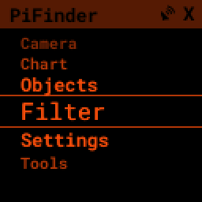
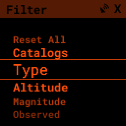

Select Type to see the deep-sky object types you can use to control which objects appear in
your object lists.

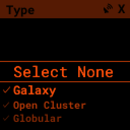
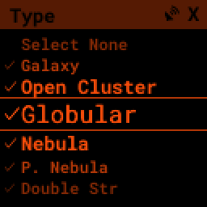

Lists that offer selections show a check-mark next to each selected option.  Press
**RIGHT** with an option highlighted to select or de-select it.

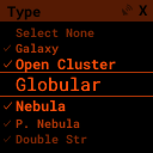

In menus that allow only a single selection, such as Altitude, selecting one option
de-selects any others.  Multi-Select menus offer options to select or de-select all items
at once.

When you're done, press **LEFT** to go back to your last menu or screen.

With this simple set of scroll-and-select tools you can reach all of the PiFinder's
features.

Quick Menu
-------------------------------------

You can reach everything through the menu system.  A secondary quick-menu brings some
functions into easier reach.

Press and hold **SQUARE** to open the Quick Menu.

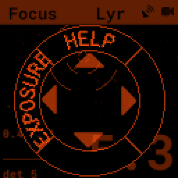

This menu presents up to four options, one per arrow button.  Press an arrow to select its
item.  The menu changes with the screen you're on, but it often has
:ref:`HELP<user_guide:help system>` at the UP option.

Some Quick Menus have a second layer.  The Object List's Quick Menu, for example, offers
Sort and Filter.  Press **LEFT** for Sort to open a ring of sort orders, with subtle
shading marking the current one.

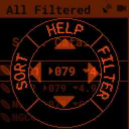
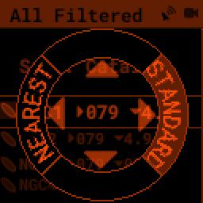

Select a sort order to apply it.  To exit the Quick Menu at any time, press **SQUARE**
again.

Help System
--------------

Many screens offer help with their button functions, and with other details about how
things work or what a screen is for.

When available, HELP is the UP option in the Quick Menu

Press **UP** to select help.  Help opens one or more pages.  A prompt at the top or bottom
of the screen shows when more pages are available.  Press **UP** or **DOWN** to scroll
through them.

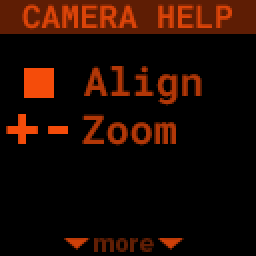
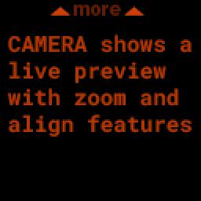

Observing with PiFinder
========================

Out under the stars, you do four basic things in various combinations:

* Curating a list of objects you're interested in
* Viewing details about those objects
* Pushing the telescope to bring them into your eyepiece
* Logging your observations

Everyone observes their own way, so use the features you want and skip the rest.

Object List
--------------------

The Object List is one of the PiFinder's main features.  It presents a collection of
objects you've selected using catalogs, filters, observing lists, and text search.

To start a list, select Objects from the main PiFinder menu, then select one of five menu
items:

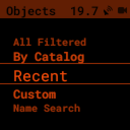

- **All Filtered**: All objects across all catalogs that meet your
  :ref:`filter criteria<user_guide:filters>`.  This could be thousands of objects, and it
  is most useful with strict filters, such as globulars above 30 degrees altitude and
  brighter than magnitude 10.
- **By Catalog**: All objects from a specific catalog that meet your filter criteria.  Great
  for observing projects and finding the nearest objects in a particular catalog.
- **Recent**: Starts empty and builds a history of the objects you've looked at during
  the current session.
- **Custom**: Enter a right ascension and declination by hand to make a one-off Custom Target.
  See :ref:`user_guide:custom targets`.
- **Name Search**: Search for objects by name with the number keypad.  The Snowball planetary?
  Cat's Eye?  This is the way to find them.

However you build the list, it always displays the same information and offers the same
sorting and selection.

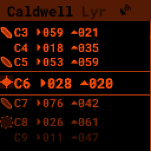

A symbol along the left shows each object's type.  Next to it is the designation, usually
the catalog abbreviation and index number, then the distance from your current telescope
position.  Each entry's brightness hints at its magnitude.

Press **SQUARE** to cycle through additional information for the objects on the list.

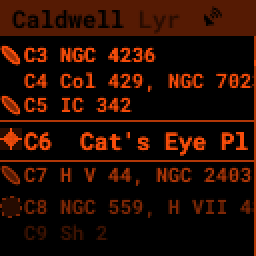

You can see a scrolling list of common names for each object.

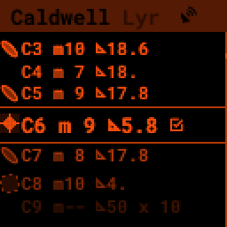

The next press shows the magnitude and size of each object, with a check mark to indicate
whether you've observed and logged it before.

Press and hold **SQUARE** to open the Quick Menu, where you can sort and filter this list.

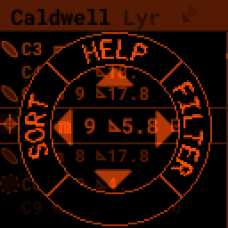

Press **LEFT** to select SORT

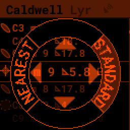

By default, lists use STANDARD order.  That is usually the order the objects appear in the
catalogs.  Press the indicated arrow to select another order such as NEAREST, which puts
the object closest to your current telescope position at the top.

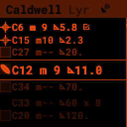

If you start typing a number, the Object List jumps to the next object with that index
number.  Press the **UP/DOWN** arrows to step to the next or previous match.  Press
**SQUARE** to exit jump mode and select an object.

Press **RIGHT** to open the details for the selected object.

Object Details
--------------------

Press **RIGHT** from the Object List to open the Object Details screen for the highlighted
object.  This screen shows large Push-To instructions,
:ref:`object images<user_guide:object images>`, and catalog details.

Press **SQUARE** to cycle through the object's information.  Press **UP/DOWN** to move to
the next or previous object in the list.  **LEFT** goes back to the full list, and
**RIGHT** opens the :ref:`Logging<user_guide:logging observations>` interface for the
current object.

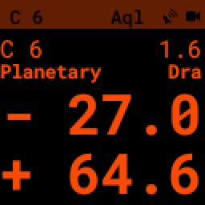

The Push-To information shows which way, and how far, to move your telescope to put the
object in your eyepiece.  As you move the telescope the numbers dim, which means the
PiFinder is using the accelerometer to estimate where the telescope points.  When you stop,
or move slowly enough, the camera plate solves to give an absolute position and the numbers
brighten again.

When the numbers are near 0.00 the object should be in your eyepiece.  The numbers are the
distance to the object in degrees, so with an eyepiece offering a 0.5 degree true field of
view, getting them below 0.25 (half the true field) should put the object in view.

Closer to zero means more centered.  For a very dim object, knowing it's dead center and
consulting the object image can make all the difference.

.. note::
   By default the Push-To arrows guide you in altitude and azimuth, the way an Alt/Az or
   Dobsonian mount moves.  On an equatorial mount, set Mount Type to Equatorial in the
   :ref:`user_guide:settings menu`.  The guidance then switches to right ascension and
   declination to match your mount's axes.

   Leave Mount Type on Alt/Az if you use an alt-az telescope on an equatorial tracking
   platform.  You still move the telescope in altitude and azimuth, and the PiFinder
   corrects for the platform's rotation on its own.

The number in the upper right is the object's
:ref:`contrast reserve <user_guide:contrast reserve>`.  It estimates how easily the object
should show in your eyepiece tonight.

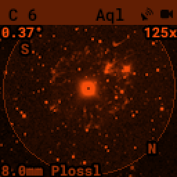

The PiFinder can show images of all the extended objects in its catalogs.  See the section on
:ref:`object images<user_guide:object images>` below for more.

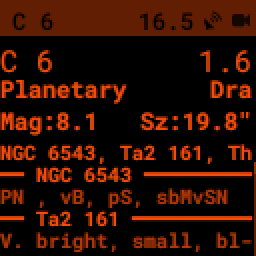

Depending on the catalog, the PiFinder may have detailed notes alongside the object's type,
constellation, magnitude, and size.  It gives the size in degrees, arcminutes, or
arcseconds, whichever best suits the object.  Use the **+/-** keys to scroll the notes.

Many objects carry more than one catalog designation, and the notes can gather a description
from each.  A bright horizontal rule labelled with the catalog and number, for example
*NGC 6543*, separates one catalog's notes from the next, so you can see at a glance where
each note comes from.  The notes finish with a count of how many times you've logged the
object, marked by its own rule (it reads *Not Logged* until your first sighting).

What each part of the screen shows
^^^^^^^^^^^^^^^^^^^^^^^^^^^^^^^^^^^

The Object Details screen packs a lot in.  These two views label every part.  The first is
the Push-To screen.  The second is the catalog details you reach by pressing **SQUARE**.

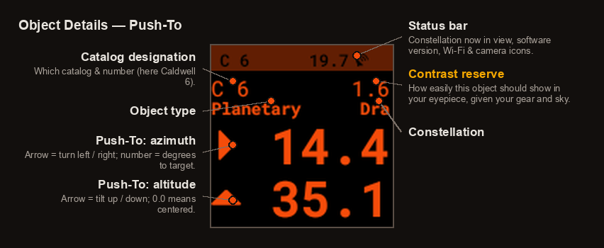

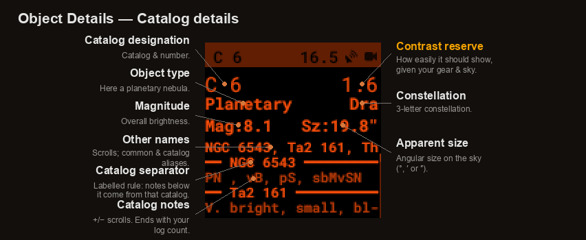

Contrast Reserve
^^^^^^^^^^^^^^^^^

The number in the upper right of the Object Details screen is the **contrast reserve**.  It
estimates how easily an object should stand out in your eyepiece.  It weighs the object's
brightness and size against your sky brightness, your telescope's aperture, and the
magnification of your active eyepiece, then compares the result to what the eye can detect.
A higher number means the object should be easier to see.

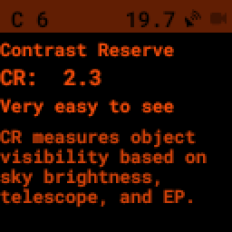

Keep pressing **SQUARE** to reach the Contrast Reserve page, which shows the value on its
own with a plain-language reading of what to expect:

.. list-table::
   :header-rows: 1

   * - Contrast reserve
     - What to expect
   * - Below −0.2
     - Object is not visible
   * - −0.2 to 0.1
     - Questionable detection
   * - 0.1 to 0.35
     - Difficult to see
   * - 0.35 to 0.5
     - Quite difficult to see
   * - 0.5 to 1.0
     - Easy to see
   * - 1.0 and above
     - Very easy to see

The contrast reserve appears only when the PiFinder has everything it needs to work it out:
an active :ref:`telescope and eyepiece <equipment:choosing your active telescope and eyepiece>`,
a sky-brightness reading, and an object with a known magnitude and size.  If any of these is
missing, the PiFinder leaves the number off.  A double star has no single magnitude, for
example, and the sky brightness is unknown until the camera has estimated it.

.. note::
   The sky-brightness figure comes from the PiFinder's Sky Quality Meter (SQM), its
   camera-based estimate of how dark your sky is.  The contrast reserve therefore tracks
   your real conditions: the same object reads higher under a dark sky than from town.
   Treat it as a guide rather than a guarantee.  Averted vision, transparency, and how
   dark-adapted you are all play their part at the eyepiece.

Sky Quality Meter
------------------

The PiFinder measures how dark your sky is from its own camera.  It reports the result in
magnitudes per square arcsecond, where higher numbers mean darker skies.  To see the
reading, select SQM from the main menu.

The screen shows the current figure in large digits, along with the Bortle class that
describes the same sky in words.  Press **SQUARE** for a plain-language description of what
you can expect to see under a sky of that class.

There is nothing to set up.  The PiFinder recognises its own camera and starts measuring
when you turn it on.  The reading needs no plate solve, so it keeps updating through thin
cloud and through frames with too few stars to solve.

The :doc:`Sky Quality Meter page <sqm>` covers the screen in full, explains what the number
means, and describes the optional calibration wizard: when you need it, how to run it, and
what it changes.

Star Chart
-------------

The Star Chart, reached from the main PiFinder menu, draws a live map of the sky around
where your telescope points, with constellation lines and markers for nearby objects.  It
redraws as you move the telescope, so it is a quick way to see what is around you and
confirm your aim.  Zoom in and out with the **+/-** keys.

Deep-sky objects show as small symbols, one shape per object type.  Near where you point,
the chart marks the objects your :ref:`filters <user_guide:filters>` allow.  It reveals
fainter ones as you zoom in and keeps only the brightest as you zoom out, so the field never
crowds.  The chart also marks objects on a loaded observing list.  To dim these markers, or
switch them off, use the DSO Display setting under Chart... in the
:ref:`user_guide:settings menu`.

A brighter cross marks the object you last opened in :ref:`user_guide:object details`,
wherever you steer.  It is a quick way to see where that object sits relative to your aim.
On the chart the cross carries the object's designation, "M 57" for example.  Once the
object drifts off the edge, an arrow at the rim points the way instead.  The cross stays
bright even with DSO Display turned off.

A line along the bottom of the chart names the center object, the marker nearest the middle
of the chart.  It gives the object's designation and the first other name the catalogs carry
for it, "NGC 7000 North America nebula" for example.  Text too long for the line scrolls
across it.  With RA/DEC Disp. turned on, the
coordinates keep the bottom line and the center object sits just above them.

Press **RIGHT** to open that object's :ref:`user_guide:object details`.  The arrow at the
right of the line is a reminder of that key.  In the details screen, press **LEFT** to come
back to the chart.  Press **UP/DOWN** to step outward through the chart's other markers,
nearest first.

Only markers the chart has drawn can take the line, and only while they are on screen.  The
readout never names something you cannot see.  With DSO Display off, the cross is the only
marker left, so the line goes blank once the cross drifts off the edge.  The readout also
holds its choice until another marker comes clearly closer, so it does not flicker between
two markers as your aim drifts.  To switch the line off, set Center Object to Off under
Chart... in the :ref:`user_guide:settings menu`.  **RIGHT** then does nothing on the chart.

You decide how the chart is turned.  Select Coordinate Sys. under Chart... in the
:ref:`user_guide:settings menu`:

- **Horizontal** (the default) keeps the horizon level and the zenith up, matching what you
  see with the naked eye.
- **EQ (Auto)** lines the chart up with the celestial pole: north-up in the northern
  hemisphere, south-up in the southern.
- **EQ (North-up)** and **EQ (South-up)** force north-up or south-up wherever you are.

The chart labels what is currently at the top, so you always know how it is oriented.  The
labels are "Zenith up", "NCP up" (north celestial pole), and "SCP up" (south celestial
pole).  The same orientation applies to the Align screen.

.. note::
   The chart works before the PiFinder has a GPS fix.  The Horizontal and EQ (Auto) modes
   need to know where you are to orient themselves.  Until GPS locks, or you
   :ref:`enter your location by hand <user_guide:place & time>`, the chart falls back to
   north-celestial-pole-up.  It marks the label with a leading "!", for example "!NCP up",
   to show that the orientation is temporary and settles once your location is known.

Filters
----------

Every object list aside from :ref:`user_guide:name search` and Recent shows only objects
that meet the filter criteria you've set.  View and adjust your filters from the Set
Filters menu, the last item in the Objects menu.

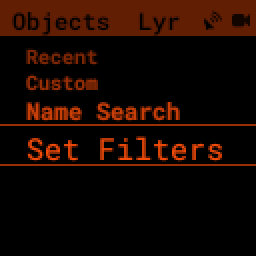

You can also reach the filter options from the :ref:`user_guide:quick menu` on the Object
List screen.

The Set Filters menu offers several ways to limit which objects appear, plus a Reset All
option to clear every filter.

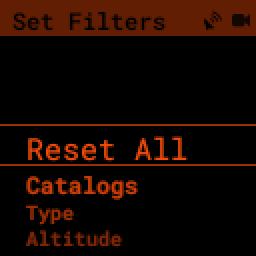

With no filters set, every available object appears.  The All Filtered list then shows over
18,000 objects.

Some filter types take a single value, like Altitude, and some allow multiple selections,
like Object type.  Here's a brief explanation of each:

- **Catalogs**: Limit which catalogs the All Filtered list includes.  This is distinct from
  the catalog-specific object lists, which are a shortcut to one catalog.  Using the
  Catalogs filter, the All Filtered list can show globular clusters across multiple
  catalogs at once.
- **Type**: Limit by object type.  You can select multiple types to include.
- **Altitude**: The current apparent altitude of an object from your observing location.
- **Magnitude**: Limit to objects at least as bright as the selected magnitude.
- **Observed**: Include only objects you've logged, never logged, or any logged state.

Catalogs Filter
^^^^^^^^^^^^^^^^^

The PiFinder has many catalogs, so this menu groups them by category.

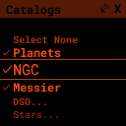

Common catalogs appear at the top level for quick reference.  Less common ones sit in
sub-categories marked with an ellipsis (...).

Here's the DSO... category as an example:

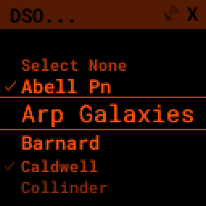

Selected catalogs show a check box, and you may see the same catalog, like Messier, in
multiple spots.  Selecting or de-selecting anywhere changes its state everywhere.

Name Search
------------

Name Search is a powerful way to search the PiFinder's large object database.  It finds
objects by their common name, like the Cat's Eye nebula.  To reach the Name Search screen,
select it from the Objects menu:

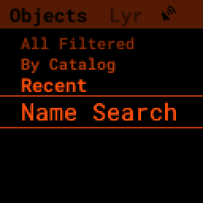

It uses multi-tap text input, like the cellphones from the dawn of text messaging.  The
on-screen keypad shows the letters you get by pressing each number key several times in a
row.

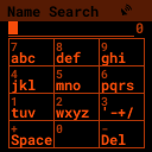

Each number key generates its number, then the three or four letters shown, in turn.  Pause
long enough between presses, or press a different key, and the cursor moves to the next
position.

To press each key just once, switch the search input to T9.  Every press enters its digit,
and the PiFinder matches the digit sequence against the letters of each object name, so
``1897`` finds Vega.  Select Multi-Tap or T9 under Search Input in the
:ref:`user_guide:settings menu`.  You can also press and hold **SQUARE** here and select
Input from the :ref:`user_guide:quick menu` to reach the setting directly.

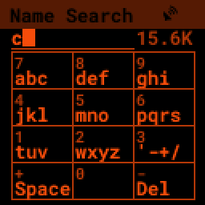

As you type, the PiFinder shows how many objects match your search term, to the far right
of your text.

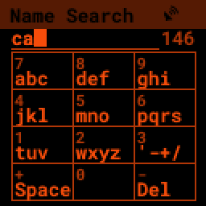

The count drops as you add more text.

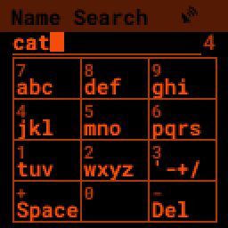

Once you've narrowed the list enough, press **RIGHT** to see the full list of matches.

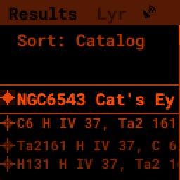

Custom Targets
---------------

Sometimes the object you're after isn't in any catalog: a newly discovered comet, or a
position from a chart or article.  Select Custom from the Objects menu to enter a right
ascension and declination by hand, then push to it like any other object.

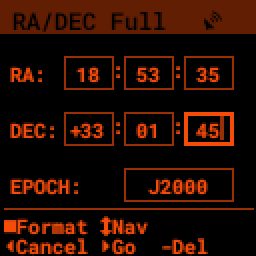

Type the coordinates with the number keys.  The **UP/DOWN** arrows move between fields, and
**-** deletes the last digit.  Press **SQUARE** to cycle the entry format: full
hours/minutes/seconds (shown above), decimal hours and degrees, or decimal degrees for
both.  The title bar names the active format.  With the declination degrees selected, **+**
flips its sign.  On the EPOCH field, **+** cycles between J2000, JNOW, and B1950.

When the numbers look right, press **RIGHT** to create the target.  The PiFinder makes a
one-off object, opens its :ref:`Object Details<user_guide:object details>` screen with
Push-To guidance, and adds it to the Recent list so you can return to it during the
session.  Press **LEFT** to go back without creating anything.

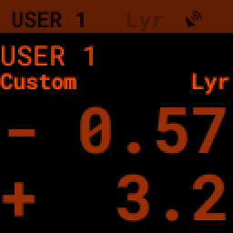

Observing Lists
---------------

You can bring a session you planned ahead of time to the eyepiece, whether you built it in
SkySafari or a spreadsheet, or a fellow observer shared it with you.  Copy the list file
into the ``obslists/`` folder of the PiFinder's :ref:`shared data
folder <connectivity:shared data access>`, then load it from Obs Lists in the Objects
menu.

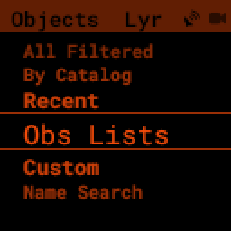

The PiFinder reads observing lists in all of these formats.  It recognizes each by its file
extension and, for ``.txt`` files, by the content itself:

.. list-table::
   :header-rows: 1

   * - Format
     - Extension
   * - `SkySafari observing list <https://support.simulationcurriculum.com/hc/en-us/articles/236161107-SkySafari-5-Observing-Lists>`_
     - ``.skylist``
   * - PiFinder native
     - ``.pifinder``
   * - CSV
     - ``.csv``
   * - `Stellarium observing list <https://stellarium.org/guide/>`_
     - ``.sol``
   * - `Autostar / Meade tour <http://www.weasner.com/etx/autostar/as_tours.html>`_
     - ``.txt``, ``.mtf``
   * - `Argo Navis catalog <http://www.wildcard-innovations.com.au/downloads/documentation/argoman10.pdf>`_
     - ``.txt``
   * - `NexTour / Celestron tour <https://www.nexstarsite.com/PCControl/NexRemote.htm>`_
     - ``.hct``
   * - `EQMOD tour <https://eq-mod.sourceforge.net/tour/>`_
     - ``.lst``
   * - Plain text, one object name per line
     - ``.txt``

The Obs Lists screen shows every list it finds, along with any folders.  Folder names appear
in ``[brackets]``, so you can organize lists into subfolders by trip, season, or source.
Scroll with the **UP/DOWN** arrows and press **RIGHT** to open a folder or load a list.

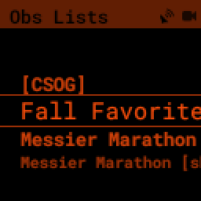

When two lists share a name, such as ``Messier Marathon.skylist`` and
``Messier Marathon.csv``, the PiFinder appends the format to tell them apart, as in the
image above.

Loading a list matches each entry against the PiFinder's catalogs, briefly reports how
many objects matched, and opens the result as a regular
:ref:`Object List <user_guide:object list>` you can sort, browse, and push to.

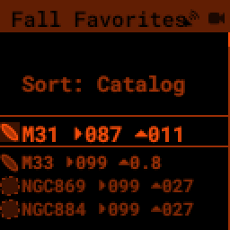

Entries that match a catalog behave exactly like objects you find by browsing.  Images,
descriptions, and your observation logs all come along.  An entry the PiFinder cannot
match, but that includes coordinates, becomes a one-off object under the code OBS, so
nothing on your list is left behind.

.. note::
   The ``.pifinder`` format is the PiFinder's own JSON list format.  Use it when a planning
   tool offers it, because it carries catalog references, magnitudes, object sizes, and
   coordinate epochs that the other formats drop.  The `observing-list formats reference
   <https://github.com/brickbots/PiFinder/blob/main/docs/ax/catalog/obslist-formats/README.md#the-pifinder-format>`__
   documents its fields, JSON schema, and a worked example.

Importing a CSV list
^^^^^^^^^^^^^^^^^^^^^

CSV is the format to reach for when another tool gives you a list as plain columns: a
spreadsheet, an observing planner, or a sky atlas.  The first line is a header naming the
columns.  The PiFinder reads them by name, so their order does not matter and the case is
ignored.  Only ``Name`` is required, plus coordinates so the PiFinder knows where to point:

.. list-table::
   :header-rows: 1

   * - Column
     - Holds
   * - ``Name``
     - A label for the row, e.g. ``M 3`` or ``My comet``.
   * - ``RA`` / ``Dec``
     - Right ascension and declination (see the coordinate forms below).
   * - ``Magnitude``
     - Brightness, optional.
   * - ``Type``
     - Object type such as ``Gx`` or ``PN``, optional.

The PiFinder accepts common spellings of those headers too.  ``ra``, ``dec``, ``mag``,
``RA_deg`` and ``Dec_deg`` all work.  The RA header can also carry the unit: the PiFinder
reads a decimal under ``RA_h`` or ``RA_hours`` as hours, and one under ``RA`` or ``RA_deg``
as degrees.  Write coordinates in any of three forms:

.. list-table::
   :header-rows: 1

   * - Form
     - RA example
     - Dec example
   * - Decimal degrees
     - ``205.8583``
     - ``+28.244``
   * - Colon-separated
     - ``13:43:26``
     - ``+28:14:39``
   * - Sexagesimal
     - ``13h 43m 26s``
     - ``+28° 14' 39"``

The PiFinder reads a decimal right ascension as **degrees** (0–360) unless its header names
hours.  A small list looks like this::

   Name,RA,Dec,Magnitude
   My target,205.8583,28.2442,6.3
   Comet 2024X,250.667,36.411,11.0

Each row resolves the same way as any other observing list.  If its name matches a catalog
object, you get that object with its images, descriptions, and your logs.  Matching ignores
spacing and capitalisation, so ``M 13``, ``M13`` and ``NGC 224`` all work.  If the name
matches nothing, the PiFinder uses the row's own coordinates as an OBS target.  To keep your
exact coordinates for an object the catalog would otherwise recognize, give the row a name
the catalog does not match.  A prefix, as in ``_M 3``, is enough.

For the complete column reference, see the `observing-list formats reference
<https://github.com/brickbots/PiFinder/blob/main/docs/ax/catalog/obslist-formats/README.md#csv-import>`__.
It covers every accepted header spelling, the coordinate forms, and the import notes.

Object Images
---------------

If you used the prebuilt PiFinder image, or have
:ref:`downloaded<software:catalog image download>` the set of catalog images, you can see
what the selected object looks like in sky-survey images.  These appear in the background of
the :ref:`user_guide:object details` screen.  Press the **SQUARE** key to cycle through the
pages of information about each object and view the images in full detail.

The PiFinder rotates each image to match the view through your eyepiece at your position and
time, which helps you identify the faintest objects.

Zoom in and out with the **+/-** keys.  The FOV appears at the bottom of the image, so you
can match it to your eyepiece.

As an example, here are the images available for M57

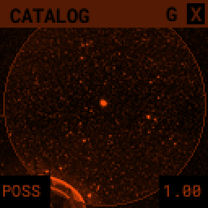

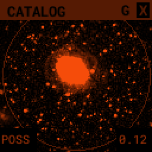

These images match the view through your eyepiece for the telescope you're using, pointing
at a specific area of sky from your current location.  By default they are oriented for a
Newtonian reflector.  If you use a refractor, or an SCT with a star diagonal, set the
orientation options for your telescope as described in :doc:`equipment`.  Use the **+** and
**-** keys to switch between the fields of view of the eyepieces you configured in the
:ref:`Web Interface <connectivity:web interface>`.

Two overlays help you read the image.  Letters near the edge of the field mark the cardinal
directions, so you can relate the view to a chart.  You see two of N, S, E, and W,
depending on how the image is rotated.  A thin outline traces the object's cataloged size
and orientation.  When only the bright core shows in the eyepiece, that outline gives you a
feel for the object's full extent.  You can switch both overlays off under Image... in the
:ref:`user_guide:settings menu`.

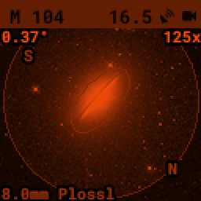

The bottom left of the screen shows the source of the current image, and the left side
shows the current FOV information.

Logging Observations
-----------------------

Press the **RIGHT** arrow while viewing any object's details to open the logging interface.
There you add context about your observation and save it to your log.

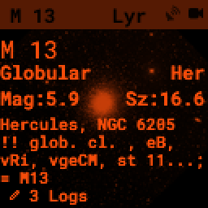
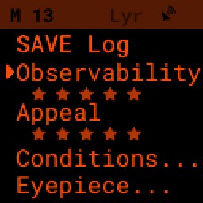

Use the **UP/DOWN** arrows to select one of the four context items to change:

- **Observability**: How easy is it to spot and recognize this object
- **Appeal**: Your overall rating.  Would you recommend it to a friend?

Set these first two with a number key from 1 to 5, or press the **RIGHT** arrow to cycle
through the stars.

- **Conditions**...

  - **Transparency**: A relative measure of contrast.

  - **Seeing**: The stillness of the atmosphere.

- **Eyepiece**: Note which of your eyepieces you're using.

When you're done, use the **UP/DOWN** arrows to select **SAVE LOG** and record your
observation.  You can also save straight away, with no context, just to note that you
observed an object.

Observing Projects
--------------------

If you're like me, you may enjoy observing projects, such as working through all the
Messier or Herschel objects.  The PiFinder makes these long-term efforts easy.  Log each
object, and it then shows you only the objects you have left that are visible during a
session.

Combine a :ref:`filter<user_guide:filters>` on observation status with an object list
sorted by NEAREST to work through a collection easily.

Power & Charging
=====================================

Every rev4 PiFinder has an internal battery, good for a full night on a single charge.  You
can also keep one running indefinitely from any USB-C power source.  This section covers the
power button, how charging behaves, what the battery indicator tells you, how long a charge
lasts, and how to look after the cell.  For the first time you turn one on, the
:ref:`quick_start:powering the pifinder` section of the Quick Start walks through it step
by step.

Power button and shutdown
-------------------------

To turn the PiFinder on, press and hold the button marked **PWR**, on the front below the
keypad, for about two seconds.  The **PWR** label lights while the PiFinder starts up, and
goes out once the screen and keypad come up.

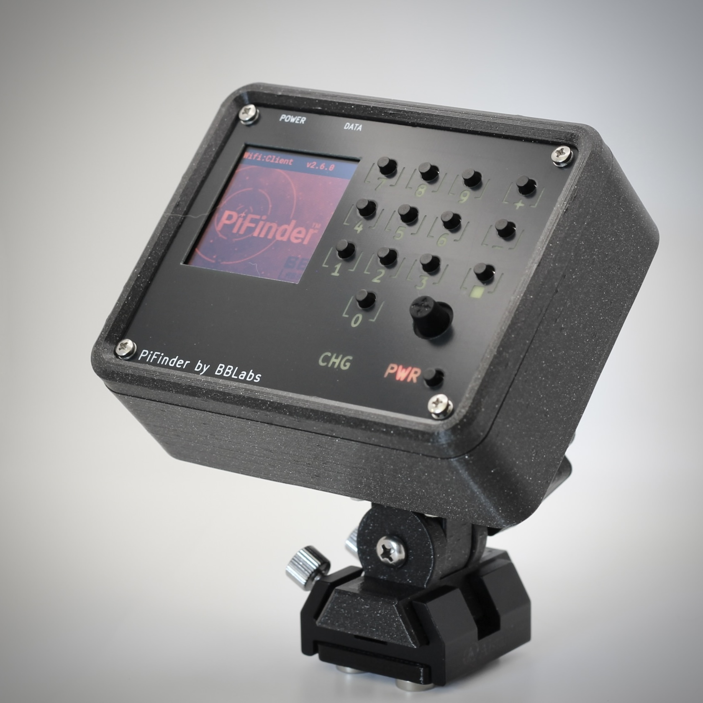

To shut down, press and hold the button again for about a second.  The screen goes straight
to the shutdown confirmation.  A second press confirms it, a tone plays, and the PiFinder
turns itself off once it has closed everything down safely.  In normal use you never need to
cut the power by hand.  If the software ever hangs and will not shut down, press and hold
**PWR** for more than 14 seconds to reset the power system.  See
:ref:`troubleshooting:the pifinder won't turn on`.

The menus get you to the same place if your hands are already on the keypad.  See
:ref:`user_guide:shutdown`.

.. note::
   On v3 and v2.5 PiFinders power is a small white **slide** switch above the screen:
   facing the screen, slide it right for on and left for off.  Shut down from the menus
   first, then slide the switch off.
   |v3_docs|

Charging
--------

Two USB-C ports sit on top of the case, each named on the faceplate just below it:

- **POWER** runs the PiFinder and charges the battery.  This is the one to plug a charger
  or a power bank into.
- **DATA** is for connecting accessories, such as the PiFinder remote or other USB
  devices.

From empty, a full charge takes about six hours with the PiFinder turned off.  Charging
draws up to **1.5A**, so use a supply that can deliver it.  A weaker source charges
proportionally slower.

You can carry on observing while the battery charges.  There is no need to turn the
PiFinder off first.  Expect the charge to take considerably longer that way, because the
PiFinder consumes much of what the charger supplies.  A long charge that leaves the battery
still low almost always means the PiFinder was running the whole time.

A charge indicator labelled **CHG** lights while the battery is charging and goes out once
it's full.  It is red, but bright enough to be distracting once your eyes are dark adapted,
so it's worth knowing what it is before it appears beside you at the eyepiece.

.. note::
   The last stretch of charging is slow.  As the cell approaches full the charging current
   tapers off, so the **CHG** light can stay on for a while after the battery is nearly
   there.  That's normal, not a fault.

.. note::
   v3 PiFinders charge through the optional **PiSugar S Plus** board rather than an
   on-board charger.  Charge a v3 with the slide switch **off**, because one left running
   barely fills at all.  Use the port nearest the back of the case.  Its indicator glows
   blue while charging and green when full, and a full charge takes roughly three hours.
   The port nearest the keypad runs the PiFinder without charging.  It is wired ahead of
   the slide switch, so plugging into it turns a v3 on regardless of the switch position.
   |v3_docs|

The battery indicator
---------------------

The title bar carries a battery glyph, just left of the GPS and solver icons.

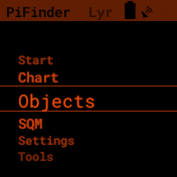

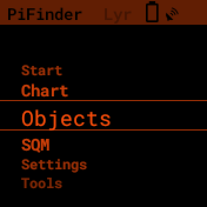

It estimates **how much longer the PiFinder will run**, not how much charge is left in the
cell.  Take it as a guide to the rest of the evening rather than a precise figure, and
expect it to err on the cautious side.

The glyph empties in coarse steps rather than counting down smoothly, and shows a hollow
outline for the last stretch.

While the battery is charging, a bolt appears in place of the usual glyph.

.. note::
   v3 and v2.5 PiFinders have no battery indicator.  The PiSugar board's charge state isn't
   visible to the PiFinder software, so nothing appears in the title bar.
   |v3_docs|

Low-battery warnings and automatic shutdown
-------------------------------------------

The PiFinder warns you twice as the battery runs down: once when the estimate reaches
**10%**, and again at **5%**.  Each is a brief message on screen with a sound to match.

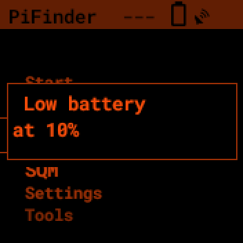

Measured on the bench under a continuously solving load, the 10% warning arrives about an
hour and a half before the end, and the 5% warning about half an hour before it.  Lighter
use stretches both.  Each warning appears once per discharge rather than repeating, so it
does not nag you for the rest of the night.  Plugging in re-arms them for next time.

When the battery is nearly flat, the PiFinder shows a final warning, plays the shutdown tone
and shuts itself down cleanly.  It stops deliberately rather than letting the power cut out
on its own.

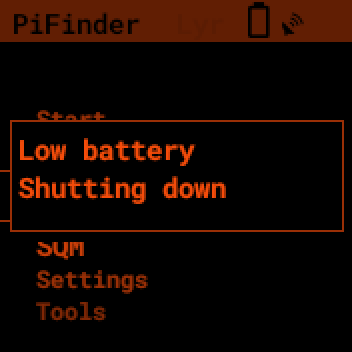

Battery life
------------

A full charge of the 8,000mAh cell runs the PiFinder for about **ten hours**.  Treat that as
a floor rather than an average.  It was measured with the camera solving continuously, the
screen at full brightness and the screen sleep turned off, which is harder work than a real
night at the eyepiece.  Sitting on one object, or stepping away from the telescope, lets the
PiFinder drop into power-save mode and stretches the time considerably.  Turning the
brightness down helps too.  Hold **SQUARE** and press **+** or **-** to adjust the screen
and keypad at any time.

.. note::
   The PiFinder drops into power-save mode after it has been idle for a while.  It dims the
   screen and slows the camera to save power.  Any key press, or movement of the telescope,
   wakes it.  You can change the idle time, or turn it off entirely, in the
   :ref:`user_guide:settings menu`.

Running on external power
-------------------------

Any USB-C source rated for at least **2A** runs the PiFinder: a wall charger, a USB power
bank, or a portable power station's USB output.  Plug it into the **POWER** port.  The
PiFinder then runs from it and tops the battery up at the same time, and you can add
external power mid-session without restarting.  As a rough guide, about 1,000mAh of
power-bank capacity runs the PiFinder for an hour, so a 10,000mAh bank is good for the
better part of a night.

If you hit power dropouts, suspect the cable first.  Some USB-C cables are unreliable at
the ~2A the PiFinder draws, especially on long runs.

.. note::
   On a v3, the port nearest the keypad runs the PiFinder without charging.  That makes a
   useful trick for stretching a long night.  Plug a power bank into that port and turn the
   battery **off**.  The PiFinder then runs on external power, with the cell held in
   reserve for after you unplug the bank.
   |v3_docs|

.. warning::
   Feed the PiFinder **5V USB-C power only**.  To run it from a telescope's 12V supply, you
   must use a 12V-to-5V step-down (DC-DC) converter with a USB-C output.  Never connect 12V
   directly to the PiFinder.  That will damage it.

Battery safety & care
---------------------

The internal battery is a lithium-polymer (LiPo) cell.  Treat it sensibly and it lasts for
years, but like any lithium battery it deserves a little respect.

.. warning::
   Stop using the battery and disconnect power if it ever becomes **swollen, damaged,
   unusually hot, or develops an odour**.  A puffed-up or punctured LiPo cell can vent or
   catch fire.  Do not continue to charge or use a cell in this condition.  Contact us
   about a replacement.

.. warning::
   Do not **puncture, crush, drop, or open** the battery, and don't open the case to get at
   it.  Keep the PiFinder dry.  The battery and electronics are not waterproof.

A few habits keep the cell healthy:

- **Charge through the POWER port only.**  The PiFinder's own charger looks after the cell,
  so just supply 5V USB-C as described above.  There is no need for an external LiPo
  charger, and you should not connect one.
- **Charge where you can keep an eye on it,** and not on or near anything flammable.  Do not
  charge or leave the PiFinder in extreme heat.  A closed car on a sunny day is the classic
  way to cook a battery.
- **Mind the temperature.**  Observers report using the PiFinder from about -15°C (5°F) to
  45°C (110°F).  That range describes the whole PiFinder in the field, not a separate
  battery rating.  Capacity drops in the cold, though the computer's own heat keeps the cell
  warm enough to work in most conditions.  Do not charge a battery that is below freezing.
- **For long-term storage,** leave the cell partly charged rather than full or empty and keep
  it somewhere cool and dry.  Top it up every few months so it does not discharge completely.
- **Dispose of it responsibly.**  Take a worn-out lithium battery to a battery-recycling
  drop-off, not the household rubbish.

.. note::
   On a v3, the battery and its charger are the optional **PiSugar S Plus 5000mAh** board,
   which is also the only compatible replacement part.  Other PiSugar models share the I2C
   bus with the PiFinder's motion sensor and cause problems, so make sure you fit the
   S Plus.  Don't attempt to disassemble the board itself.
   |v3_docs|

Settings Menu
==============

All user-configurable items live in the Settings Menu, near the bottom of the main
PiFinder menu.

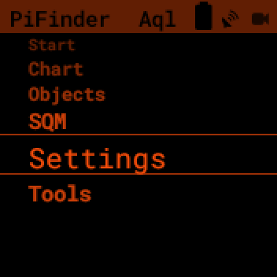

The top items collect several options under User Preferences, the Chart Screen, and the
:ref:`object image <user_guide:object images>` overlays.  An ellipsis (...) indicates
more options below.

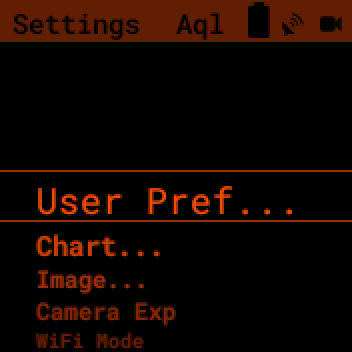

Below the general UI options are settings for which :ref:`connectivity:wifi` mode your
PiFinder is in, and for its physical configuration.

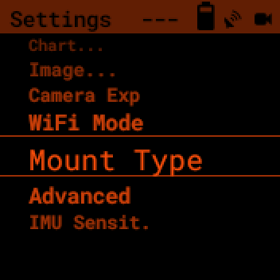

The Advanced submenu, near the bottom of the Settings Menu, holds the hardware setup you
normally configure once: PiFinder Type, Camera Type, and GPS Settings (type and baud rate).
Opening it shows a brief "Options for DIY PiFinders" reminder, because on a fully built
PiFinder these already match your hardware.

Sounds
------

A rev4 PiFinder has a small buzzer.  It plays a short tone on each key press, at startup
and shutdown, and with every low-battery warning.  The Volume menu item, in User
Preferences, sets how loud they are.  Its options are Off, or 1 through 5.  Selecting a
level plays a sample tone at that level, so you can set it by ear.

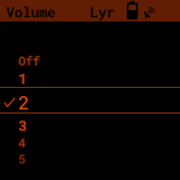

The tones vary in loudness by design: the buzzer is far louder at some pitches than
others, so a cue pitched away from its loudest note sounds softer.  Set Volume to Off if
you'd rather observe in silence.

.. note::
   v3 and v2.5 PiFinders have no buzzer.  The Volume setting appears on those PiFinders too,
   but nothing sounds.
   |v3_docs|

Connectivity
==============

The PiFinder hosts its own WiFi network, ``PiFinderAP`` (no password), so your phone or
tablet can join it anywhere.  It can also join your home network instead.  Switch between
the two modes from the :ref:`user_guide:settings menu`, and check the current mode and
address on the :ref:`user_guide:status screen`.  From a connected device the PiFinder
answers at ``http://pifinder.local``.  The :doc:`connectivity` page covers the web
interface, SkySafari and other planetarium apps, and the shared data folder.

Tools
==========================

Near the bottom of the main PiFinder menu, the Tools menu item leads to a set of screens
that aren't observing-related but provide useful information or let you perform actions:
checking the PiFinder's :ref:`status<user_guide:status screen>`, selecting your active
:doc:`telescope and eyepiece <equipment>`, setting your place and time by hand,
:ref:`updating the software<user_guide:update software>`, and
:ref:`shutting down<user_guide:shutdown>` or restarting.

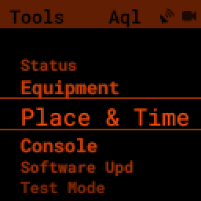

For the full tree and a note on what every item does, see the
:ref:`Tools section of the Menu Map<menu_map:tools>`.  The sections below cover the screens
you reach for most often.

Status Screen
----------------------------------

The Status Screen is the central place to check the PiFinder's current state and operation.

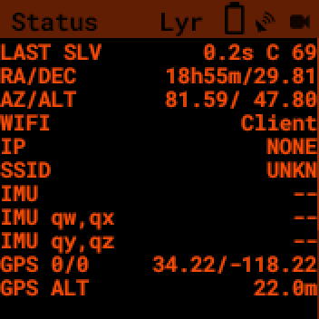

Some of the key information shown:

- The current solver state, as LAST SLV on the top line.  It shows the seconds since the
  last plate solve, the solve type (i for IMU or C for camera), and, for a camera solve,
  the number of stars matched.
- WiFi information a bit further down, including the current WiFi mode, network name, and
  IP address.
- The GPS rows near the bottom.  The list is longer than the screen, so scroll down to
  see them.  GPS MSG names the last message from the GPS receiver, with how long ago it
  arrived.  On a healthy link the names change constantly and the age stays under a
  second.  A frozen name with a climbing age, or names starting with ``?``, point to a
  GPS problem.  See :ref:`troubleshooting:the gps never locks`.

Place & Time
----------------------------------

The PiFinder needs to know where and when it is to turn the sky's coordinates into the
directions it gives you.  Its built-in GPS handles this automatically.  You do not have to
wait for a fix, or have GPS at all, to get going.  Open Tools, then Place & Time, to set
everything by hand.

Set Location gathers the ways to manage your observing site:

- **Enter Coords** lets you type your latitude, then longitude, then altitude with the
  number keys.  The **+** key flips the sign for southern latitudes and western longitudes.
- **Load Location** recalls one of your saved sites, and **Save Location** stores the
  current one so you can select it again next time.

Set Time/Date sets the clock when there's no GPS.  Enter the time, and the PiFinder moves on
to a date-entry screen.  The PiFinder protects a time you set by hand, so a later GPS fix
does not overwrite it and your manual clock stays put.  Reset Location and Reset Time/Date
discard what's set, if you'd rather start fresh or hand control back to GPS.

.. note::
   With your location and time set by hand, the PiFinder is fully usable without a GPS
   signal.  You can focus, align, browse objects, and push to them.  The
   :ref:`user_guide:star chart` and Align screens also work before a GPS lock.

Getting a GPS lock
----------------------------------

The PiFinder's GPS receiver takes a few minutes to work out where it is.  This is normal,
and it is the part of the first night that surprises people most.  Knowing what the
receiver is doing saves you from chasing a fault that isn't there.

Before it can fix a position, the receiver has to download orbit data from the satellites
themselves.  That download runs at a slow, fixed rate, so it takes several minutes however
good your sky is.  Expect longer after the PiFinder has been off for a while, or when you
have travelled a distance since the last session.  Later nights at the same site are
quicker, because the PiFinder still holds usable data.

Open the Start menu and select GPS Status to watch progress.  That screen turns the camera
off, which cuts electrical noise and helps the receiver hear more satellites.  It shows
**Lock boost on** while it does this.  Leave the PiFinder on that screen and let it work.

Four things are worth knowing while you wait:

- **"Sats seen/used: 0/0" is not a progress bar.**  It reads 0/0 for most of the wait and
  then climbs quickly near the end.  A long run of zeros does not mean the receiver has
  failed or that the sky is blocked.
- **Leave the PiFinder on.**  Turning it off and on again restarts the download from the
  beginning.  Rebooting every few minutes to check on it is the one reliable way to never
  get a lock.
- **Your phone is not a fair comparison.**  Phones use assisted GPS.  They download the same
  orbit data over the mobile network in seconds and already know roughly where they are.  A
  phone showing dozens of satellites next to your PiFinder tells you nothing about
  conditions.
- **Give the receiver a clear view.**  It needs open sky.  Indoors, under a roof, or hard up
  against a wall all slow it down or stop it.

Once the fix arrives, the Lock Type on the GPS Status screen tells you how good it is:

- **Accurate** is a 2D fix.  It gives latitude and longitude without altitude.
- **Precise** is a 3D fix, which adds altitude.

Both are plenty.  The PiFinder only needs a rough position on Earth to point your telescope,
so a night that reads Accurate works exactly as well as one that reads Precise.  **Limited**
and **Basic** appear before a full fix, while the receiver is still settling.

.. note::
   You do not have to wait.  If the sky is good and you would rather start observing, enter
   your location and time by hand as described above.  Everything works from there.

Update Software
------------------

The PiFinder can download and install software updates directly from its screen and keypad.
To start, select Software Upd from the :ref:`user_guide:tools` menu.

Updates happen on the PiFinder itself, so there is no need to send it anywhere.  New PiFinders
often ship a version or two behind the latest release, so running an update is a normal part
of your first night out.

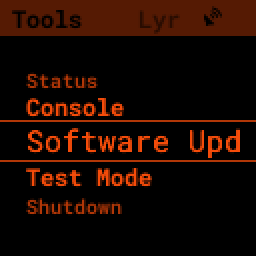

The PiFinder needs internet access, so put it in Client Mode connected to a WiFi network.
See :ref:`connectivity:connecting to a new wifi network` for details.

The PiFinder confirms it can reach the internet, then compares the current release version
to the one installed.

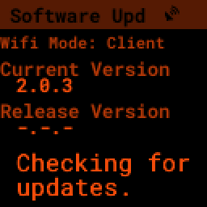

.. note::
   If the release version shows as **unknown**, the PiFinder cannot reach the internet to
   check.  It is either in Access Point mode, or its WiFi is not configured.  Put it in
   Client mode on a network with internet access (see
   :ref:`connectivity:connecting to a new wifi network`).  Re-imaging the SD card is not the
   fix for this.  If WiFi is configured but the check still fails, move closer to the
   router or re-enter the network details.

If a new version is available, select the option presented to start the update.  This may
take several minutes, and the PiFinder restarts when it's done.

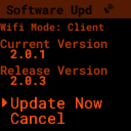

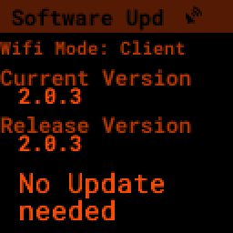

You can also download a pre-built image of any software release and write it to the
PiFinder's SD card.  See our `release page <https://github.com/brickbots/PiFinder/releases>`_
for information about each release and a download link.

Instructions for writing release images to an SD card are on the :doc:`software setup<software>`
page.

Polar Alignment
---------------------------

An equatorial platform or equatorial mount tracks the sky by turning your telescope around a
single axis that's meant to point at the celestial pole.  That axis is the platform's pivot,
or the mount's right ascension axis.  The closer it is to the true pole, the longer objects
stay put in the eyepiece.  The Polar Alignment tool measures how far your axis sits from the
pole and walks you through correcting it.  It works from ordinary plate solves, so you need
no polar scope and no sight of Polaris.

It lives near the bottom of the main menu: open Tools, scroll down to Experimental, and
select Polar Align.

The tool solves the sky at two or three points while you rotate around that axis between
them.  You turn the platform, or slew the mount in right ascension only.  The PiFinder then
works out where the axis points from how the view shifts.  The measurement is only as good
as the solves behind it, so before you start make sure the PiFinder has a GPS lock, is
focused, and is solving reliably.  Turn your mount's or platform's sidereal tracking off as
well, because the measurement assumes the telescope holds still except when you rotate it
yourself.

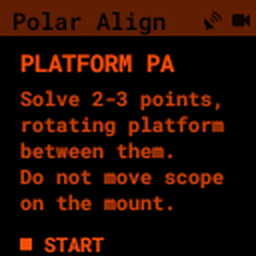

.. note::
   This aligns the rotation *axis*, not the PiFinder to your eyepiece.  The one rule that
   matters: between captures, move only *around* that axis.  On a platform, keep the
   telescope clamped to the platform and rotate the platform.  On an equatorial mount, lock
   the declination axis and slew only in right ascension.  During adjustment, move the axis
   itself with your altitude and azimuth adjusters, not by slewing the telescope.

To take a measurement, open Polar Align and press **SQUARE** to begin, then:

1. Aim the telescope near the pole and wait for the screen to report a recent solve.  Press
   **SQUARE** to capture the first point.  :ref:`user_guide:getting a good measurement`
   below gives the best aim and sweep for each mount.
2. Rotate around the axis by at least about 10°, turning the platform or slewing in right
   ascension only.  Wait for a fresh solve, then press **SQUARE** for the second point.
3. For a stronger result, rotate farther and capture a third point.  Three points let the
   PiFinder check how well the captures agree.  To stop at two points instead, press **0**
   to solve now.

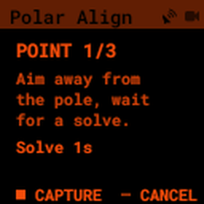

If the screen says 'Rotate more', the captures were too close together to pin down the axis.
Rotate farther and capture again.

Once it has enough rotation, the PiFinder switches to a live readout showing how far the
axis is from the pole, as push-to offsets in altitude and azimuth.  Turn your altitude and
azimuth adjusters to follow the arrows until both readings fall to zero.  On a platform
those are the platform's adjusters.  On a mount they are the polar-alignment bolts.  The
readout refreshes with each new solve.  If it shows 'No solve', hold everything still until
the PiFinder solves again.

.. note::
   Before touching the adjusters, lock *both* of the mount's axes.  Right ascension is the
   one everyone forgets, because you unlocked it to rotate between captures.  A clutch that
   slips while you work the adjusters quietly ruins the correction.  On a platform, leave
   the telescope alone entirely and adjust only the platform.

.. note::
   Turn Sleep Time off before you start.  Adjuster knobs move the telescope too slowly for
   the motion sensor to notice, so the screen dims part way through an adjustment even
   though you are working.  Only key presses hold the PiFinder awake, and the longest sleep
   delay is 2 minutes, so **Off** is the setting that suits this job.  Sleep Time sits under
   User Pref in the :ref:`user_guide:settings menu`.

   The same applies to a motorized mount at guide speed.  A slow slew may not register as
   motion, so the Push-To numbers appear to freeze and then jump when the PiFinder wakes.

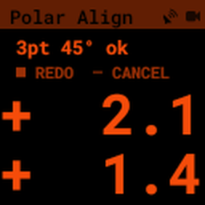

The top line summarises the measurement: the number of points used, the total sweep, and,
for a three-point solve, a fit rating of ``ok``, ``mid``, or ``bad``.  A poor fit usually
means something moved between captures that shouldn't have, so it's worth redoing.

Press and hold **SQUARE** to open the :ref:`user_guide:quick menu`, which gathers the
advanced actions.  **STATS** opens a read-only detail view.  **REDO PT** drops just the
last point so you can recapture it.  **Roll On/Off** switches between a full three-axis
fit and an RA/Dec-only fit that ignores camera roll, which is useful after a camera flop.
:ref:`user_guide:getting a good measurement` covers which fit suits each mount.

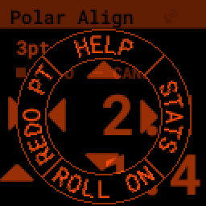

The STATS view spells out the correction in both degrees and arcminutes for each axis, the
fitted axis position, the fit quality, and how the captures were spaced in time.  That
detail helps you judge whether a measurement is trustworthy.

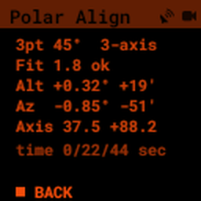

To start a fresh measurement at any time, press **SQUARE**.  To exit the tool, press
**MINUS**.

Getting a good measurement
^^^^^^^^^^^^^^^^^^^^^^^^^^

The connection between the PiFinder and the telescope is never perfectly rigid.  Small
flexures grow with how much the PiFinder's attitude changes between captures, and they show
most strongly in camera roll.  Wider sweeps are better in theory, but in practice the sweet
spot is a moderate sweep taken close to the pole, which keeps the PiFinder's attitude nearly
constant.

On an equatorial mount:

- Point the declination axis so the telescope sits roughly 7–10° off the mount's polar axis.
  Measure from wherever that axis points now, not from where the true pole is.
- Sweep roughly 30–45° in right ascension: take the middle capture with the PiFinder's
  screen roughly vertical, and the first and last captures 15–22° either side of it.
- Set Roll Off in the Quick Menu.  Flexure shows up most strongly in roll, so the fit is
  better without it.

On an equatorial platform:

- Aim the telescope close to Polaris, ideally within 5°.
- Keep Roll On.  Aimed this close to the axis, the pointing barely shifts between captures,
  so the roll change carries most of the rotation information.
- Position the PiFinder so its screen is vertical at the middle of the platform's travel.
  That also keeps the altitude and azimuth arrows matching the real directions while you
  adjust.

Expect the result to land within 20–30 arcminutes of the pole.  A very rigid connection
between the PiFinder and the telescope, plus a wider sweep, can bring that down to around
10.  That won't match a polar scope, or a routine that images through a rigidly mounted
telescope with a much smaller field of view.  It is still a solid alignment when the pole is
hidden from your site or you have no polar scope, and it is close enough to put Polaris into
a polar scope's reticle.

Shutdown
---------------------------

You do not strictly have to shut down before you cut the power, but the PiFinder is a
computer and skipping the shutdown risks file corruption.  Some MicroSD cards are more
sensitive than others.

The quickest route is the power button.  Press and hold it for about a second, and the
confirmation below appears from wherever you are.

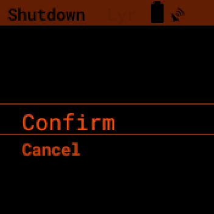

Press the power button again, or the **RIGHT** arrow, to confirm.  Press the **LEFT** arrow
to go back.  The screen and keypad turn off within a few seconds, and the PiFinder turns
itself off.

The keypad gets you to the same screen.  The Tools menu offers a Shutdown menu item under
Power, and the Quick Menu is faster:

- Press and hold **LEFT** for more than a second to jump to the main menu
- Press and hold **SQUARE** to open the Quick Menu

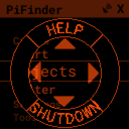

- Press **DOWN** to select the SHUTDOWN option

.. note::
   On v3 and v2.5 PiFinders there is no power button, so use the keypad route above.  Once
   the screen and keypad turn off it's safe to slide the power switch off or unplug the
   battery.
   |v3_docs|
