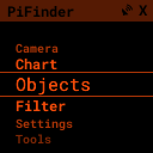

======================
PiFinder™ User Manual
======================

.. note::
   This documentation is for v3 and v2.5 PiFinders running software 2.2.0 or above.
   You can see what version of software is running by looking in the upper right of
   the welcome screen. 

   If you need docs for a previous version please choose `1.x.x <https://pifinder.readthedocs.io/en/v1.11.2/index.html>`_
   , `2.0.x <https://pifinder.readthedocs.io/en/v2.0.4/index.html>`_
   or `2.1.x <https://pifinder.readthedocs.io/en/v2.1.1/index.html>`_

Thanks for your interest in the PiFinder!  This guide describes how to use a 
PiFinder but if you want information on building one, please see the :doc
:`Build Guide <build_guide>` and the :doc:`Bill of Materials <BOM>`.

This user manual is divided into several sections which you can access using the links 
to the left.  Now, let's dig deeper into the various functions of the PiFinder!

How It Works
===============

The PiFinder is a self-contained telescope positioning device.  It will let you 
know where your telescope is pointed, provide the ability to choose a particular target 
(like a Galaxy or other DSO) and direct you on how to move 
your telescope to find that object.  There are some other nice features along with 
these core functions, but the PiFinder is designed primarily as a way to get 
interesting objects into your eyepiece so you can take a look at them.

In order to direct you to wonders of the night sky, the PiFinder needs 
to know where your telescope is currently pointed.  The primary way it does this 
is directly, by taking photos of the night sky and examining the star patterns 
to determine what section of the sky it's seeing.  It can do 
this incredibly fast (up to 20 times per second!) and very accurately.  
This only works well if your telescope is not moving, so it couples this 
very accurate system with an accelerometer to provide an estimate of how far your telescope 
has moved from the last known position.  This estimate will contain some error, 
but as soon as you stop moving the scope a new photo will be taken and any inaccuracy will be corrected.

Along with knowing where your telescope is pointing, the PiFinder knows where thousands of 
interesting objects are located. It can use these two pieces of information to indicate 
how you should move your telescope to bring any of those thousands of objects into 
your eyepiece.  Since it's directly observing where your telescope is pointing, 
you can be assured you are on target!

.. note::
   If you would like a general overview of how to use the PiFinder, please give the 
   :doc:`quick_start` a read.  This manual goes more in depth but does not cover some
   of the first time set-up items in the Quick Start

Adjusting Brightness
=====================================

The PiFinder is designed to allow you to adjust the brightness of the screen and keypad at any 
time: simply hold down the **SQUARE** button and push **+** for brighter, or **-** for dimmer. In a dark sky 
site, you can turn the brightness down to preserve your dark-adapted vision.

.. note::
   The PiFinder will dim the screen and reduce the frequency of exposures, solving, and other processes 
   when it’s been idle for a period of time. This helps save battery power and can also prevent glare 
   at the eyepiece in especially dark environments. The default is 30 seconds and this can be configured, 
   or turned off completely, in the :ref:`user_guide:settings menu`

   Pressing any button, or moving the PiFinder will wake it from power save mode.

The Menu System
=====================================

All the functions of the PiFinder can be accessed via its menu system:

Each menu is a list of items that represent a submenu, screen, or a set of options you can choose from.  You can scroll
though each menu and make selections using these keys:

- The **UP** and **DOWN** arrows will scroll the current menu
- The **RIGHT** arrow will activate the current option; selecting it or moving to another menu
- The **LEFT** arrow will take you back to the previous menu or screen
- Holding **LEFT** for more than one second will always take you back to the TOP of the menus

The status bar at the top of the screen will show the name of the menu you are currently viewing.  

Screens
--------

When you choose some menu items, like Camera, these will lead you to a specific screen such as showing the 
camera preview, a star chart or details about a particular catalog object.  Each one of the screens is
covered in more detail below.

Options
--------

Some menus present a list of options where you can choose one or more items to control how
the PiFinder operates.  For instance, the Filter menu items take you to a sub-menu of different
ways you can filter your object lists:

Selecting Type presents you with various DSO types that 
you can select to control what objects appear in your object lists.

Lists that offer selections will usually have a check-mark next to the one, or many, 
option selected.  Pressing the **RIGHT** arrow with an option highlighted will select
or de-select that item.

For some menus that only allow a single item to be selected, such as Altitude, selecting
one item will de-select any others.  Multi-Select menus have options to select or de-select
all items for ease of use.

When you are done selecting options for a particular setting, you can use the **LEFT** arrow
key to return to your last menu or screen.

With this simple set of scroll and select tools you can access all the powerful features of
the PiFinder.

Quick Menu
=====================================

Although you can access everything the PiFinder has to offer using just the menu system, we've
introduced a secondary quick-menu to bring some of those functions into easier reach.  

Hold down the **SQUARE** key to access the Quick Menu

This menu presents up to four options, one for each arrow button.  Pressing that arrow
will select that item.  This menu is different depending on what screen you are on, but 
often has :ref:`HELP<user_guide:help system>` at the UP option.

Some Quick Menus have multiple layers like the one above.  Selecting RIGHT will open the 
Background Subtraction (BG SUB) options.  To indicate a current setting, one option may
have some subtle shading.  The image below is showing that the BG SUB setting is currently
HALF.

Selecting LEFT would switch this option to FULL.  You can exit the Quick Menu at any time
by pressing the SQUARE button again.

Help System
==============

Many screens offer help with specific button functions and other details about how things 
work or the purpose of a particular page.  

When available, HELP will be the UP option in the Quick Menu

Pressing the UP arrow will select the help option and display one or more pages of help.  There
will be a prompt at the top or bottom of the screen to show if more pages are available and 
pressing UP or DOWN will scroll through them

Settings Menu
==============

All of the user configurable items for the PiFinder can be found in the Settings Menu which is near the
bottom of the main PiFinder menu

The top items collect several options together under User Preferences and Chart Screen.   The ellipsis (...) indicates
that there are more options below.

Below the general UI options are settings to change which :ref:`user_guide:wifi` mode your PiFinder is in, what its 
physical configuration is and more physical configuration items.

Observing with PiFinder
========================

When using the PiFinder under the stars to explore the universe, you'll be doing four basic things in various combinations:

* Curating a list of objects you are interested in
* Viewing details about those objects
* Pushing the scope to bring them into your eyepiece
* Logging your observations
  
Everyone has their own unique way to observe, so the PiFinder offers different ways to use (or not use!) these features
to facilitate a great night of observing.

Object List
--------------------

The Object list is one of the main features of the PiFinder.  It presents a collection of objects you've selected using 
catalogs, filters, observing lists and text search tools.  

To select a starting point for your observing journey, choose Objects from the main PiFinder menu.  You can then choose
from one of four options:

- **All Filtered**: This will show you all the objects across all catalogs that meet 
  your :ref:`filter criteria<user_guide:filters>`.  This could be thousands of objects and is most useful with very
  strict filter settings, such as only looking for globulars above 30 degree altitude and brighter than magnitude 10.
- **By Catalog**: Shows all objects from a specific catalog that meet your filter criteria.  Great for observing projects
  and looking for the nearest objects in a particular catalog.
- **Recent**: This list starts empty and will contain a history of all the objects you've checked out during your current
  observing session
- **Name Search**: Using the number keypad and T9 style text entry, you can search for objects by name.  The snowball planetary?
  Cats-Eye?  This is the way to find them!

No matter how you get objects onto the list, it always displays 
the same information and allows you to sort and select the same way.

Along the left side is a symbol showing what sort of object each line represents.  Next to that is the designation of the
object, usually the catalog abbreviation and index number, then the distance from your current telescope position to this
object. The brightness of each entry in the list gives a little hint about its magnitude.

Pressing the **SQUARE** key will cycle through additional information for the objects on the list.

You can see a scrolling list of common names for each object.

And the magnitude and size of each object along with a little check mark to indicate if you've observed and logged
this object previously.

Holding down the **SQUARE** key will bring up the Quick Menu which allows you to sort and filter this list

Pressing **LEFT** will select SORT

By default, lists are sorted in STANDARD order... usually the order they appear in catalogs.  You can choose
another sort order such as NEAREST by pressing the arrow key indicated.  Sorting by NEAREST puts the object 
that is closest to your current telescope position at the top of the list.

If you start typing a number, the Object list will jump to the next object with that index number.  You can
use the **UP/DOWN** down arrows to go to the next/previous match and use the **SQUARE** key to exit the 
jump mode and select an object.

Pressing the **RIGHT** key will bring you to details for the selected object....

Object Details
--------------------

Pressing the **RIGHT** key from the Object list will bring you to the Object Details screen 
for the highlighted object. This screen shows large Push-To instructions, :ref:`object images<user_guide:object images>` and 
catalog details for objects.

Pressing **SQUARE** will cycle through the different information for the object and **UP/DOWN** will move to the next
or previous object in the list.  **LEFT** will bring you back to the full list and **RIGHT** brings 
up the :ref:`Logging<user_guide:logging observations>` interface for the current object.

The Push-To info shows which way, and how far, to move your telescope to put the selected object in your 
eyepiece.  As you move the scope the numbers will dim a bit to indicate that the PiFinder is using the
accelerometer to provide an estimate of where the telescope is currently pointing.  When you stop, or 
move slowly enough, the camera will be able to plate solve and provide an absolute position which will
cause the numbers to brighten again.

When the numbers are near 0.00 the object should be in your eyepiece.  The numbers indicate the distance
to the object in degrees.  So if you have an eyepiece with a 0.5 degree true field of view, getting the
numbers below 0.25 (half the true field of view) should be enough to put the object within the eyepiece.

Closer to zero will mean more centered. If you are trying to find a very dim object, knowing it's right in 
the center of field and consulting the object image can really make a difference.

The PiFinder can display images of all the objects in its catalog!  
See the section on :ref:`object images<user_guide:object images>`
below for more information

Depending on the catalog, the PiFinder may have detailed notes about objects along with Type, constellation,
magnitude and size.  Use the **+/-** keys to scroll the notes field.  At the bottom of the notes is a counter
of how many times you've logged this object.

Filters
----------

All the object lists aside from :ref:`user_guide:name search` and Recent will only show objects that meet
the filter criteria you have set.  You can always view and adjust your filter settings using the Filter menu
available from the main PiFinder menu

You can also jump to the filter options using the :ref:`user_guide:quick menu` available from the 
Object List screen

The Filter menu has several ways to limit which objects appear in the object list along with a 
Reset All option to completely remove all filters.  

With no filters set every object available will appear on the object list.  
For instance the All Filtered list will show over 18,000 objects!  

Some filter types can have a single value, like Altitude, and some allow you to select multiple 
options, like Object type.  Here's a brief explanation of each:

- **Catalogs**: This allows you to limit which catalogs are included in the All Filtered list.  This 
  is distinct from the Catalog specific object lists, which are a sort of shortcut to view objects
  only from one specific catalog.  Using the Catalogs filter you can use the All Filtered list to 
  see all of the different globular clusters across multiple catalogs.
- **Type**: Limits by object type.  You can select multiple types of objects to include in your lists.
- **Altitude**: The current apparent altitude of this object from your observing location.  
- **Magnitude**: Limit objects displayed to those at least as bright as the selected magnitude.
- **Observed**: Only include objects you've logged already, never logged, or any logged state.

Catalogs Filter
^^^^^^^^^^^^^^^^^

The PiFinder has many different catalogs so this menu groups them by categories.

.. image:: images/user_guide/filter_catalogs.png

Some common catalogs are listed on the top level for quick reference and less 
common catalogs are listed in their sub-categories indicated with an ellipsis (...)

Here's the DSO... category as an example:

Selected catalogs are indicated with a check box and you may see the same catalog, like Messier,
listed in multiple spots.  Selecting or de-selecting anywhere will change the state everywhere.

Name Search
------------

A powerful way to search the large database of objects included with the PiFinder is by name.  
This lets you find objects by their common description, like the Cat's Eye nebula.  To access 
the Name Search screen select it from the Objects menu:

It uses a T9 style text input, like some popular cellular phones at the dawn of text messages!  
The on-screen keypad shows the letters that are available by pressing each number key multiple
times in a row.  

Each number key will generate its number, then the three or four letters displayed
in turn.  If you pause long enough between key-presses, or press a different key, the cursor
will move to the next position.

As you enter text, the PiFinder will show you how many objects match your search term to
the far right of the text you are entering.

You can see the number of objects reducing as we add more text....

Once you have enough of a search term to limit the list of objects, press the **SQUARE** key
to see the full list of matching objects.

Object Images
---------------

If you have used the prebuilt PiFinder image or have :ref:`downloaded<software:catalog image download>`
the set of catalog images you can view what the selected object looks like via images from sky surveys.  
These images will display in the background of the :ref:`user_guide:object details` screen and you 
can see them in full detail by pressing the **SQUARE** key to cycle through various pages of 
information about each object. 

The images will be rotated and oriented as they will appear through
the eyepiece at the position and time you are observing them to help you identify the faintest of 
targets.

You can zoom in an out via the **+/-** keys and the FOV will
be displayed at the bottom of the image so you can match it with your eyepiece FOV.

As an example, here are the images available for M57

.. image:: ../../images/screenshots/CATALOG_images_002_docs.png
   :target: ../../images/screenshots/CATALOG_images_002_docs.png
   :alt: Catalog Image

.. image:: ../../images/screenshots/CATALOG_images_003_docs.png
   :target: ../../images/screenshots/CATALOG_images_003_docs.png
   :alt: Catalog Image

These images are oriented as they would be through the eyepiece in a Newtonian reflector 
pointing at a specific area of the sky from your current location.   You can 
use the **+** and **-** keys to switch between the field of view provided by the different
eyepieces you configured via the :ref:`user_guide:Web Interface` 

The bottom left of the screen shows the source of the current image and the left side shows the current FOV information.

Logging Observations
-----------------------

Pressing the **RIGHT** arrow when looking at the details of any object will bring you to the 
logging interface.  Here you can add a bit of context about your observation and save it to
your log.

.. image:: images/user_guide/logging_01_docs.png

Use the **UP/DOWN** arrows to select one of the four context items to change:

- **Observability**: How easy is it to spot and recognize this object
- **Appeal**: Overall rating of this object.. would you refer a friend?

Both of these first two items are set by choosing a number between 1 and 5 to set the rating
or pressing the **RIGHT** arrow to cycle through the stars.

- **Conditions**...

  - **Transparency**: A relative measure of contrast. 

  - **Seeing**: The stillness of the atmosphere. 

- **Eyepiece**: You can note which of your eyepieces you are using.

When you are done adding context, or if you want to just note that you observed an object 
without context, use the **UP/DOWN** arrows to select **SAVE LOG** to record your observation.

Observing Projects
--------------------

If you are like me, you may enjoy various observing projects, such as observing all the Messier 
or Herschel objects.  The PiFinder makes these longer term efforts easy by allowing you to log each 
object and then only showing you objects you have left that are visible during any observing session!

Combining the ability to :ref:`filter<user_guide:filters>` a catalog by observation status and sorting the object list 
by the nearest objects allows you to work your way through a collection of objects easily.

Tools
==========================

Near the bottom of the main PiFinder menu is an option that brings you to a set of tools.  These are screens
that are not observing related but provide useful information about the PiFinder or let you perform actions.

- :ref:`Status<user_guide:status screen>`: General info about about the PiFinder operation. 
- Console: Shows messages from various PiFinder subsystems
- :ref:`Software Upd<user_guide:update software>`: Updates the software of your PiFinder.  
- Test Mode: Puts the PiFinder into a demo/debug mode which loads and solves an image from disk.  Will prevent proper operation at night, but allows exploration of PiFinder features during the day.
- :ref:`Shutdown<user_guide:shutdown>`: Shuts down the PiFinder

Status Screen
----------------------------------

The Status Screen is the central place to get information about the current 
state and operation of the PiFinder.  

.. image:: images/user_guide/status_screen_docs.png

Some of the key bits of information displayed:

- The current solver state displayed as LST SLV on the top line.  It shows the
  number of seconds since the last plate solve, the current solve state (i for IMU 
  or C for camera) and the number of stars matched if the current solve is a camera solve
- WiFi information is displayed a bit further down including the current WiFi mode, 
  network name and IP address.

Shutdown 
---------------------------

Although shutting down is not strictly needed before power-off, the PiFinder is a 
computer and there is a chance of file corruption if you do not.  Some MicroSD 
cards are more sensitive to this than others.

The Tools menu offers a Shutdown option, and there is a quick way to access this as well.

To easily shut down the PiFinder:

- Hold the **LEFT** arrow button for more than a second to jump to the main menu
- Hold the **SQUARE** button to access the Radial menu

.. image:: images/quick_start/main_menu_marking.png

- Press **DOWN** to select the SHUTDOWN option
- Use the **RIGHT** arrow to confirm, or the **LEFT** arrow to go back

.. image:: images/quick_start/shutdown_confirm.png

When you confirm the screen and keypad will turn off after a few seconds and it's then safe to
turn off the unit using the power switch or unplugging the battery.

WiFi
==========================

Access Point and Client Mode
----------------------------------

The PiFinder can either connect to an existing network via the Client mode, or serve as a 
wireless access point for other devices to connect to via the Access Point (AP) mode.  Use the 
:ref:`user_guide:Web Interface` or the :ref:`user_guide:status screen` to switch between these two modes 
and to see which mode is currently active.

Using the PiFinder in Access Point mode creates a network called PiFinderAP with no password to allow 
easy connection of phones, tablets and other devices in the field.

To use the Client mode, you'll need to add information about the WiFi network you'd like the 
PiFinder to connect to using the Web Interface as described in :ref:`user_guide:connecting to a new wifi network`

PiFinder address
-----------------

In most cases, you can use the name ``pifinder.local`` to connect to the PiFinder.  On older computers 
or those that don't support zeroconf networking, you can use the IP address provided on the :ref:`Global 
Options<user_guide:settings menu>` screen to connect.  You can connect to the PiFinder via:

* A web browser to use the :ref:`user_guide:Web Interface` for remote control, setting up access to other WiFi networks and for configuration changes
* SSH to get shell access for advanced users
* SMB (Samba) to access saved images, logs and observing lists
* LX200 protocol to allow updating of a planetarium app, such as :doc:`skysafari` , with the position of the telescope

Web Interface
==============

The PiFinder provides an easy to use web interface which allows you to:

* See the current PiFinder status
* Remote control the PiFinder via a virtual screen and keypad
* Change network settings and connect to new WiFi networks
* Backup and restore your observing logs, settings and other data
* View and download your logged observations

To access the web interface for the first time, make sure the PiFinder is in Access Point mode (see :ref:`user_guide:settings menu`).  This is the default for new PiFinders to make first time set up easier.  Using a phone, tablet or computer, connect to the PiFinder's wireless network called PiFinderAP.  It's an open network with no password required.  Once connected, open your web browser and visit:
``http://pifinder.local``

.. note::
   If you are connected to the PiFinderAP network and can't load the PiFinder web interface using
   http://pifinder.local try http://10.10.10.1 as some systems may not support the network features
   required to resolve local computer names

.. list-table::
   :width: 100%

   * - .. image:: images/user_guide/pf_web_home_fullnav.jpg

     - .. image:: images/user_guide/pf_web_home_hamburger.jpg

The home screen shows the general PiFinder status info and a live view of the screen.  Depending 
on your screen size you'll either see a navigation bar along the top of the page, or a 'hamburger' menu in the upper-left which contains these same options for smaller screens.

While the home screen not require a password, most other functions will.  The password for the web 
interface is the same as what is used for the ``pifinder`` user and changing one will change 
the other.  The default password for new images and PiFinders is ``solveit``.  This can be changed using 
the Tools option in the web interface.

Connecting to a new WiFi network
---------------------------------

The default behavior of the PiFinder is to generate its own WiFi network called ``PiFinderAP`` that you can connect to 
and configure additional networks. To get the PiFinder to connect to an existing WiFi network with Internet access you
can follow the steps below:

1) Make sure the PiFinder is in Access Point mode
2) Connect your phone, tablet, or computer to the PiFinder's wifi network called PiFinderAP
3) Visit http://pifinder.local using your web browser
4) Click the 'Network' link in the top bar, or if you have a smaller screen, click the three stacked horizontal lines in the upper-right corner to access the menu and choose 'Network' from there.
    .. image:: images/user_guide/pf_web_net0.png
5) When prompted enter the password for your PiFinder.  The default is `solveit`.
6) Scroll down until you see the 'Wifi Networks' section and click the + button to add a new network
    .. image:: images/user_guide/pf_web_net1.jpg
7) Enter the name (SSID) of your network and the password in the form.  If your network does not have a password, leave the Password field blank.
8) Click the 'SAVE' button to save the new network
9)  You should now see the network you added in the 'Wifi Networks' section of the page
10) Scroll up and change the Wifi mode from 'Access Point' to 'Client' so that the PiFinder will attempt to connect to your network next time it restarts
11) Click the 'UPDATE AND RESTART' button

To add more WiFi networks for the PiFinder to look for, navigate to the Network Setup page of the :ref:`user_guide:web interface` and click the + button near the list of WiFi networks and repeat the steps above.

SkySafari
===================

The PiFinder can provide real-time pointing information to a device running SkySafari via the LX200 protocol.  See 
this :doc:`skysafari` document for complete details, but here is the connection info:

* Use 'Other' telescope type
* Mount Type: Alt-Az, GoTo.. even if your scope is Push-To.  This allows sending of targets from SkySafari to the PiFinder
* Scope Type: Meade LX200 classic
* IP Address: ``pifinder.local`` or IP address provides on the Status screen
* Port: 4030

Shared Data Access
===================

In the course of using the PiFinder several data files are created that may be of interest.  
These are available via a SMB (samba) network share called ``//pifinder.local/shared``.  Accessing this will depend on your 
OS, but the PiFinder should be visible in a network browser provided.  There is no password requirement, 
just connect as ``guest`` with no password provided.

Once connected, you'll see:

* ``captures/``\ : These are images saved when logging objects.  They are named with the observation ID from the database.
* ``obslists/``\ : This folder holds observing saved during a PiFinder session or to load for future sessions.
* ``screenshots/``\ :  It's possible to take screenshots while using the PiFinder (hold down **ENT** and press 
  *0*\ ).  They are stored here.
* ``solver_debug_dumps/``\ : If enabled, information about solver performance is stored here as a collection of images 
  and json files.
* ``observations.db``\ : This is the SQLite database which holds all the logged observations.

Update Software
==================

The PiFinder offers a way to download and install software updates directly from the PiFinder screen and 
keypad.  To start this process you can choose Software Upd from the :ref:`user_guide:tools`

The PiFinder will need to be connected to the internet, so you'll need to have it in Client Mode and connected
to a WiFi network.  See :ref:`user_guide:connecting to a new wifi network` for more details.

The PiFinder will check to make sure it can access the internet then compare the current release version to
the version installed.  

If a new version is available, you can use the presented option to start the update.  This may take several minutes
and the PiFinder will restart when it's done.  

You can also download a pre-built image of any software release and write it to the PiFinder's SD card.  
See our `release page <https://github.com/brickbots/PiFinder/releases>`_ to find information about any
of our releases and a link to download the images.

Instructions for writing software release images to an SD card can be found on the :doc:`software setup<software>` page.

FAQ
====

Have any questions?  Please send them through to me at `info@PiFinder.io <mailto:info@pifinder.io>`_ and I'll do my best to help and potentially add your question here.  Better yet, feel free to fork this repo and contribute via a pull request!
