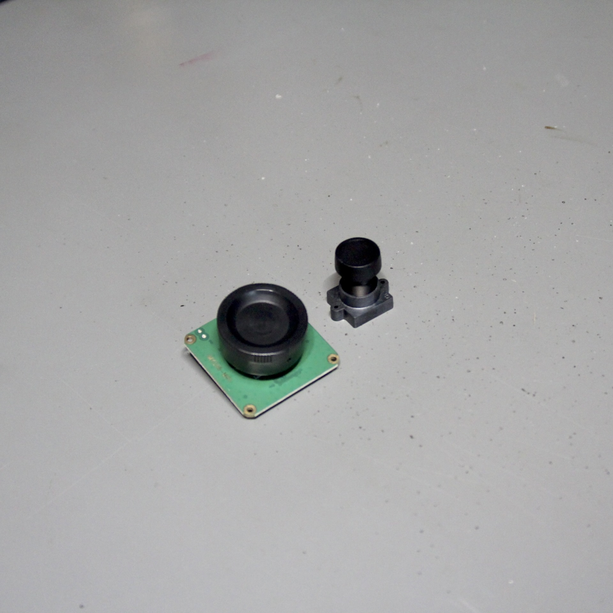
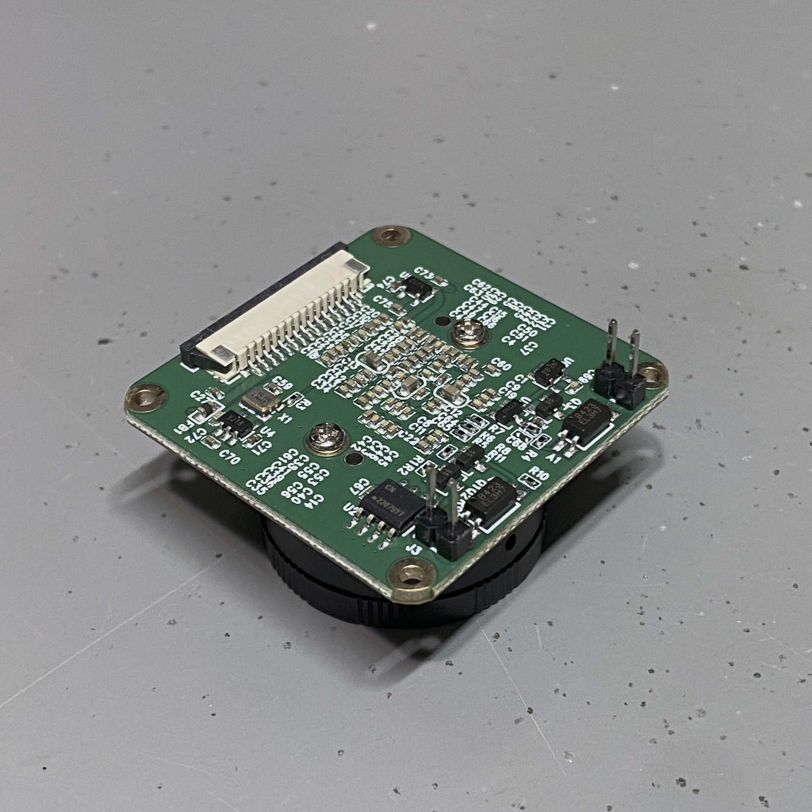
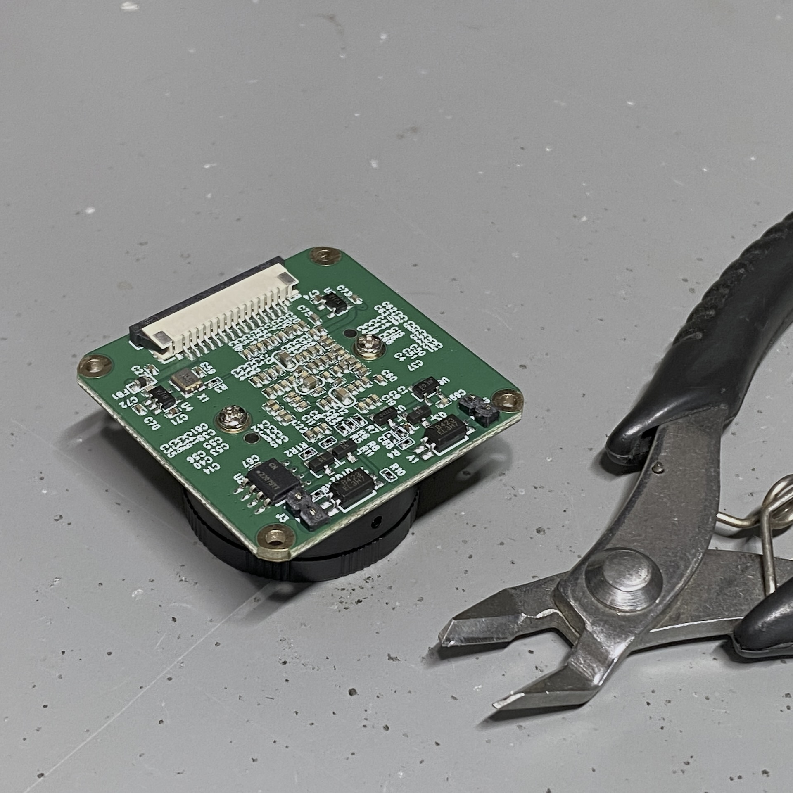
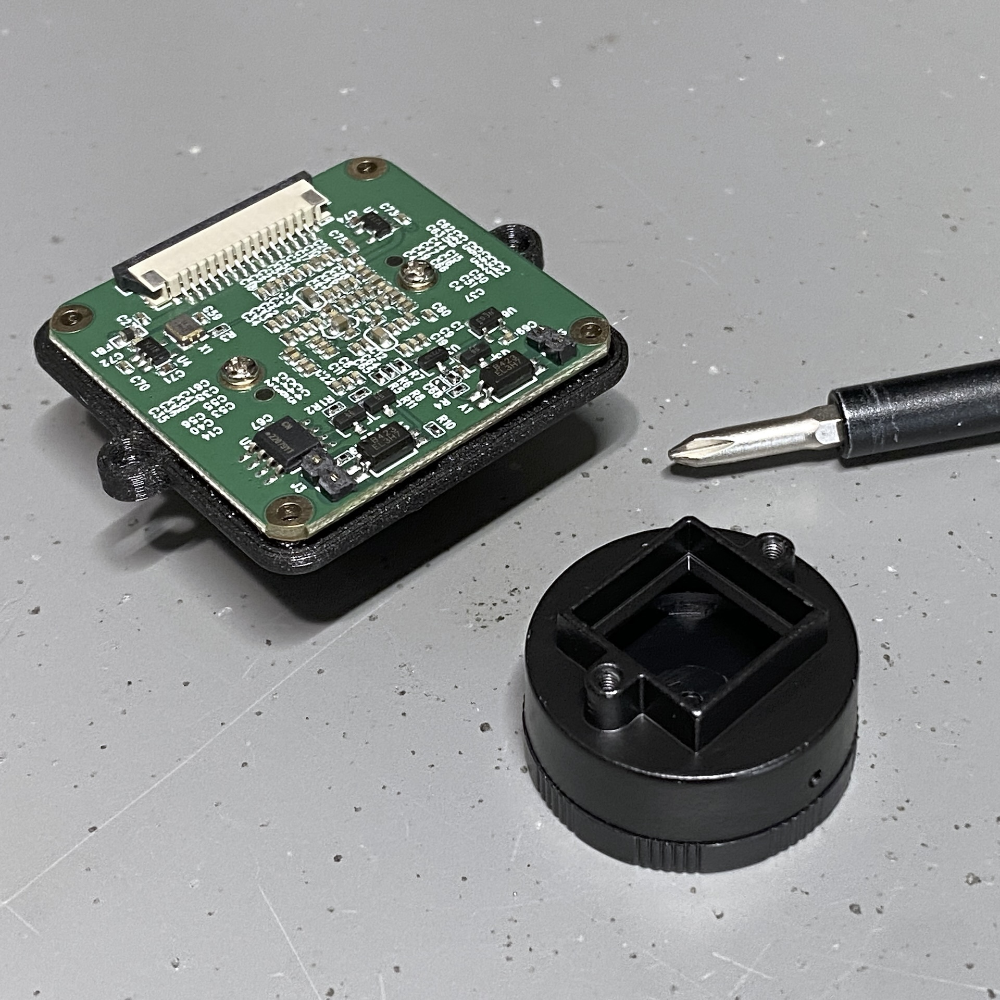
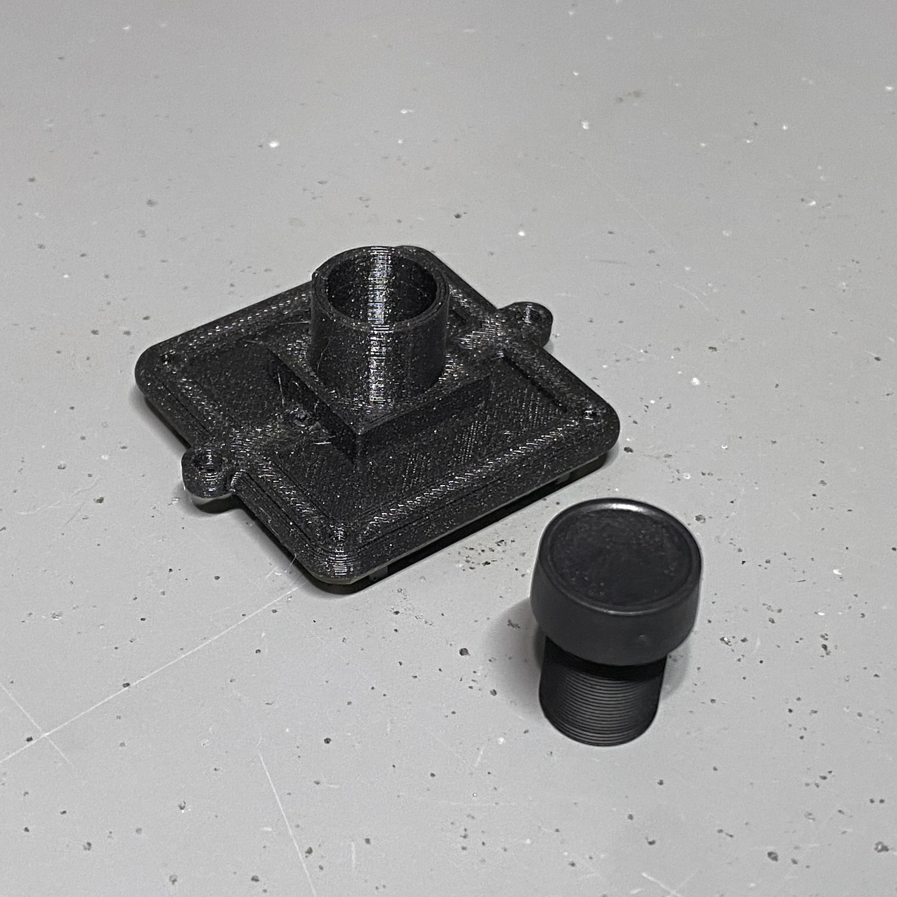
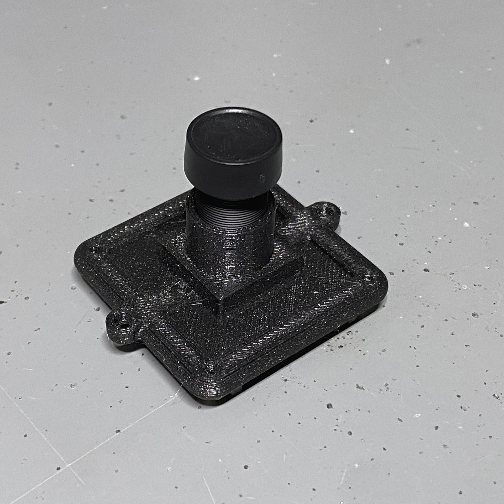
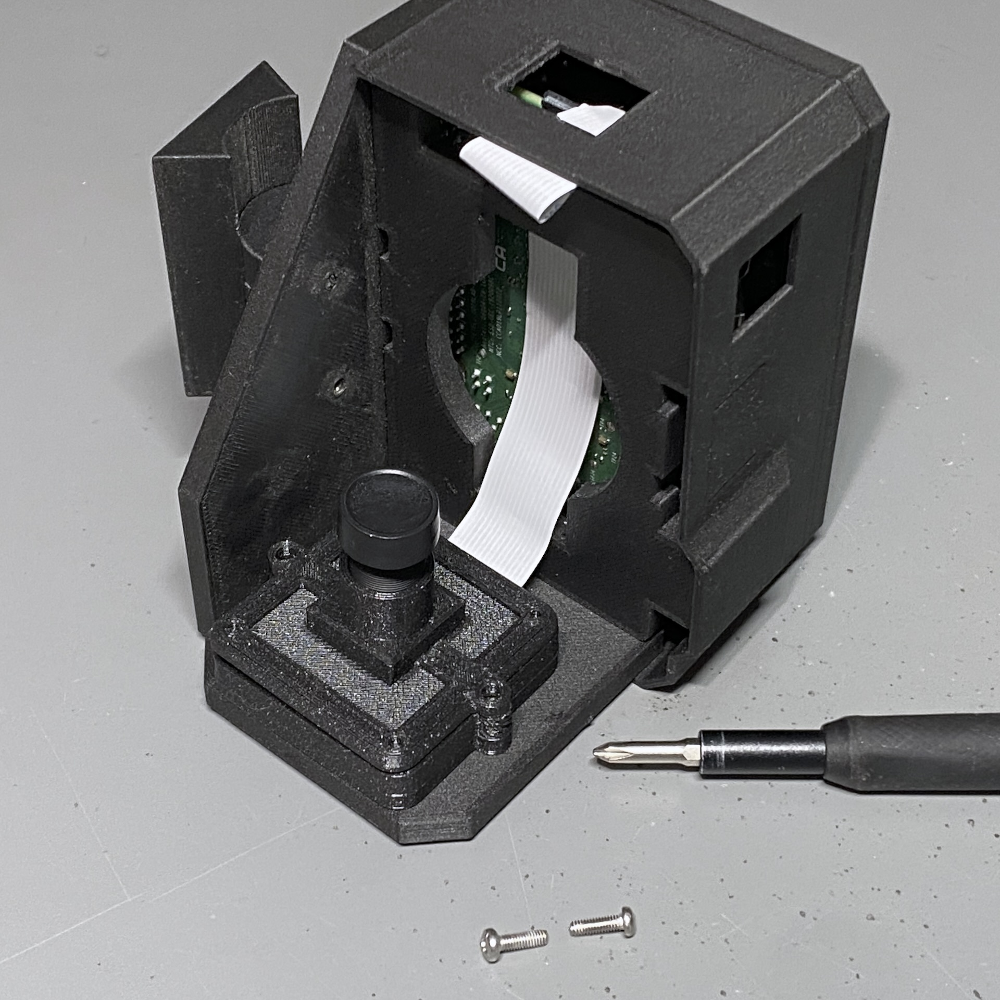
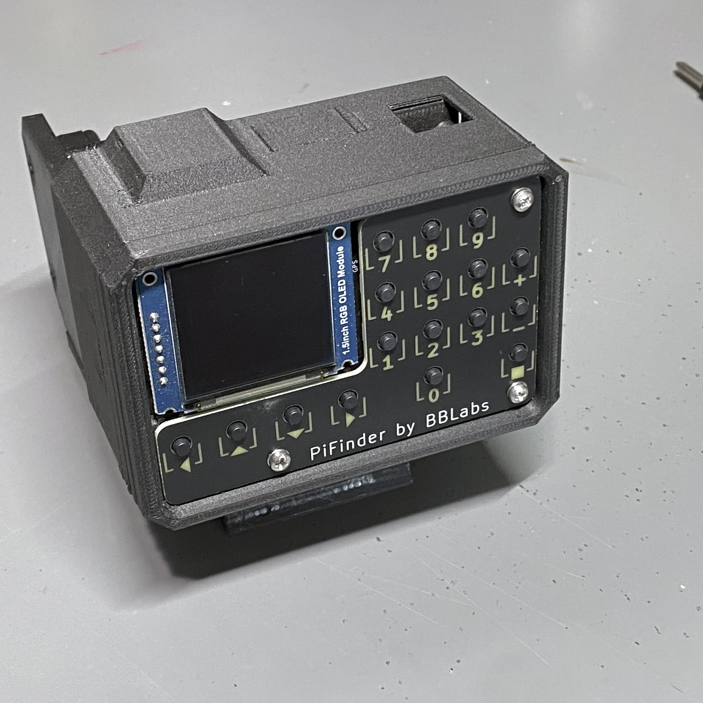

Version 2.5 Upgrade Kit Guide
================================================

Thanks for ordering a PiFinder v2.5 upgrade kit!  This kit includes everything you need to update
the camera in your PiFinder to match the capabilities of a v3 and replace the button faceplate
so you can have the proper labels for the new software.

In this guide we show a Right handed PiFinder, but these instructions are generally the same 
for Left and Flat units as well.

Get Started
------------

Collect your PiFinder v2 and unpack all the parts from the upgrade kit.  Put them all on a messy
workbench and take an out of focus picture....

You'll also need a small philips head screwdriver, and a pair of side cutters to complete the assembly.  
This whole process should take about 10 minutes and is not tricky, but it's probably a good idea to read through this 
guide once before diving in.

Camera Prep
----------------

The new v3 camera may come with one of two different lens holders aready installed. No matter 
which your camera has you'll be removing and replacing it.

Some cameras have pin headers installed, if you have one of these, you'll need to clip them as close
as reasonable to the board.

Grab the lens holder and look through it to make sure it's clear of any obstructions.

Place the lens holder on the table with the large side up oriented as in the photo below.  The two screw
tabs on the lens holder must stick out the opposite sides from the cream-white and dark-grey cable connector on the PCB.
You'll be removing the two screws (yours might be black) near the center of the green PCB and lifting it gently
to the new lens holder.  

Mind the sensor surface on the under side of the PCB. It should sit nicely in the square recess of the lens holder.
Use the same two screws to affix the sensor PCB to the lens holder.  The screws will be cutting their own threads, but
there are holes there to help get started.  Tighten the screws down against the PCB so nothing is wiggling/moving.

.. image:: images/v25_upgrade/v25_upgrade_14.jpeg

Flip the camera assembly over and thread in the lens.  Be slow and careful here.  With gentle force
the lens should slide in a few MM to get everything align and stop.  When it stops, check to make sure it seems 
straight and start screwing it into place.  To get focus about right, You'll want a 6mm gap (picured below) between the 
top of the lens holder and the bottom of the lip on the lens.  Don't fret too much about it as you'll do final focus 
under the stars.

Installing the Camera
----------------------

Grab your PiFinder and remove the four screws holding on the camera.  It may be
easier to remove the lens first if you have the internal battery installed.

Open the cable connector on the camera by gently sliding the dark-grey part of the 
connector towards the cable.  Once open the cable should come loose easily.

Unplug the cable and set the camera aside, saving the four m2.5 8mm screws.

Remove the four brass stand-offs holding that used to hold the camera, these
are no longer needed.

Use the four screws to secure the adaptor to the PiFinder back plate as shown.  The 
adapter has an opening in one side to allow the cable to exit.  Make sure 
this is aligned with the direction the cable is coming from.

Next you'll connect the cable to the new camera module.  Open the connector all the way
by sliding the dark-grey piece away from the PCB.  Be gentle as this part can break with too
much force. 

Once the connector is open, slide the cable into the connector using gentle force and making 
sure it's well aligned.  Take you time and watch the
dark-grey clip.  It should not close as you are inserting the cable, and if it does, you'll need
to re-open it to get the cable to slide in all the way.

Once the cable is seated in the connector, close the dark-grey clip by sliding it shut, this 
may take a little force to get it completely closed.  Check the photo below if in doubt!

.. image:: images/v25_upgrade/v25_upgrade_24.jpeg

Situate the camera in the adapter and use the two new screws to secure it.  They are 
the same size as the other four, if they get mixed up.

.. image:: images/v25_upgrade/v25_upgrade_26.jpeg

Swapping the Faceplate
-----------------------

Not a whole lot to say here.. except to ignore the well-used state of my development 
PiFinder here.  

Remove the three screws, swap the plate and screw it back on

Software and Camera Set Up
----------------------------

To use the new camera, you'll need to update to the latest PiFinder software.  Check the 
`Version 1.x software update guide <https://pifinder.readthedocs.io/en/v1.11.2/user_guide.html#update-software>`_ 
for details on different ways to update your software.  If you PiFinder is very old, you 
may need to write a new SD card.

Once you have the new software running, you'll need to switch camera types to one of the
sensors used in the v3.  PiFinder upgrade kits currently shipping will include the Sony
imx462 or imx296 sensor. The box your camera module came in should indicate the 
type.  From the main PiFinder menu:

* Scroll down and choose Settings

* Then choose Camera Type near the bottom

* Finally, choose either v3 - imx462 or v3 - imx296

Your PiFinder will reboot and you should be able to see a bright image or static from the 
camera preview screen depending on lighting conditions and such.  You might want to use the
settings menu to set your exposure to 0.4 or 0.2 at a maximum with the new camera and I'd 
encourage you to try lower once you are out under the stars.

And you are DONE!  Congratulations on your new PiFinder v2.5

Check out the :doc:`quick_start` for details on focusing and a primer on the new 
software interface.
