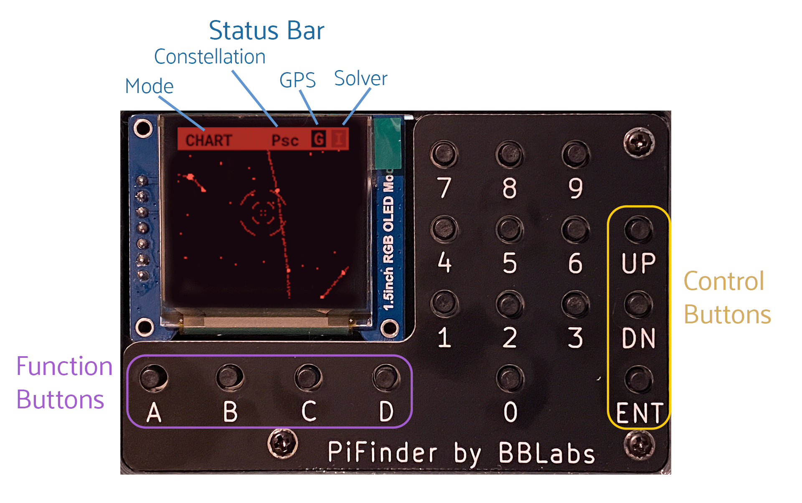

# PiFinder User Manual

- [Introduction and Overview](#introduction-and-overview)
-  [Hardware](#hardware)
  * [Overview](#overview) 
  * [Mounting](#mounting) 
  * [Camera Alignment](#camera-alignment) 
- [UI Overview](#ui-overview)
  * [Chart](#chart)
  * [Catalog](#catalog)
  * [Locate](#locate)
  * [Log](#log)
  * [Preview](#preview)
  * [Status](#status)
  * [Console](#console)
- [How-To](#how-to)
  * [Startup](#startup)
  * [Searching for objects](#searching-for-objects)
  * [Push-To object](#push-to-object)
  * [Observation logging](#observation-logging)
    + [Custom lists](#custom-lists)
- [FAQ](#faq)

## Introduction and Overview

Thanks for your interest in the PiFinder!  This guide describes how to use a PiFinder but if you want information on building one, please see the [Build Guide](./build_guide.md) and the [Bill of Materials](BOM.md).

The PiFinder is a self-contained telescope positioning device.  It will let you know where your telescope is pointed, provide the ability to choose a particular target (like a Galaxy or other DSO) and direct you on how to move your telescope to find that object.  There are some other nice features along with these core functions, but the PiFinder is designed primarily as a way to get interesting objects into your eyepiece so you can take a look at them.

The primary way PiFinder determines where your telescope is pointing is by taking photos of the sky and using stars contained therein to determine where it's pointing.  Having the camera of the PiFinder 

## Hardware
### Overview

You probably build the PiFinder you are going to use, but here's a quick overview of the unit if you have not.  One side has the keypad and screen, while the other has the camera, lens and camera mounting cell.  There is likely also a GPS transciever plugged into one of the USB ports with an antenna mounted on top.  

Depending on how your unit was built it may have internal batteries or it may be powered from your telescope through the available USB-C port.

In the photo on the left above, you can see two of the three thumbscrews used to tilt the camera mounting cell.  These thumbscrews allow alignment of the camera with your telescope optical axis after it's mounted.

### Mounting

Depending on the mounting system you printed or received for your PiFinder, you will either have a rail on the bottom which fits a standard finder shoe, or a Go-Pro style mount.  As with any finder, a sturdy and stable mounting method is needed; Ideally with the ability to take off the finder and re-attach it while retaining it's relationship with the telescope.

### Camera alignment

Once your PiFinder is mounted to your telescope, you'll need to align it with the optical axis of your telescope just like a RACI or red-dot finder.   To do this, you can use the three thumbscrews at the back of the unit to adjust where the camera is pointing:

* To start, point your telescope at a distant object or bright star and center it in your telescope eyepiece.  
* Turn on the PiFinder if it's not on already
* Make sure your PiFinder is in [Preview](#preview) mode so you can see what the camera sees.
  * If you are doing this during the day, you'll need to use the Down control button to reduce the exposure
* Use the three thumbscrews to adjust the tilt of the camera.  Between each adjustment, make sure you wait for a new exposure to be taken to see the results.  This normally takes about 1.5 seconds (at night), depending on your exposure settings.
* If the PiFinder is not holding alignment between observing sessions, try tightening the middle screw, or selecting a stronger spring, to help hold the cell more tightly against the thumbscrews. 

### Keypad and Screen

## UI Overview

### Chart

### Catalog
### Locate
### Log
### Preview
### Status
### Console

## How-To
### Startup
### Searching for objects
### Push-To object
### Observation logging
#### Custom lists

## FAQ
