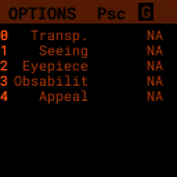

# PiFinder User Manual - How To

- [Introduction and Overview](user_guide.md#introduction-and-overview)
- [How-To](#how-to)
  * [Adjust Screen Brightness](#adjust-screen-brightness)
  * [See all the things](#see-all-the-messier)
  * [WiFi](#wifi)
  * [SkySafari](#skysafari)
  * [Data Access (SMB Share)](#data-access)
  * [Shutdown and Restart](#shutdown-and-Restart)
  * [Observing lists](#observing-lists)
  * [Update Software](#update-software)
- [Hardware](user_guide_hw.md)
- [UI Screens](user_guide_ui.md)
- [Setup](user_guide_setup.md)
- [FAQ](user_guide_faq.md)

## How-To

### Adjust Screen Brightness

At any time you can hold down the _ENT_ key and use the  _UP_ and _DN_ keys to adjust screen brightness.  The brightness level will be adjusted immediately and saved automatically.

### See all the Messier (or Caldwell, or NGC....) objects
This how to covers a lot of the basic catalog/locating/observing features of the PiFinder.   

Combining the ability to filter a catalog by observation status and pushing the nearest 'X' objects to the observing list allows you to work your way through a collection of objects easily.

Use the _A_ key to cycle through the main screens until you get to the [Catalog](user_guide_ui.md#catalog)


Then use the _C_ key to cycle through the available catalogs to find the Messier objects


Holding the _A_ button for about a second will bring up the [Options](user_guide_ui.md#options) page of the [Catalog](user_guide_ui.md#catalog) screen


On this screen you can filter the catalog in various ways.  By default, it will only show items that are higher than 10degrees above the horizon right now and will include objects of any magnitude, type and regardless of whether you have observed them or not.  You can switch the observation filter to 'No' to focus on the Messier objects you've not yet observed.

Press the _3_ key to bring up the Observed options


Then press the _2_ key to select the 'No' option.  Pressing the _A_ key will return you to the Catalog page with your filters activated.  You can see in the upper-right of the screen that the number of objects matching the filter is 47 of 110


We're going to create an observing list from this filtered catalog.  Hold down the _A_ key to return to the Options page.  


We can either push all the items that match our current filter using the _4_ Push List action, 
or we can choose to create a list of objects near the current place the telescope is pointing.   This is a great way to easily and quickly work through objects when they might be most visible based on your particular location.

Press the _5_ key to select Push Near


You can select the number of nearby objects you want to push to the observing list.  Let's get 20 nearby Messier objects we've never logged observations for!  Press the _4_ key and you'll end up at the [Locate](user_guide_ui.md#locate) screen with a list of these 20 objects sorted by distance from the current pointing position.


The locate screen serves double duty by showing you where to move the telescope to center this object, and also letting you scroll through the observing or history lists.  In the screenshot above were looking at item 1/20 in the Obsv (Observing) list.  You can use _UP_ and _DN_ to scroll through the list.  Or just push the scope in the indicated direction to observe M33.

When you have observed M33, hold down the _ENT_ button to log this object using the [LOG](user_guide_ui.md#log) screen.


The Logging screen shows you the current target, how far you are from it and allows you to press _B_ to log the item, _C_ to log with a photo and _D_ to abort the logging.  If you press and hold the _A_ key you can provide more information about your observation.



This page works just like others.  You can use the numbers on the right to select what you want to adjust and then choose an option on the right.  Once you've set your observation notes, press _A_ to return to the log screen and either _B_ or _C_ to log your observation.

Now that M33 is logged, it won't show up any longer when you filter the Messier objects by 'No' observation.

Another way to use the observing list is to switch to the Chart screen.  The currently selected target will be pointed to with the arrow around the reticle if it's offscreen and an X if it's on screen.  


Use can use the _UP_ and _DN_ keys to zoom the chart in an out.  Here is the chart zoomed out showing the location of M33 along with some of the other nearby objects on the observing list.

b

### Switch Sides
By default, the PiFinder software is set for right-side focuser operation.   To switch to left-side orientation, use the [Options](user_guide_ui.md#options) page of the [Status](user_guide_ui.md#status) screen.  This will make sure the preview is displayed correct side up and the IMU up/down direction is correct.

### WiFi
#### Access Point and Client Mode
The PiFinder can either connect to an existing network, or serve as an wireless access point for other devices to connect to.  Use the [Options](user_guide_ui.md#system-options) page of the Status screen to switch between these two modes and see which mode is currently active.

Using the PiFinder in Access Point mode creates a network called AP_PiFinder with no password to allow easy connection of phones, tablets and other devices in the field.

#### Changing Wifi networks
When in client mode, the PiFinder will attempt to connect to one or more networks which have been previously configured.  If you set up your PiFinder via the instructions [here](software.md) you likely already have one network configured.

If you purchased a kit that came with an SD card, or you want to change network configuration, please see the instructions below to change your network settings:

* Shutdown and power off the PiFinder
* Remove the SD card from your PiFinder and insert it into another computer.  
	* Windows may prompt you to format the card, don't do so! There is a partition on there (/boot) that windows should be able to read/write to.
* Create a file called wpa_supplicant.conf in the root of the SD card with these contents:

```
ctrl_interface=DIR=/var/run/wpa_supplicant GROUP=netdev
country=<Insert 2 letter ISO 3166-1 country code here>
update_config=1

network={
 ssid="<Name of your wireless LAN>"
 psk="<Password for your wireless LAN>"
}
```
* Set `country` to your two letter country code.
* Set SSID to your WiFi network name, preserving the surrounding quotes.
* Set PSK to the password for your WiFi network, again preserving the surrounding quotes.
* Save this file (make sure it ends up with the .conf extension)
* Insert it back into the PiFinder and power back on.

That file will be moved from the `/boot` partition and the PiFinder should connect to your network. 

Alternatively, you can switch the PiFinder to AP mode, SSH into it and edit `/etc/wpa_supplicant.conf` in place to change or add networks.

#### PiFinder address
In most cases, you can use the name `pifinder.local` to connect to the PiFinder.  On older computer or those that don't support zeroconf networking, you can use the IP address provides on the [Status](user_guide_ui.md#status) screen to connect.  You can connect to the PiFinder via:
* SSH to get shell access for software updates and other admin tasks
* SMB (Samba) to access saved images, logs an observing lists
* LX200 protocol to allow updating of a planetarium app, such as [SkySafari](#skysafari), with the position of the telescope

### SkySafari
The PiFinder can provide real-time pointing information to a device running SkySafari via the LX200 protocol.  See this [guide](./skysafari.md) for complete details, but here is the connection info:
* Use 'Other' telescope type
* Mount Type: Alt-Az, GoTo.. even if your scope is Push-To.  This allows sending of targets from SkySafari to the PiFinder
* Scope Type: Meade LX200 classic
* IP Address: `pifinder.local` or IP address provides on the [Status](user_guide_ui.md#status) screen.
* Port: 4030

### Data Access
In the course of using the PiFinder several data files are created that may be of interest.  These are available via a SMB (samba) network share called `//pifinder.local/shared`.  Accessing this will depend on your OS, but the PiFinder should be visible in a network browser provided.  There is no password requirement, just connect as `guest` with no password provided.

Once connected, you'll see:
* `captures/`: These are images saved when logging objects.  They are named with the observation ID from the database.
* `obslists/`: This folder holds observing saved during a PiFinder session or to load for future sessions.
* `screenshots/`:  It's possible to take screenshots while using the PiFinder (hold down _ENT_ and press _0_).  They are stored here.
* `solver_debug_dumps/`: If enabled, information about solver performance is stored here as a collection of images and json files.
* `observations.db`: This is the SQLite database which holds all the logged observations.


### Shutdown and Restart

Although shutting down is not strictly needed before power-off, the PiFinder is a computer and there is a chance of file corruption.  Some MicroSD cards are more sensitive to this than others.

Shutdown and Restart actions are available from the [Options](user_guide_ui.md#options) for the [Status](user_guide_ui.md#status) screen.  Hold down _Ent_ and press _A_ to cycle through the system screens until you see the status screen, the press and hold _A_ to access the options.

Restarting the PiFinder software should not normally be needed, but can be useful for generating a new session id which is included for a photos and logging during a particular execution of the PiFinder software.

### Observing lists
PiFinder maintains two lists of objects for each observing session; The History list and the Observing list.  The [Locate](user_guide_ui.md#locate) screen lets you scroll through these lists and push the telescope to any object on them.

The History list will record any object that you set as a target to push-to.  It's added to as soon as you press the _ENT_ key on the catalog screen to select an object.  The main purpose of the History list is to let you scroll back through objects you have observed that session.

The Observing list is a list of objects that is populated from either a filtered catalog or a file on disk.  It's a list of objects you'd like to observe during a session.  

Both these lists start empty at the beginning of each session.  To populate an observing list you can push a filtered list of objects from the [Catalog](user_guide_ui.md#catalog) screen or use the [Options](user_guide_ui.md#options) page of the [Locate](user_guide_ui.md#locate) screen to load an observing list from disk.  The PiFinder supports .skylist file format used in SkySafari and adopted in many other applications as well.

### Update Software
##### v1.2.2 or greater
A Software action is available from the [Options](#options) for the [Status](#status) screen.  This will both show which version the PiFinder currently has installed and allow you to Upd the software if the PiFinder is connected to the internet.  You man need to switch [WiFi](#wifi) modes to Client if the device is in AP mode.

Select the option for 'Software' and then 'Upd'.  You should see a message that says 'Updating...' followed by 'Ok! Restarting'.  The PiFinder should restart and the new software version should be displayed when checking the [Options](#options) for the [Status](#status) screen

##### Pre v1.2.2
Prior to version 1.2.2 you'll need to SSH into the PiFinder to update the software.  Once connected to the PiFinder and logged in type:

```
cd PiFinder
git stash
git pull
```

This should update to the latest release and from then forward you'll be able to use the built-in software update system.


## FAQ

Have any questions?  Please send them through to me at [rich@brickbots.com](mailto:rich@brickbots.com) and I'll do my best to help and potentially add your question here.  Better yet, feel free to fork this repo and contribute via a pull request!
