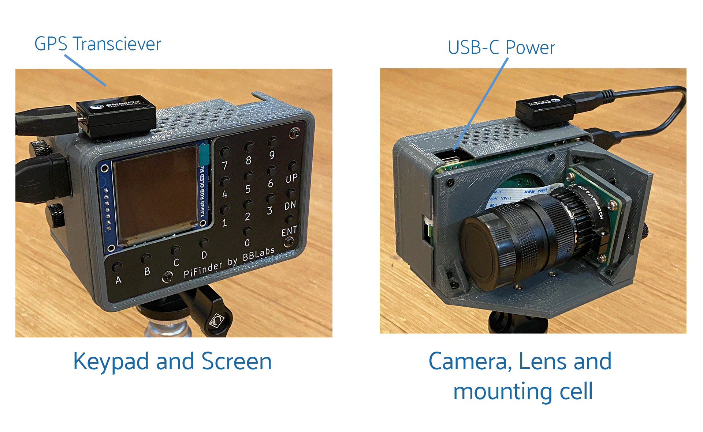
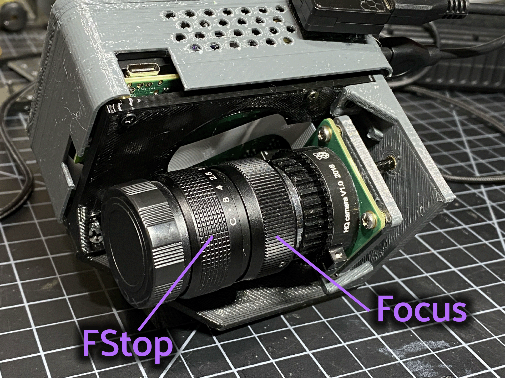
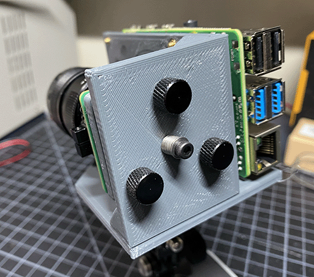

# PiFinder User Manual - Hardware

- [Introduction and Overview](user_guide.md#introduction-and-overview)
- [How-To](user_guide_howto.md)
- [Hardware](#hardware)
  * [Overview](#overview) 
  * [Mounting](#mounting) 
  * [Camera Setup](#camera-setup) 
  * [Camera Alignment](#camera-alignment) 
- [UI Screens](user_guide_ui.md)
- [Setup](user_guide_setup.md)
- [FAQ](user_guide_faq.md)

## Hardware
You probably build the PiFinder you are going to use, but if not, here's a quick overview of the unit. 

### Overview
One side has the keypad and screen, while the other has the camera, lens and camera mounting cell.  There is likely also a GPS transciever plugged into one of the USB ports with an antenna mounted on top.  

Depending on how your unit was built it may have internal batteries or it may be powered from your telescope through the available USB-C port.

In the photo on the left above, you can see two of the three thumbscrews used to tilt the camera mounting cell.  These thumbscrews allow alignment of the camera with your telescope optical axis after it's mounted.

### Mounting
There are currently 3 different mounting configurations supported. Right, Left, and Flat. Right and Left mounts are commonly used with reflector style telescopes where it is required for the screen to face the side due to the focuser position.  In these 2 mounting styles, the PiFinder is upright and the screen faces either left, or right, depending the focuser position. Flat mount is more commonly used for refractors or catadioptrics where the user sits behind the telescope. In this mounting orientation, the PiFinder lays flat with the screen pointing up. See photo below for an example of the right-hand and flat configurations.

For information about which parts to print for which configuration, please see the [Parts](build_guide_parts.md) section of the build guide.  The dovetail mounting system included with the PiFinder will fit into the most common finder brackets found on telescopes.  For the left and right hand configurations the dovetail bracket is adjustable so that the PiFinder can site upright and the screen is easily viewable no matter where around the circumference of your telescope the finder bracket is mounted.

There are currently 3 different mounting configurations supported. Right, Left, and Flat. Right and Left mounts are commonly used with reflector style telescopes where it is required for the screen to face the side due to the focuser position. In these 2 mounting styles, the PiFinder is upright. Flat mount is more commonly used for refrectors or catadioptrics where the user sits behind the telescope. In this mounting orientaiton, the PiFinder lays flat with the screen pointing up. See photo below for an example of the flat mount.

### Camera Setup
After you mount your PiFinder the first time, you'll need to setup the camera aperture and focus.
If you are using the recommended lens, it will have two adjustment rings on it; One to adjust the aperture (f-stop) and one for focus.

#### F-Stop
Make sure the aperture of your lens is all the way open.  For the recommend lens, turn the f-stop ring towards you all the way if you are looking at the unit like like the image above.

#### Focus
Focus for plate solving is actually not all the critical, and defocusing a bit can even improve the solve as it spreads star light across multiple pixels.  You can either use a very distant object during the day, or a bright star at night.  Start with the focus ring all the way to the 'Far' end and you'll probably be close enough to solve most areas of the sky.  Better focus may help pick out a few dimmer stars and allow you to potentially reduce exposure time.

There is a focus helper in the [Preview](#preview) options to help.  This will show a zoomed in image from the center of the camera view to help you hit focus on the small screen.
To activate the focus helper, hold down the 'A' function key while in preview mode and turn on the option from the settings menu.  As you adjust the focus ring, you'll have to wait a second or two make after each adjustment to see the results in the exposure.

### Camera alignment
Once your PiFinder is mounted to your telescope, you'll need to align it with the optical axis of your telescope just like a RACI or red-dot finder.   To do this, you can use the three thumbscrews at the back of the unit to adjust where the camera is pointing:

* To start, point your telescope at a distant object or bright star and center it in your telescope eyepiece.  
* Turn on the PiFinder if it's not on already
* Make sure your PiFinder is in [Preview](#preview) mode so you can see what the camera sees.
  * If you are doing this during the day, you'll need to use the _DN_ key to reduce the exposure
* Use the three thumbscrews to adjust the tilt of the camera.  Between each adjustment, make sure you wait for a new exposure to be taken to see the results.  This normally takes about 1.5 seconds (at night), depending on your exposure settings.
* If the PiFinder is not holding alignment between observing sessions, try tightening the middle screw, or selecting a stronger spring, to help hold the cell more tightly against the thumbscrews. 

