# PiFinder User Manual

- [Introduction and Overview](user_guide.md#introduction-and-overview)
- [How-To](user_guide_howto.md)
- [Hardware](user_guide_hw.md)
- [UI Screens](#ui-screens)
  * [Options](#options)
  * [Chart](#chart)
  * [Catalog](#catalog)
  * [Locate](#locate)
* [System Screens](#system-screens)
  * [Log](#log)
  * [Preview](#preview)
  * [Status](#status)
    * [System Options](#system-options)
  * [Console](#console)
- [Setup](user_guide_setup.md)
- [FAQ](user_guide_faq.md)

## UI Screens
The user interface for the PiFinder is split into various screens that you can switch between to perform different tasks.  The A key is used to cycle between the three main screens:

* Chart
* Catalog
* Locate

By holding down the Enter key and pressing the A function key you can get to the less commonly used screens:

* Console
* Status
* Camera Preview

Some actions in one screen will move you to another, for instance selecting an object from the Catalog will switch automatically to the Locate screen.  

The remaining function keys serve different purposes depending on which screen you are on at the time you press them, but there are some key-combinations that act across any of the individual screens:

* Long press _A_:  For screens with options, such a the Catalog screeen, holding down the _A_ function key will bring up the options for that screen.  See [Options](#options) below.
* _ENT + UP/DN_: This combination will adjust the screen brightness up and down at any time.

### Options
Many screens have options which change the way they behave or perform other less commonly used actions.  Pressing and holding the _A_ button will bring up the options for whichever screen you are currently using.  To exit the option screen press _A_ to return to the previous screen.

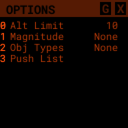

The options screen will show one option or action item per line with the name or description of the item to the left and the current value to the right.  The bright numbers along the left edge indicate the key on the keypad to press to access that item.

Once an item is selected the item will be highlighted and the available values or types of actions will be listed along the right hand side.   The bright numbers along the right hand side will let you select the value(s) for this item.

Some types of options can only have a single value, like Magnitude above.  Others, such as Obj Types will allow you to select multiple values.  If an option only has a single value, selecting it will return you to the main options page.  For options that can have multiple values, you'll need to use the _ENT_ key to confirm your selections and return to the main option page.

The Options screen can also contain less commonly used actions which will take place when a value is selected.  

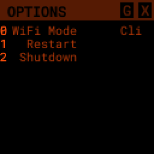

The Options screen shown above (for the Status screen) has general PiFinder options along with a couple actions.  Selecting an action item, such as _1_, will always have one additional step to confirm the action, or allow you exit.

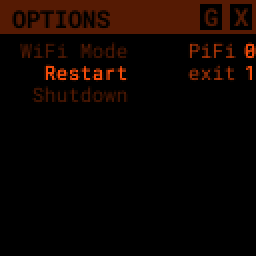

To exit the option screen press _A_ to return to the previous screen.

### Chart
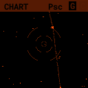

The chart screen will display a star chart centered around the current RA / Dec coordinates the PiFinder has determined.  By default it shows stars down to magnitude 7 and has a 10 degree field of view.  As you move your telescope the chart will be updated several times a second using either a plate solve for a captured image or an approximation based on the last plate solve and the Inertial Measurement Unit (IMU).

There is a Telrad style reticle that can be used to help orient the chart.  The outer ring is four degrees in diameter, the inner two degrees and the middle 1/2 degree.

If you have a target selected, an arrow around the outer rim of the reticle will point in the direction that target is located. 

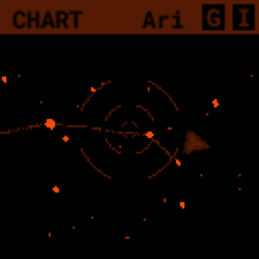 

If the target is within the current chart, the arrow will disappear and a small X will mark the spot of the target.  

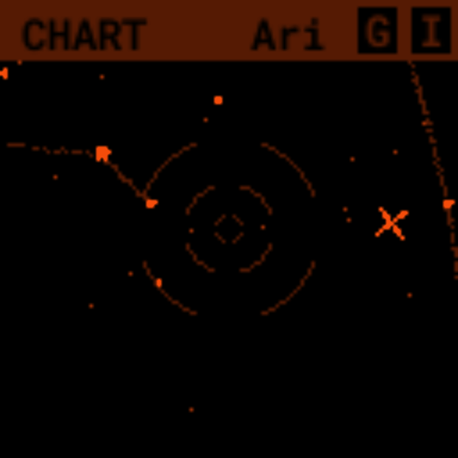

While viewing the chart you can adjust it's appearance and FOV in several ways:

* _B_ Function key: Toggle reticle state.  There are several brightness levels including off.
* _C_ Function key: Toggle constellation line brightness.
* _D_ Function key: Toggle observing list marker brightness.  This will show markers for DSO objects in your observing list.
* _UP/DN_ :  Increase or decrees the field of view (zoom).  This ranges from 5 degrees to 60 degrees.
* Holding the _A_ function key will bring up settings for the chart including the above reticle/constellation brightness

### Catalog
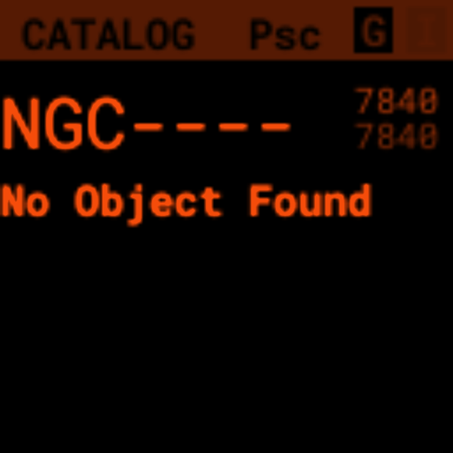

The catalog screen allows the searching and selection of astronomical objects to locate.  It has multiple catalogs available (Messier, NGC, IC) and displays some basic information about each object.  You can set filter criteria (Altitude, Magnitude, Object Type) to limit the objects surfaced via the search.

The _C_ function keys will cycle through the various catalogs available.  The upper-left will show the count of filtered objects over the total number of objects in each catalog.

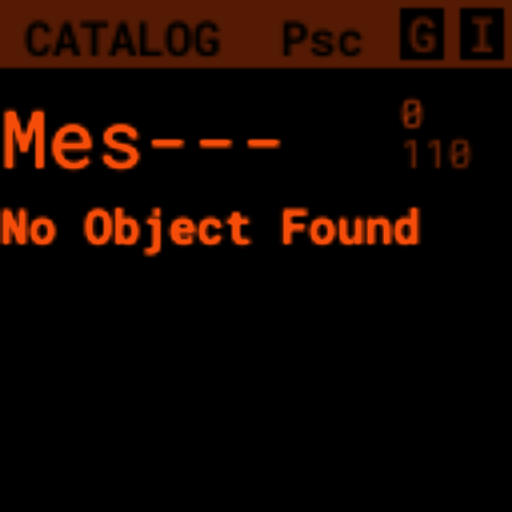

Use the number keys to enter the id of the object you are looking for.  As you type, any matching object will be displayed.  Typing in _74_ to look for Messier 74 will bring up Messier 7 and 74 in turn as you enter numbers.

 

If the number you have entered matches an object in the catalog, information about the object will be displayed below including:
* Object Type
* Constellation
* Magnitude
* Size
* Other names
* IC/NGC coded observing notes

Use the _D_ key to clear the number field out and start fresh.  If you find an object you are interested in, pressing the _ENT_ key will add it to your target list and switch to the [Locate](#Locate) screen.

Holding the _A_ key for two seconds will bring up the settings for the catalog.  You can filter by apparent altitude, magnitude and object type.  The Options page also has an action to push the currently filtered catalog to the [Observing](user_guide_howto.md#observing-lists) list. Pressing _A_ will bring you back to the catalog and update the count of objects that match your filter.

* The _UP/DN_ keys will scroll through the currently filtered objects.

### Locate
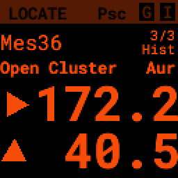

The Locate screen uses the last solve and currently selected target to provide a visual indication of which direction to move your telescope in order to center the target.  It also provides a summary of the current target and information about the overall target list.  

Values are expressed in degrees with the top line being rotation in Azimuth and the bottom line in Altitude.  

* _UP/DN_ will cycle through the active list.  The numbers in the upper-right corner of the screen represent the index of the current object / total number of objects in the list and the list name is displayed directly below.
* _ENT_ will switch back to the catalog screen to access full information about the current target
* _B_ will toggle between the [History and Observing lists](user_guide_howto.md#observing-lists)

The currently target is also displayed on the [Chart](#Chart) screen as a small tick mark.

## System Screens
The screens listed below are more rarely used and do not show up when rotating through the regular UI screens using the _A_ key.  To access these screens, rotate through them using the _ENT-A_ combination.  

### Log
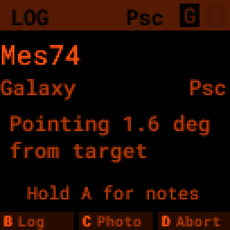

The Log screen can be accessed at any time by long holding the ENT key.  It allows you to record your observation of the currently selected target in a database as part of a session.  Each session starts when you power-up, or reset, the PiFinder and every observation logged during the session will be grouped together for later review.

Summary information about the current target is displayed along with the distance from the current telescope position.  This distance allows you to make sure you are observing/logging the correct object in a crowded field, like Virgo.  

You can add some details about your observation by holding down the A key to add notes.

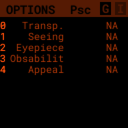

* Transp. :  The transparency of the sky.  This is often noted along with Seeing below
* Seeing:  The stillness of the atmosphere. 
* Eyepiece:  You can note which of your eyepieces you are using.
* Obsabillit:  Observability - How easy is it to spot and recognize this object
* Appeal: Overall rating of this object.. would you refer a friend?

Pressing the A key from the Observing Notes options will bring you back to the Log screen.

* B key - Logs the current target to the database and saves a 512x512 snapshot image with current exposure settings.
* C key - Logs the current target to the database and takes a high-resolution photo.  Takes longer, but you get a nice image of a 10 degree patch of sky that should have contained your target.
* D key - Abort and return to the previous screen

### Preview
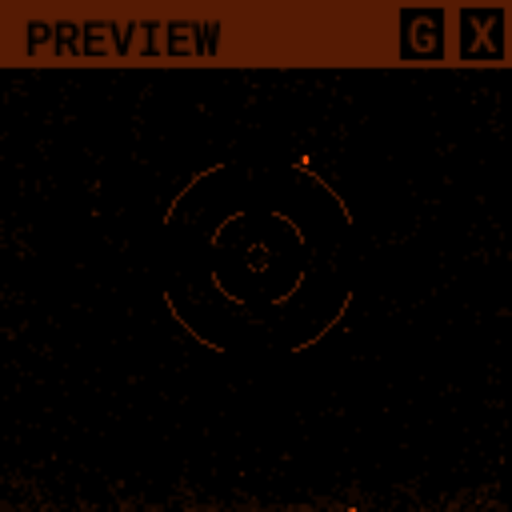

The preview screen displays most recently taken exposure from the camera.  You can adjust the processing of this image (just for display purposes), adjust exposure and zoom in to focus.

* _B_ key - Adjust reticle brightness or turn it off completely
* _C_ key - Turn background subtraction on/off
* _D_ key - Adjust gamma correction intensity

In the options menu (long-press _A_) you can adjust these same display parameters and also enter Focus Help mode.  In this mode the camera image is enlarged to help achieve good focus on a star.  Since this only shows the center of frame, get a star lined up in the reticle before activating Focus Help.

You can adjust overall exposure using the _UP/DN_ keys (check the [Console](#console) for specific setting).  If you'd like to save this exposure as the default for future sessions, use the _ENT_ key.

### Status
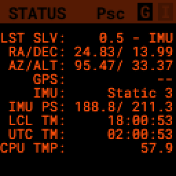

The status screen displays:
* LST SLV: Seconds since last position solution, plus last position solution source (CAM or IMU)
* RA/DEC: Last solved Right Ascension and Declination
* AZ/ALT: Last solved position in Azimuth / Altitude.  This can only be displayed if a GPS lock is achieved to provide location and time information.
* GPS: GPS Status (Locked/--)
* IMU: Inertial Measurement Unit status.  Moving/Static + Confidence level (0-3)
* IMU PS:  Current IMU position (Azimuth / Altitude) before conversion to astronomical AZ/ALT position.
* LCL TM: Local time (requires GPS fix)
* UTC TM: UTC Time (requires GPS fix)
* CPU TMP: Temperature of the Raspberry PI CPU
* WiFi: Current WiFi mode, either AP for access point, or Cli for client
* IP: Current IP address for connecting to via software such as SSH or SkySafari

#### System Options
The [Options](#options) page for the status screen gives access to general PiFinder options and actions.  Press and hold the _A_ key to access the option page.
* Set the [Power Save](user_guide.md#power-save) timeout
* Change [WiFi](user_guide_howto.md#wifi) Mode between client and access point
* Switch between left/right [side](build_guide.md#focuser-side) orientation
* [Restart](user_guide_howto.md#shutdown-and-restart) the PiFinder software
* [Shutdown](user_guide_howto.md#shutdown-and-restart) the PiFinder
* [Update](user_guide_howto.md#update-software) the PiFinder software

### Console
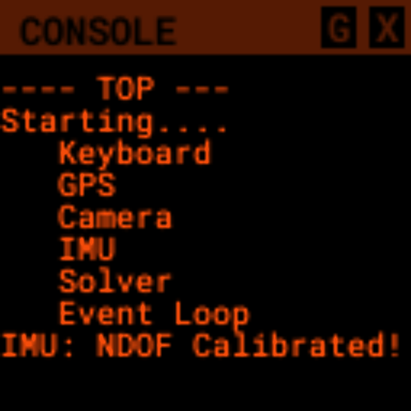

Logged information from the various parts of the PiFinder system is displayed here.
* _UP/DN_ key - Scroll the log display
