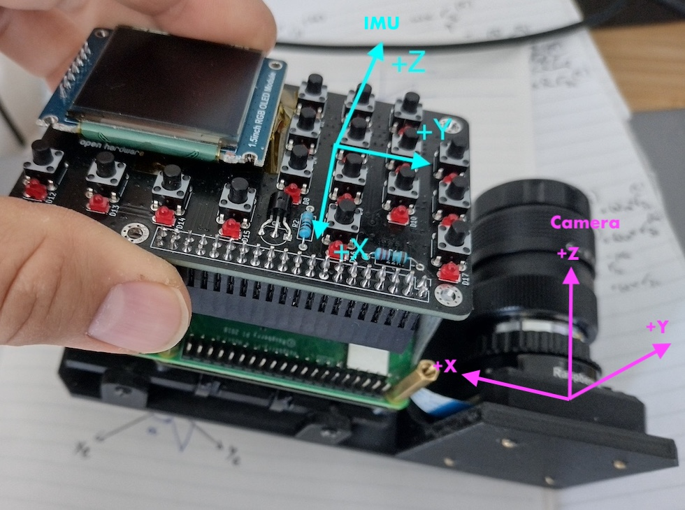

README: IMU support prototyping
===============================

> The first part of this README is temporary for the prototyping phase of the IMU support.

# TODO

>Remove this before release!

See Discord thread: https://discord.com/channels/1087556380724052059/1406599296002035895

Issues:
* Fails nox
* Chart orientation: Under TestMode for desktop testing, When in "Chart Mode",
alt/az seems to be swapped round. Looks OK in Align mode at first sight but
this is because the chart is oriented 90-degrees around . Is it the way the
fake IMU is generated? Does it try to account for the IMU orientation which is
removed in imu_pi.py? Also check "Chart Mode" when sky testing.

TODO:
* Sky test

For future:
* Update imu_pi.py
* Set alignment once at alignment rather than calculating it every loop
    * Alignment is currently done in `integrator.py` where `set_alignment()` is
    called every iteration of the loop. Would like to set the alignment onece
    to pre-compute the `q_scope2cam` quaternion, etc.

Done:
* Support other PiFinder types
* Adjust Roll depending on mount_type for charts
* Lint
* Type hints for integrator.py
* Use RaDecRoll class --> Done. Need to test.
* Go through TODOs in code
* Doesn't pass Nox
* Doesn't run wih v3 Flat. Issue in main branch? (reported by grimaldi: 20 Aug 2025 https://discord.com/channels/1087556380724052059/1406599296002035895/1407813498163167345)
* In EQ mode flickers between 0° and 359°. This is also in the main branch.
* Issue in the default requirements? Error (not related to the IMU changes)
  when I try to create a new env using requirements.txt. Maybe I can't just
  create a new environment using pip?
* Clean up README
  * Remove instruction on venv
  * Remove descriptions of frames

# Sky test log

>Remove this before release!

## 20251001: c6422 (tested 5 Oct)

* v2 Flat. Exposure 0.4s.
* Tested in altaz mode. 
* 97% full moon. Zenity NELM 3.
* Worked fine. When moved quickly to a target, the IMU mode got it to within
1-2° and then it snapped to the pointing from the plate solve and stayed there.
I didn't see any jiggling of the SkySafari cursor when zoomed in at a scale of
5° FOV.
* Changes since last test: Cleaning up & refactoring. EQ mode angle changed to
  +/-. Numpy version updated.  

## 20250831: af358e (tested 5/6 Aug)

* Tested on altaz mount in altaz mode.
* Seemed ok. Didn't check chart display.
* Changes have mainly been refactoring & linting.

## 20250819: 700f77c (tested 19/20 Aug)

* Tested on altaz mount in altaz & eq mode
* OK:
  * Changed chart display so that altaz is in horizontal frame and EQ mode displays in equatorial
  coordinates. This appears to work.
  * Tracking on chart and SkySafari OK.
* Issues:
  * Catalog crashes in altaz mode (ok in EQ mode). Probably because we don't calculate altaz in integrator.py? Same behaviour under test mode so we could do desktop tests.


## 20250817: 5cf8aae

* Tested on altaz and eq mounts
* **altaz:** Tracked fine. When the PiFinder was non-upright, I got the
  feeling it tended to jump after an IMU track and got a plate-solve. This
  wasn't seen when the PiFinder was upright. When non-upright, the crosshair
  moved diagonally when the scope was moved in az or alt. The rotated
  constellations in the chart were hard to make out.
* **EQ:** Seemed to work fine but I'm not experienced with EQ. The display on
  SkySafari showed RA movement along the horizontal direction and Dec along
  the vertical. This seemed to make sense.

# Installation & set up

## Install additional packages

This branch needs the `numpy.quaternion` package. To do this, run
`pifinder_post_update.sh`, which will install the new package and updage
`numpy`.

PiFinder can be run from the command line as usual:

```bash
cd ~/PiFinder/python
python3 -m PiFinder.main
```

For testing, running the following command will dump the raw IMU measurements to the terminal:

```bash
python PiFinder/imu_print_measurements.py
```

# Theory

## Quaternion rotation

A quaternion is defined by

$$\mathbf{q} = \cos(\theta/2) + (u_x \mathbf{i} + u_y \mathbf{j} + u_z
\mathbf{k}) \sin(\theta / 2)$$

This can be interpreted as a rotation around the axis $\mathbf{u}$ by an angle
$\theta$ in the clockwise direction when looking along $\mathbf{u}$ from the
origin. Alternatively, using the right-hand corkscrew rule, the right thumb
points along the axis and fingers in the direction of positive rotation.

We can express a quaternion as

$$\mathbf{q} = (w, x, y, z)$$

where $w$ is the scalar part and $(x, y, z)$ is the vector part. We will use
the *scalar-first* convention used by Numpy Quaternion.

A vector can be rotated by the quaternion $\mathbf{q}$ by defining the vector
as a pure quaternion $\mathbf{p}$ (where the scalar part is zero) as follows:

$\mathbf{p^\prime} = \mathbf{qpq}^{-1}$


### Numpy quaternion

In Numpy Quaternion, we can create a quaternion using

```python
q = quaternion.quaternion(w, x, y, z)
```

Quaternion multiplications are simply `q1 * q2`.

The inverse (or conjugate) is given by `q.conj()`.


### Intrinsic and extrinsic rotation

Intrinsic rotation of $q_0$ followed by $q_1$

$$q_{new} = q_0 q_1$$

For an extrinsic rotation of $q_0$ followed by $q_1$, left multiply

$$q_{new} =  q_1 q_0$$


## Coordinate frames

### Coordinate frame definitions

We define the following reference frames:

#### Equatorial coordinate system
* Centered around the center of the Earth with the $xy$ plane running through
  the Earths' equator. $+z$ points to the north pole and $+x$ to the Vernal
  equinox.

#### Horizontal coordinate system
* Centred around the observer. We will use the convention:
* $x$ points South, $y$ to East and $z$ to the zenith.

#### Scope frame
* +z is boresight. 
* On an altaz mount, we define +y as the vertical direction of the scope and +x
  as the horizontal direction to the left when looking along the boresight.
* In the ideal case, the Scope frame is assumed to be the same as the Gimbal
  frame. In reality, there may be errors due to mounting or gravity.

#### Camera frame
* The camera frame describes the pointing of the PiFinder's camera. There will
  be an offset between the camera and the scope.
* $+z$ is the boresight of the camera, $+y$ and $+x$ are respectively the
  vertical and horizontal (to the left) directions of the camera.

#### IMU frame
* The IMU frame is the local coordinates that the IMU outputs the data in.
* The diagram below illustrates the IMU coordinate frame for the v2 PiFinder
  with the Adafruit BNO055 IMU. 

### IMU and camera coordinate frames

To use the IMU for dead-reckoning, we need to know the transformation between
the IMU's own coordinate frame and the PiFinder's camera coordinate frame
(which we use as the PiFinder's reference coordinate frame).

The picture below illustrate the IMU and camera coordinates for the v2 flat
version of the PiFinder. For each type, we need to work out the quaternion
rotation `q_imu2cam` that rotates the IMU frame to the camera frame.



The transformations will be approximate and there will be small errors in 
`q_imu2cam` due to mechanical tolerances. These errors will contribute to the 
tracking error between the plate solved coordinates and the IMU dead-reckoning.

### Roll

The roll (as given by Tetra3) is defined as the rotation of the north pole
relative to the camera image's "up" direction ($+y$). A positive roll angle
means that the pole is counter-clockwise from image "up" (i.e. towards West).

### Telescope coordinate transformations

We will use quaternions to describe rotations. In our convention, the
orientation of the camera frame in equatorial frame is written as `q_eq2cam`.
This is the rotation from the EQ frame's origin to the camera frame. We can
also write the rotation from the camera frame to the scope frame as
`q_cam2scope`. The two quaternions can be multiplied to describe the equitorial
coordinates of the scope pointing by 


```python
q_eq2cam * q_cam2scope = q_eq2scope
```

Note that this convention makes it clear when applying intrinsic rotations (right-multiply).

The Mount and Gimbal frames are not used in the current implementation but this
framework could be used to extend the implementation to control the mount. For
example, `q_mnt2gimb` depends on the gimbal angles, which is what we can
control to move the scope. 

## Coordinate frame transformation

We will use the equatorial frame as the reference frame. The goal is determine
the scope pointing in RA and Dec. The pointing of the scope relative to the
equatorial frame can be described by quaternion $q_{eq2scope}$.

The PiFinder uses the coordinates from plate-solving but this is at a low rate
and plate-solving may not succeed when the scope is moving so the IMU
measurements can be used to infer the pointing between plate-solving by
dead-reckoning.

### Plate solving 

Plate-solving returns the pointing of the PiFinder camera in (RA, Dec, Roll)
coordinates. The quaternion rotation of the camera pointing relative to the
equatorial frame for time step $k$ is given by $q_{eq2cam}(k)$ and the scope
pointing is give by,

$$q_{eq2scope}(k) = q_{eq2cam}(k) \; q_{cam2scope}$$

We use the PiFinder's camera frame as the reference because plate solving is
done relative to the camera frame. $q_{cam2scope}$ is the quaternion that
represents the alignment offset between the PiFinder camera frame and the scope
frame

### Alignment

The alignment offset between the PiFinder camera frame and the scope frame is
determined during alignment of the PiFinder with the scope and is assumed to be
fixed. The goal of alignment is to determine the quaternion $q_{cam2scope}$.

During alignment, the user user selects the target seen in the center the
scope, which gives the (RA, Dec) of the scope pointing but not the roll. We can
assume some arbitrary roll value (say roll = 0) and get $q_{eq2scope}$. At the
same time, plate solving measures the (RA, Dec, Roll) at the camera center or
$q_{eq2cam}$. We can express the relation by,

$$q_{eq2scope} = q_{eq2cam} \; q_{cam2scope}$$

Rearranging this gives,

$$q_{cam2scope} = q_{eq2cam}^{-1} \; q_{eq2scope}$$

Note that for unit quaternions, we can also use the conjugate $q^*$ instead of
$q^{-1}$, because the conjugate is slightly faster to compute.

Roll returned by plate-solving is not relevant for pointing and it can be
arbitrary but it is needed for full three degrees-of-freedom dead-reckoning by
the IMU.

### Dead-reckoning

Between plate solving, the IMU extrapolates the scope orientation by dead
reckoning. Suppose that we want to use the IMU measurement at time step $k$ to
estimate the scope pointing;

```python
q_eq2scope(k) = q_eq2cam(k-m) * q_cam2imu * q_x2imu(k-m).conj() * q_x2imu(k) * q_imu2cam * q_cam2scope
```

Where
1. `k` represents the current time step and `k-m` represents the time step
   where we had a last solve. 
2. `q_x2imu(k)` is the current IMU measurement quaternion w.r.t its own
   drifting reference frame `x`.
3. Note that the quaternion `q_x2imu(k-m).conj() * q_x2imu(k)` rotates the IMU
   body from the orientation in the last solve (at time step `k-m`) to to the
   current orientation (at time step `k`).
4. `q_cam2imu = q_imu2cam.conj()` is the alignment of the IMU to the camera and
depends on the PiFinder configuration. There will be some error due to
mechanical tolerances which will propagate to the pointing error when using the
IMU.

We can pre-compute the first three terms after plate solving at time step
`k-m`, which corresponds to the quaternion rotation from the `eq` frame to the
IMU's reference frame `x`.

```python
q_eq2x(k-m) = q_eq2cam(k-m) * q_cam2imu * q_x2imu(k-m).conj()
```

## Potential future improvements

A potential next step could be to use a Kalman filter framework to estimate the
pointing. Some of the benefits are:

* Smoother, filtered pointing estimate. 
* Improves the accuracy of the pointing estimate. Accuracy may be more
  beneficial when using the PiFinder estimate to control driven mounts. 
* Potentially enable any generic IMU (with gyro and accelerometer) to be used
  without internal fusion FW, which tends to add to the BOM cost.
* If required, could take fewer plate-solving frames by only triggering a plate
solve when the uncertainty of the Kalman filter estimate based on IMU
dead-reckoning exceeds some limit. This can reduce power consumption and allow
for a cheaper, less powerful computing platform to be used.

The accuracy improvement will likely come from the following sources:

* Filtering benefits from the averaging effects of using multiple measurements. 
* The Kalman filter will estimate the accelerometer and gyro bias online. The
calibration will be done in conjunction with the plate-solved measurements so
it will be better than an IMU-only calibration.
* The orientation of the IMU to the camera frame, $q_{imu2cam}$, has errors
because of mechanical tolerances. The Kalman filter will calibrate for this
online. This will improve the accuracy and enable other non-standard
form-factors.
